---------

<hr style="height:1pt; visibility:hidden;" />

<!----
DRAFT, adapted from the July 2026 workshop page o3-positron-install.qmd.
TODO before publishing:
- Depends on the SSH compute-node setup in bonus/vscode-local.qmd being tested
  (incl. in Positron, and on Windows).
- Check whether Positron is available in OSU's Software Center / Self Service by now.
- Check that Positron has the `remote.SSH.connectTimeout` setting.
- API key: depends on how keys are provisioned for week 8 (see w8b TODO).
- Check current LiteLLM model names that work with Posit Assistant.
- Retake screenshots that show workshop-specific names (osc-cardinal-compute in
  install-posit-ai-osc.png; the model name in positron-select-model2.png).
- Add to _quarto.yml (UA menu); UA4 is the week-16 post-course survey, so
  consider renumbering.
---->

## Introduction

### Overview

By [Sunday, November 8^th^]{style="color:#bb0000"} (before our first R class),
you should have Positron installed on your computer and be able to use it
with R and its AI assistant at OSC.

::: {.callout-note appearance="simple"}
_If you run into problems with any of these steps, contact Jelmer --- don't wait until the weekend!_
:::

### Why Positron?

For the R part of the course, we'll use **Positron**,
an IDE (Integrated Development Environment) for R and Python
made by Posit, the company behind RStudio:

- It has the panes you may know from RStudio, like a Console, Environment, and Plots,
  but it is **built on VS Code**, so much of it will look familiar.
- Its AI assistant, **Posit Assistant**, can be used with your
  **OSU API key** from week 8. It can even see the objects in your R session,
  such as data frames.
  (RStudio Server at OSC has no AI assistant.)
- Positron is the main focus of Posit's development moving forward.

Unlike VS Code, Positron can't be used through OnDemand at OSC.
Instead, you'll install it on your own computer and connect it to an OSC compute node,
using the same setup as for a [local VS Code installation](../bonus/vscode-local.qmd).

## Install Positron

::: {.callout-warning collapse="true"}
#### If you have an OSU-managed computer _(Click to expand)_

If you have an OSU-managed computer, whether you can (easily) install Positron
depends on your operating system and whether you have local administrative privileges:

|             | Have administrative privileges | No administrative privileges         |
| ----------- | ------------------------------ | ------------------------------------ |
| **Windows** | ✅                             | ❌ (contact the IT Service Desk)      |
| **Mac**     | ✅                             | ✅ (install it in your _personal_ Applications folder) |

: {.striped .hover tbl-colwidths="[20, 40, 40]"}

If you have an OSU-managed Windows computer without administrative privileges,
contact Jelmer.
:::

1. Go to the [Positron download page](https://positron.posit.co/download.html)
   and check the box to accept the license agreement.

2. Download the latest release for your operating system:
   - **Mac**: the `.dmg` file (Intel or Apple Silicon)
   - **Windows**: the `.exe` installer
   - **Linux**: the `.deb` or `.rpm` file, depending on your distribution

3. Install Positron:
   - **Mac**: Open the `.dmg` file and drag Positron to your Applications folder
     (on an OSU-managed Mac without administrative privileges,
     use the Applications folder _in your Home folder_).
   - **Windows**: Run the `.exe` installer and follow the prompts.
   - **Linux**: Use your package manager to install the downloaded file.

4. Open Positron.

## Set up Posit Assistant

You'll first set up Posit Assistant on your own computer.
This configuration will carry over to OSC.

### Install the extension

::: {.columns}
::: {.column width="55%"}

1. Open the **Extensions** view by clicking the Extensions icon in
   the Activity Bar (the narrow, leftmost sidebar).

2. In the search box, start typing "**posit assistant**".

3. Click **Install** on the "**Posit Assistant**" extension by Posit.

:::
::: {.column width="45%"}

{fig-align="center" width="20%" fig-alt="The Extensions icon in the Positron Activity Bar."}

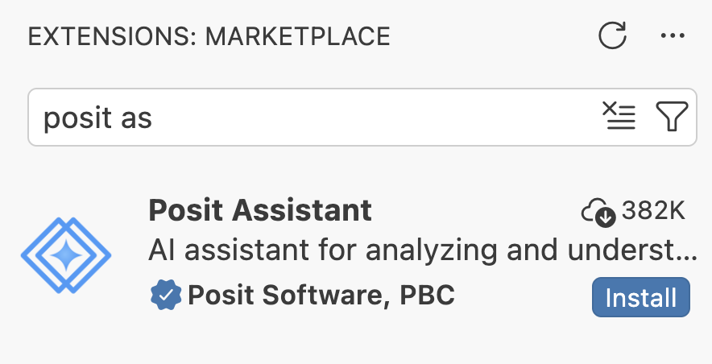{fig-align="center" width="90%" .lightbox fig-alt="Screenshot of the Positron Extensions view showing the Posit Assistant extension."}

:::
:::

### Connect it to your OSU API key

::: {.columns}
::: {.column width="70%"}

1. Click on the newly added **Posit Assistant icon** in the Activity Bar.

2. Click "**Help me set it up**" and then "**Configure LLM providers**":

:::
::: {.column width="30%"}

{fig-align="center" width="30%" fig-alt="The Posit Assistant icon in the Activity Bar."}

:::
:::

::: {.columns}
::: {.column width="50%"}
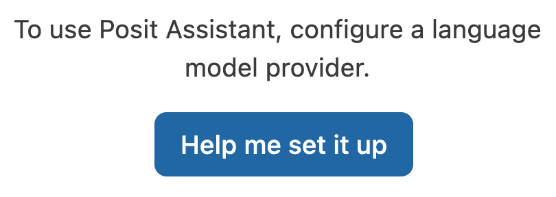{fig-align="center" width="90%" .lightbox fig-alt="Screenshot of the Posit Assistant panel with a 'Help me set it up' button."}
:::
::: {.column width="50%"}
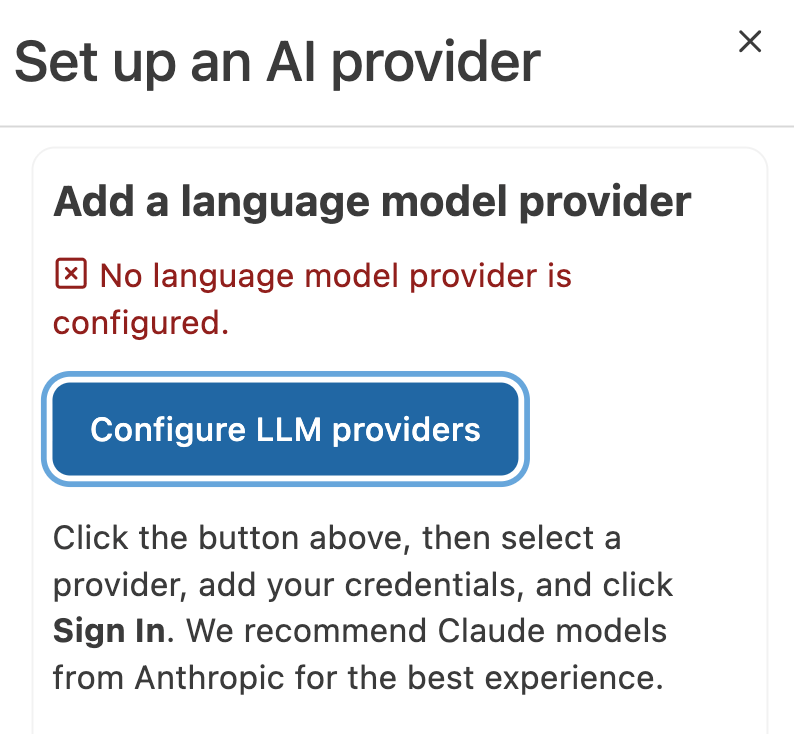{fig-align="center" width="90%" .lightbox fig-alt="Screenshot of the Posit Assistant panel with a 'Configure LLM providers' button."}
:::
:::

3. At the top, select **Custom Provider** from the list of providers, and enter:

   - **API Key**: your OSU API key from week 8.
     _(It's the value of `ANTHROPIC_AUTH_TOKEN` in your `~/.claude/settings.json` file at OSC.)_
   - **Base URL**: `https://litellm.cloud.osu.edu`

   Then, click **Sign in**.

   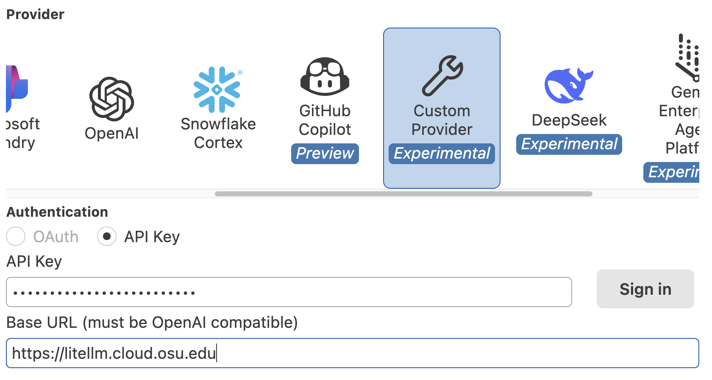{fig-align="center" width="60%" .lightbox fig-alt="Screenshot of the Custom Provider form with API Key and Base URL fields."}

4. If it worked, the assistant panel should now show:

   {fig-align="center" width="40%" .lightbox fig-alt="Screenshot of the Posit Assistant panel after successfully signing in."}

5. In the bottom-right of the prompt box, click **Select Model**.
   The models available with your API key are under "**OpenAI Compatible**" ---
   click "**More models**":

   ::: {.columns}
   ::: {.column width="60%"}
   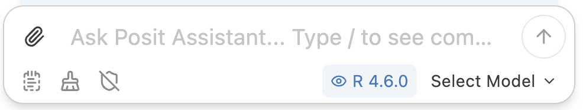{fig-align="center" width="100%" .lightbox fig-alt="Screenshot of the Select Model button in the Posit Assistant prompt box."}
   :::
   ::: {.column width="40%"}
   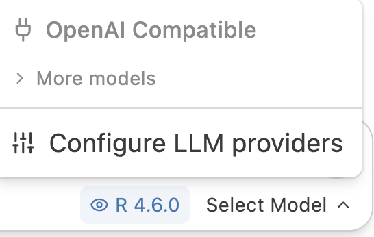{fig-align="center" width="80%" .lightbox fig-alt="Screenshot of the model list with an OpenAI Compatible section and a More models option."}
   :::
   :::

6. In the (long!) list, select <!-- TODO: model name --> **`claude-sonnet-...`**.
   The prompt box should then look something like this:

   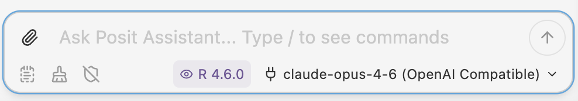{fig-align="center" width="70%" .lightbox fig-alt="Screenshot of the Posit Assistant prompt box with a Claude model selected."}

::: {.callout-warning appearance="simple"}
Not all models available with the OSU API key work with Posit Assistant.
If you get an "**internal error**" when using it later, switch to a different model.
:::

## Connect Positron to OSC

### The SSH connection

Because Positron is built on VS Code, it uses the same SSH configuration as VS Code.

- **If you already set up** a [local VS Code installation at OSC](../bonus/vscode-local.qmd)
  with the `osc-pitzer-compute` connection, you don't need to repeat that:
  it will automatically work in Positron too.
  Just do step 1 under [Connect](#connect) below.

- **If you haven't**, follow the steps in
  [Set up the OSC connections](../bonus/vscode-local.qmd#set-up-the-osc-connections)
  on that page, **but do them in Positron instead of VS Code** --- they are identical.
  (You don't need to install VS Code or the Remote Development extension:
  Positron has this functionality built in.)

### Connect {#connect}

1. In Positron's **Settings** (cog wheel  > `Settings`),
   search for `remote.SSH.connectTimeout` and set it to **300** (seconds),
   if you haven't already.

2. Open the **Command Palette**
   (<kbd>Ctrl/⌘</kbd>+<kbd>Shift</kbd>+<kbd>P</kbd>),
   start typing "_SSH connect_", select `Remote-SSH: Connect to Host...`,
   and then select **`osc-pitzer-compute`**.

3. A new Positron window will open and connect to OSC.
   This may take 30 seconds or more while a compute job is starting.
   If you're asked whether you "trust the authors", click **Trust and Continue**.

4. Open your personal folder: in the Explorer, click **Open Folder** and enter
   `/fs/ess/PAS3493/people/<user>`, where `<user>` is your OSC username.

   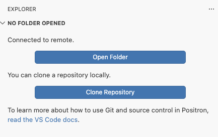{fig-align="center" width="45%" .lightbox fig-alt="Screenshot of the Positron Explorer with an Open Folder button."}

::: {.callout-tip appearance="simple"}
Like in VS Code, this folder will now appear in Positron's "Recent" list on the
Welcome page, so next time you can reconnect with a single click.
:::

### Make R available

R is installed at OSC, but has to be loaded as a module (as you learned in week 6).
To make sure Positron finds R, you'll load the module in your shell settings file `~/.bashrc`:

1. Open a **terminal** in Positron (`Terminal` > `New Terminal`) and run:

   ```bash
   echo 'module load gcc/12.3.0 R/4.5.2' >> ~/.bashrc
   ```

2. Reload Positron:
   in the **Command Palette**, start typing "_Reload Window_",
   and select "**Developer: Reload Window**".

3. Positron should now start R in the **Console** in the bottom panel.

   ::: {.callout-warning collapse="true"}
   #### If you're seeing a Python console instead of R _(Click to expand)_

   - In the top-right corner of the Positron window, you'll see something like this:

     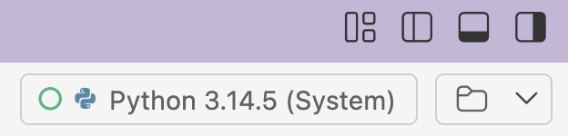{fig-align="center" width="40%" .lightbox fig-alt="Screenshot of the Positron interpreter indicator showing Python."}

   - Click on the Python indicator, and then select **New Console Session**:

     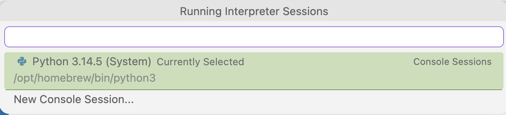{fig-align="center" width="70%" .lightbox fig-alt="Screenshot of the interpreter menu with a New Console Session option."}

   - Select the R version:

     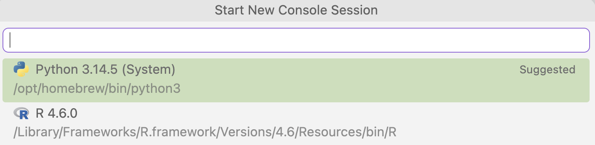{fig-align="center" width="70%" .lightbox fig-alt="Screenshot of the list of available R and Python interpreters."}

   - The top-right corner should now show R,
     and your console should have switched to R as well:

     {fig-align="center" width="40%" .lightbox fig-alt="Screenshot of the Positron interpreter indicator showing R."}
   :::

::: {.callout-note collapse="true"}
#### Why `~/.bashrc`? _(Click to expand)_
Commands in `~/.bashrc` are run every time you start a new shell at OSC
(see the [shell configuration self-study page](../bonus/shell-config.qmd)).
This is not a permanent solution: the R versions available at OSC change over time,
so you may need to update this line in the future.
:::

### Install Posit Assistant at OSC

Extensions like Posit Assistant need to be installed separately on the remote:
open the Extensions view, find Posit Assistant,
and click **"Install in SSH: osc-pitzer-compute"**.

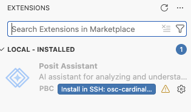{fig-align="center" width="50%" .lightbox fig-alt="Screenshot of the Posit Assistant extension with an 'Install in SSH' button."}

Your settings from earlier (API key and model) will carry over.

## Test it

1. In the R Console, create a small data frame:

   ```r
   df <- data.frame(x = 1:10, y = rnorm(10))
   ```

2. In the Posit Assistant panel, ask:

   > Create a scatter plot of x vs y from df

3. Posit Assistant should write code for a plot and ask for permission to run it:
   click **Allow**.

   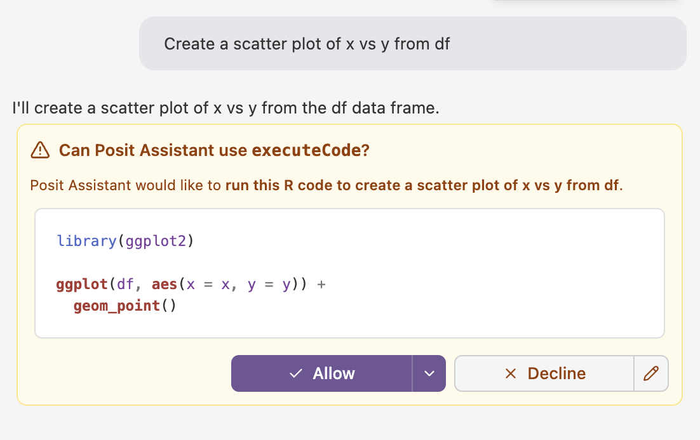{fig-align="center" width="70%" .lightbox fig-alt="Screenshot of the Posit Assistant panel showing generated code for a scatter plot and an Allow button."}

4. It produces the plot, and shows it in its own panel along with
   suggestions for next steps.
   The plot should also appear in the **Plots** pane,
   since it was made by R code that ran in your R session at OSC.

   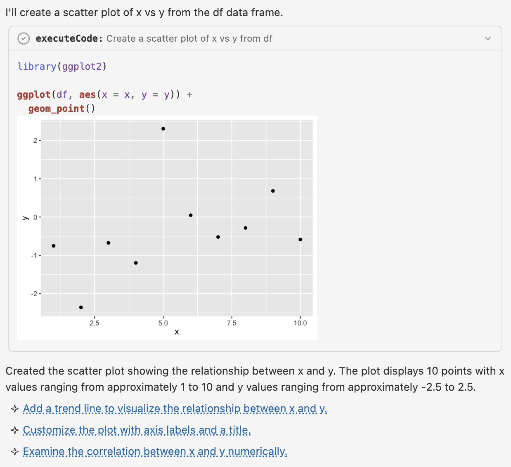{fig-align="center" width="80%" .lightbox fig-alt="Screenshot of the Posit Assistant panel showing a scatter plot and suggested next steps."}

::: {.callout-tip appearance="simple"}
Note that you didn't have to tell Posit Assistant what `df` contains:
it can see the objects in your R session.
:::

**All done!** If everything worked, let Jelmer know --- and if it didn't, let him know too.

## If you can't get Positron to work

You can always use R through **RStudio Server** in OnDemand instead,
which doesn't need any setup (but has no AI assistant):

1. In OnDemand, select **`Interactive Apps`** > **`RStudio Server`**.
2. Fill out the form: Cluster **`pitzer`**, R version **`4.5.2`**,
   Project **`PAS3493`**, Number of hours **`2`**,
   Node type **`any`**, Number of cores **`1`**.
3. Click **`Launch`**, and then **`Connect to RStudio Server`** once it appears.

The R content in the coming weeks works the same way in both programs.

## Optional extras

::: {.callout-note collapse="true"}
#### Claude Code in Positron _(Click to expand)_

The "Claude Code for VS Code" extension from week 8 also works in Positron
(which is a variant, or "fork", of VS Code).
While connected to OSC, install it from the Extensions view.
It will use the same `~/.claude/settings.json` file at OSC as in week 8.

Unlike Posit Assistant, Claude Code can't see your R session's objects by default.
:::

::: {.callout-note collapse="true"}
#### Inline code suggestions with GitHub Copilot _(Click to expand)_

Posit Assistant can also be used with a GitHub Copilot login,
which adds inline code suggestions as you type
(see the [GitHub Copilot self-study page](../bonus/copilot.qmd) for background).
To set this up, click the cog wheel  at the top of the Posit Assistant panel,
select **Configure LLM providers**, select "GitHub Copilot", and click **Sign in**.
:::

<hr style="height:1pt; visibility:hidden;" />
