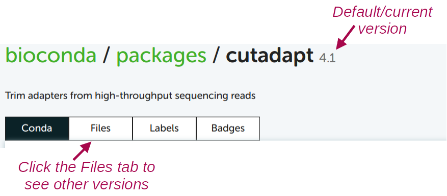

----------------------------------------------------------------------------------------------------

<hr style="height:1pt; visibility:hidden;" />
<hr style="height:1pt; visibility:hidden;" />

## Introduction to Conda

Conda can create so-called **environments** in which you can install
one or more software packages.
Compared to containers (see the comparison in [w6a](../week06/w6a_osc.qmd)),
Conda works especially well when you want to combine several programs in a single
environment, or when you want to add programs to an existing environment later.

::: {.callout-tip appearance="simple"}
This makes Conda particularly handy for bioinformatics "utilities"
like SeqKit, SAMtools, and BEDTools,
which you will often want to use **interactively** (not just in scripts),
and where you may want to **pipe** the output of one program into another.
With all of them in one active environment,
you can simply type `samtools ... | seqkit ...`,
whereas with containers,
every command would need its own `apptainer exec ...` prefix.
:::

Conda installs programs from the same online software repositories that the
Seqera containers you used in [w6b](../week06/w6b_software.qmd) were built from ---
recall the `bioconda::` and `conda-forge::` prefixes of the container search hits.
So, any program with a `bioconda::` or `conda-forge::` hit in the Seqera search
can also be installed with Conda.
As you'll learn below, installing a program with Conda:

- Is quite straightforward
- Is very uniform (the procedure is nearly identical for any program)
- Doesn't require administrative privileges

Under the hood, a Conda environment is "merely" a **directory** that includes
the **executable** (binary) files for the program or programs in question.
When you activate a Conda environment,
that directory will be added to the collection of locations that the computer
checks when you try to run a program by entering a command
(this is called the `$PATH`).

Like with modules, Conda has a main command (`conda`) and several sub-commands
(e.g. `create`, `activate`, `deactivate`, and `install`).
For example, to activate an environment, you would use `conda activate`.
But before you can do so, you need to create an environment.

## Creating Conda environments and installing software

### Loading the Conda module

Before you can use Conda in any way,
you always need to load OSC's Miniconda module first:

```bash
module load miniconda3/25.11.1-py312
```

::: {.callout-warning appearance="simple"}
As of September 2026, the above version is only available on Pitzer.
You should be on Pitzer now, but if/when you are on one of the other clusters,
load this module instead:

```bash
module load miniconda3/24.1.2-py310
```

:::

### One-time Conda configuration

Before you can create your own environments,
you should first do some one-time configuration[^6].
The configuration will set the **Conda "channels"** (basically, software repositories)
you want to use when installing programs.
It will also set the relative priorities among channels,
since one program may be available from multiple channels.

[^6]: That is, these settings will be saved somewhere in your OSC Home directory,
      and you never have to set them again unless you need to make changes.

We can do this configuration with the `config` sub-command ---
run the following in your shell:

```bash
conda config --add channels bioconda     # Added first => lowest priority
conda config --add channels conda-forge  # Added last => highest priority
conda config --set channel_priority strict
```

<!----
We don't add Anaconda's `defaults` channel:
Bioconda no longer recommends it (mixing it with conda-forge causes conflicts),
and its terms of service can require a paid license for large organizations.
---->

Check whether the configuration was successfully saved:

```bash
conda config --get channels
```
``` {.bash-out}
--add channels 'bioconda'   # lowest priority
--add channels 'conda-forge'   # highest priority
```

### Example: Creating an environment for TrimGalore

Now, you will create a Conda environment for the program **TrimGalore**,
which can trim and filter reads in FASTQ files,
but does not have a system-wide installation at OSC.

Here is a command that creates a new Conda environment
and installs TrimGalore into it, all at once:

```bash
# [Don't run this - we'll modify this a bit below]
conda create -y -n trim-galore bioconda::trim-galore
```

Let's break that command down:

- **`create`** is the Conda sub-command to create a new environment.
- When adding **`-y`**, Conda will not ask us for confirmation to install.
- Following the **`-n`** option, you can specify the _name_ you would like the
  environment to have: we used `trim-galore`.
  You can use whatever name you like for the environment,
  but a descriptive yet concise name is a good idea.
  For single-program environments, it makes sense to simply name it after the program.
- With **`bioconda::trim-galore`** we indicate that we want to install the program
  `trim-galore` from the `bioconda` channel.

By default, Conda will install the **latest available version** of a program.
If you create an entirely new environment for a program, like we're doing here,
that default will almost always apply.
But if you're installing into an environment that already contains other programs,
it's _possible_ that due to compatibility issues, it will install a different version.

If you want to explicitly **specify a version** to install,
add the version number after **`=`** following the package name.
In that case, you may also want to include that version number in
the Conda environment's name, as in the below example, which you can run:

```bash
conda create -y -n trim-galore-2.3.0 bioconda::trim-galore=2.3.0
```
```{.bash-out}
Retrieving notices: ...working... done
Channels:
 - conda-forge
 - bioconda
Platform: linux-64
Collecting package metadata (repodata.json): done
Solving environment: done

## Package Plan ##
# [...truncated...]
```

There should be a lot of output, with many packages that are being downloaded
(these are all "dependencies" of TrimGalore), but if it works, you should see
this before you get your prompt back:

```bash-out-solo
Downloading and Extracting Packages

Preparing transaction: done
Verifying transaction: done
Executing transaction: done
#
# To activate this environment, use
#
#     $ conda activate trim-galore-2.3.0
#
# To deactivate an active environment, use
#
#     $ conda deactivate
```

## Creating environments for any available program

### Finding Conda installation info online

Minor variations on the `conda create` command above can be used to install
almost any program for which a Conda package is available,
which is the vast majority of open-source bioinformatics programs!

To find out whether a program is available, what the channel and package name are,
and which versions exist, you can use the same
[Seqera Containers search](https://seqera.io/containers) you used in
[w6b](../week06/w6b_software.qmd):
for example, searching for Cutadapt gives a `bioconda::cutadapt` hit,
and its dropdown menu lists the available versions.

Then, that `bioconda::cutadapt` goes at the end of the `conda create` command:

```bash
# [Don't run this - example command]
conda create -y -n cutadapt bioconda::cutadapt
```

And to specify a version, add it after an `=`, e.g. `bioconda::cutadapt=5.1`.

::: {.callout-note collapse="true"}
#### Alternative: Google and the Anaconda website _(Click to expand)_

Each Conda package also has a page on the Anaconda website,
which is usually the top hit when you Google the program name together with "conda",
e.g. "cutadapt conda":

{fig-align="center" width="90%" fig-alt="A screenshot of Google search results for 'conda cutadapt'" .lightbox}

::: legend2
Screenshot of Google search results for "conda cutadapt".
:::

<hr style="height:1pt; visibility:hidden;" />

{fig-align="center" width="65%" .no-border fig-alt="A screenshot of the Conda page for Cutadapt" .lightbox}

::: legend2
Screenshot of the Conda page for Cutadapt.
:::

<hr style="height:1pt; visibility:hidden;" />

The first of the example installation commands shown there,
`conda install bioconda::cutadapt`, uses the `install` subcommand.
This installs a program into _the currently active_ Conda environment,
which is usually not what you want: it's better to give each program
(or set of programs) a new, dedicated environment.

To turn this into a create-plus-install command like the ones above,
simply replace `install` with `create -y -n <env-name>`:

```bash
# [Don't run this - example command]
conda create -y -n cutadapt bioconda::cutadapt
```

The Anaconda page also shows which version will be installed by default,
and which older versions are available:

{fig-align="center" width="70%" fig-alt="An annotated screenshot of version options on the Conda website" .lightbox}
:::

## Activating Conda environments

As mentioned above, these environments are activated much like with modules.
But while the term "load" is used for modules,
the term and command `activate` is used for Conda environments ---
it means the same thing.

You should be able to **activate** the environment we just created
(using just its name; more on that [below](#where-conda-environments-are-stored)):

```bash
conda activate trim-galore-2.3.0
```
```{.bash-out}
(trim-galore-2.3.0) [jelmer@p0085 jelmer]$
```

:::{.callout-tip appearance="simple"}
When you have an active Conda environment,
its name is displayed as part of your prompt, as shown above!
:::

With the TrimGalore environment activated, you should be able to use the program.
To test this, simply run the `trim_galore` command
(note the underscore: the command name differs from the package name)
with the `--help` option:

```bash
trim_galore --help
```
```{.bash-out}
 USAGE:

trim_galore [options] <filename(s)>

-h/--help               Print this help message and exits.
# [...truncated...]
```

Unlike `module load`,
Conda will by default only keep **a single environment active**.
Therefore, when you have environment A active and then activate environment B,
the active environment will **switch** to B,
and the program(s) in environment A will no longer be available.

::: {.callout-note collapse="true"}
#### Having multiple environments active with `--stack` _(Click to expand)_

If you want to have multiple Conda environments active at the same time,
you can do so with the `--stack` option:

1. Activate the TrimGalore environment, if it isn't already active:

   ```bash
   conda activate trim-galore-2.3.0
   ```

2. "Stack" a MultiQC environment of mine:

   ```bash
   conda activate --stack /fs/ess/PAS3493/share/conda/multiqc
   ```

3. Check that you can use both programs --- output not shown,
   but both should successfully print help info:

   ```bash
   multiqc --help

   trim_galore --help
   ```
:::

::: callout-note
#### Deactivating environments

To deactivate the currently active environment,
run `conda deactivate` (no environment name needed):

```bash
conda deactivate
```
:::

<hr style="height:1pt; visibility:hidden;" />

::: exercise
####  Exercise: Create and activate a FastQC environment

OSC has a module for FastQC version 0.12.1.
But say that you want to exactly reproduce an analysis from a paper
that used FastQC version 0.11.9.

1. Create a Conda environment with FastQC version 0.11.9.

   <details><summary>  _Click for the solution._ </summary>

   ```bash
   module load miniconda3/25.11.1-py312
   conda create -y -n fastqc-0.11.9 bioconda::fastqc=0.11.9
   ```
   </details>

2. Activate the environment and check that you have the correct version of FastQC.

   <details><summary>  _Click for the solution._ </summary>

   ```bash
   conda activate fastqc-0.11.9
   fastqc --version
   ```
   ```bash-out
   FastQC v0.11.9
   ```
   </details>

3. With the environment still active, run `module load fastqc/0.12.1`.
   Which version do you predict `fastqc --version` will report now?
   Check your prediction.
   (Hint: think about what both `conda activate` and `module load` do to your `$PATH`.)

   <details><summary>  _Click for the solution._ </summary>

   It will report version 0.12.1.
   Both `conda activate` and `module load` add a directory to the _start_ of
   your `$PATH`, and the shell runs the first `fastqc` it finds there.
   So whichever you activated or loaded _last_ wins.
   To avoid confusion like this,
   don't mix modules and Conda environments that provide the same program.
   </details>
:::

## Managing your Conda environments

### Where Conda environments are stored

You may have noticed that above,
we merely gave the environment we created a name
(`trim-galore-2.3.0`),
and did not tell Conda **where** to put this environment.
Similarly, we were able to activate the environment with just its name.

Conda puts environments in a **personal default directory**,
which at OSC is `~/.conda/envs` (see the `conda env list` output below).
To instead put an environment in a location of your choice,
use the `-p` (for "prefix", i.e. path) option instead of `-n` ---
for example, to create the environment inside a project directory:

```bash
# [Don't run this]
conda create -y -p /fs/ess/PAS3493/people/$USER/my_project/software/conda/trim-galore \
    bioconda::trim-galore
```

When you do this, you will have to pass the path to the environment
(rather than a name) when you _activate_ it:

```bash
# [Don't run this]
conda activate /fs/ess/PAS3493/people/$USER/my_project/software/conda/trim-galore
```

As explained [below](#project-specific-environments),
this is the approach I recommend for your research projects.

::: {.callout-tip appearance="simple"}
When you want to activate **someone else's Conda environment**
(this is possible as long as you have read-access to that dir!),
you'll always have to specify the full path to the environment's directory.
:::

To see which Conda environments you have, run `conda env list`:

```bash
conda env list
```
```bash-out
trim-galore-2.3.0       /users/PAS0471/jelmer/.conda/envs/trim-galore-2.3.0
```

To remove a Conda environment, use `conda env remove`:

```bash
conda env remove -n trim-galore-2.3.0
```

::: {.callout-note collapse="true"}
#### More Conda commands to manage your environments _(Click to expand)_

- List all packages (programs) installed in an environment ---
  due to dependencies, this can be a long list,
  even if you only actively installed one program:

  ```bash
  conda list -n trim-galore-2.3.0
  ```

- Export a plain-text "YAML" file that contains the instructions to recreate
  your currently-active environment (useful for reproducibility!)

  ```bash
  conda env export --from-history > my_env.yml
  ```

  The `--from-history` option only includes the packages you explicitly asked for
  (with their versions, if you specified them), rather than every dependency with
  platform-specific build details ---
  which makes the file much more likely to work on another computer.

  And you can use the following to create a Conda environment from such a YAML file:

  ```bash
  conda env create -n my_env --file my_env.yml
  ```

- Downloaded packages are cached in `~/.conda/pkgs`, even for environments
  you created elsewhere with `-p`. This cache can grow large,
  so if you're running low on space in your Home directory, clear it with:

  ```bash
  conda clean --all
  ```
:::

### Project-specific environments

There are a number of ways to organize your Conda environments,
but I recommend that you create
**Conda environments that are specific to a research project**,
rather than reusing environments across projects.
That way, each project has its own record of exactly which software
(and which versions) it used,
and updating or breaking an environment for one project can't affect your other projects.
This does have the downside of requiring more disk space and time to set up each project,
but it provides better reproducibility and maintainability.

Within a project, there are two reasonable ways to organize your environments:

- **A single environment for the project**
  - You just need to activate that one environment when you're working on
    your project.
  - The project's software setup is described by a single environment
    (and can be exported to a single YAML file).
  - But the more programs you install into one environment,
    the higher the risk of running into problems due to mutually
    incompatible software and complicated dependency situations.
    Therefore, this works best for projects that only use a handful of programs.

- **Multiple environments for the project**, e.g. one for each program
  or for each analysis step
  - Less risk of dependency problems, and each environment is quick to create.
  - You can update or replace one program without touching the others.
  - But you need to activate the right environment at each step,
    e.g. in each of your scripts.

::: {.callout-warning appearance="simple"}
What is _not_ recommended is simply installing all programs across all
your projects into one single environment.
Even though this might seem easier, it doesn't benefit reproducibility,
and your environment is likely to stop functioning sooner or later.
:::

#### Put your environments inside your project directory

To make your environments project-specific,
**create them inside your project directory with `-p`** ---
for example, in a `software/conda` subdirectory with one or more environments,
as in the [example above](#where-conda-environments-are-stored).
This has several advantages:

- It is always clear which environments belong to which project,
  and your scripts can refer to them with the path to the environment.
- Other members of your group who have access to the project directory
  can use the same environments.
- You avoid filling up your Home directory, which has limited storage space.
- When you archive or remove a project, its software goes along with it.

::: {.callout-note collapse="true"}
#### Using Conda environments in shell scripts
Once you start writing shell scripts (week 7) and Slurm batch jobs (week 9),
don't rely on whatever module or environment happens to be active in your shell
when you run the script. Instead, include both steps inside the script itself,
so the script is self-contained and reproducible:

```bash
module load miniconda3/25.11.1-py312
conda activate /fs/ess/PAS3493/people/$USER/my_project/software/conda/trim-galore
```

If this gives an error like `CondaError: Run 'conda init' before 'conda activate'`,
use `source activate <env>` instead of `conda activate <env>`.
:::

::: exercise
####  Exercise: A project environment with two programs

FastQC and MultiQC are often used together.
Following the recommendation above, create a single Conda environment
with both programs, inside a `software/conda` subdirectory
of your personal directory in the course project, `/fs/ess/PAS3493/people/$USER`.
Call the environment `qc`.

1. Create the environment. You can install multiple programs in one go by
   listing them one after the other.

   <details><summary>  _Click for the solution._ </summary>

   ```bash
   module load miniconda3/25.11.1-py312
   conda create -y -p /fs/ess/PAS3493/people/$USER/software/conda/qc \
       bioconda::fastqc bioconda::multiqc
   ```
   </details>

2. Activate the environment and check that both programs work.

   <details><summary>  _Click for the solution._ </summary>

   ```bash
   conda activate /fs/ess/PAS3493/people/$USER/software/conda/qc
   fastqc --version
   multiqc --version
   ```
   </details>

3. Run `conda list` and look for the packages `openjdk` and `python`.
   You didn't ask for either of them, so why were they installed?

   <details><summary>  _Click for the solution._ </summary>

   They are dependencies: FastQC is written in Java (`openjdk` provides Java),
   and MultiQC is written in Python.
   Conda automatically installs everything a program needs to run ---
   which is also why environments can contain many more packages
   than you explicitly installed.
   </details>
:::
