----------------------------------------------------------------------------------------------------

<hr style="height:1pt; visibility:hidden;" />

::: callout-warning
#### This page is a draft and is still under construction.
:::

<hr style="height:1pt; visibility:hidden;" />

## Introduction

In class, we used the Claude extension in VS Code Server
(see [this week's second lecture](../week08/w8b_claude.qmd)).
Claude is great for chat and agent-style help,
but it does not give you **inline suggestions**:
"ghost text" code completions that appear as you type.
Additionally, you can only continue to use Claude after this course if your
PI supports an Ohio State Generative AI account, or if you get a personal account^[
  Note: If you get a personal account, you will be responsible for any costs
  associated with its use and it will not be OSU-approved].

This page focuses on GitHub Copilot, which in VS Code is a built-in feature.
You will learn how to:

- Get free extended access to GitHub Copilot as a student
- Sign in to GitHub Copilot and enable its inline suggestions in VS Code
- Use GitHub Copilot's inline suggestions and chat to help you with coding tasks

**Unlike the Claude setup we use in class, GitHub Copilot is not an OSU-approved tool.**
This is true even though GitHub Copilot is closely related to Microsoft Copilot^[
GitHub and VS Code are both Microsoft products.
Google Gemini also has a VS Code extension with similar functionality,
but when I logged in with OSU credentials, I was informed that this is not available to us.
].
So, whenever you use GitHub Copilot, you must be aware of the data privacy implications
outlined in [this week's first lecture](../week08/w8a_genAI.qmd).

## Setting up

### About access to GitHub Copilot

Anyone with a GitHub account is automatically enrolled in the "**Copilot Free**" plan,
which provides quite limited access to Copilot's features, but at least you can try it out.
As students and teachers/faculty, we can get additional free access after applying for it.
While teachers can get access to the "**Copilot Pro**" plan,
which can also be bought by individuals for $10/month,
students get access to the more limited "**Copilot Student**" plan.

GitHub is increasingly vague about the limits of especially the free and student plans,
but here is an approximate summary (where an "AI Credit" is roughly a single chat request):

| Plan        | Free for whom    | How to get it                | Code completions | "AI Credits" |
| ----------- | ---------------- | ---------------------------- | ---------------- | ------------- |
| **Free**    | Everyone         | Automatically                | 2,000 per month  | ~50           |
| **Student** | Students         | Apply for education benefits | Unlimited        | 200           |
| **Pro**     | Teachers/Faculty | Apply for education benefits | Unlimited        | 1,500         |

: {.striped .hover}

<hr style="height:1pt; visibility:hidden;" />

Here is how GitHub itself currently describes the differences between the plans
([source](https://docs.github.com/en/copilot/concepts/billing/individual-plans)):

{fig-align="center" width="90%" .no-border fig-alt="A screenshot of the GitHub Copilot plans table, showing the Free, Student, and Pro plans with their features." .lightbox}

::: legend2
GitHub's overview of the plans discussed above (there are more plans).
:::

<hr style="height:1pt; visibility:hidden;" />

#### Apply for education benefits

1. Go to [https://github.com/settings/education/benefits ](https://github.com/settings/education/benefits){target="_blank"}.

2. Click "**Start an application**":

{fig-align="center" width="90%" fig-alt="A screenshot of the Education Benefits section of the GitHub settings, with a 'Start an application' button." .lightbox}

3. Fill out the form as needed.
   _(You may need a document that proves your current status at the university.)_

::: {.callout-caution appearance="simple"}
Application approval is often quite fast (sometimes in minutes),
but **access is only granted 72 hours after approval**.
You can already sign in and use the free plan in the meantime.
:::

### Signing in to GitHub Copilot in VS Code

Start a VS Code Server session at OSC as usual,
and open your personal dir in the course's project dir (`/fs/ess/PAS3493/people/<user>`).
Then:

1. Click "**Sign In**" next to the Copilot icon in the status bar at the bottom of the window:

{fig-align="center" width="35%" fig-alt="A screenshot of the VS Code status bar, with the Copilot icon and a 'Sign In' button." .lightbox}

2. Click "**Continue with GitHub**" and continue to follow the prompts to authenticate with your GitHub account.

<details><summary>_Click here for a step-by-step guide with screenshots_</summary>

- This is where you click "Continue with GitHub"

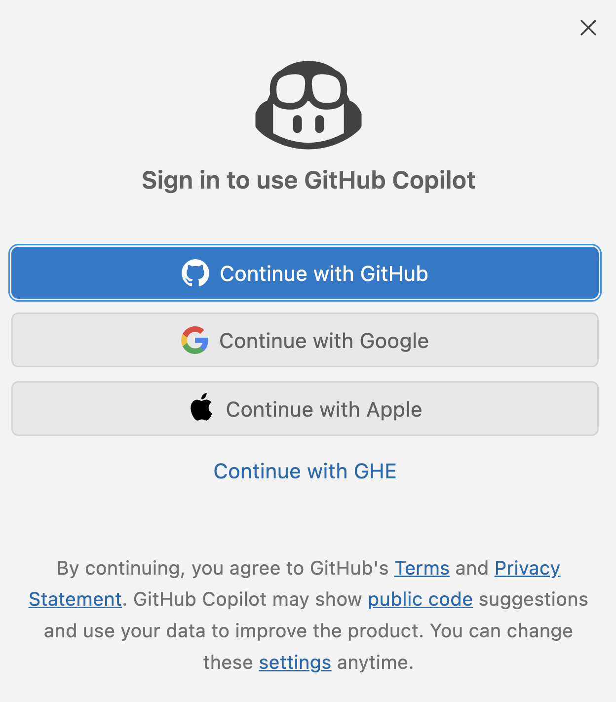{fig-align="center" width="45%" fig-alt="A screenshot of the 'Sign in to use GitHub Copilot' dialog, with a highlighted 'Continue with GitHub' button." .lightbox}

- VS Code will show you a one-time code.
  Click "**Copy & Continue to Browser**", which copies the code:

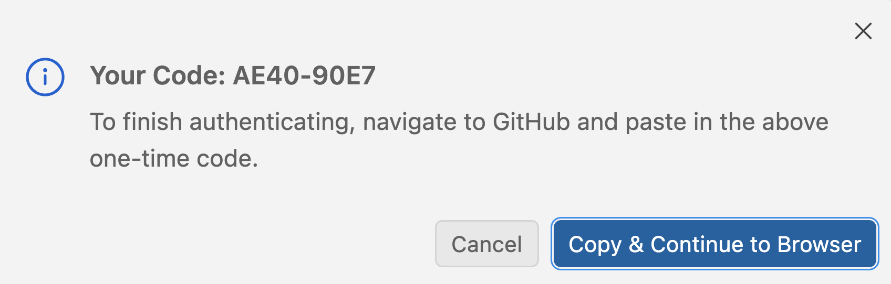{fig-align="center" width="60%" fig-alt="A screenshot of a VS Code dialog showing a one-time code, with a 'Copy & Continue to Browser' button." .lightbox}

- Click "**Open**" to allow VS Code to open the GitHub website in a new browser tab:

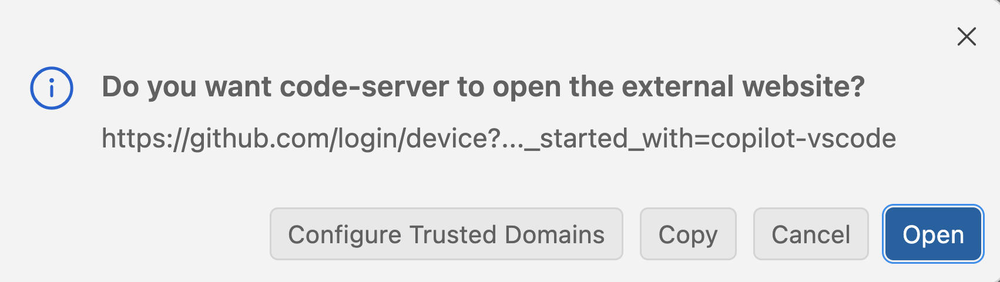{fig-align="center" width="60%" fig-alt="A screenshot of a VS Code dialog asking 'Do you want code-server to open the external website?', with an 'Open' button." .lightbox}

- In the new browser tab, check that you are signed in to the correct GitHub account
   and click "**Continue**":

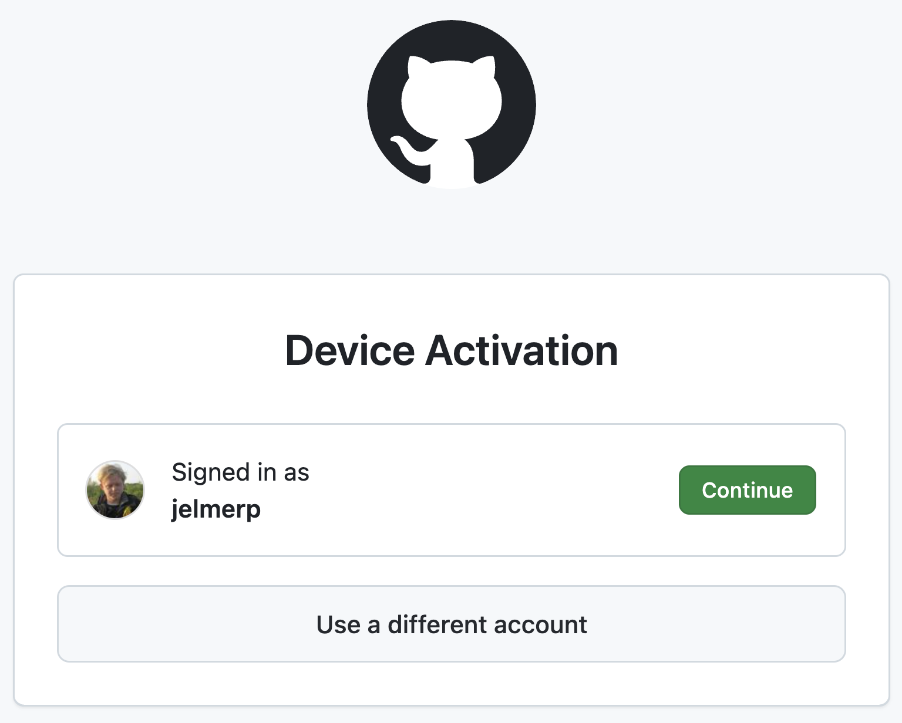{fig-align="center" width="50%" fig-alt="A screenshot of the GitHub 'Device Activation' page showing the signed-in account and a 'Continue' button." .lightbox}

- Paste the code that you copied in step 3 and click "**Continue**":

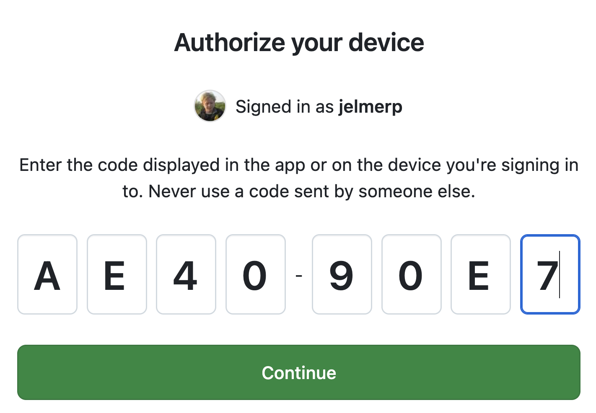{fig-align="center" width="50%" fig-alt="A screenshot of the GitHub 'Authorize your device' page, with the one-time code entered and a 'Continue' button." .lightbox}

::: {.callout-tip collapse="true"}
#### Lost the code? _(Click to expand)_
Back in VS Code, a notification in the bottom right also shows the code:

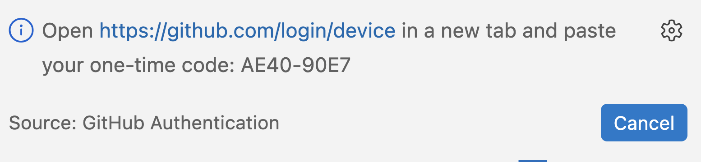{fig-align="center" width="60%" fig-alt="A screenshot of a VS Code notification with the link github.com/login/device and the one-time code." .lightbox}
:::

- On the "Authorize Visual Studio Code" page,
  scroll down and click "**Authorize Visual-Studio-Code**":

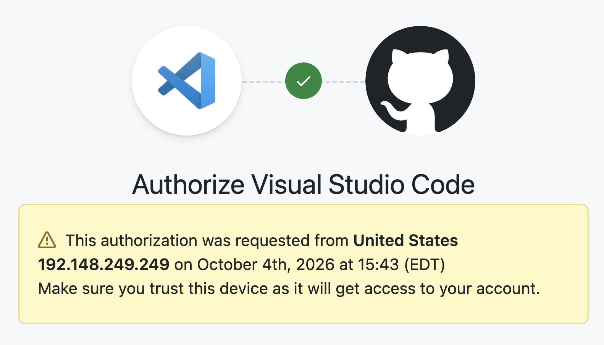{fig-align="center" width="55%" fig-alt="A screenshot of the top of the GitHub 'Authorize Visual Studio Code' page, with a warning about where the authorization was requested from." .lightbox}

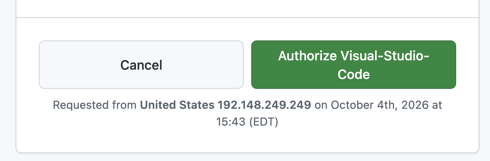{fig-align="center" width="55%" fig-alt="A screenshot of the bottom of the 'Authorize Visual Studio Code' page, with an 'Authorize Visual-Studio-Code' button." .lightbox}

::: {.callout-note appearance="simple"}
The page shows that this request came from an OSC IP address
(starting with `192.148`) --- that's expected,
because VS Code Server runs at OSC rather than on your computer.
:::

- GitHub may ask you to confirm access with your passkey, password,
  or two-factor authentication:

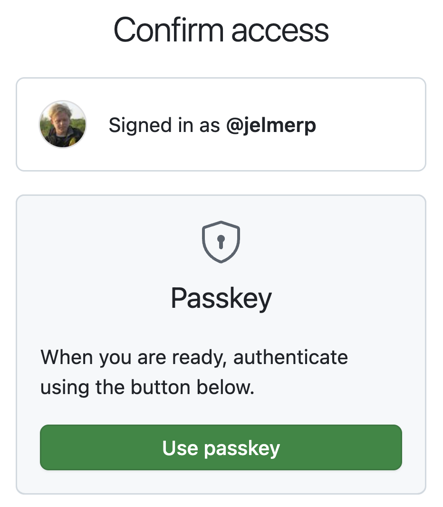{fig-align="center" width="35%" fig-alt="A screenshot of the GitHub 'Confirm access' page asking to authenticate with a passkey." .lightbox}

After this, you can close the browser tab and go back to VS Code.

</details>

### Enabling inline suggestions

Click the Copilot icon in the status bar at the bottom again.
This shows your plan and how much of your monthly allowance you have used.
Inline suggestions _may_ be **disabled** by default:

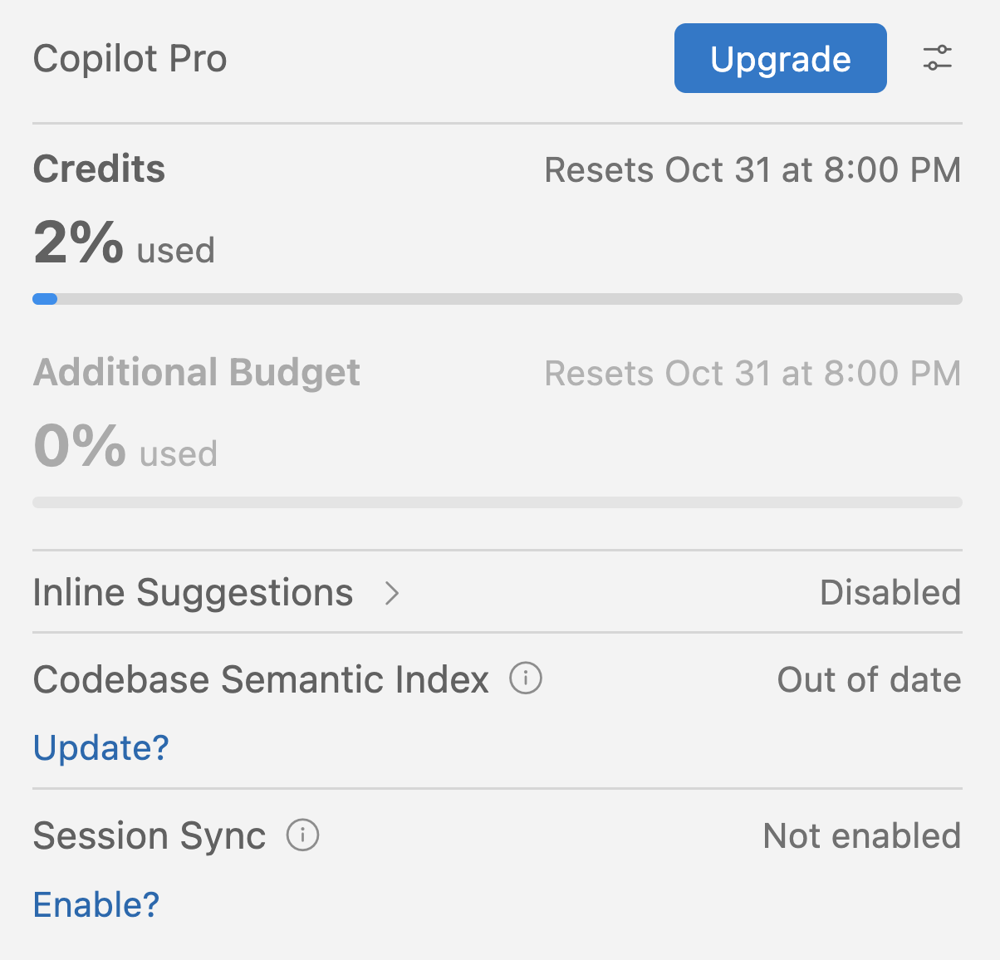{fig-align="center" width="45%" fig-alt="A screenshot of the Copilot status menu showing the plan, credits used, and 'Inline Suggestions: Disabled'." .lightbox}

If so, enable them as follows:

1. Open the Command Palette
   via the bottom-left cog wheel or with the keyboard shortcut
   <kbd>Ctrl</kbd>+<kbd>Shift</kbd>+<kbd>P</kbd> (Windows) or
   <kbd>Cmd</kbd>+<kbd>Shift</kbd>+<kbd>P</kbd> (Mac)

2. Type "copilot inline" and select `GitHub Copilot: Enable Inline Suggestions`:

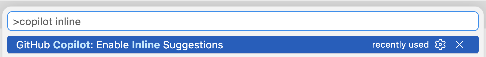{fig-align="center" width="80%" fig-alt="A screenshot of the VS Code Command Palette with the 'GitHub Copilot: Enable Inline Suggestions' command." .lightbox}

3. Click the Copilot icon in the status bar once more,
   and make sure that all boxes under "Inline Suggestions" are checked:

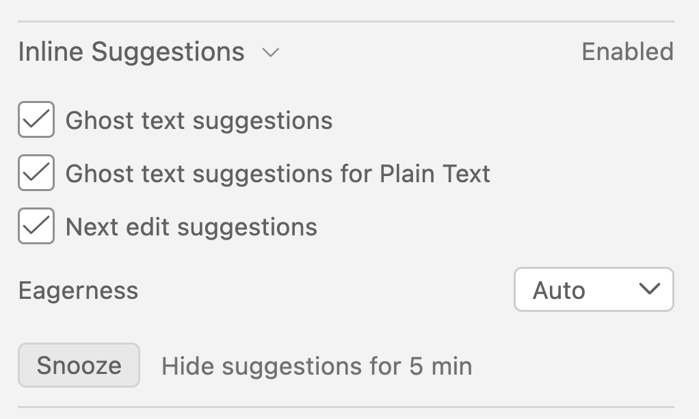{fig-align="center" width="40%" fig-alt="A screenshot of the Copilot status menu with Inline Suggestions enabled and the boxes for ghost text suggestions and next edit suggestions checked." .lightbox}

## GitHub Copilot inline suggestions

Let's start by creating a dir for this week, navigating there, and creating
and opening a Markdown file:

```bash
# You should be in /fs/ess/PAS3493/people/$USER
mkdir -p week08/copilot
cd week08/copilot
touch copilot.md
```

In the editor, paste the following into the `copilot.md` document:

````markdown
```bash
# GTF file:
GTF=../../garrigos/ref/annot.gtf
```
````

When you go to a new line within the code block and wait a second,
you should see a suggestion "in ghost text" (light gray text) appear.
To accept the suggestion, press <kbd>Tab</kbd>.

But instead of letting GitHub Copilot go off on its own to randomly suggest
ways to interrogate this file,
let's give it a prompt by typing a comment line first:

```bash
# Count the number of lines in the GTF file
```

Press <kbd>Enter</kbd> to go to a new line, and again wait for a second for the
suggestion to appear.
Accept it with <kbd>Tab</kbd> and run the code:
does it seem to have given a correct suggestion?

### Example prompts for the GTF file

```bash
# Count the number of lines in the GTF file, excluding the header

# Count the number of gene features in the GTF file

# Print a frequency table of all feature types in the GTF file

# Count the number of genes on the + versus the - strand

# How many genes have a description?
```

::: callout-tip
#### Iterating questions and inline chat
When you are not happy with Copilot's suggestion,
you can delete the answer, modify your prompt line, and press <kbd>Enter</kbd> again.
However, if you want to explicitly request a change to the current suggestion,
you can also use the inline chat functionality by selecting the code and pressing
<kbd>⌘</kbd>+<kbd>I</kbd> (Mac) / <kbd>Ctrl</kbd>+<kbd>I</kbd> (Windows).

For example, I didn't get a good answer to the last prompt above:

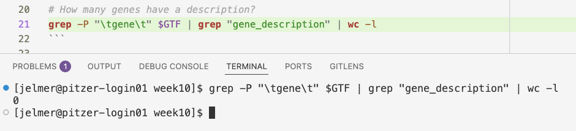{fig-align="center" width="80%" fig-alt="A screenshot of an inline Copilot suggestion in ghost text that does not correctly answer the prompt." .lightbox}

So I pressed the <kbd>⌘</kbd>+<kbd>I</kbd> and reported the failure:

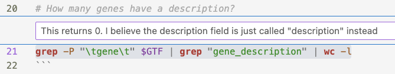{fig-align="center" width="80%" fig-alt="A screenshot of the Copilot inline chat box, with a message reporting that the previous suggestion was incorrect." .lightbox}

Copilot then came up with a fix, which I could accept:

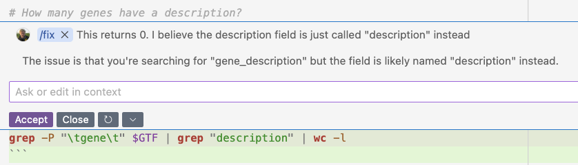{fig-align="center" width="80%" fig-alt="A screenshot of Copilot's inline chat proposing a fixed code suggestion." .lightbox}

Running the modified line did give the correct answer:

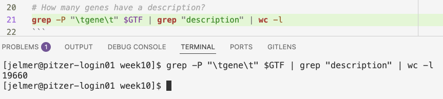{fig-align="center" width="80%" fig-alt="A screenshot of the terminal, showing the corrected code now producing the correct output." .lightbox}
:::

::: callout-note
#### More complicated bonus prompts

<hr style="height:1pt; visibility:hidden;" />

```bash
# What is the average length of a gene in this GTF file?

# What is the average number of exons per gene in this GTF file?

# List all unique gene biotypes in the GTF file
```

:::

### Other example prompts

Here are a few other example prompts you can try in the same way ---
these are more general Unix shell tasks that are currently likely just beyond
your abilities:

```bash
# List the top 5 largest files in the /fs/ess/PAS3493 directory and its subdirs

# Find all Markdown files in /fs/ess/PAS3493 and its subdirs

# Print a list of files that contain the word "cathemerium" in /fs/ess/PAS3493 and its subdirs
```

::: {.callout-tip appearance="simple"}
You can hover over suggestions to see alternative suggestions, if they are available --
see the top-right of this screenshot:

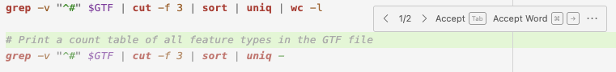{fig-align="center" width="90%" fig-alt="A screenshot showing alternative Copilot suggestions revealed by hovering over the ghost text, with navigation arrows in the top right." .lightbox}
:::

::: exercise
####  Exercise: Ask other questions
Be creative and ask GitHub Copilot to help you with some Unix shell tasks!
:::

## GitHub Copilot Chat

### The chat sidebar and chat options

Open the chat sidebar using the keyboard shortcut
<kbd>Ctrl</kbd>+<kbd>⌘</kbd>+<kbd>I</kbd> (Mac) /
<kbd>Ctrl</kbd>+<kbd>Alt</kbd>+<kbd>I</kbd> (Windows)
or by clicking the icon in the top bar, shown on the far left in this screenshot:

{fig-align="center" width="75%" fig-alt="A screenshot of the VS Code top bar, with the icon to open the GitHub Copilot Chat sidebar highlighted on the far left." .lightbox}

The chat sidebar should open on the right side of your VS Code window,
and look something like this:

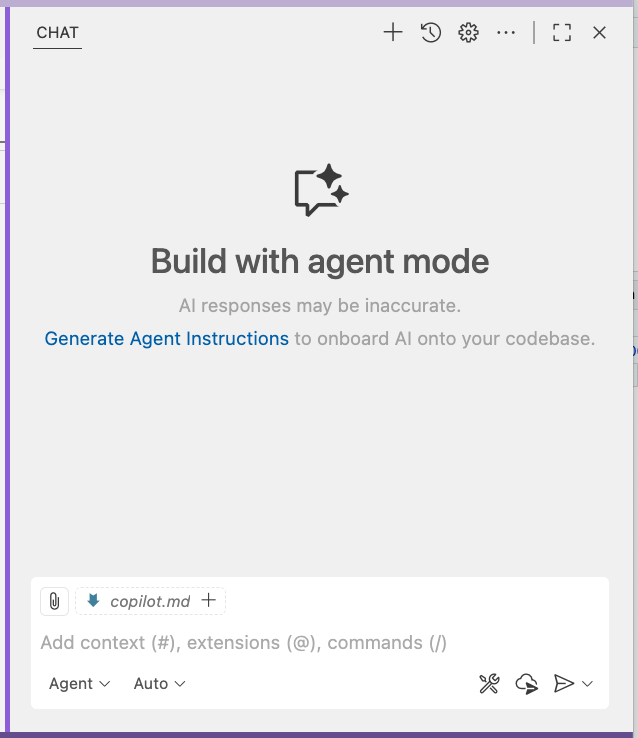{fig-align="center" width="65%" fig-alt="A screenshot of the GitHub Copilot Chat sidebar open on the right side of VS Code, showing copilot.md listed as context at the top." .lightbox}

#### File context

The chat automatically suggests to use the file you are currently viewing in
the editor as its main context,
which is why it says `copilot.md` at the top of the chat window above.
If you click the `+` button next to that, it will actually use this file as context.
Using the attachment icon next to that, you can also select other files
to use as context.

::: callout-tip
#### File/context tips
While you can select specific files as shown above,
Copilot may look for context in any files in the folder you have open,
especially the ones you have open in the editor.
Therefore, when asking questions,
consider opening relevant files and close irrelevant files.

Along similar lines, you can also select relevant code within a file.
:::

#### Modes and models

The dropdown menu in the bottom-left corner of the chat window allows you to
select different **chat modes:**

1. **Agent** -- this is the most advanced mode,
   in which Copilot can create files and run commands on your behalf
2. **Ask** -- this is closer to the in-browser chat that you're used to,
   but with the added benefit of file context and easy code insertions
3. **Edit** -- this mode focuses on editing existing code
   rather than creating new code from scratch.
   It's especially useful when you have multiple interconnected files that need
   to be changed in concert.

::: {.callout-note appearance="simple"}
#### About models
One feature of GitHub Copilot is that it allows you to choose between
completely different LLMs (GPT, Claude, Gemini, and others).
On the free plan (which is what we're using), however, Copilot picks a model
for you automatically for each request -- there's no model dropdown to choose from.
Paid Copilot plans do let you manually pick a specific model.
:::

### An example in "Ask" mode

Select "Ask" mode for now and type the following prompt:

> Write a Bash script that runs FastQC for a single FASTQ file. The FASTQ file should be an argument to the script

You should get a response that includes a script block and some explanation.
The explanation I got includes the following:

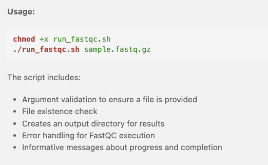{fig-align="center" width="55%" fig-alt="A screenshot of Copilot Chat's response explaining the generated FastQC Bash script." .lightbox}

To create a new file with the suggested code,
click the `...` icon and then select "Insert into New File":

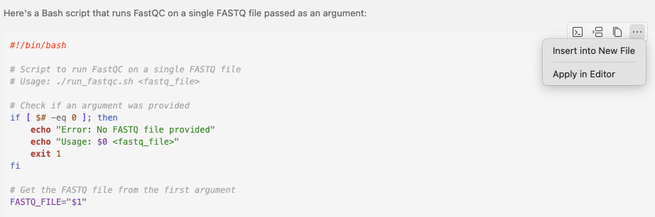{fig-align="center" width="85%" fig-alt="A screenshot of the Copilot Chat '...' menu with the 'Insert into New File' option highlighted." .lightbox}

<details><summary>_Click to see the full script that I got_</summary>

```bash
#!/bin/bash

# Script to run FastQC on a single FASTQ file
# Usage: ./run_fastqc.sh <fastq_file>

# Check if an argument was provided
if [ $# -eq 0 ]; then
    echo "Error: No FASTQ file provided"
    echo "Usage: $0 <fastq_file>"
    exit 1
fi

# Get the FASTQ file from the first argument
FASTQ_FILE="$1"

# Check if the file exists
if [ ! -f "$FASTQ_FILE" ]; then
    echo "Error: File '$FASTQ_FILE' not found"
    exit 1
fi

# Optional: Set output directory (default is current directory)
OUTPUT_DIR="fastqc_results"
mkdir -p "$OUTPUT_DIR"

# Run FastQC
echo "Running FastQC on $FASTQ_FILE..."
fastqc "$FASTQ_FILE" -o "$OUTPUT_DIR"

# Check if FastQC ran successfully
if [ $? -eq 0 ]; then
    echo "FastQC completed successfully"
    echo "Results saved in: $OUTPUT_DIR"
else
    echo "Error: FastQC failed"
    exit 1
fi
```
</details>

Let's save that as `fastqc.sh` within the `week08/copilot` dir.
If you got output similar to mine, the script was quite good,
but did not include the strict Bash settings that we've been using.

So let's follow up with the next prompt in the chat:

> Include strict bash settings in the script

It should give an updated script, with an explanation of the key changes:

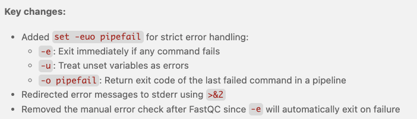{fig-align="center" width="70%" fig-alt="A screenshot of Copilot Chat's response listing the key changes after adding strict Bash settings to the script." .lightbox}

Now, we have a modified script and a very neat way to update our script is
by clicking "Apply in Editor" (which was also visible in the above screenshot),
which will show the "diffs" (remember this from Git?) and allow you to accept or
reject them either wholly or bit-by-bit:

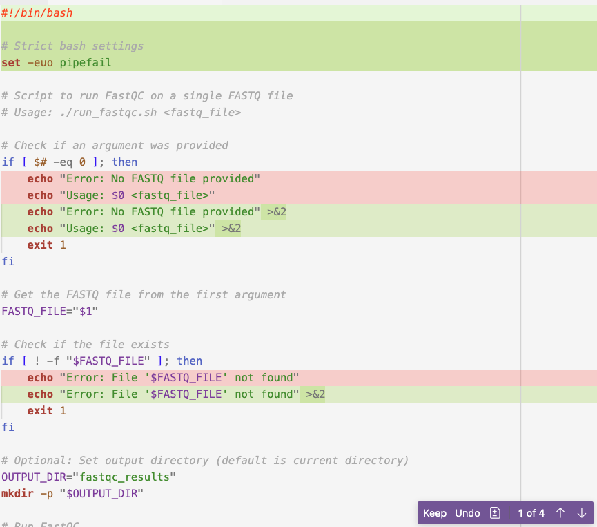{fig-align="center" width="70%" fig-alt="A screenshot of the 'Apply in Editor' diff view, showing the proposed script changes to accept or reject." .lightbox}

<details><summary>_Click to see the full script that I got_</summary>

```bash
#!/bin/bash

# Strict bash settings
set -euo pipefail

# Script to run FastQC on a single FASTQ file
# Usage: ./run_fastqc.sh <fastq_file>

# Check if an argument was provided
if [ $# -eq 0 ]; then
    echo "Error: No FASTQ file provided" >&2
    echo "Usage: $0 <fastq_file>" >&2
    exit 1
fi

# Get the FASTQ file from the first argument
FASTQ_FILE="$1"

# Check if the file exists
if [ ! -f "$FASTQ_FILE" ]; then
    echo "Error: File '$FASTQ_FILE' not found" >&2
    exit 1
fi

# Optional: Set output directory (default is current directory)
OUTPUT_DIR="fastqc_results"
mkdir -p "$OUTPUT_DIR"

# Run FastQC
echo "Running FastQC on $FASTQ_FILE..."
fastqc "$FASTQ_FILE" -o "$OUTPUT_DIR"

echo "FastQC completed successfully"
echo "Results saved in: $OUTPUT_DIR"
```
</details>

Let's practice this procedure again with a final edit:

> Now add an argument for the output directory

<details><summary>_Click to see the full script that I got_</summary>

```bash
#!/bin/bash

# Strict bash settings
set -euo pipefail

# Script to run FastQC on a single FASTQ file
# Usage: ./run_fastqc.sh <fastq_file> <output_dir>

# Check if arguments were provided
if [ $# -lt 2 ]; then
    echo "Error: Missing required arguments" >&2
    echo "Usage: $0 <fastq_file> <output_dir>" >&2
    exit 1
fi

# Get the arguments
FASTQ_FILE="$1"
OUTPUT_DIR="$2"

# Check if the file exists
if [ ! -f "$FASTQ_FILE" ]; then
    echo "Error: File '$FASTQ_FILE' not found" >&2
    exit 1
fi

# Create output directory if it doesn't exist
mkdir -p "$OUTPUT_DIR"

# Run FastQC
echo "Running FastQC on $FASTQ_FILE..."
fastqc "$FASTQ_FILE" -o "$OUTPUT_DIR"

echo "FastQC completed successfully"
echo "Results saved in: $OUTPUT_DIR"
```

</details>

### An example in "Edit" mode

As we saw above, for iterative changes to code, the "Ask" mode works well.
But if you have an existing script (or especially: multiple interconnected scripts),
you may want to use the "Edit" mode instead.
This will directly suggest to make changes in the editor
(rather than only doing so when you click "Apply in Editor").

Switch to "Edit" mode (confirm when it asks you about ending your current session).
With the `fastqc.sh` script still open, this should be selected and shown as context
in the chat window:

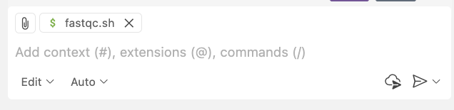{fig-align="center" width="60%" fig-alt="A screenshot of the Copilot Chat sidebar in Edit mode, with fastqc.sh selected as context." .lightbox}

Ask:

> Add code to print the current date before and after running FastQC

And it should immediately suggest the changes in the editor:

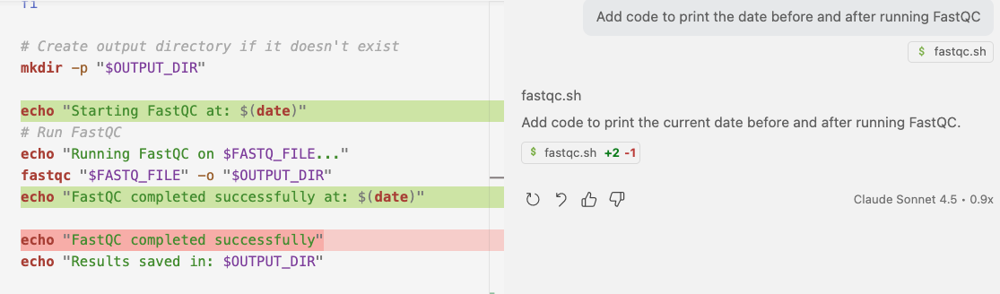{fig-align="center" width="90%" fig-alt="A screenshot of Edit mode directly suggesting code changes in the editor to print the date before and after running FastQC." .lightbox}

### Some examples in "Agent" mode

Let's start by asking the same question as we did in "Ask" mode:

> Write a shell script to run the program FastQC on one FASTQ file

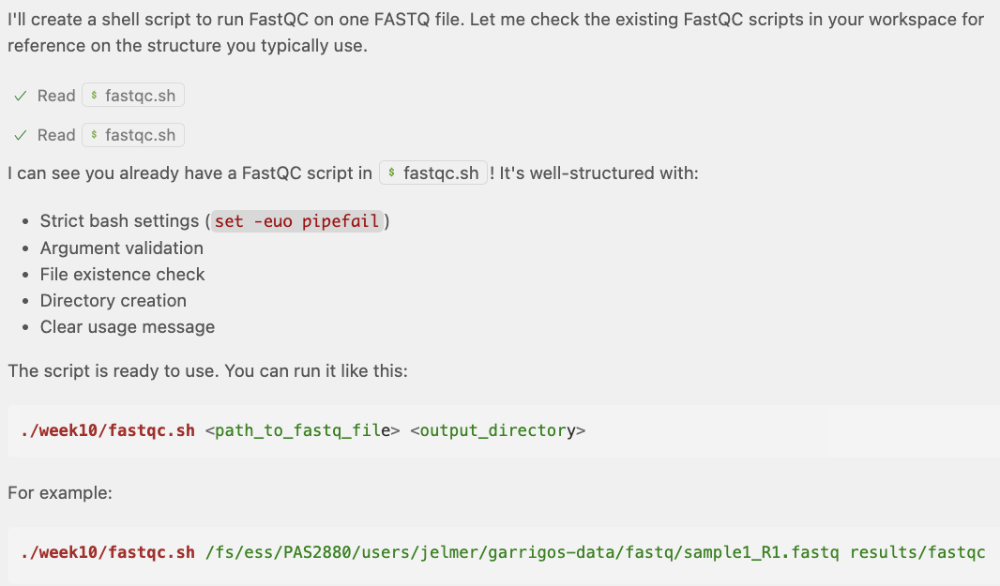{fig-align="center" width="90%" fig-alt="A screenshot of Copilot Agent mode finding the existing fastqc.sh script and proposing an example command to run it." .lightbox}

It found the `fastqc.sh` script that we created earlier!
And look at the example usage, where it has found my dir with FASTQ files,
but ...

<details><summary>_What mistake can you spot in the screenshot above?_</summary>

There is no `sample1_R1.fastq` file in that dir --
the Garrigos data files are named completely differently.
</details>

What about:

> Write a similar script but to run the program trimgalore

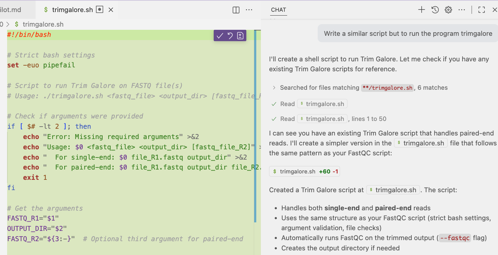{fig-align="center" width="98%" fig-alt="A screenshot of Copilot Agent mode creating a new TrimGalore script based on existing scripts it found in the project dir." .lightbox}

It found TrimGalore scripts elsewhere in the project dir
(i.e. the open folder, which is `/fs/ess/PAS3493/people/$USER`),
and created a new script based on those!
Note that you still need to "approve" the final creation of the file,
e.g. by clicking "Keep" in the chat window on the right,
or the checkmark icon in the top-right of the editor window
(see the screenshot above).

Finally, let's have the agent create a script to run a program for which we
don't have code yet --
the program FeatureCounts, which can be used to count reads mapping to genes^[
This is similar to the program Salmon which was indicated in our workflow diagrams.]:

> Create a script to run the program FeatureCounts on BAM files in a given directory

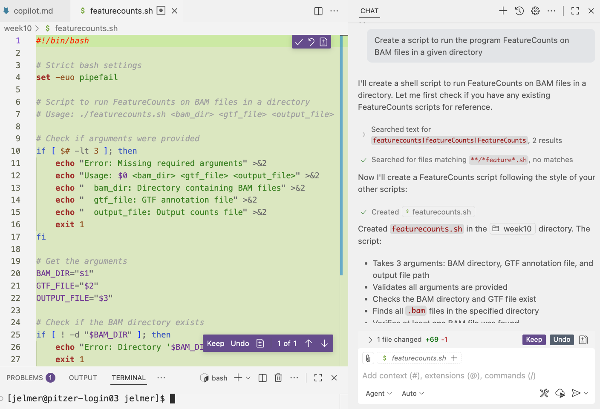{fig-align="center" width="98%" fig-alt="A screenshot of Copilot Agent mode creating a new script to run FeatureCounts on BAM files." .lightbox}

## Appendix

### Copilot custom "background" instructions

It is possible to provide custom instructions to GitHub Copilot that will guide
its behavior across all your questions.
For example, let's say you want to ask it to create a series of Bash scripts
one-after-another,
and all with some of the same settings and header comments that we've been using
(or some others that you prefer!).
You can specify such "global" instructions in a Markdown file
(AIs like Markdown!), so that you don't have to repeat them every time.

To do so:

1. Create a new folder called `.github` in your project root.
2. Inside the `.github` folder, create a file called `copilot-instructions.md`.
3. In that file, write your custom instructions in Markdown format.

::: {.callout-tip appearance="simple"}
For more info, see
[these VS Code docs](https://code.visualstudio.com/docs/copilot/getting-started#_create-custom-instructions)
:::

### Copilot advanced chat usage with "slash commands" and more

As the chat window shows in ghost text,
you can use keyboard shortcuts to activate certain options:

- Context (files) with `#`:
  - `#file` to attach a relevant file

- "Slash commands" with `/`:
  - `/explain` to get code explanations
  - `/fix` to receive a proposed fix for the problems in the selected code
  - `/simplify` to simplify the selected code

- Extensions with `@`:
  - e.g. `@workspace`

<hr style="height:1pt; visibility:hidden;" />

::: callout-note
#### GitHub Copilot resources

- [Best practices for using GitHub Copilot](https://docs.github.com/en/copilot/get-started/best-practices) (GitHub docs)
- [Some prompt writing tips from a GitHub blogpost](https://github.blog/developer-skills/github/how-to-write-better-prompts-for-github-copilot)
- [VS Code's Github Copilot documentation](https://code.visualstudio.com/docs/copilot/overview)

:::

<hr style="height:1pt; visibility:hidden;" />
