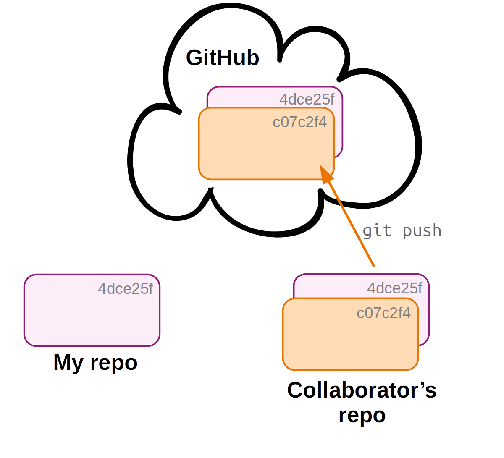
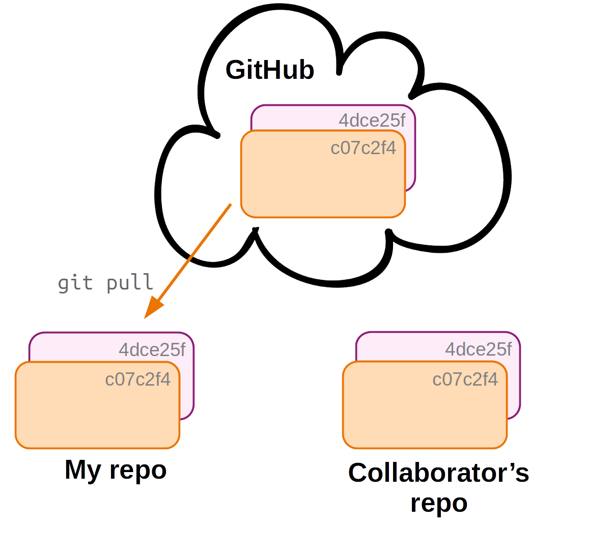
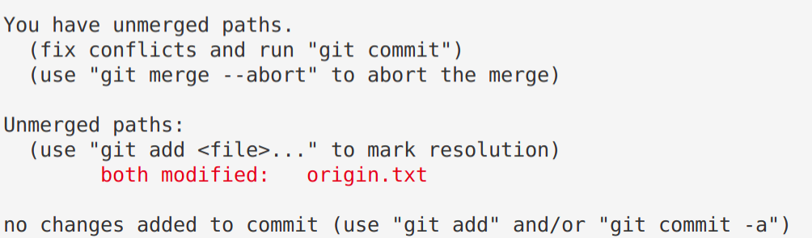
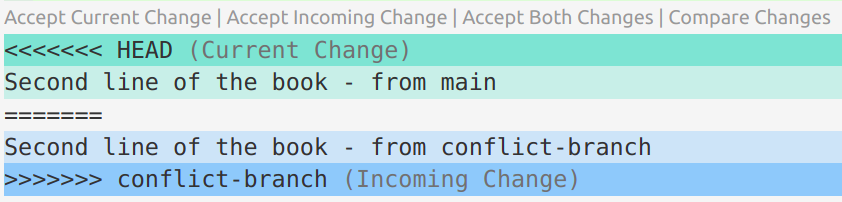
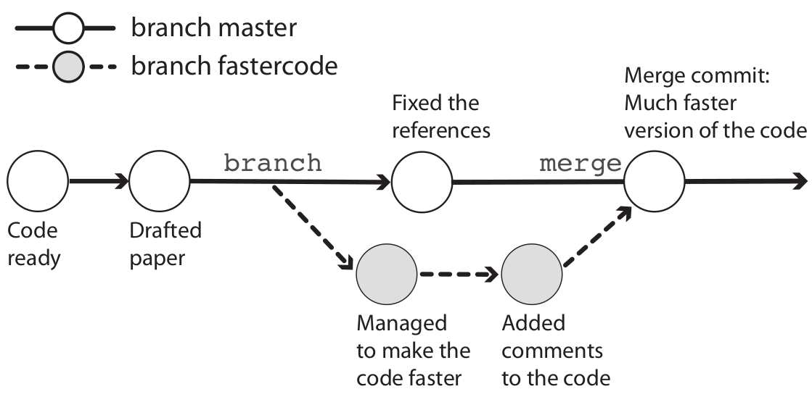

--------------------------------------------------------------------------------

<br>

## Introduction

This page contains optional self-study material if you want to dig deeper into Git.
Some of it may also be useful as a reference in case you run into problems while
trying to use Git.

- [Moving and removing tracked files](#moving-and-removing-tracked-files)
- [Unstaging files](#unstaging-files)
- [Collaboration with Git: multi-user remote workflows](#collaboration-with-git-multi-user-remote-workflows)
- [Contributing to repositories: Forking & Pull Requests](#contributing-to-repositories-forking-pull-requests)
- [Undoing (& viewing) changes that have been committed](#undoing-viewing-changes-that-have-been-committed)
- [Branching & merging](#branching-merging)
- [Miscellaneous Git](#miscellaneous-git)

## Moving and removing tracked files

_This section and the next one continue with the `evo` repository
from the [Git hands-on lecture](/week05/w5b_git.qmd)._

### Moving and removing tracked files

When you want to remove, move, or rename files that are tracked by Git,
it is good practice to preface the regular `rm` and `mv` commands with `git` ---
that is, to use `git rm` and `git mv`.

When removing or moving/renaming a tracked file with `git rm` / `git mv`,
changes will be made to your working dir just like with a regular `rm`/`mv`,
and the operation will also be _staged_.
For example:

``` sh
# (Don't run this, hypothetical examples)
git rm file-to-remove.txt
git mv myoldname.txt mynewname.txt

git status
```
```bash-out
On branch main
Changes to be committed:
  (use "git restore --staged <file>..." to unstage)
        renamed:    myoldname.txt -> mynewname.txt
        deleted:    file-to-remove.txt
```

<hr style="height:1pt; visibility:hidden;" />

::: {.callout-warning collapse=true}
#### What if I forget to use `git rm`/`git mv`? _(Click to expand)_

It is inevitable that you will occasionally forget about this and e.g. use `rm`
instead of `git rm`.
Fortunately, _Git will eventually figure out what happened_. For example:

- For a renamed file, Git will first be confused and register both a removed file
  and an added file:

  ```bash
  # (Don't run this, hypothetical example)
  mv myoldname.txt mynewname.txt

  git status
  ```
  ```bash-out
  On branch main
  Changes not staged for commit:
    (use "git add/rm <file>..." to update what will be committed)
    (use "git restore <file>..." to discard changes in working directory)
          deleted:    myoldname.txt

  Untracked files:
    (use "git add <file>..." to include in what will be committed)
          mynewname.txt
  ```

- But after you stage both changes (the new file and the deleted file),
  Git realizes it was renamed instead:

  ```bash
  git add myoldname.txt
  git add mynewname.txt

  git status
  ```
  ```bash-out
  On branch main
  Changes to be committed:
    (use "git restore --staged <file>..." to unstage)
          renamed:    myoldname.txt -> mynewname.txt
  ```

So, there is no need to stress if you forget this, but when you remember,
use `git mv` and `git rm`.
:::

### Stop tracking a file, but keep it on your computer

`git rm` removes a file from the repo and deletes it from your working dir.
In some cases, though, you want to keep the file, but have Git stop tracking it.
For example, if you accidentally committed a large data file or a file with a password,
you might want to remove it from the repo but keep it on your computer.

For this, add the `--cached` option:

```sh
# (Don't run this, hypothetical example)
echo "results/" >> .gitignore        # Make sure Git ignores it from now on
git rm --cached results/counts.tsv   # Stop tracking it, but keep the file
git commit -m "Stop tracking the counts file"
```

The file stays put in your working dir, but Git no longer tracks it ---
and thanks to the `.gitignore` entry, it won't be reported as untracked either.

Be aware that this only stops tracking the file *from now on*:
the versions you already committed stay in the repo's history,
and will still be pushed to GitHub.
Removing a file from a repo's history entirely is difficult,
which is exactly why it's so important not to commit large or sensitive files
in the first place.

::: exercise
####  Exercise: `.gitignore` and `git rm`

1. Create a new directory `results` with files `Galapagos.txt` and `Ascension.txt`.
   Add a line to the `.gitignore` file to ignore all files in `results`,
   and commit the changes to the `.gitignore` file.

   <details><summary>  _Click for the solution._ </summary>

   - Create the dir and files:

     ```bash
     mkdir results
     touch results/Galapagos.txt results/Ascension.txt
     ```

   - Optional - check that they are detected by Git
     (note: only the dir will be shown, not its contents):

     ```bash
     git status
     ```
     ```bash-out
     On branch main
     Untracked files:
       (use "git add <file>..." to include in what will be committed)
             results/

     nothing added to commit but untracked files present (use "git add" to track)
     ```

   - Add the text "results/" to the `.gitignore` file:

     ```bash
     echo "results/" >> .gitignore
     ```

   - Optional - check the status again:

     ```bash
     git status
     ```
     ```bash-out
     On branch main
     Changes not staged for commit:
       (use "git add <file>..." to update what will be committed)
       (use "git restore <file>..." to discard changes in working directory)
             modified:   .gitignore

     no changes added to commit (use "git add" and/or "git commit -a")
     ```

     Looks good, `results/` is no longer listed.
     But you do need to commit the changes to `.gitignore`.

   - Commit the changes to `.gitignore`:

     ```bash
     git add .gitignore
     git commit -m "Add results dir to gitignore"
     ```
     ```bash-out
     [main 33b6576] Add results dir to gitignore
     1 file changed, 1 insertion(+)
     ```
   </details>

2. Create and commit an empty new file `notes.txt`.
   Then, remove it with `git rm` and commit your file removal.

   <details><summary>  _Click for the solution._ </summary>

   - Create the file and add and commit it:

     ```bash
     touch notes.txt
     git add notes.txt
     git commit -m "Add notes"
     ```
     ```bash-out
     [main 44a37f9] Add notes
     1 file changed, 0 insertions(+), 0 deletions(-)
     create mode 100644 notes.txt
     ```

   - Optional - check that the file is there:

     ```bash
     ls
     ```
     ```bash-out
     data  notes.txt  origin.txt  README.md  results  todo.txt  todo.txt~
     ```

   - Remove the file with `git rm` and commit the removal:

     ```bash
     git rm notes.txt
     git commit -m "These notes were made in error"
     ```
     ```bash-out
     [main 058fd47] These notes were made in error
     1 file changed, 0 insertions(+), 0 deletions(-)
     delete mode 100644 notes.txt
     ```

   - Optional - check that the file is no longer there:

     ```bash
     ls
     ```
     ```bash-out
     data  origin.txt  README.md  results  todo.txt  todo.txt~
     ```
   </details>

3. Suppose that, *before* you had added `results/` to `.gitignore`,
   you had already committed `results/Galapagos.txt`.
   You then add `results/` to `.gitignore` as in part 1.
   Would `git status` still report changes to `results/Galapagos.txt`?
   And which command would you use to make Git stop tracking it
  *without deleting the file*?

   <details><summary>  _Click for the solution._ </summary>

   Yes, it would still be reported:
   `.gitignore` only affects *untracked* files,
   so a file that is already tracked keeps being tracked.

   To stop tracking it while keeping it on your computer:

   ```bash
   git rm --cached results/Galapagos.txt
   git commit -m "Stop tracking the Galapagos results"
   ```

   (Plain `git rm` would also delete the file itself.)

   </details>

:::

## Collaboration with Git: multi-user remote workflows

In a multi-user workflow, your collaborator can make changes to the repository
(committing to local, then pushing to remote),
and you need to make sure that you stay up-to-date with these changes.

Synchronization between your and your collaborator's repository happens via the remote,
so now you will need a way to _download_ changes from the remote that your collaborator made.
This happens with the **`git pull`** command.

::: columns
::: {.column width="48%"}
{fig-align="center" width="100%" fig-alt="A diagram showing a multi-user Git and Github workflow in 4 steps: step 1" .lightbox}
:::
::: {.column width="4%"}
:::
::: {.column width="48%"}
{fig-align="center" width="100%" fig-alt="A diagram showing a multi-user Git and Github workflow in 4 steps: step 2" .lightbox}
:::
:::

------

::: columns
::: {.column width="48%"}
{fig-align="center" width="100%" fig-alt="A diagram showing a multi-user Git and Github workflow in 4 steps: step 3" .lightbox}
:::
::: {.column width="4%"}
:::
::: {.column width="48%"}
{fig-align="center" width="100%" fig-alt="A diagram showing a multi-user Git and Github workflow in 4 steps: step 4" .lightbox}
:::
:::

In a multi-user workflow,
changes made by different users are **shared via the online copy of the repo**.
But syncing is not automatic:

- Changes to your local repo remain local-only until you **push** to remote.
- Someone else's changes to the remote repo do not make it into your
  local repo until you **pull** from remote.

However, Git can tell you about "divergence" between your local repository and the remote.
Note that `git status` by itself does **not** contact GitHub:
it compares your local repo with the last state of the remote that Git knows about.
To have Git check the remote for new commits
without merging them into your working dir, run `git fetch` first:

```bash
# (Don't run this, hypothetical example)
git fetch    # Ask GitHub whether there are new commits
git status   # Now git status knows about your collaborator's commits
```
{.no-border fig-align="left" width="60%"}

::: {.callout-warning appearance="simple"}
In a multi-user workflow, you should use `git pull` often,
since staying up-to-date with your collaborator's changes will reduce the chances of
*[merge conflicts](#merge-conflicts)*.
:::

::: {.callout-note collapse="true"}
#### A message you may run into when pulling _(Click to expand)_

Usually, `git pull` simply downloads the commits you don't have yet,
and you'll see no more than a summary of the changes.
But when _both_ your local repo and the remote have commits that the other
doesn't have --- the two have "**diverged**", which can easily happen when you
work from two computers or with collaborators ---
Git refuses to guess how to combine them, and prints a wall of text:

```sh
git pull
```
```bash-out
hint: You have divergent branches and need to specify how to reconcile them.
hint: You can do so by running one of the following commands sometime before
hint: your next pull:
hint:
hint:   git config pull.rebase false  # merge
hint:   git config pull.rebase true   # rebase
hint:   git config pull.ff only       # fast-forward only
hint:
hint: You can replace "git config" with "git config --global" to set a default
hint: preference for all repositories. [...]
fatal: Need to specify how to reconcile divergent branches.
```

Nothing went wrong here, and nothing was changed:
Git just stopped and asked you to pick a strategy.
The first option, `merge`, keeps both sets of commits and ties them together
with an extra "merge commit",
and is the best default for how we use Git in this course.

To select it once and for all, so you won't see this message again:

```sh
git config --global pull.rebase false
```
:::

### Add a collaborator in GitHub

You can add a collaborator to a repository on GitHub as follows:

1. Go to the repository's settings.
2. Click on `Collaborators` in the left-hand menu.
3. Click `Add people` and follow the prompts.

### Merge conflicts

A so-called **merge conflict** means that Git is not able to automatically merge
two branches, which occurs when **all three** of the following conditions are met:

- You try to merge two branches
  (this includes cases where you're pulling from remote: a pull includes a merge).
- One or more file changes have been committed on **both** branches since their
  divergence.
- Some of these changes were made in the same part(s) of file(s).

When this occurs, Git has no way of knowing which changes to keep,
and it will report a merge conflict as follows:

{fig-align="center" width="70%" .no-border fig-alt="A screenshot of Git reporting a Merge Conflict." .lightbox}

#### Resolving a merge conflict

When Git reports a merge conflict, follow these steps:

1. Use **`git status`** to find the conflicting file(s).

{fig-align="center" width="70%" .no-border fig-alt="A screenshot showing how you can see which file contains a Conflict." .lightbox}

2. **Open and edit those file(s) manually** to a version that fixes the conflict.

   Git will have changed these file(s) to add the conflicting lines from both versions
   of the file, and to add marks that indicate which lines conflict.
   You have to manually change the contents in your text editor to keep the
   conflicting content that you want, and to remove the indicator marks that Git made.

   ```bash-out-solo
   On the Origin of Species       # Line preceding conflicting line
   <<<<<<< HEAD                   # GIT MARK 1: Next line = current branch
   Line 2 - from main             # Conflict line: current branch
   =======                        # GIT MARK 2: Dividing line
   Line 2 - from conflict-branch  # Conflict line: incoming branch
   >>>>>>> conflict-branch        # GIT MARK 3: Prev line = incoming branch
   ```

3. Use `git add` to tell Git you've resolved the conflict in a particular file:

   ```sh
   git add origin.txt
   ```

{fig-align="center" width="50%" .no-border fig-alt="A screenshot showing Git output when the conflicts have been fixed." .lightbox}

4. Once all conflicts are resolved, use `git status` to check that all changes
   have been staged.
   Then, use `git commit` to finish the merge commit:

   ```sh
   git commit -m "Solved the merge conflict"
   ```

<hr style="height:1pt; visibility:hidden;" />

::: callout-tip
#### VS Code functionality for resolving Merge Conflicts

VS Code has some nice functionality to make Step 2 (resolving the conflict) easier.
After the merge conflict, you can open the conflicting file in VS Code:

{fig-align="center" width="70%" fig-alt="A screenshot of how VS Code shows conflicting lines in a file causing a Merge Conflict." .lightbox}

If you click on "*Accept Current Change*" or "*Accept Incoming Change*", etc.,
it will keep the desired lines and remove the Git indicator marks.
Then, save and exit.
:::

## Contributing to repositories: Forking & Pull Requests

### What can you do with someone else's GitHub repository?

In some cases, you may be interested in working in some way with someone else's
repository that you found on GitHub.
If you do not have rights to push, you can:

- **Clone** the repo and make changes locally. When you do this,
  you can also periodically pull to remain up-to-date with changes in the original repo.
- **Fork** the repository on GitHub and develop it independently.
  Forking creates *a new personal GitHub repo*, to which you can push.
- Using a forked repo, you can also submit a **Pull Request** with proposed
  changes to the original repo:
  for example, if you've fixed a bug in someone else's program.

If you're actually collaborating on a project, though,
you should ask your collaborator to give you admin rights for the repo,
which makes things a lot easier than working via Pull Requests.

::: {.callout-tip appearance="simple"}
Note: Forking, Pull Requests, and Issues are GitHub functionality, and not part of Git.
:::

#### Forking a GitHub repository

You can follow along by e.g. forking [my `evo` repo](https://github.com/jelmerp/evo).

- Go to a GitHub repository, and click the "**_Fork_**" button in the top-right:

{fig-align="center" width="50%" fig-alt="A screenshot of the 'Fork' button on GitHub." .lightbox}

- You may be asked which account to fork to: select your account.
- Now, you have your own version of the repository, and it is labeled explicitly as a fork.

#### Forking workflow

You can't directly modify the *original repository*, but you can:

- First, **modify your fork** (with local edits and pushing).
- Then, **submit a so-called Pull Request** to the owner of the original repo
  to pull in your changes.
- You can also easily **keep your fork up-to-date** with changes to the
  original repository.

{target="_blank"}](../img/fork-triangle-happy.png){fig-align="center" width="70%" fig-alt="A diagram of the fork-and-pull request workflow." .lightbox}

#### Editing the forked repository

To clone your forked GitHub repository to a dir at OSC,
start by creating a dir there --- for example:

```bash
mkdir /fs/ess/PAS3493/people/$USER/week05/fork_test
cd /fs/ess/PAS3493/people/$USER/week05/fork_test
```

Then, find the URL for your forked GitHub repository by clicking the green `Code` button.
Make sure you get the SSH URL (rather than the HTTPS URL),
and click the clipboard button next to the URL to copy it:

{fig-align="center" width="50%" .no-border fig-alt="A screenshot showing where to find the SSH URL to a repository." .lightbox}

Then, type `git clone` and a space, and paste the URL, e.g.:

```sh
git clone git@github.com:jelmerp/originspecies.git
```
```bash-out
Cloning into 'originspecies'...
remote: Enumerating objects: 31, done.
remote: Counting objects: 100% (31/31), done.
remote: Compressing objects: 100% (19/19), done.
remote: Total 31 (delta 4), reused 30 (delta 3), pack-reused 0
Receiving objects: 100% (31/31), done.
Resolving deltas: 100% (4/4), done.
```

Now, you can make changes to the repository in the familiar way, for example:

```sh
echo "# Chapter 1. Variation under domestication" >> origin.txt
git add origin.txt
git commit -m "Suggested title for first chapter"
```

And note that you can push without any setup ---
because you cloned the repository, the remote setup is already done
(and you have permission to push because it's your own repo on GitHub and you
have set up GitHub authentication):

```bash
git push
```

#### Creating a Pull Request

If you then go back to GitHub, you'll see that your forked repo is "*x commit(s) ahead*"
of the original repo:

{fig-align="center" width="90%" fig-alt="A screenshot of GitHub indicating that a forked repo is ahead of the original repo." .lightbox}

Click `Pull request`, and check whether the right repositories and branches
are being compared
(and here you can also see the changes that were made in the commits):

{fig-align="center" width="90%" fig-alt="A screenshot of GitHub indicating that two repos can be merged." .lightbox}

If it looks good, click the green `Create Pull Request` button:

{fig-align="center" width="90%" fig-alt="A screenshot of the 'Create pull request' button on GitHub." .lightbox}

Give your Pull Request a title, and write a brief description of your changes:

{fig-align="center" width="85%" fig-alt="A screenshot of the 'Pull  Request' dialogue box." .lightbox}

#### Keeping your fork up-to-date

As you saw, you can't directly *push* to the original repo but instead have to submit
a Pull Request (yes, this terminology is confusing!).
The easiest way to do this is on the GitHub website:
on your fork's page, GitHub shows how many commits your fork is behind the
original repo, along with a **`Sync fork`** button that pulls in the changes.
(After that, run `git pull` locally to get those changes onto your computer too.)

If you'd rather do it entirely from the command line,
you *can* create an ongoing connection to the original repo,
which you can use to periodically *pull* to keep your fork up-to-date.
This works similarly to connecting your own GitHub repo,
but you should give the remote a different nickname than `origin` --- the convention
is `upstream`:

```bash
# Add the "upstream" connection
git remote add upstream git@github.com:jelmerp/originspecies.git

# List the remotes:
git remote -v
```
```bash-out
origin   git@github.com:pallass-boszanger/originspecies.git  (fetch)
origin   git@github.com:pallass-boszanger/originspecies.git  (push)
upstream   git@github.com:jelmerp/originspecies.git  (fetch)
upstream   git@github.com:jelmerp/originspecies.git  (push)
```

```bash
# Pull from the upstream repository:
git pull upstream main
```

::: {.callout-tip appearance="simple"}
"*Upstream*" is an arbitrary but conventional name ---
compare with `origin`, which is used for your *own* version of the online repo.
:::


## Undoing changes that have not been committed

In the [Git hands-on lecture](/week05/w5b_git.qmd#undoing-changes-that-have-not-been-committed),
you used `git restore` to undo changes to files in your working dir.
Here, you'll learn how to undo other kinds of changes that have not been committed.

### Unstaging files

`git restore` can also *unstage* a file.
In other words, you can undo the staging that is done by `git add`,
so the file goes back to the *modified* state.

This is most often needed when you added a file that was not supposed to be part
of the next commit. For example:

1. You modify two files and use `git add --all`:

   ```sh
   echo "Variation under domestication" >> origin.txt
   echo "Prepare for the next journey" >> todo.txt

   git add --all
   ```

2. Then you realize that those two file changes should be part of separate commits.
   Again, check the status first:

   ```bash
   git status
   ```
   ```bash-out
   On branch main
   Changes to be committed:
     (use "git restore --staged <file>..." to unstage)
           modified:   origin.txt
           modified:   todo.txt
   ```

3. And use `git restore --staged` as suggested by Git:

   ```sh
   git restore --staged todo.txt

   git status
   ```
   ```bash-out
   On branch main
   Changes to be committed:
     (use "git restore --staged <file>..." to unstage)
           modified:   origin.txt

   Changes not staged for commit:
     (use "git add <file>..." to update what will be committed)
     (use "git restore <file>..." to discard changes in working directory)
           modified:   todo.txt
   ```

Now, you can go ahead and add these changes to separate commits: see the exercise below.
And finally, in case you merely staged a file _prematurely_,
you can just continue editing the file and re-add it afterwards.

::: exercise
####  Exercise: Commit the changes 1-by-1

1. You just ran `git restore --staged todo.txt`.
   Before checking: do you think the *contents* of `todo.txt` in your working dir changed?
   Why or why not?

   <details><summary>  _Click for the solution._ </summary>

   No: unstaging only changes which version Git has lined up for the next commit,
   so your file on disk is untouched.
   This is also why there are two separate commands:
   `git restore --staged <file>` moves a file out of the Index,
   whereas `git restore <file>` overwrites the file in your working dir.
   </details>

2. Commit the currently staged changes to `origin.txt`.
   Then predict what `git status` will report about `todo.txt`, and check.

   <details><summary>  _Click for the solution._ </summary>

   ```bash
   git commit -m "Start writing about artificial selection"
   git status
   ```

   `todo.txt` is still listed as "modified" and not staged:
   committing `origin.txt` did nothing to it.
   </details>

3. Now stage and commit the changes to `todo.txt` as well.

   <details><summary>  _Click for the solution._ </summary>

   ```bash
   git add todo.txt
   git commit -m "Update the TODO file"
   ```
   </details>

:::

### Undoing staged changes

What if you had made mistaken changes (like an accidental deletion) and also
*staged* those changes?
You can simply follow the two steps described above, in order:

1. First unstage the file with `git restore --staged <file>`.
2. Then discard changes in the working dir with `git restore <file>`.

For instance, you overwrote the contents of the book and then staged the overwritten file:

```sh
echo "Instincts of the Cuckoo" > origin.txt
git add origin.txt

cat origin.txt
```
```bash-out
Instincts of the Cuckoo
```

You can undo all of this as follows:

```bash
git restore --staged origin.txt
git restore origin.txt

cat origin.txt
```
```bash-out
On the Origin of Species
Variation under domestication
```

## Undoing (& viewing) changes that have been committed

Whereas in the [Git hands-on lecture](/week05/w5b_git.qmd) and above,
you learned about undoing changes that have _not_ been committed,
here you'll see how you can undo changes that have been committed.
We'll start with some concepts that are helpful in this context.

### The three trees of Git

In class, you saw that a file can be in three states: *committed*, *staged*, and *modified*.
These states correspond to the three "trees" of Git ---
three snapshots of your project that Git keeps side by side:

- **HEAD**: State of the project in the most recent commit (on the current branch).
- **Index** (*Stage*): State of the project ready to be committed.
- **Working directory** (_Working Tree_): State of the project as currently on your computer.

<hr style="height:1pt; visibility:hidden;" />

{fig-align="center" width="40%" .no-border fig-alt="A diagram illustrating the concept of the three trees of Git." .lightbox}

<hr style="height:1pt; visibility:hidden;" />

Or consider this table for a hypothetical example in which HEAD, the Index,
and the working dir all differ with regards to the version of file 1,
and there also is an untracked file in the working dir:

| File state    | Version                                     | Which tree    |
| ------------- | ------------------------------------------- | ------------- |
| **Committed** | file 1 version X                            | HEAD          |
| **Staged**    | [**file 1 version Y**]{style="color:green"} | Index (stage) |
| **Modified**  | [**file 1 version Z**]{style="color:red"}   | Working dir   |
| **Untracked** | [**file 2 version X**]{style="color:red"}   | Working dir   |

: {.striped .hover tbl-colwidths="[25, 25, 25]"}

### Ways to refer to past commits

To refer to specific past commits, you can:

- Use the hexadecimal checksum (either the full ID or the 7-character abbreviation)
- Use ***HEAD*** notation: HEAD is the most recent commit,
  and there are two ways of indicating ancestors of HEAD:

<hr style="height:1pt; visibility:hidden;" />

{fig-align="center" width="70%" .no-border fig-alt="A diagram showing how to refer to past commits." .lightbox}

For example, using `git diff` to compare your repo or individual files between
any two arbitrary commits:

```bash
# Second-to-last commit vs last commit - full repo:
git diff HEAD^ HEAD

# A specified commit vs the last commit - specific file:
git diff d715c54 HEAD todo.txt
```

Note that the order matters: `git diff <A> <B>` shows the changes needed to go
*from* A *to* B, so type the ID of the older commit first if you want more recently
added lines to show up as additions.

### Viewing past versions of the repository

Before undoing committed changes, you may want to look at earlier states of your repo,
e.g. to know what to revert to:

- First, print an overview of past commits and their messages:

  ```sh
  # (example code in this and the next few boxes - don't run as-is)
  git log --oneline
  ```

- Find a commit you want to go back to, and look around in the past:

  ```sh
  git switch --detach <sha-id>  # Replace <sha-id> by an actual hash

  less myfile.txt               # Etc. ...
  ```

- Then, you can go back to where you were originally as follows:

  ```sh
  git switch main
  ```

::: callout-note
#### "Detached `HEAD`" state
Moving to a commit by its hash puts you in what Git calls
"**detached `HEAD`**" state --- which is **not an error**.

Normally, `HEAD` follows a branch such as `main`,
and every commit you make is added to that branch.
When you move to an old commit directly, `HEAD` is "detached" from `main`:
you are viewing an old snapshot of your project,
and Git no longer has a branch to attach new commits to.
Any commit you made while in this state would therefore not appear on `main`,
and would be easy to lose track of.

That is why `git switch` refuses to move to a commit hash unless you add `--detach`:
you have to ask for this state explicitly.
(The older `git checkout <sha-id>` has no such requirement,
and instead prints a long warning that starts with
*"You are in 'detached HEAD' state"*.)

So while you're visiting the past: look around, but don't commit.
Running `git switch main` re-attaches `HEAD` to `main` and brings you back to the present.
:::

The next section will talk about strategies to move your repo back to an earlier
state that you found this way.

::: callout-tip
#### Just need to retrieve an older version of a single file?
If you just want to retrieve/restore an older version of a **single file**
that you found while browsing around in the past, then a quick way can be:
simply copy the file to a location outside of your repo, move yourself back to the "present",
and move the file back into your repo, now in the present.
:::

{fig-align="center" width="90%" fig-alt="A diagram visualizing moving to older versions of a repo." .lightbox}

::: callout-warning
### `git switch` and `git restore` versus `git checkout`
Most Git tutorials --- and the figure above --- use a single command, `git checkout`,
for all of the following:

- Move to a previous commit to explore (**figure above**)
- Retrieve one file as it was in a past commit (see below)
- Move between branches (see the [branching section](#branching-merging) below)

Because this triple duty was so confusing,
Git split these uses over two commands in 2019:
`git switch` for moving between branches and commits,
and `git restore` (which you used in class) for getting file versions back.
This page uses those two commands throughout,
but `git checkout` still works, and you'll keep running into it,
so it's worth being able to translate:

| Used on this page | `git checkout` equivalent |
|-------------------|---------------------------|
| `git switch <branch>` | `git checkout <branch>` |
| `git switch -c <branch>` | `git checkout -b <branch>` |
| `git switch --detach <sha-id>` | `git checkout <sha-id>` |
| `git restore --source=<sha-id> <file>` | `git checkout <sha-id> -- <file>` |

One oddity: the `man` pages of `git switch` and `git restore` still say
*"THIS COMMAND IS EXPERIMENTAL"*.
In practice, both have been stable and widely used for years.
:::

### Undoing entire commits

To undo commits, i.e. to move the state of your repository back to how it was
before the commit you want to undo, there are two main commands:

- `git revert`: Undo the changes made by a commit, by applying the opposite changes in a new commit.
- `git reset`: Delete commits as if they were never made.

#### Undoing commits with `git revert`

A couple of examples of creating a new commit that will revert all changes made in the specified commit:

```sh
# Undo changes by the most recent commit:
git revert HEAD

# Undo changes by the second-to-last commit:
git revert HEAD^

# Undo changes by a commit identified by its checksum:
git revert e1c5739
```

#### Undoing commits with `git reset`

`git reset` is quite complicated as it has three modes
(`--hard`, `--mixed` (default), and `--soft`)
*and* can act either on individual files or on entire commits.
**To undo a commit, and:**

- Stage all changes made by that commit:

  ```sh
  # Resetting to the 2nd-to-last commit (HEAD^) => undoing the last commit
  git reset --soft HEAD^
  ```

- Put all changes made by that commit as uncommitted working-dir changes:

  ```sh
  # Note that '--mixed' is the default, so you could omit that
  git reset --mixed HEAD^
  ```

- Completely **discard** all changes made by that commit:

  ```sh
  git reset --hard HEAD^
  ```

::: callout-warning
### `git reset` erases history
Undoing with `git revert` is much safer than with `git reset`,
because `git revert` does not erase any history.

For this reason, some argue you should not use `git reset` on commits altogether.
At any rate, you should **never** use `git reset` for commits that have already
been pushed online.
:::

### Viewing & reverting to earlier versions of files

Above, you learned to undo at a project/commit-wide level.
But you can also undo things for specific files:

1. Get a specific version of a file from a past commit:

   ```sh
   # Retrieve the version of README.md from the second-to-last commit
   git restore --source=HEAD^ README.md
   ```

   ```bash
   # Or: Retrieve the version of README.md from a commit IDed by the checksum
   git restore --source=e1c5739 README.md
   ```

2. Now, you have the old version in your working dir (but not staged),
   which you can optionally check with:

   ```sh
   # Optional: check the file at the earlier state
   cat README.md
   git status
   ```

3. You can go on to stage and commit this version from the past,
   or go back to the current version, as we will do below:

   ```sh
   git restore README.md
   ```

::: callout-warning
#### Be careful with `git restore`
Be careful with `git restore`: any uncommitted changes to this file
would be overwritten by the past version you retrieve!
:::

An **alternative method** to view and revert to older versions of specific files
is to use `git show`.

- View a file from any commit as follows:

  ```bash
  # View the version of README.md from the last commit
  git show HEAD:README.md
  ```

  ```bash
  # Or: View the version of README.md from a commit IDed by the checksum
  git show ad4ca74:README.md
  ```

- Revert a file to a previous version:

  ```sh
  git show ad4ca74:README.md > README.md
  ```

## Branching & merging

In this section, you'll learn about using so-called "branches" in Git.
Branches are basically parallel versions of your repository,
which allow you or your collaborators to experiment or create variants without
affecting existing functionality or others' work.

### A repo with a couple of commits

First, you'll create a dummy repo with a few commits by running a script:

```sh
cd /fs/ess/PAS3493/people/$USER/week05
git clone https://github.com/CSB-book/CSB.git
```

Take a look at the script you will run to create your repo:

```bash
cat CSB/git/data/create_repository.sh
```
```bash-out
#!/bin/bash

# function of the script:
# sets up a repository and
# immitates workflow of
# creating and commiting two text files

mkdir branching_example
cd branching_example
git init
echo "Some great code here" > code.txt
git add .
git commit -m "Code ready"
echo "If everything would be that easy!" > manuscript.txt
git add .
git commit -m "Drafted paper"
```

Run the script --- note that you run it from `week05`,
and *not* from inside the `CSB` dir:

```bash
bash CSB/git/data/create_repository.sh
```
```bash-out
Initialized empty Git repository in /fs/ess/PAS3493/people/jelmer/week05/branching_example/.git/
[main (root-commit) 3c59d8a] Code ready
 1 file changed, 1 insertion(+)
 create mode 100644 code.txt
[main 7ba8ca4] Drafted paper
 1 file changed, 1 insertion(+)
 create mode 100644 manuscript.txt
```

::: {.callout-warning appearance="simple"}
Why not simply `cd` into `CSB/git/sandbox` and run the script there?
Because `CSB` is itself a Git repo --- and as mentioned in class,
you should never create a repo inside another repo.
:::

And move into the repository's dir:

```bash
cd branching_example
```

Let's see what has been done in this repo:

```sh
git log --oneline
```
```bash-out
7ba8ca4 (HEAD -> main) Drafted paper
3c59d8a Code ready
```
We will later modify the file `code.txt` --- let's see what it contains now:

```sh
cat code.txt
```
```bash-out
Some great code here
```

### Using branches in Git

You now want to improve the code, but these changes are *experimental,*
and you want to retain your previous version that you know works.
This is where ***branching*** comes in.
With a new branch, you can make changes that don't affect the `main` branch,
and can also keep working on the `main` branch:

{fig-align="center" width="75%" fig-alt="A diagram showing how Git branches work." .lightbox}

#### Creating a new branch

First, create a new branch as follows, naming it `fastercode`:

```sh
git branch fastercode
```

List the branches:

```sh
# Without args, git branch will list the branches
git branch
```
```bash-out
  fastercode
* main
```

It turns out that you created a new branch *but are still on the main branch*,
as the **`*`** indicates.

You can **switch branches** with `git switch`:

```sh
git switch fastercode
```
```bash-out
Switched to branch 'fastercode'
```

And confirm your switch with `git branch`:

```bash
git branch
```
```bash-out
* fastercode
  main
```

Note that you can also tell from the `git status` output on which branch you are:

```bash
git status
```
```bash-out
On branch fastercode
nothing to commit, working tree clean
```

#### Making experimental changes on the new branch

You edit the code, stage and commit the changes:

```sh
echo "Yeah, faster code" >> code.txt
cat code.txt
```
```bash-out
Some great code here
Yeah, faster code
```

```bash
git add code.txt
git commit -m "Managed to make code faster"
```
```bash-out
[fastercode 21f1828] Managed to make code faster
 1 file changed, 1 insertion(+)
```

Let's check the log again, which tells you that the last commit was made on the
`fastercode` branch:

```sh
git log --oneline
```
```bash-out
21f1828 (HEAD -> fastercode) Managed to make code faster
7ba8ca4 (main) Drafted paper
3c59d8a Code ready
```

#### Moving back to the `main` branch

You need to switch gears and add references to the paper draft.
Since this has nothing to do with your attempt at faster code,
you should make these changes **back on the `main` branch**:

```sh
# Move back to the 'main' branch
git switch main
```
```bash-out
Switched to branch 'main'
```

What does `code.txt`, which we edited on `fastercode`, now look like?

```sh
cat code.txt
```
```bash-out
Some great code here
```

So, by switching between branches, the contents of your working dir have changed!

Now, while still on the `main` branch, add the reference, stage and commit:

```sh
echo "Marra et al. 2014" > references.txt
git add references.txt
git commit -m "Fixed the references"
```
```bash-out
[main 1bf123f] Fixed the references
 1 file changed, 1 insertion(+)
 create mode 100644 references.txt
```

Now that you've made changes to both branches,
let's see the log in "graph" format with `--graph`,
also listing all branches with `--all`
--- note how it tries to depict these branches:

```sh
git log --oneline --graph --all
```
```bash-out
* 1bf123f (HEAD -> main) Fixed the references
| * 21f1828 (fastercode) Managed to make code faster
|/
* 7ba8ca4 Drafted paper
* 3c59d8a Code ready
```

#### Finishing up on the experimental branch

Earlier, you finished speeding up the code in the `fastercode` branch,
but you still need to document your changes. So, you go back:

```sh
git switch fastercode
```
```bash-out
Switched to branch 'fastercode'
```

Do you still have the `references.txt` file from the `main` branch?

```sh
ls
```
```bash-out
code.txt  manuscript.txt
```

Nope, your working dir has changed again.

Then, add the "documentation" to the code, and stage and commit:

```sh
echo "# My documentation" >> code.txt
git add code.txt
git commit -m "Added comments to the code"
```
```bash-out
[fastercode d09f611] Added comments to the code
 1 file changed, 1 insertion(+)
```

Check the log graph:

```sh
git log --oneline --all --graph
```
```bash-out
* d09f611 (HEAD -> fastercode) Added comments to the code
* 21f1828 Managed to make code faster
| * 1bf123f (main) Fixed the references
|/
* 7ba8ca4 Drafted paper
* 3c59d8a Code ready
```

#### Merging the branches

You're happy with the changes to the code, and want to make the `fastercode`
version *the default version of the code*.
This means you should merge the `fastercode` branch back into `main`.
To do so, you first have to move back to `main`:

```sh
git switch main
```
```bash-out
Switched to branch 'main'
```

Now you are ready to merge with the `git merge` command.
Because *both* branches have new commits, Git cannot simply move `main` forward:
it has to combine the two histories into a new "**merge commit**" ---
which is why you also provide a commit message here[^ff]:

[^ff]: If the branch you merge in is the only one that has new commits,
Git can just move the branch label forward
(a so-called *fast-forward* merge), and no merge commit is made.

```sh
git merge fastercode -m "Much faster version of code"
```
```bash-out
Merge made by the 'ort' strategy.
 code.txt | 2 ++
 1 file changed, 2 insertions(+)
```

Once again, check the log graph, which depicts the branches coming back together:

```sh
git log --oneline --all --graph
```
```bash-out
*   5bb84cd (HEAD -> main) Much faster version of code
|\
| * d09f611 (fastercode) Added comments to the code
| * 21f1828 Managed to make code faster
* | 1bf123f Fixed the references
|/
* 7ba8ca4 Drafted paper
* 3c59d8a Code ready
```

#### Cleaning up

You no longer need the `fastercode` branch, so you can delete it as follows:

```sh
git branch -d fastercode
```
```bash-out
Deleted branch fastercode (was d09f611).
```

### Branching and merging -- Workflow summary

{fig-align="center" width="90%" fig-alt="A diagram with a summary of the Git branching and merging workflow." .lightbox}

#### Overview of commands used in the branching workflow

```sh
# (Don't run this, hypothetical example)

# Create a new branch:
git branch mybranch

# Move to new branch:
git switch mybranch

# Add and commit changes:
git add --all
git commit -m "my message"

# Done with branch - move back to main trunk and merge
git switch main
git merge mybranch -m "Message for merge"

# And [optionally] delete the branch:
git branch -d mybranch
```

## Miscellaneous Git

### Amending commits

Let's say you forgot to add a file to a commit,
or notice a silly typo in something you just committed.
Creating a separate commit for this seems "wasteful" or even confusing,
and including these changes along with others in a next commit is also likely
to be inappropriate.
In such cases, you can **_amend_ the previous commit**.

First, stage the forgotten or fixed file:

```sh
# (Don't run this, hypothetical example)
git add myfile.txt
```

Then, amend the commit,
adding `--no-edit` to indicate that you do not want to change the commit message:

```sh
# (Don't run this, hypothetical example)
git commit --amend --no-edit
```

::: callout-warning
#### Amending commits is a way of "changing history"
Because amending a commit "changes history", some recommend avoiding this altogether.
For sure, do **not** amend commits that have been published in (*pushed to*)
the online counterpart of the repo.
:::

### `git stash`

Git stash can be useful when you need to _pull from the remote_,
but have changes in your working dir that:

- Are not appropriate for a separate commit
- Are not worth starting a new branch for

Here is an example of the sequence of commands you can use in such cases.

1. Stash changes to tracked files with `git stash`:

   ```sh
   # (Note: add option '-u' if you need to include untracked files)
   git stash
   ```

2. Pull from the remote repository:

   ```bash
   git pull
   ```

3. "Apply" (recover) the stashed changes back to your working dir:

   ```bash
   git stash apply
   ```

### Tags

If you have a repo with general scripts, which you continue to develop and use in multiple projects,
and you publish a paper in which you use these scripts,
it is a good idea to add a "**_tag_**" to a commit to mark the version of the
scripts used in your analysis:

```sh
git tag -a v1.2.0 -m "Clever release title"
git push --follow-tags
```

### Some final tips

- Git will not pay attention to *empty* directories in your working dir.
- You can create a new branch and move to it in one go using:

  ```sh
  git switch -c <new-branch-name>
  ```

- To show commits in which a specific file was changed, you can simply use:

  ```sh
  git log <filename>
  ```

- "**Aliases**" (command shortcuts) can be useful with Git,
  and can be added in two ways:

  - By adding lines like the below to the `~/.gitconfig` file:

    ```bash-out
    [alias]
      hist = log --graph --pretty=format:'%h %ad | %s%d [%an]' --date=short
      last = log -1 HEAD  # Just show the last commit
    ```

  - With the `git config` command:

    ```sh
    git config --global alias.last "log -1 HEAD"
    ```
