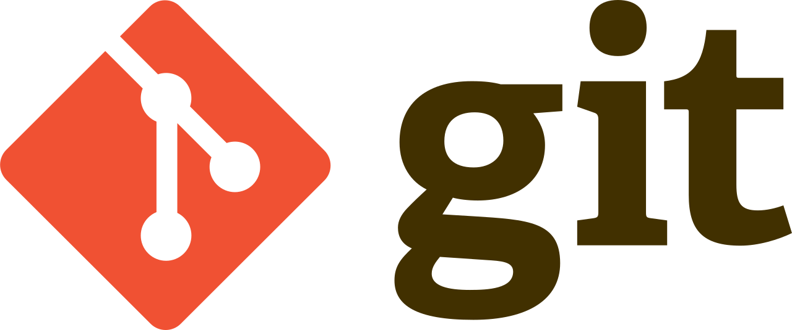

# Personal introductions {background-color="silver"}

## Introductions: Jelmer (instructor)

**Lead of the CFAES Bioinformatics and Microscopy cores**

- Part of what until recently was known as the Molecular & Cellular Imaging Center (MCIC)
- We are now officially under **CFAES Research & Analytical Service Cores (RASC)**,
  a set of core facilities providing services in molecular biology,
  high-throughput sequencing, bioinformatics, microscopy, and soil analyses.

. . .

**What I work on**

- Providing research assistance with omics data analysis

- Teaching, such as this course, workshops, and [Code Club ](https://osu-codeclub.github.io){target="_blank"}

. . .

**Otherwise**

- Research background in animal evolutionary genomics & speciation

- In my free time, I enjoy bird watching -- locally & across the world

## Introductions: Kelsey Starr (TA)

TODO

## Introductions: You

- Name

- Lab and Department

- Research interests and/or current research topics

- Why you are taking or attending this course

- Something about you that is *not* work-related, such as a hobby or fun fact

## Pre-course survey results

TODO

# Course content: goals and background {background-color="silver"}

## The core goals of this course

This course tries to enable you to:

- Do your research more **reproducibly** and **efficiently**

- Work with large-scale "**omics**" datasets

. . .

It will focus primarily on general, foundational "**computing skills**"
rather than on specific applications. For example, you will learn to:

- Code in the Unix shell and R
- Organize, document, manage, and share your research data, code, and results
- Work with a remote supercomputer
- Write automated analysis pipelines

## Course background I: Reproducibility

. . .

Reproducibility and replicability are two related but distinct ideas:

1. Research is **replicable** when independent experiments produce the same results
2. Research is **reproducible** when the same data produce the same results (_a lower bar!_)

Our focus is on #2.

------------------------------------------------------------------------

## Course background I: Reproducibility (cont.)

**In general terms, your research is reproducible when you:**

- Share your data
- Share your methods --- in sufficient detail for anyone to redo what you did
- All reported data, methods and results are congruent

. . .

> *"The most basic principle for reproducible research is: Do everything via code."*\
> —Karl Broman, University of Madison

. . .

 [***How do you think this quote relates to the requirements***
***mentioned above? Do you agree?***]{style="color:darkblue"}

-----

::: {.columns}
::: {.column width="30%"}
#### To join the poll, either:
- **[Click this link](https://app.sli.do/event/gitfHtAuaHLdbbomX8mkuB){target="_blank"}**

- Or scan the QR code:

{width="60%"}
:::

::: {.column width="70%"}
<!-- The live updating poll results display cleanly here -->
<iframe src="https://app.sli.do/event/gitfHtAuaHLdbbomX8mkuB" width="100%" height="680px" style="border:2px solid #ccc; border-radius: 8px;" data-external="1"></iframe>
:::
:::
  
## Course background I: Reproducibility (cont.)

**We will cover the following practices that benefit reproducibility:**

- Using code, and following best practices doing so (*throughout*)
- Detailed project documentation (*week 2*)
- Good project file organization  (*week 2*)

. . .

- Data and code management & sharing (*weeks 5 & 10*)
- Using open-source software with "containers" (*week 6*)
- Reporting a clear protocol to (re)run your analyses (*week 10*)

We'll also revisit the general topic of reproducibility in week 10.

. . . 

::: callout-tip
##### Another motivator: working reproducibly will benefit future you!

See @markowetz2015's "_Five selfish reasons to work reproducibly_"
in this week's readings.
:::

## Course background II: Efficiency and automation

**Using code also means that you can work more efficiently and improve automation** —\
this can be particularly useful when you have to, for example:

- Do repetitive tasks
- Recreate a figure or redo an analysis after adding a sample
- Redo all analyses after ... finding a mistake in the first data processing step 😳

## Course background III: Omics data

Omics data is increasingly important in biology,
and most notably includes the study of:

. . . 

- DNA at the (near) whole-genome level: Genomics
- Expressed RNA at the (near) whole-transcriptome level: Transcriptomics
- Expressed protein at the (near) whole-proteome level: Proteomics

::: callout-tip
#### The next lecture will introduce omics data in a bit more detail.
:::

. . . 

::: callout-warning
## What this course does and does not focus on 

- While we'll be using some example omics datasets,
  this course will *not* comprehensively cover how to perform specific omics analyses,
  or its underlying methods ---
  we focus on foundational computing skills.

- To learn more about specific omics analysis, I highly recommended the follow-up course
  **Genome Analytics** (HCS 7004) by Dr. Jonathan Fresnedo-Ramirez.
:::

## Recap: course goals and background

This core will focus on teaching you computing skills that enable you to:

- Do your research more **reproducibly** and **efficiently**

- Work with large-scale "**omics**" datasets

# Course content: topics {background-color="silver"}

## The Unix shell & shell scripts

The Unix shell (or the "Terminal") is a **command-line interface to computers**.

Being able to work in the Unix shell is a key skill for omics data analysis,
because a lot of the relevant software is operated using the shell.

. . .

You'll also write shell *scripts*,
and will use an editor called VS Code for this and other purposes.

::::::: columns
:::: column
{fig-align="center" width="40%" fig-alt="The Bash logo." .lightbox}

::: legend2
Bash (shell language)
:::
::::

:::: column
{fig-align="center" width="40%" fig-alt="The VS Code logo." .lightbox}

::: legend2
VS Code
:::
::::
:::::::

## Project file organization & documentation {.nostretch}

Good research project documentation & file organization is a necessary starting
point for reproducible research.

- You'll learn best practices for project file organization

- You'll learn how to manage your data and software

- You'll learn project documentation strategies,
  and for documentation will use a plain-text file format called *Markdown*

{fig-align="center" width="28%" fig-alt="The Markdown logo." .lightbox}

::: legend2
Markdown
:::

## Version control with Git and GitHub

Using version control, you can more effectively keep track of project progress,
collaborate, share code, revisit earlier versions, and undo.

- *Git* is the version control software we will use,
  and *GitHub* is the website that hosts Git projects (repositories)

- You'll also use these to hand in your graded assignments

 

::::: columns
::: {.column width="50%"}

{fig-align="center" width="55%" fig-alt="The Git logo." .lightbox}
:::
::: {.column width="50%"}
{fig-align="center" fig-alt="The GitHub logo." .lightbox}
:::
:::::

## High-performance computing with OSC

Thanks to supercomputer resources,
you can work with **very large datasets at speed** ---
running up to 100s of analyses in parallel,
and using much larger amounts of memory and storage space than a personal computer has.

. . .

You will use the **Ohio Supercomputer Center (OSC)** throughout the course!

:::::: columns
::: {.column width="38%"}
 
{fig-align="center" width="100%" fig-alt="The OSC logo." .lightbox}
:::
::: {.column width="31%"}
  
{fig-align="center" width="95%" fig-alt="The Apptainer logo." .lightbox}
:::
::: {.column width="31%"}
{fig-align="center" width="75%" fig-alt="The Slurm logo." .lightbox}
:::
::::::

## Running best-practice pipelines {.nostretch}

An omics data analysis often consists of many consecutive steps,
each using different programs.
Pipelines enable you to run many steps with a single command.

You will learn how to use comprehensive,
best-practice omics data Nextflow pipelines produced by the *nf-core* initiative.

 

:::::: columns
::: {.column width="45%"}
{fig-align="center" width="95%" fig-alt="The Nextflow logo." .lightbox}
:::
::: {.column width="7%"}
:::
::: {.column width="40%"}
{fig-align="center" width="95%" fig-alt="The nf-core logo." .lightbox}
:::
::::::

## R for data analysis & visualization {.nostretch}

While the Unix shell environment is the best choice for "initial" processing of
a lot of omics data,
R is the most prominent language in "downstream" statistical analysis and
data visualization.

In this course, you will learn the basics of R, how to visualize data in R,
and how you can use specialized "packages" for omics data analysis.

::::: columns
::: {.column width="35%"}
{fig-align="center" width="55%" fig-alt="The R logo." .lightbox}
:::
::: {.column width="35%"}
 
{fig-align="center" width="80%" fig-alt="The RStudio logo." .lightbox}
:::
::: {.column width="25%"}
{fig-align="center" width="55%" fig-alt="The Quarto logo." .lightbox}
:::
:::::

. . .

::: callout-tip
#### R vs. Python
Python is also commonly used but I believe that altogether,
R is a far better choice for this course.
Python is a great follow-up language for those seeking to specialize in bioinformatics.
:::

-----

::: {.columns}
::: {.column width="30%"}
#### To join the poll, either:
- **[Click this link](https://app.sli.do/event/gitfHtAuaHLdbbomX8mkuB){target="_blank"}**

- Or scan the QR code:

{width="60%"}
:::

::: {.column width="70%"}
<!-- The live updating poll results display cleanly here -->
<iframe src="https://app.sli.do/event/gitfHtAuaHLdbbomX8mkuB" width="100%" height="680px" style="border:2px solid #ccc; border-radius: 8px;" data-external="1"></iframe>
:::
:::

## Using generative AI to help with coding

- Recently, generative AI (genAI) tools such as ChatGPT and Gemini have become ubiquitous.

 [***Do you use generative AI on a daily basis?***]{style="color:olive"}

. . .

 

- One major use case of generative AI is that **it can help you code**,
  and we'll cover this in week 8.

- Agentic AI
  
::: callout-warning
#### Should I even learn to code nowadays?
We do believe so!

TODO
:::

## Recap: course topics

- The Unix shell and shell scripts

- Project file organization & documentation

- Version control with Git and GitHub

- Automated workflow management with Nextflow

- R for downstream data analysis and visualization

- Using generative AI to help with coding

# Course practicalities: general {background-color="silver"}

## Zoom

- Be muted by default, but feel free to unmute yourself to ask questions any time!

- You can also ask questions in the Zoom chat.

- Please have your camera turned on whenever possible!!

## Participatory live coding

- Lots of class time will be spent doing "**participatory live coding**" ---
  I demonstrate the typing and running of code live,
  and you're expected to follow along on your own computer.

. . .

- You'll want to simultaneously see the Zoom window with my screen share _and_
  one or more windows on your own computer. 

- Therefore, I recommend using large and/or multiple monitors
  if you have access to those.

. . .

::: {.callout-note appearance="simple"}
Also, be prepared to share your screen for troubleshooting purposes.
:::

## Course websites

- The main website for this course is
  [this "GitHub website"](https://cfaes-bioinfo.github.io/pracs-au26){target="_blank"},
  which contains:
  - Overviews of each week, including readings
  - Slide decks and lecture pages
  - Assignments and exercises

::: {.callout-tip appearance="simple"}
We'll now do a quick tour of the GitHub website!
:::

 

. . .

- There is also a
  [CarmenCanvas site for this course](https://osu.instructure.com/courses/213814),
  which is primarily used to:
  - Send weekly announcements about the upcoming week (_turn on Notifications!_)
  - Get deadlines on the calendar for you

## Office hours

- Jelmer: TODO at 1-3 pm (same Zoom link as class or Selby 018)
- Kelsey: TODO at 1-3 pm (TODO Zoom link or TODO)

Drop us an email (can be last-minute) to book a slot / make us join you in the Zoom meeting,
or you can try to drop-in in person.

# Course practicalities: homework and grading {background-color="silver"}

## What your grade is made up of

You can earn a total of 100 points across 6 assignments and 4 final project checkpoints.

## Graded assignments (60 pts)

A total of 6 graded assignments, worth 10 points each,
are due on Sundays in the following weeks:

| Nr. | Topic                             | Week |
| --- | --------------------------------- | :--: |
| 1.  | Markdown and project organization |  2   |
| 2.  | Unix shell                        |  4   |
| 3.  | Git and software management       |  6   |
| 4.  | Using genAI                       |  8   |
| 5.  | Workflow management               |  10  |
| 6.  | Data analysis with R              |  13  |

: {.striped}

. . .

 

::: {.callout-note appearance="simple"}
The first two are submitted simply by storing your files at OSC,
and the remaining four are submitted via GitHub.
:::

## Final project (40 pts)

Plan and implement a small data processing and/or analysis project -- with checkpoints:

| Checkpoint | What                   | Due     | Points |
| ---------- | ---------------------- | ------- | :----: |
| 1.         | **Proposal**           | week 12 |   5    |
| 2.         | **Draft**              | week 14 |   5    |
| 3.         | **Oral presentations** | week 16 |   10   |
| 4.         | **Final submission**   | week 16 |   20   |

: {.striped}

 

. . .

::: callout-tip
#### Data sets for the final project

Ideally, you have or develop your own idea for a dataset and analysis ---
so you can work on something that's directly useful for your own research.
If not, we can provide you with a dataset.
:::

## Using generative AI for graded assignments

You are allowed and in some cases encouraged to use AI for certain assignments
and exercises:
this will be clearly stated on a case-by-case basis.

_TBA more info_

## Ungraded homework

- Readings

- Exercises (in weeks that do not have graded assignments)

- Occasional small ungraded assignments such as surveys and account setup

## Readings

In certain weeks, you will be asked to read 1 or 2 papers.
Additionally:

- You are _always_ expected to reread and practice with the lecture material
  we go through in class.

- Lecture page contents we don't cover in class
  _automatically turns into **required** self-study material_.

. . .

::: callout-tip
#### Callout boxes
We'll often skip or glance over contents in "callout boxes" such as this one:
read those in your own time.
:::

. . .

::: callout-note
#### Enjoy reading books?

In most weeks, chapters from the following two books are listed as
"further resources" (optional reading),
which are available online through the OSU library:

- @allesina2019: Computing Skills for Biologists
  ([library link ](https://search.library.osu.edu/permalink/01OHIOLINK_OSU/1oqfg3i/alma991085518416808507){target="_blank"})
- @buffalo2015: Bioinformatics Data Skills
  ([library link ](https://search.library.osu.edu/permalink/01OHIOLINK_OSU/1oqfg3i/alma991085456156508507){target="_blank"})
:::

## Weekly recitation on Monday

We will have an optional but highly recommended weekly recitation meeting on
Mondays, to go over the exercises for the preceding week.

 

::: callout-caution
## Practice is key to learn these skills!

This course is intended to be highly practical.
If you don't spend time practicing by yourself,
you may not get all that much out of it.
:::

 

. . .

If you would like to join these sessions,
[**please indicate your availability using this poll**] (TODO - ADD POLL)

## Rest of this week

### Lectures

- [Introduction to omics data](./w1b_omics-data.qmd){target="_blank"}

### Homework

- Ungraded assignments:
  - [Pre-course survey ](https://forms.cloud.microsoft/r/wqriyRJSmd){target="_blank"}
  - [Make sure you have access to OSC](./w1_ua_osc-setup.html){target="_blank"}

- Readings:
  - @poinsignon2023 --- _Working with omics data: An interdisciplinary challenge at the crossroads of biology and computer science_
  - @markowetz2015 --- *Five selfish reasons to work reproducibly*

# Questions? {background-color="silver"}

    

# References
