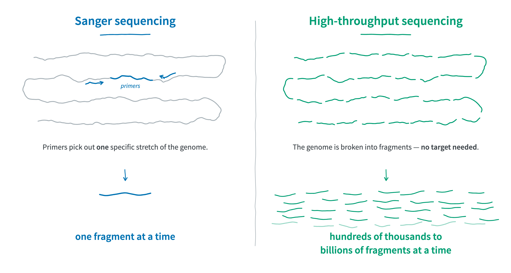
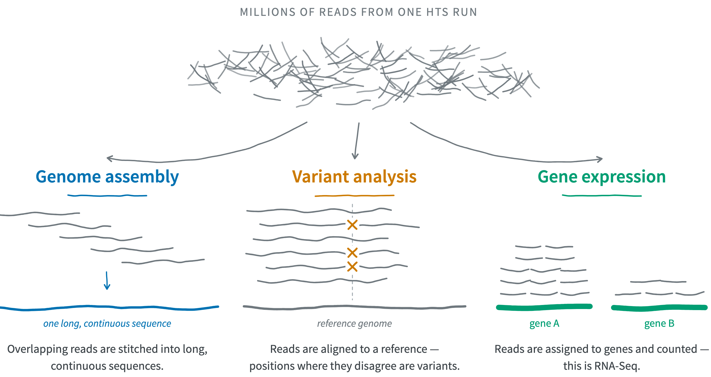
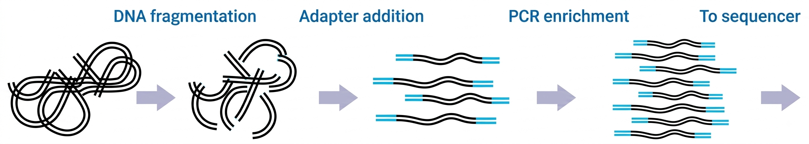

# The main omics data types {background-color="#A7B1B7"}

## The main omics data types

{fig-align="center" width="55%" fig-alt="A diagram showing the main omics data types." .lightbox}

::: legend2
Copyright [ThermoFisher](https://www.thermofisher.com/us/en/home/brands/thermo-scientific/molecular-biology/molecular-biology-learning-center/molecular-biology-resource-library/spotlight-articles/supporting-multi-omics-approaches.html)
:::

## The main omics data types

| Omics type      | Molecule type     | Shows                       |     |
| --------------- | ----------------- | --------------------------- | --- |
| genomics        | DNA               | What can happen             |     |
| epigenomics     | DNA modifications | What is allowed to happen   |     |
| transcriptomics | RNA               | What appears to be targeted |     |

: {.striped tbl-colwidths="[20,22,34,24]"}

. . .

<br>

:::callout-note
#### What does -omics mean 
The "omics" suffix indicates large-scale datasets ---
e.g., "genomics" data spans much or all of the genome.

While the boundaries can be fuzzy,
sequencing a single gene is not genomics,
and running qPCR for several genes is not transcriptomics.
:::

## The main omics data types

| Omics type      | Molecule type     | Shows                        | Mainly produced by             |
| --------------- | ----------------- | ---------------------------- | ------------------------------ |
| genomics        | DNA               | What can happen              | [**HTS**]{.teal}               |
| epigenomics     | DNA modifications | What is allowed to happen    | [**HTS**]{.teal}               |
| transcriptomics | RNA               | What appears to be targeted  | [**HTS**]{.teal}               |

: {.striped tbl-colwidths="[20,22,34,24]"}

<br>

::: callout-tip
#### HTS = high-throughput sequencing

. . .

Nearly all HTS currently involves **DNA** sequencing,
including for epigenomics and transcriptomics data.
For example, RNA is reverse-transcribed prior to sequencing.

HTS is the focus of the rest of this lecture,
and HTS data of examples **throughout the course**.

:::

::: footer
:::

## The main omics data types

| Omics type      | Molecule type     | Shows                       | Mainly produced by |
| --------------- | ----------------- | --------------------------- | ------------------ |
| genomics        | DNA               | What can happen             | [**HTS**]{.teal}   |
| epigenomics     | DNA modifications | What is allowed to happen   | [**HTS**]{.teal}   |
| transcriptomics | RNA               | What appears to be targeted | [**HTS**]{.teal}   |
| proteomics      | proteins          | What is actively working    |                    |
| metabolomics    | metabolites       | What the net outcome is     |                    |

: {.striped tbl-colwidths="[20,22,34,24]"}

## The main omics data types

| Omics type      | Molecule type     | Shows                        | Mainly produced by             |
| --------------- | ----------------- | ---------------------------- | ------------------------------ |
| genomics        | DNA               | What can happen              | [**HTS**]{.teal}               |
| epigenomics     | DNA modifications | What is allowed to happen    | [**HTS**]{.teal}               |
| transcriptomics | RNA               | What appears to be targeted  | [**HTS**]{.teal}               |
| proteomics      | proteins          | What is actively working     | [**mass spectrometry**]{.amber} |
| metabolomics    | metabolites       | What the net outcome is      | [**mass spectrometry**]{.amber} |

: {.striped tbl-colwidths="[20,22,34,24]"}

## The main omics data types

| Omics type      | Molecule type     | Shows                        | Mainly produced by             |
| --------------- | ----------------- | ---------------------------- | ------------------------------ |
| genomics        | DNA               | What can happen              | [**HTS**]{.teal}               |
| epigenomics     | DNA modifications | What is allowed to happen    | [**HTS**]{.teal}               |
| transcriptomics | RNA               | What appears to be targeted  | [**HTS**]{.teal}               |
| proteomics      | proteins          | What is actively working     | [**mass spectrometry**]{.amber} |
| metabolomics    | metabolites       | What the net outcome is      | [**mass spectrometry**]{.amber} |

: {.striped tbl-colwidths="[20,22,34,24]"}

<br>

::: callout-note
#### Multi-omics

In multi-omics studies, two or more omics data types are combined ---
ideally from the same set of samples.

This is often needed to **link genotype to phenotype**.
For example, to study a plant-pathogen interaction,
one could combine host and pathogen **transcriptomics** with
**metabolomics** of plant defense compounds.

:::

## Learn more in this week's first reading

@poinsignon2023 --- *Working with omics data:*\
*An interdisciplinary challenge at the crossroads of biology and computer science*

<hr style="height:1pt; visibility:hidden;" />

::: {style="margin-bottom: 0px;"}
{width="70%" fig-align="center" fig-alt="A diagram showing how different kinds of omics data are produced and analyzed." .lightbox}
:::

::: legend2
Figure 2 from the paper.
:::

::: footer
:::

# High-throughput sequencing (HTS) {background-color="#A7B1B7"}

## Sanger vs. high-throughput sequencing

::: {.columns}
::: {.column width="47%"}

### [Sanger sequencing]{style="display:block; text-align:center;"}

- Since **1977** (technology) / **1986** (automated sequencer).

- Sequencing of a single, short-ish DNA fragment at a time.

- This fragment is typically PCR-amplified and therefore specifically targeted.

:::
::: {.column width="5%"}
<div class="fragment" data-fragment-index="1" style="border-left: 1px solid #A7B1B7; height: 100%; margin: 0 auto; width: 0;"></div>
:::
::: {.column width="47%" .fragment data-fragment-index="1"}

### [High-throughput sequencing (HTS)]{style="display:block; text-align:center;"}

- Since **2005**.<br>[x]{style="color:white;"}

- Sequencing of hundreds of thousands to billions of DNA fragments at a time.

- Fragments can be targeted in various ways or randomly generated from input DNA.

:::
:::

<br>

. . .

::: callout-important
#### Reads and sequencing errors
The sequence determined from a DNA fragment is called a "**read**".
With current technologies, reads are never 100% accurate,
and this has important consequences for downstream analyses.
:::

----

{.img-wide fig-align="center" width="100%" fig-alt="Two panels comparing what is sequenced. Left, Sanger sequencing: a folded, squiggly genome drawn in grey with one short stretch highlighted in blue, flanked by two primers pointing inwards; below it, a single blue fragment, labelled one fragment at a time. Right, high-throughput sequencing: the same squiggly genome, now broken into many teal fragments; below it, a large pile of teal fragments, labelled hundreds of thousands to billions of fragments at a time."}

## Timeline

::: {.timeline .vertical-alt .tl-label-opposite .tl-dot-center style="--tl-color-line: var(--color-secondary); --tl-color-accent: var(--color-primary); --tl-gap: 0;"}

::: {.event data-label="1986" .fragment style="margin-bottom: 6rem;"}
First automated **Sanger** sequencer
:::

::: {.event data-label="2005" .fragment style="margin-bottom: -1rem;"}
First high-throughput sequencer, by **454**
:::

::: {.event data-label="2006" .fragment style="margin-bottom: 1.5rem;"}
First **Illumina** sequencer
:::

::: {.event data-label="2011" .fragment style="margin-bottom: 0.75rem;"}
First long-read sequencer, by **PacBio**
:::

::: {.event data-label="2015" .fragment style="margin-bottom: -1rem;"}
First **Oxford Nanopore** sequencer,<br>the pocket-sized MinION
:::

:::

. . .

<hr style="height:1pt; visibility:hidden;" />

<details class="details-quiz">
<summary>Do you know when first the human genome assembly was published?</summary>
The first draft of the human genome was published in 2001.
</summary></details>

::: footer
:::

## The main HTS technologies

::: {.smaller-table}

|                                              | [Short-read HTS]{style="color: #666666; font-size: 1.3em;"} | [Long-read HTS]{style="color: #666666; font-size: 1.3em;"}                              |
| -------------------------------------------- | ------------------------------- | ---------------------------------------------------------------------------------------- |
| [**Main technologies**]{style="color:white"} | [Illumina]{style="color:white"} | [Oxford Nanopore Technologies (ONT) & Pacific Biosciences (PacBio)]{style="color:white"} |

: {tbl-colwidths="[18,41,41]"}

:::

## The main HTS technologies

::: {.smaller-table}

|                       | [Short-read HTS]{style="color: #666666; font-size: 1.3em;"} | [Long-read HTS]{style="color: #666666; font-size: 1.3em;"}        |
| --------------------- | ----------------------------------------------- | ----------------------------------------------------------------- |
| **Usage**             | most common                                     | less common (but increasing)                                      |
| **Main technologies** | Illumina                                        | Oxford Nanopore Technologies (ONT) & Pacific Biosciences (PacBio) |
| **Timeline**          | since 2006 — [technology fairly stable]{.amber} | since 2011 — [still rapid development]{.teal}                     |

: {.striped tbl-colwidths="[18,41,41]"}

:::

## The main HTS technologies

::: {.smaller-table}

|                       | [Short-read HTS]{style="color: #666666; font-size: 1.3em;"} | [Long-read HTS]{style="color: #666666; font-size: 1.3em;"}        |
| --------------------- | ----------------------------------------------------------- | ----------------------------------------------------------------- |
| **Usage**             | most common                                                 | less common (but increasing)                                      |
| **Main technologies** | Illumina                                                    | Oxford Nanopore Technologies (ONT) & Pacific Biosciences (PacBio) |
| **Timeline**          | since 2006 — [technology fairly stable]{.amber}             | since 2011 — [still rapid development]{.teal}                     |
| **Read lengths**      | [50–300 bp]{.amber}                                         | [10–100+ kbp]{.teal}                                              |
| **Error rates**       | [mostly <0.1%]{.teal}                                       | [0.5–1% (ONT)]{.amber} / [mostly <0.1% (PacBio)]{.teal}           |

: {.striped tbl-colwidths="[18,41,41]"}

:::

<hr style="height:1pt; visibility:hidden;" />

::: callout-quiz
::: callout-note
#### Long reads are orders of magnitude longer than short reads --- and, for PacBio, just as accurate.

So why is Illumina still by far the most commonly used HTS technology?
:::
:::

## The main HTS technologies

::: {.smaller-table}

|                       | [Short-read HTS]{style="color: #666666; font-size: 1.3em;"} | [Long-read HTS]{style="color: #666666; font-size: 1.3em;"}        |
| --------------------- | ----------------------------------------------------------- | ----------------------------------------------------------------- |
| **Usage**             | most common                                                 | less common (but increasing)                                      |
| **Main technologies** | Illumina                                                    | Oxford Nanopore Technologies (ONT) & Pacific Biosciences (PacBio) |
| **Timeline**          | since 2006 — [technology fairly stable]{.amber}             | since 2011 — [still rapid development]{.teal}                     |
| **Read lengths**      | [50–300 bp]{.amber}                                         | [10–100+ kbp]{.teal}                                              |
| **Error rates**       | [mostly <0.1%]{.teal}                                       | [0.5–1% (ONT)]{.amber} / [mostly <0.1% (PacBio)]{.teal}           |
| **Throughput**        | [higher]{.teal}                                             | [lower]{.amber}                                                   |
| **Cost per base**     | [lower]{.teal}                                              | [higher]{.amber}                                                  |

: {.striped tbl-colwidths="[18,41,41]"}

:::

## The main HTS technologies

::: {.smaller-table}

|                       | [Short-read HTS]{style="color: #666666; font-size: 1.3em;"} | [Long-read HTS]{style="color: #666666; font-size: 1.3em;"}                                                  |
| --------------------- | ----------------------------------------------------------- | --------------------------------------------------------------------- |
| **Usage**             | most common                                                 | less common (but increasing)                                          |
| **Main technologies** | Illumina                                                    | Oxford Nanopore Technologies (ONT) &<br> Pacific Biosciences (PacBio) |
| **Timeline**          | since 2006 — [technology fairly stable]{.amber}             | since 2011 — [still rapid development]{.teal}                         |
| **Read lengths**      | [50–300 bp]{.amber}                                         | [10–100+ kbp]{.teal}                                                  |
| **Error rates**       | [mostly <0.1%]{.teal}                                       | [0.5–1% (ONT)]{.amber} / [mostly <0.1% (PacBio)]{.teal}           |
| **Throughput**        | [higher]{.teal}                                             | [lower]{.amber}                                                       |
| **Cost per base**     | [lower]{.teal}                                              | [higher]{.amber}                                                      |
| **AKA**               | Next-Generation Sequencing (NGS)                            | Third-Generation Sequencing (TGS)                                     |

: {.striped tbl-colwidths="[18,41,41]"}

:::

## Examples of HTS applications

- **Genome assembly**

- **Variant analysis** --- for population genetics/genomics, GWAS, etc.

- **Gene expression comparisons** --- using RNA-Seq

- **Microbial community characterization** --- using metabarcoding or shotgun metagenomics

. . .

<hr style="height:1pt; visibility:hidden;" />

<details class="details-quiz">
<summary>For which of these applications are longer reads very useful?</summary>
<!-----
- Genome assembly
- Microbial community characterization
---->
</details>

<details class="details-quiz">
<summary>For which of these applications is read length not as important?</summary>
<!-----
- Variant analysis
- Gene expression comparisons --- and many other "read-as-a-tag" applications where
  the goal is just to know a read's origin in a reference genome.
---->
</details>

::: footer
:::

-----

{.img-wide fig-align="center" fig-alt="Three HTS applications sketched from one starting point. At the top, a dense, unstructured pile of short reads labelled millions of reads from one HTS run, with three arrows fanning down. Left, genome assembly: five reads arranged as a staircase so each overlaps the one above, an arrow, and a single long blue line labelled one long, continuous sequence. Middle, variant analysis: six reads aligned above a grey reference genome line, with an amber cross at the same column in three of the six. Right, gene expression: reads sorted into two stacks, a tall stack over a teal bar labelled gene A and a short stack over a bar labelled gene B."}

::: footer
:::

## The two stages of many HTS analyses

::: {.columns}
::: {.column width="47%"}

### [Algorithmic initial data processing]{style="display:block; text-align:center;"}

::: {.fragment data-fragment-index="1"}

Typically:

- Operates on reads, alignments, and so on.
- Done in a **Unix shell** on a **supercomputer**.
- Relatively standardized, automatable, and "non-interactive".

:::
:::
::: {.column width="5%"}
<div style="border-left: 1px solid #A7B1B7; height: 100%; margin: 0 auto; width: 0;"></div>
:::
::: {.column width="47%"}

### [Statistical analysis & visualization]{style="display:block; text-align:center;"}

::: {.fragment data-fragment-index="3"}

Typically:

- Operates on summaries like read counts.
- Can be done with **R** on a laptop.
- Highly interactive and iterative, less standardized and harder to automate.

:::
:::
:::

<hr style="height:1pt; visibility:hidden;" />

::: {style="text-align:center;" .fragment data-fragment-index="2"}
_**Examples:**_
:::

::: {.columns}
::: {.column width="47%" .fragment data-fragment-index="2"}

- _Read quality control (QC) and trimming._
- _Alignment of reads to a reference genome._

:::
::: {.column width="5%"}
<div style="border-left: 1px solid #A7B1B7; height: 100%; margin: 0 auto; width: 0;"></div>
:::
::: {.column width="47%" .fragment data-fragment-index="4"}

- _Comparing counts of genes (RNA-Seq) or taxa (metabarcoding) among treatments._
- _Genome-wide Association Studies (GWAS)._

:::
:::

::: footer
:::

## HTS recap

::: {.columns}
::: {.column width="30%" .box-blue .fragment data-fragment-index="1"}
#### HTS & Omics

HTS produces the most common omics data types:

- genomics
- transcriptomics
- (and epigenomics)

:::
::: {.column width="3%"}
:::
::: {.column width="30%" .box-amber .fragment data-fragment-index="2"}
#### Read types

Three technologies are most commonly used,
producing reads that are:

- short (Illumina) or
- long (ONT and PacBio)

:::
::: {.column width="3%"}
:::
::: {.column width="30%" .box-teal .fragment data-fragment-index="3"}
#### Applications

Many applications exist.

Some are not (just) about determining the exact DNA sequence,
but about producing **counts of categories** like genes.

:::
:::

# Illumina libraries and sequencing {background-color="#A7B1B7"}

## Illumina libraries and sequencing

We're going to zoom in on Illumina sequencing, because:

- This is the most commonly used type of HTS.
- We'll use Illumina read files as examples throughout the course.

<hr style="height:1pt; visibility:hidden;" />

::: {.diagram-wide}
```{mermaid}
%%| fig-align: center
%%{init: {'themeCSS': '.edgePath .path, .flowchart-link { stroke-width: 3px; }'}}%%
flowchart TD
    Omics([Omics technologies])
    HTS[HTS]
    MS[Mass spectrometry]
    Illumina[Illumina]
    ONT[ONT]
    PacBio[PacBio]

    Omics --> HTS
    Omics --> MS
    HTS --> Illumina
    HTS --> ONT
    HTS --> PacBio

    classDef omics fill:#bb0000,color:#ffffff,stroke:#bb0000,font-weight:bold;
    classDef hts fill:#009E73,color:#ffffff,stroke:#009E73,font-weight:bold;
    classDef illumina fill:#0072B2,color:#ffffff,stroke:#0072B2,font-weight:bold;
    classDef dim fill:#eaeaea,color:#999999,stroke:#cccccc;

    class Omics omics;
    class HTS hts;
    class Illumina illumina;
    class MS,ONT,PacBio dim;
```
:::

## Libraries and library prep

In a sequencing context, a "**library**" is a collection of\
nucleic acid fragments ready for sequencing.

<hr style="height:1pt; visibility:hidden;" />

. . .

These fragments **number in the millions or billions** and are\
often simply generated at random from input such as genomic DNA:

::: {style="margin-bottom: 0px;"}
{fig-align="center" fig-alt="A diagram showing the main Illumina library preparation steps." .lightbox}
:::

::: legend2
An overview of the **library prep** procedure.
This is typically done for you by a sequencing facility or company.
:::

## A closer look at the processed DNA fragments

As shown on the previous slide, after library prep,\
each DNA fragment is flanked by several types of short sequences\
that together make up the "**adapters**":

<br>

{fig-align="center" fig-alt="A diagram of a DNA fragment in a prepared library, with adapters flanking the fragment." .lightbox}

<hr style="height:1pt; visibility:hidden;" />

. . .

::: callout-note
#### Multiplexing!
Adapters can include so-called "indices" or "barcodes" that identify individual
samples.\
That way, many samples can be combined (**multiplexed**) into a single library.
:::

## Paired-end vs. single-end sequencing

DNA fragments can be sequenced from both ends as shown below,\
and this is called **"paired-end" (PE) sequencing**:

{fig-align="center" fig-alt="A diagram showing forward and reverse reads in paired-end sequencing." .lightbox}

. . .

<hr style="height:1pt; visibility:hidden;" />

::: callout-tip
#### Why paired-end sequencing?
This is a way for Illumina sequencing to produce more information from the same DNA fragment,
given the limited read length of the technology (as you always know which two reads form a pair).
:::

## Paired-end vs. single-end sequencing

DNA fragments can be sequenced from both ends as shown below,\
and this is called **"paired-end" (PE) sequencing**:

{fig-align="center" fig-alt="A diagram showing forward and reverse reads in paired-end sequencing." .lightbox}

<hr style="height:1pt; visibility:hidden;" />

When sequencing is instead **single-end (SE)**, no reverse read is produced:

{fig-align="center" fig-alt="A diagram showing the forward read in single-end sequencing." .lightbox}

## Insert size variation

The DNA fragment's size ("**insert size**") can vary --- by design, but also\
because of limited precision in size selection. What happens when it is:

. . .

<hr style="height:1pt; visibility:hidden;" />

::: callout-quiz
::: callout-note
#### 1: Shorter than the *combined* read length (but longer than a single read)?

A.  The fragment is too short to sequence, so it drops out of the library.
B.  The forward and reverse reads overlap in the middle.
C.  The reads come out shorter than the read length that was ordered.
D.  The final bases of each read consist of adapter sequence.

:::
:::

. . .

{fig-align="center" width="70%" fig-alt="A diagram illustrating the scenario when the DNA fragment is shorter than the combined read length" .lightbox}

## Insert size variation

The DNA fragment's size ("**insert size**") can vary --- by design, but also\
because of limited precision in size selection. What happens when it is:

<hr style="height:1pt; visibility:hidden;" />

::: callout-quiz
::: callout-note
#### 2: Shorter than a *single* read? (The reads still overlap --- but what else?)

A.  The sequencer stops early, so these reads are shorter than the rest.
B.  The reverse read is dropped, leaving only a forward read.
C.  The final bases of each read consist of adapter sequence.
D.  The fragment gets sequenced twice, producing a PCR duplicate.

:::
:::

. . .

{fig-align="center" width="58%" fig-alt="A diagram illustrating the scenario when the DNA fragment is shorter than the single read length" .lightbox}

## Video of Illumina technology



# Reference genomes {background-color="#A7B1B7"}

## Reference genomes

Many HTS applications **require** a "reference genome"
(or **involve its production**), which includes:

::: {.columns}
::: {.column width="47%" .fragment data-fragment-index="1"}

### [An assembly]{style="display:block; text-align:center;"}

The assembled genomic DNA sequence, in pieces ranging up to whole chromosomes.

- Most genome assemblies are incomplete and fragmented (but less and less so).

- Non-chromosome-level pieces are called **contigs** and **scaffolds**.

:::
::: {.column width="5%"}
<div class="fragment" data-fragment-index="1" style="border-left: 1px solid #A7B1B7; height: 100%; margin: 0 auto; width: 0;"></div>
:::

::: {.column width="47%" .fragment data-fragment-index="3"}

### [An annotation]{style="display:block; text-align:center;"}

Provides the *locations of genes and other genomic "features"*,
plus functional information about them.

:::
:::

. . .

:::callout-tip
#### Reference genomes are typically applicable at the **species level**. But:

- If needed, it's often possible to work with genomes of closely related species.
- Conversely, different subspecies/lines may have their own reference genomes.
:::

::: footer
:::

## Illumina and reference genome recap

::: {.columns}
::: {.column width="30%" .box-blue .fragment data-fragment-index="1"}
#### Library prep

Prepares nucleic acid fragments for sequencing.

For example, by attaching adapter and sample barcode sequences.

:::
::: {.column width="3%"}
:::
::: {.column width="30%" .box-amber .fragment data-fragment-index="2"}
#### Sequencing design

Illumina sequencing is often done with:

- Paired-end reads
- Multiple samples at a time (_multiplexing_)

:::
::: {.column width="3%"}
:::
::: {.column width="30%" .box-teal .fragment data-fragment-index="3"}
#### Reference genome

For many omics analyses, you need a reference genome assembly and annotation.

:::
:::

# The course's main example dataset {background-color="#A7B1B7"}

## Garrigós et al. 2025

Throughout the course, we'll use an example/practice data set from
@garrigós2025:

{fig-align="center" width="75%" fig-alt="A screenshot of the paper's front matter." .lightbox}

This paper uses **paired-end Illumina RNA-Seq data** to study gene expression in
*Culex pipiens* mosquitoes infected with two different malaria-causing *Plasmodium*
protozoans.

## What's next?

At the start of week 3,
we'll discuss follow-up material related to today's lecture:

- **Sequence file types**, such as FASTQ files that contain the reads produced by HTS.

- More on the **@garrigós2025 dataset** (the paper is that week's assigned reading).

- An overview of the **RNA-Seq data analysis steps** we'll perform on the Garrigós dataset.

# Questions? {background-color="#A7B1B7" .unlisted}

<br><br>

[**Break for 5 minutes**]{style="display:block; text-align:center; font-size: 2rem;"}

::: {style="display: flex; justify-content: center; margin-top: 1em;"}

:::

## References

<!-----
[Removed question]

## Paired-end vs. single-end sequencing

::: callout-quiz
::: callout-note
#### What does paired-end sequencing give you that single-end does not?

A) Twice as many DNA fragments get sequenced.
B) Sequence from both ends of the *same* fragment, a known distance apart.
C) Two independent reads of the exact same bases, cancelling out sequencing errors.
D) Longer reads, because the forward and reverse read are joined together.


<hr style="height:1pt; visibility:hidden;" />

<details><summary>  &nbsp; _Click for the answer_</summary>

B) The *same* fragments are sequenced --- just from both ends.
So you get twice as many **reads**, but not twice as many **fragments** (A).
The two reads cover *different* bases (C),
and each is the standard read length (D).

</details>

<hr style="height:1pt; visibility:hidden;" />
:::
:::

----->
