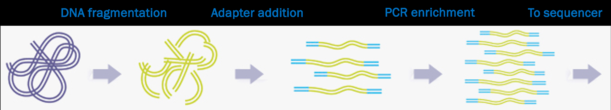
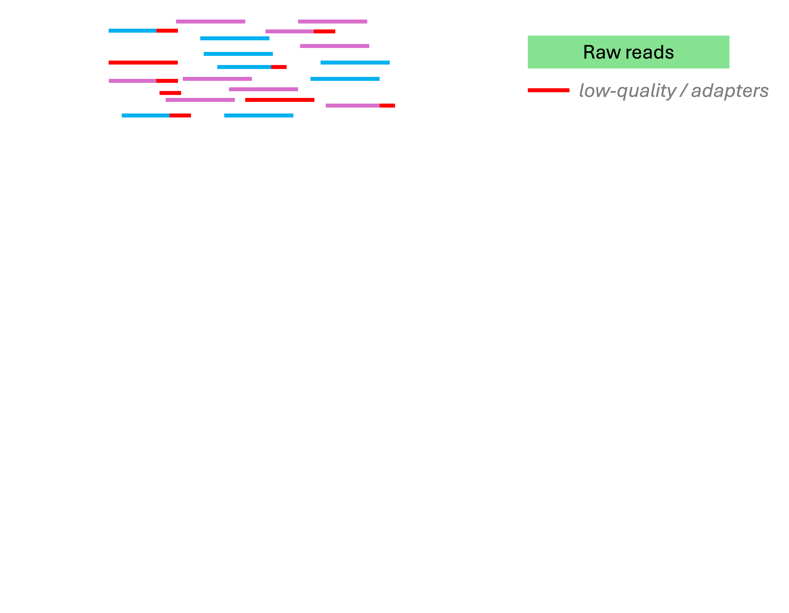
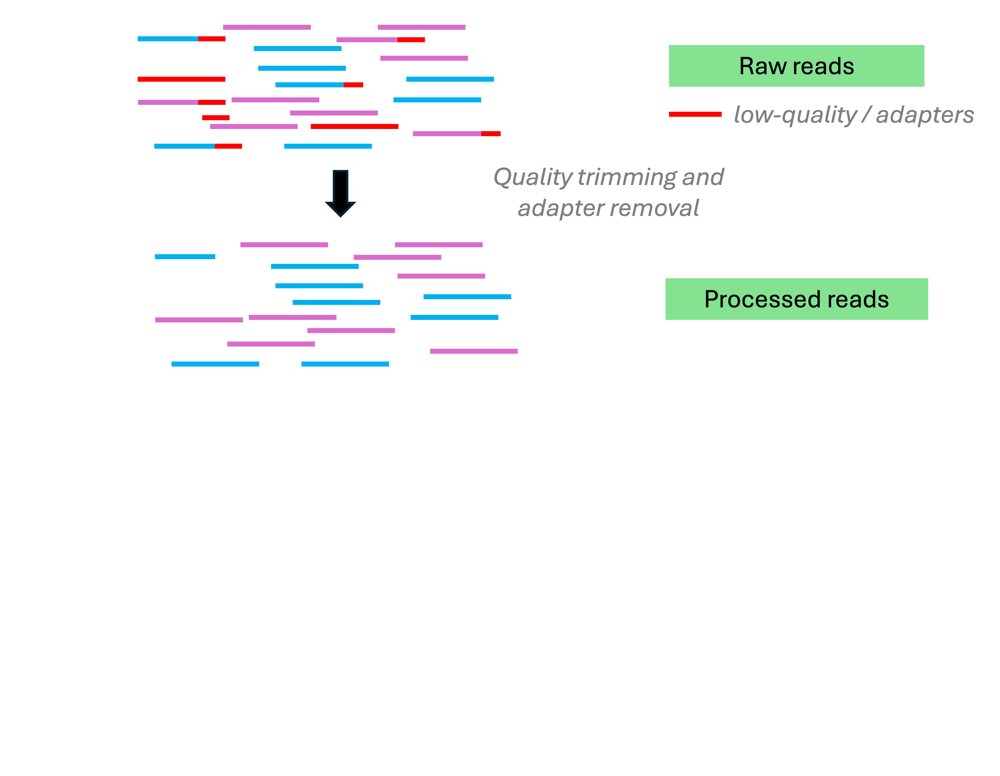
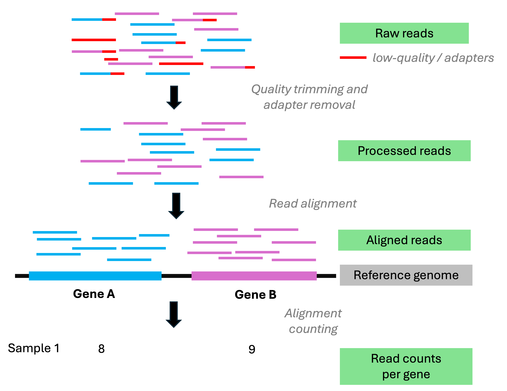
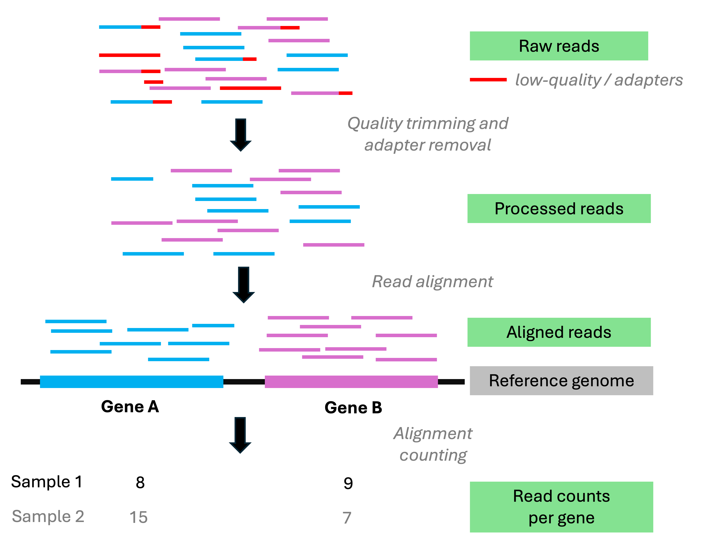

# The main omics data types {background-color="#A7B1B7"}

## The main omics data types

{fig-align="center" width="55%" fig-alt="A diagram showing the main omics data types." .lightbox}

::: legend2
Copyright [ThermoFisher](https://www.thermofisher.com/us/en/home/brands/thermo-scientific/molecular-biology/molecular-biology-learning-center/molecular-biology-resource-library/spotlight-articles/supporting-multi-omics-approaches.html)
:::

## The main omics data types

| Omics type      | Molecule type     |                                                             |
| --------------- | ----------------- | ----------------------------------------------------------- |
| Genomics        | DNA               |                                                             |
| Epigenomics     | DNA modifications | [**High-throughput sequencing (HTS)**]{style="color:white"} |
| Transcriptomics | RNA               |                                                             |
| Proteomics      | Proteins          |                                                             |
| Metabolomics    | Metabolites       |                                                             |

: {.striped tbl-colwidths="[25,25,50]"}

. . .

 

:::callout-note
#### What does -omics mean 
The "omics" suffix indicates large-scale datasets ---
e.g., "genomics" data spans much or all of the genome.

While the boundaries can be fuzzy,
sequencing a single gene is not genomics,
and running qPCR for a several genes is not transcriptomics.
:::

## The main omics data types

| Omics type      | Molecule type     | Data mainly produced by                       |
| --------------- | ----------------- | --------------------------------------------- |
| Genomics        | DNA               | [**High-throughput sequencing (HTS)**]{.teal} |
| Epigenomics     | DNA modifications | [**High-throughput sequencing (HTS)**]{.teal} |
| Transcriptomics | RNA               | [**High-throughput sequencing (HTS)**]{.teal} |
| Proteomics      | Proteins          | [**Mass Spectrometry**]{.blue}                |
| Metabolomics    | Metabolites       | [**Mass Spectrometry**]{.blue}                |

: {.striped tbl-colwidths="[25,25,50]"}

 

**[HTS]{.teal}** and the data it produces are the focus of the rest of
this lecture, and the focus of examples **throughout the course**.

. . .

::: {.callout-tip appearance="simple"}
Nearly all HTS currently involves **DNA** sequencing,
including epigenomics and transcriptomics data
(e.g., RNA is reverse-transcribed before sequencing).
:::

## Learn more in this week's first reading

@poinsignon2023 --- *Working with omics data: An interdisciplinary challenge at the crossroads of biology and computer science*

::: {style="margin-bottom: 0px;"}
{width="70%" fig-align="center" fig-alt="A diagram showing how different kinds of omics data are produced and analyzed." .lightbox}
:::

::: legend2
Figure 2 from the paper.
:::

# High-throughput sequencing (HTS) {background-color="#A7B1B7"}

## Sanger vs. high-throughput sequencing

::: {.columns}
::: {.column width="47%"}

### [Sanger sequencing]{style="display:block; text-align:center;"}

- Since [1977]{.teal}

- Sequencing of a single, short DNA fragment at a time

- The fragment is typically PCR-amplified and therefore specifically targeted

:::
::: {.column width="5%"}

:::
::: {.column width="47%" .fragment data-fragment-index="1"}

### [High-throughput sequencing (HTS)]{style="display:block; text-align:center;"}

- Since [2005]{.teal}

- Sequencing of hundreds of thousands to billions of DNA fragments at a time

- Fragments can be targeted in various ways or randomly generated from input DNA

:::
:::

 

. . .

::: callout-important
#### Reads and sequencing errors
Sequenced DNA fragments are referred to as "**reads**".
With current technologies, reads are never 100% accurate,
and this has large consequences for downstream analyses.
::::

<!----

TODO: Make timeline?

{fig-align="center" width="70%" fig-alt="A graphical overview of developments in sequencing technology over time" .lightbox}

---->

## The main HTS technologies

| | Short-read HTS   | Long-read HTS
|---|-------|-------|
[**Main companies**]{style="color:white"}  | [Illumina]{style="color:white"}                | [Oxford Nanopore Technologies (ONT) & Pacific Biosciences (PacBio)]{style="color:white"}

## The main HTS technologies

| | Short-read HTS   | Long-read HTS
|---|-------|-------|
**Usage**           | Most common                    | Less common (but increasing)
**Main companies**  | Illumina                | Oxford Nanopore Technologies (ONT) & Pacific Biosciences (PacBio)
**Timeline**        | Since 2005 — [technology fairly stable]{style="color:crimson"} | Since 2011 — [still rapid development]{style="color:green"}

: {.striped}

## The main HTS technologies

|                   | Short-read HTS          | Long-read HTS
|---|-------|-------|
**Usage**           | Most common                    | Less common (but increasing)
**Main companies**  | Illumina                | Oxford Nanopore Technologies (ONT) & Pacific Biosciences (PacBio)
**Timeline**        | Since 2005 — [technology fairly stable]{style="color:crimson"} | Since 2011 — [still rapid development]{style="color:green"}
**Read lengths**    | [50-300 bp]{style="color:crimson"}               | [10-100+ kbp]{style="color:green"}
**Error rates**     | [Mostly <0.1%]{style="color:green"}            | [1-10% (ONT) / <0.1-10% (PacBio)]{style="color:crimson"}

: {.striped}

## The main HTS technologies

|                   | Short-read HTS          | Long-read HTS
|---|-------|-------|
**Usage**           | Most common                    | Less common (but increasing)
**Main companies**  | Illumina                | Oxford Nanopore Technologies (ONT) & Pacific Biosciences (PacBio)
**Timeline**        | Since 2005 — [technology fairly stable]{style="color:crimson"} | Since 2011 — [still rapid development]{style="color:green"}
**Read lengths**    | [50-300 bp]{style="color:crimson"}               | [10-100+ kbp]{style="color:green"}
**Error rates**     | [Mostly <0.1%]{style="color:green"}            | [1-10% (ONT) / <0.1-10% (PacBio)]{style="color:crimson"}
**Throughput**    | [Higher]{style="color:green"} | [Lower]{style="color:crimson"}
**Cost per base**    | [Lower]{style="color:green"} | [Higher]{style="color:crimson"}

: {.striped}

## The main HTS technologies

|                   | Short-read HTS          | Long-read HTS
|---|-------|-------|
**Usage**           | Most common                    | Less common (but increasing)
**Main companies**  | Illumina                | Oxford Nanopore Technologies (ONT) & Pacific Biosciences (PacBio)
**Timeline**        | Since 2005 — [technology fairly stable]{style="color:crimson"} | Since 2011 — [still rapid development]{style="color:green"}
**Read lengths**    | [50-300 bp]{style="color:crimson"}               | [10-100+ kbp]{style="color:green"}
**Error rates**     | [Mostly <0.1%]{style="color:green"}            | [1-10% (ONT) / <0.1-10% (PacBio)]{style="color:crimson"}
**Throughput**    | [Higher]{style="color:green"} | [Lower]{style="color:crimson"}
**Cost per base**    | [Lower]{style="color:green"} | [Higher]{style="color:crimson"}
**AKA**             | Next-Generation Sequencing (NGS) | Third-generation sequencing

: {.striped}

## Examples of HTS applications

- **Whole-genome assembly**

. . .

- **Variant analysis** (for population genetics/genomics, molecular evolution, GWAS, etc.)

. . .

- **RNA-Seq** (transcriptome analysis)

. . .

- **Methylation sequencing, ChIP-Seq**, and other "functional" sequencing methods

. . .

- **Microbial community characterization**
  - Metabarcoding
  - Shotgun metagenomics

## Read lengths

Can you think of applications where longer reads are useful?

For example:

- Genome assembly
- Taxonomic identification of single reads (microbial metabarcoding)

. . .

Can you think of applications where read length may not matter much?

For example:

- (SNP) variant analysis
- Read-as-a-tag: the goal is just to know a read's origin in a reference genome,
  like in counting applications such as RNA-seq.

## The two stages of many HTS analyses

::: {.column width="44%" .box-tertiary}
**Algorithmic initial data processing**

. . .

- Operates on the reads
- Done in a **Unix shell** on a **supercomputer**
- Relatively standardized, automatable, and "non-interactive"

:::

::: {.column style="width:5%; text-align:center;"}

[]{style="font-size:2.5rem; color:var(--color-secondary); display:inline-block; margin-top:8rem;"}
:::

::: {.column width="44%" .box-primary}

**Statistical analysis and visualization**

. . .

- Operates on summaries like read counts
- Can be done with **R** on a laptop
- Highly interactive and iterative, not so standardized and automatable

:::

 

. . .

::: {style="text-align:center; color:#6f42c1"}
 Let's place the following into the right categories:
:::

. . .

::: {.columns}
::: {.column width="45%"}

- Quality control (QC) and trimming of reads
- Comparing counts of _genes_ (RNA-Seq) or _taxa_ (metabarcoding) among treatments

:::
::: {.column width="5%"}
:::
::: {.column width="45%"}

- Alignment to a reference genome
- Genome-wide Association Studies (GWAS)
- Taxonomically classifying reads against a reference database

:::
:::

::: footer
:::

## The two stages of many HTS analyses

::: {.column width="44%" .box-tertiary}
**Algorithmic initial data processing**

- Operates on the reads
- Done in a **Unix shell** on a **supercomputer**
- Relatively standardized, automatable, and "non-interactive"

:::

::: {.column style="width:5%; text-align:center;"}
[]{style="font-size:2.5rem; color:var(--color-secondary); display:inline-block; margin-top:8rem;"}
:::

::: {.column width="44%" .box-primary}
**Statistical analysis and visualization**

- Operates on summaries like read counts
- Can be done with **R** on a laptop
- Highly interactive and iterative, not so standardized and automatable

:::

::: {style="text-align:center;"}
_Examples:_
:::

::: {.column width="44%" .box-tertiary}

- Quality control (QC) and trimming of reads
- Alignment to a reference genome
- Taxonomically classifying reads against a reference database

:::
::: {.column style="width:5%; text-align:center;"}
:::
::: {.column width="44%" .box-primary}

- Comparing counts of _genes_ (RNA-Seq) or _taxa_ (metabarcoding) among treatments
- Genome-wide Association Studies (GWAS)

:::

::: footer
:::

## HTS recap

::: {.columns}
::: {.column width="30%" .box-blue}
### HTS & Omics

HTS produces the most common omics data types:

- genomics
- transcriptomics
- (And epigenomics)

:::
::: {.column width="3%"}
:::
::: {.column width="30%" .box-amber}
### Read types

Three technologies are most commonly used,
produc reads that are:

- short (Illumina) or
- long (ONT and PacBio)

:::
::: {.column width="3%"}
:::
::: {.column width="30%" .box-teal}
### Applications

_Many_ applications exist.

Some are not just about determining the exact DNA sequence.

:::
:::

# Break {background-color="#A7B1B7" .unlisted}

::: {style="display: flex; justify-content: center; margin-top: 1em;"}

:::

# Illumina libraries and sequencing {background-color="#A7B1B7"}

## Libraries and library prep

::: {.callout-note appearance="simple"}
We'll go into some Illumina specifics
because this is the most common type of HTS,
and because we'll use Illumina read files as examples throughout the course.
:::

. . .

In a sequencing context,
a "**library**" is a collection of nucleic acid fragments ready for sequencing.

These fragments **number in the millions or billions** and are often
simply randomly generated from input such as genomic DNA:

::: {style="margin-bottom: 0px;"}
{fig-align="center" fig-alt="A diagram showing the main Illumina library preparation steps." .lightbox}
:::

::: legend2
An overview of the **library prep** procedure.
This is typically done for you by a sequencing facility or company.
:::

## A closer look at the processed DNA fragments

As shown in the previous slide, after library prep,
each DNA fragment is flanked by several types of short sequences that together
make up the "**adapters**":

 

{fig-align="center" fig-alt="A diagram of DNA fragment in a prepared library, with adapters flanking the fragment." .lightbox}

. . .

::: callout-note
#### Multiplexing!
Adapters can include so-called "indices" or "barcodes" that identify individual
samples.
That way, many samples can be combined (_multiplexed_) into a single library.
:::

## Paired-end vs. single-end sequencing

DNA fragments can be sequenced from both ends as shown below —   
this is called **"paired-end" (PE) sequencing**:

{fig-align="center" fig-alt="A diagram showing forward and reverse reads in paired-end sequencing." .lightbox}

. . .

When sequencing is instead **single-end (SE)**, no reverse read is produced:

{fig-align="center" fig-alt="A diagram showing the forward read in single-end sequencing." .lightbox}

## Insert size variation

The DNA fragment's size ("**insert size**") can vary ---
by design, but also because of limited precision in size selection.
In some cases, it is:

. . .

Longer than the combined read length, which leads to?

**Overlapping reads** (this can be useful!):

{fig-align="center" width="70%" fig-alt="A diagram illustrating the scenario when the DNA fragment is shorter than the combined read length" .lightbox}

. . .

Shorter than the *single* read length, which leads to?

"**Adapter read-through**": the final bases in the resulting reads will consist of
adapter sequence, which should be removed before moving on.

{fig-align="center" width="58%" fig-alt="A diagram illustrating the scenario when the DNA fragment is shorter than the single read length" .lightbox}

## Video of Illumina technology



# Reference genomes {background-color="#A7B1B7"}

## Reference genomes

Many HTS applications **require** a "reference genome" or
**involve its production.**
What exactly does reference genome refer to? It usually includes:

. . .

::: {.columns}
::: {.column width="47%"}

### [An assembly]{style="display:block; text-align:center;"}

A representation of most or all of the genome DNA sequence: the genome assembly

:::
::: {.column width="5%"}

:::
::: {.column width="47%" .fragment data-fragment-index="1"}

### [An annotation]{style="display:block; text-align:center;"}

Provides e.g. *locations of genes and other genomic "features"*
in the corresponding genome assembly, and functional information for these features

:::
:::

. . .

:::callout-tip
#### Taxonomic identity

Reference genomes are typically applicable at the **species level**. But:

- If needed, it's often possible to work with genomes of closely related species
- Conversely, different subspecies/lines may have their own reference genomes
:::

::: footer
:::

## Reference genomes

Many HTS applications **require** a "reference genome" or
**involve its production.**
What exactly does reference genome refer to? It usually includes:

. . .

::: {.columns}
::: {.column width="47%"}

### [An assembly]{style="display:block; text-align:center;"}

A representation of most or all of the genome DNA sequence: the genome assembly

:::
::: {.column width="5%"}

:::
::: {.column width="47%" .fragment data-fragment-index="1"}

### [An annotation]{style="display:block; text-align:center;"}

Provides e.g. *locations of genes and other genomic "features"*
in the corresponding genome assembly, and functional information for these features

:::
:::

:::callout-warning
#### Chromosomes, scaffolds, and contigs

Nearly all genome assemblies are incomplete and fragmented to some extent.

Therefore, in addition to complete **chromosome** sequences,
assemblies may contain smaller fragments, which are called **contigs** and **scaffolds**.
:::

## Illumina and reference genome recap

::: {.columns}
::: {.column width="30%" .box-blue}
#### Library prep

Prepares nucleic acid fragments for sequencing.

For example, by attaching adapter and sample barcode sequences.

:::
::: {.column width="3%"}
:::
::: {.column width="30%" .box-amber}
#### Sequencing design

Illuminia sequencing is often done with:

- Paired-end read
- Multiple samples at a time (_multiplexing_)

:::
::: {.column width="3%"}
:::
::: {.column width="30%" .box-teal}
#### Reference genome

For many omics analyses, you need a reference genome assembly and annotation.

:::
:::

# The course's main example dataset {background-color="#A7B1B7"}

## Garrigós et al. 2025

Throughout the course, we'll use an example/practice data set from 
@garrigós2025:

{fig-align="center" width="75%" fig-alt="A screenshot of the paper's front matter." .lightbox}

This paper uses **paired-end Illumina RNA-Seq data** to study gene expression in
*Culex pipiens* mosquitos infected with two different malaria-causing *Plasmodium*
protozoans.

## What's next?

At the beginning of week 3,
we'll discuss some related and follow-up material to today's lecture:

- Sequence file types

- More on the Garrigós dataset (and the paper will be reading material for that week)

- Overview of data analysis steps we'll perform on the Garrigós dataset

# Questions? {background-color="#A7B1B7" .unlisted}

    

## References

# Bonus slides {background-color="#A7B1B7" .unlisted}

## Analysis stage I: from reads to gene counts

{fig-align="center" width="69%" fig-alt="A diagram of RNA-Seq analysis steps." .lightbox}

::: footer
:::

## Analysis stage I: from reads to gene counts

{fig-align="center" width="69%" fig-alt="A diagram of RNA-Seq analysis steps." .lightbox}

::: footer
:::

## Analysis stage I: from reads to gene counts

{fig-align="center" width="69%" fig-alt="A diagram of RNA-Seq analysis steps." .lightbox}

::: footer
:::

## Analysis stage I: from reads to gene counts

{fig-align="center" width="69%" fig-alt="A diagram of RNA-Seq analysis steps." .lightbox}

::: footer
:::

## Analysis stage I: from reads to gene counts

{fig-align="center" width="69%" fig-alt="A diagram of RNA-Seq analysis steps." .lightbox}

::: footer
:::

## Analysis stage II: gene count analysis

A comparison of gene counts between treatments to see which genes differ in
expression levels between treatments.
For example, see the plot below for gene counts for a single gene:

{fig-align="center" width="50%" fig-alt="A plot comparing gene expression levels for a single gene between two treatments." .lightbox}
