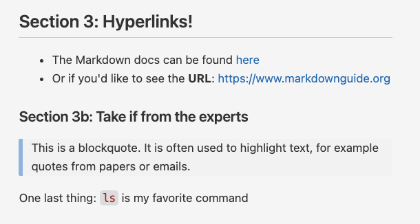

---------

<br>

## Introduction

In these exercises, you'll practice with ...

::: exercise
####  Exercise: Markdown

Add text to your `markdown-intro.md` document that would result in the following
preview:

{fig-align="center" width="65%" fig-alt="A VS Code preview of a Markdown document." .lightbox}

<details><summary>*Click for the solution*</summary>

````markdown
## Section 3: Hyperlinks!

- The Markdown docs can be found [here](https://www.markdownguide.org)
- Or if you'd like to see the **URL**: <https://www.markdownguide.org>

### Section 3b: Take it from the experts

> This is a blockquote. It is often used to highlight text, for example quotes from papers or emails.

One last thing: `ls` is my favorite command
````

</details>

:::
