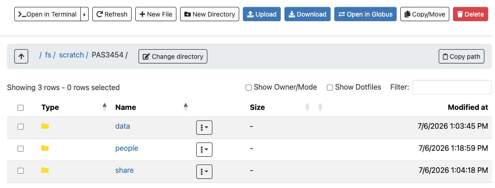

# Introduction {background-color="#A7B1B7"}

## Learning goals

**This session introduces high-performance computing**
**and the Ohio Supercomputer Center (OSC)**

::: {.columns}
::: {.column}

. . .

- You will do all your coding and computing for this course at OSC!

. . .

- This is a brief overview to provide enough context to get you going with
  using OSC
- You'll learn more along the way, and a deeper dive will follow in week 5

:::
::: {.column}

{fig-align="center" width="70%" fig-alt="The Ohio Supercomputer Center logo."}

:::
:::

## Overview and learning goals

**You will learn:**

::: {.columns}
::: {.column}

- What supercomputers are and why they are useful
- What resources the Ohio Supercomputer Center (OSC) provides

. . .

- How to access OSC resources through its web portal, "OSC OnDemand"

:::
::: {.column}

{fig-align="center" width="70%" fig-alt="The Ohio Supercomputer Center logo."}

:::
:::

# High-performance computing {background-color="#A7B1B7"}

## What is a supercomputer?

::: {.columns}
::: {.column width="47%"}

### [What is a supercomputer?]{style="display:block; text-align:center;"}

- Many computers connected by a high-speed network
- Can be accessed remotely by its users

:::
::: {.column width="5%"}

:::
::: {.column width="47%" .fragment data-fragment-index="1"}

### [What does it provide?]{style="display:block; text-align:center;"}

High-Performance Computing (**HPC**) resources --- two main aspects:

- [**Compute**]{.teal}: computing power to run your data processing and analysis
- [**Storage**]{.blue}: space for storage of your data and results

:::
:::

. . .

::: callout-tip
### Terminology
Supercomputers are also known as "compute clusters" or simply "**clusters**"
:::

## Why use a supercomputer?

Can you think of any reasons to use a supercomputer instead of your own computer?

- Your analyses take a long time to run, need large numbers of processors,
  or a large amount of memory
- You need to run an analysis many times
- You need to store a lot of data
- Your analyses require Linux-only software, but you have Windows
- Your analyses require specialized hardware, such as GPUs

. . .

::: {.callout-tip appearance="simple"}
**When you're working with omics data, many of these reasons typically apply.**
This can make it hard or impossible to run all your analyses on your personal
workstation, and supercomputers provide a solution.
:::

# The Ohio Supercomputer Center (OSC) {background-color="#A7B1B7"}

## What is OSC?

::: {.columns}
::: {.column width="40%"}

- The Ohio Supercomputer Center (OSC) is a supercomputer facility provided by the
  state of Ohio

- Has three supercomputers, lots of storage space,
  and excellent infrastructure to access these resources

:::
::: {.column width="60%"}

{fig-align="center" width="95%" fig-alt="A photo of the Cardinal OSC cluster"}

::: legend2
Cardinal, one of OSC's supercomputers.
:::

:::
:::

## OSC Projects

Access to and usage of OSC goes through OSC "Projects".

::: {.columns}
::: {.column width="29%" .box-tertiary .fragment data-fragment-index="1"}
***Scope of a project***

A project can be tied to a lab or research project,
or be educational like this course's project.

The OSC Project for this course is `PAS3493`.
:::

::: {.column width="2%"}
:::

::: {.column width="29%" .box-primary .fragment data-fragment-index="2"}

***Projects are the billing units***

OSC charges for "compute hours" and storage space,
and does so at the level of a project (not individual users).
:::

::: {.column width="2%"}
:::

::: {.column width="30%" .box-secondary .fragment data-fragment-index="3"}
***From a user perspective***

You can be a member of any number of projects.

- Specify the appropriate project when requesting compute
- Use the corresponding locations when storing files
:::
:::

# The structure of a supercomputer center {background-color="#A7B1B7"}

## Terminology

Going from smaller things to bigger things:

- **Node**\
  A single computer that is a part of a supercomputer
- **Supercomputer / Cluster**\
  A collection of connected computers.
  OSC currently has three: "Ascend", "Cardinal", and "Pitzer"
- **Supercomputer Center**\
  A facility like OSC that has one or more supercomputers

_TODO - ADD DIAGRAM_

## Supercomputer components

::: {.columns}
::: {.column width="40%"}

Two main parts of a supercomputer:

. . .

- [**Nodes** (compute)]{.teal}
  - **Login Nodes**\
    The handful of computers everyone shares after logging in
  - **Compute Nodes**\
    The many computers you can reserve to run your analyses

. . .

- [**File System** (storage)]{.blue} \
  Where files are stored (shared between clusters!)

:::
::: {.column width="60%"}

{fig-align="center" width="95%" fig-alt="A diagram showing the structure of a supercomputer with three main components:file systems, login nodes, and compute nodes"}

:::
:::

## Login versus compute nodes

::: {.columns}
::: {.column width="47%"}

### [Login nodes]{style="display:block; text-align:center;"}

An initial landing spot when you log in to a supercomputer:

- There are only a handful of them on each supercomputer
- They are shared among everyone, and cannot be reserved for exclusive usage

::: {.callout-warning appearance="simple" .fragment data-fragment-index="1"}
Login nodes are meant only for light tasks such as organizing files and
creating scripts for compute jobs,
and ***not*** **for serious computing**.
:::

:::
::: {.column width="5%"}

:::
::: {.column width="47%" .fragment data-fragment-index="2"}

### [Compute nodes]{style="display:block; text-align:center;"}

This is where serious computation, such as data analysis, takes place:

- To access compute nodes, you need to request a "compute job"

- A *job scheduler* program then assigns the requested resources --
  for example, access to a specific compute node for two hours

:::
:::

## Computer file systems

::: {.columns}
::: {.column width="48%"}

{fig-align="center" width="100%" fig-alt="A diagram of an example file structure on a Mac computer."}

:::legend2
Example file structure on a Mac [@oneil2019]
:::

:::
::: {.column width="52%"}

- The diagram shows a typical file structure on a Mac computer.

. . .

- Mac and Linux computers (OSC runs on Linux) have a single starting point
  to the entire file structure: the **root folder**, `/`.

. . .

- A **path** specifies the location of a file or folder ---
  `/home/guest` is the path to the "guest" folder.

. . .

Is "guest" inside "home", or vice versa?

"guest" is inside "home".
In other words, "guest" is a subfolder of "home",
and "home" is the parent folder of "guest".

. . .

Can you find the path to "todo_list.txt"?

`/home/oneils/documents/todo_list.txt`

:::
:::

::: footer
:::

## Computer file systems

::: {.callout-quiz}
::: {.callout-note}
#### In file paths, what does the `/` represent?

A) &nbsp; A leading `/` indicates the current user's home folder, and any other `/`s separate folders in the path.

B) &nbsp; A `/` separates a file's name from its extension, similar to how a period is used.

C) &nbsp; A leading `/` indicates the root folder, and any other `/`s separate folders in the path.

D) &nbsp; A `/` marks the boundary between a drive letter and the rest of the path, as in Windows.

:::
:::

## OSC also has a single file structure 

::: {.columns}
::: {.column}
{fig-align="center" width="90%" fig-alt="A diagram of an example file structure on a Mac computer."}

::: legend2
Example file structure on a Mac [@oneil2019].
:::

:::
::: {.column}
{fig-align="center" width="85%" fig-alt="A diagram of the high-level file structure at OSC."}

::: legend2
Some key folders in OSC's file structure.
:::

:::
:::

## OSC storage areas

| Area                                     | Main purpose                                                          | One for each | Location       |
| ----------------------------------------------- | --------------------------------------------------------------------- | ------------ | -------------- |
| [**Project**]{style="background-color:#C1E5F5"} | Main project storage                                                  | Project      | `/fs/ess/`     |
| [**Scratch**]{style="background-color:#DCEAF7"} | Additional, temporary project storage                                 | Project      | `/fs/scratch/` |
|                                                 | [General, _personal_ files not tied to projects]{style="color:white"} |              |                |

: {.hover tbl-colwidths="[15,45,20,20]"}

## OSC storage areas

| Area                                     | Main purpose                                   | One for each | Location       |
| ----------------------------------------------- | ---------------------------------------------- | ------------ | -------------- |
| [**Project**]{style="background-color:#C1E5F5"} | Main project storage                           | Project      | `/fs/ess/`     |
| [**Scratch**]{style="background-color:#DCEAF7"} | Additional, temporary project storage          | Project      | `/fs/scratch/` |
| [**Home**]{style="background-color:#FBE3D6"}    | General, _personal_ files not tied to projects | user         | `/users/`      |

: {.hover tbl-colwidths="[15,45,20,20]"}

## OSC file structure in more detail

::: {.columns}
::: {.column}

{fig-align="center" width="80%" fig-alt="A diagram showing paths on OSC and navigating upwards with relative paths"}

:::
::: {.column}

**Key folders for fictional student `jane`**

- The main data storage location for the course is `/fs/ess/PAS3493`

. . .

- You will create your personal folder there, as shown for `jane`.

. . .

::: {.callout-warning appearance="simple"}
The [Home system `PAS3493` box]{style="background-color:#FBE3D6"} is faded because:

- Your Home location may be elsewhere
- Despite appearances, your Home folder is not associated with a project!
:::

:::
:::

# OSC OnDemand {background-color="#A7B1B7"}

## OSC websites

OSC has three main websites:

| Website                                                               | Purpose                                        | Login? |
| --------------------------------------------------------------------- | ---------------------------------------------- | ------ |
| [https://ondemand.osc.edu](https://ondemand.osc.edu){target="_blank"} | Web portal: use OSC resources in your browser  | Yes    |
| [https://my.osc.edu](https://my.osc.edu){target="_blank"}             | Account and project management                 | Yes    |
| [https://osc.edu](https://osc.edu){target="_blank"}                   | General public-facing website with information | No     |

: {.hover .striped}

. . .

 

Our main access point, **OSC OnDemand** offers access to, for example:

- A file browser/explorer
- A Unix shell
- "Interactive Apps": programs such as RStudio and VS Code

## Let's log in

 Go to <https://ondemand.osc.edu> and log in ---
then, you should see a page like this:

{fig-align="center" width="75%" fig-alt="A screenshot of the OSC OnDemand landing page"}

::: callout-warning
#### Do not go to class.osc.edu!
:::

::: footer
:::

## Files menu

::: {.columns}
::: {.column width="70%"}

 In the top blue bar, hover over the **Files** dropdown menu.

You'll see a list of folders you have access to.
If your account is brand new, you should see three:

1. A [**Home**]{style="background-color:#FBE3D6"} folder (starts with `/users/`)
2. The `PAS3493` project's ["**project**"]{style="background-color:#C1E5F5"} folder (`/fs/ess/PAS3493`)
3. The `PAS3493` project's ["**scratch**"]{style="background-color:#DCEAF7"} folder (`/fs/scratch/PAS3493`)

:::
::: {.column width="30%"}

_TODO ADD SCREENSHOT_

:::
:::

. . .

::: {.callout-note appearance="simple"}
- You will only ever have one Home folder at OSC,
- When you join other projects,
  additional `/fs/ess` and `/fs/scratch` folders will appear.
:::

## Files menu


Click on `/fs/ess/PAS3493` to see what folders and files are there:

{.nostretch fig-align="center" width="82%" fig-alt="A screenshot of the OSC OnDemand file browser."}

::: {.callout-note appearance="simple"}
This interface is **much like the file browser on your own computer**:
you can create, delete, move and copy files and folders, and even upload
and download files.
:::

##  Create a personal folder

1. Click on the `people` folder
2. Click the "New Directory" at the top
   [(_directory, or "dir" for short, is another word for folder_)]{.teal}
3. Give the new folder the **exact same name** as your OSC username
   (you can see your username in the top-right corner of the OnDemand webpage)
4. Click on the new folder and within it, create two more folders:
   - one called `week02`
   - one called `week03`

. . .

::: {.callout-note appearance="simple"}
You will be using this folder to store all your files for this course!
:::

------

::: {.columns}
::: {.column}

### [Interactive Apps menu]{style="display:block; text-align:center; color:var(--color-primary);"}

Via the Interactive Apps dropdown menu,
you can access programs with Graphical User Interfaces (**GUI**s;
point-and-click interfaces):

. . .

- You'll soon start using the VS Code text editor, listed here as
  `Code Server`, to write Markdown files and work in the Unix shell.

- You'll also use `RStudio Server` to code in R.

:::
::: {.column}

{fig-align="center" width="32%" fig-alt="A screenshot of the options in the OSC OnDemand Interactive Apps dropdown menu."}

:::
:::

::: footer
:::

## Recap

::: {.columns}
::: {.column width="30%" .box-blue}
### Supercomputers

Provide shared **compute** and **storage** resources, accessed remotely.

Made up of **login nodes**, **compute nodes**, and storage areas.

:::
::: {.column width="3%"}
:::
::: {.column width="30%" .box-amber}
### OSC Projects

OSC access is organized through **Projects**.

Ours is `PAS3493`.

:::
::: {.column width="3%"}
:::
::: {.column width="30%" .box-teal}
### OSC OnDemand

<https://ondemand.osc.edu> is how you'll access all of this:
files, a Unix shell, and Interactive Apps like Code Server and RStudio Server

:::
:::

# Questions? {background-color="#A7B1B7" .unlisted}

    

## References
