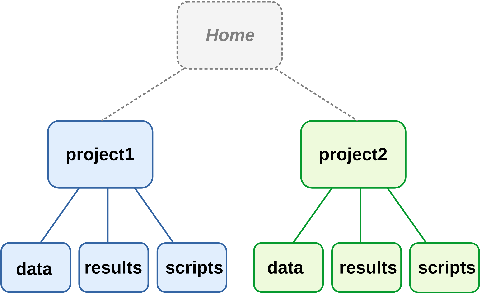
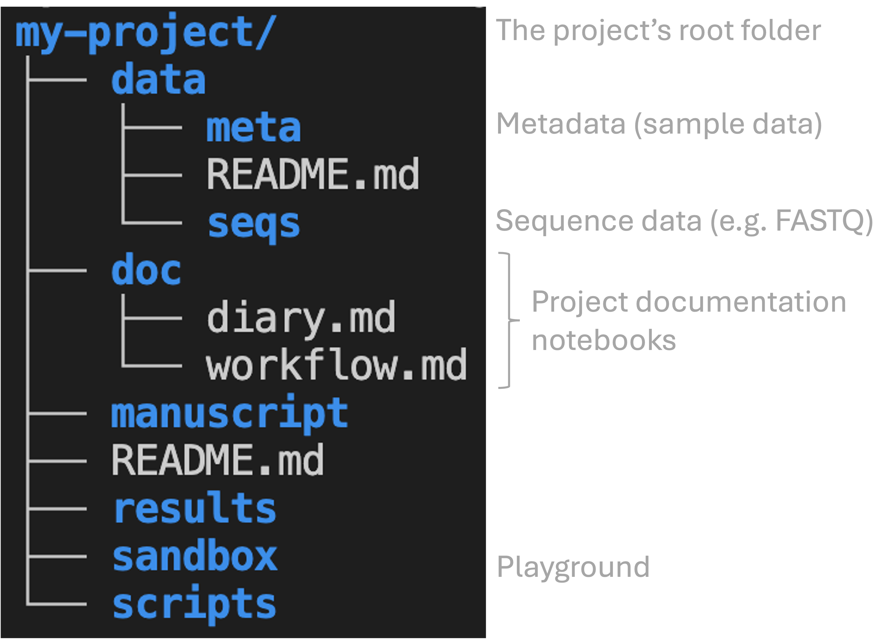

# Introduction {background-color="#A7B1B7"}

## Learning goals

**Learn best practices for...**

- organization and management of your research project files
- documentation of your research project.

. . .

<br>

::: callout-tip
### Two guiding principles [@noble2009]

1. Someone unfamiliar with your project should be able to look at your
   computer files and understand in detail what you did and why.
2. Everything you do, you will probably have to do over again.

Keep these principles in mind while we discuss the recommendations below!
:::

## Why does this matter?

Thoughtful and systematic project documentation and organization...

- improve the **reproducibility** of your research

. . .

- facilitate **collaboration** with others and "your future self"

. . .

- are **prerequisites** for effective use of version control (week 4),
  automation, and agentic AI (week 8).

## Sidebar: Why reproducibility matters

::: callout-discussion
::: callout-note

- Which of @markowetz2015's "_Five selfish reasons to work reproducibly_"
  resonated most with you? Why?

- What are some other reasons to work reproducibly?

<!----
TODO: Make a list of reasons to work reproducibly.
---->

:::
:::

## Recommended practices

1. Use one folder for one project, with a systematic subfolder structure.
  
. . .

2. Avoid editing your data altogether, and editing your results manually.

. . .

3. Follow file and folder naming practices that favor machine- and
   human-readability.

. . .

4. Prefer plain-text file formats.

. . .

5. Document your project extensively with Markdown files.

<br>

We'll now get into these one by one.

# 1. Folder structure {background-color="#A7B1B7"}

## 1a. Use one folder for one project

::: {.columns}
::: {.column width="45%"}

Use a separate folder for each project, which should contain...

- _all_ files related to that project, and _only_ those files

- subfolders to cleanly organize your files.

. . .

<hr style="height:1pt; visibility:hidden;" />

**This strategy makes it easier to...**

- find files
- share or back up your entire project
- avoid throwing away stuff in error.

:::
::: {.column width="55%"}

{fig-align="center" width="95%" fig-alt="A diagram showing two research project folder hierarchies."}

::: legend2
Two project folder hierarchies. Each box is a folder.
:::

:::
:::

## 1b. Separate files using a systematic structure

::: {.columns}
::: {.column width="42%"}

Use subfolders to separate different kinds of files, such as files that contain:

- code _vs._
- data _vs._
- results

:::
::: {.column width="58%"}

. . .

For example:

{fig-align="center" width="100%" fig-alt="A screenshot showing an example research project folder hierarchy."}

:::
:::

## 1b. Alternative organization

- Several of these folders could be named differently, such as:
  - Some researchers prefer `analysis` instead of `results`
  - Some researchers prefer `src` ("source") instead of `scripts`
  
- Some recommendations, such as by @buffalo2015,
  use `data/raw` and `data/processed` folders.
  However, this blurs the line between data and analysis results,
  and I much prefer to put "processed data" within `results`.

- @noble2009
  recommends that subfolders within `results` are initially organized by date
  and then by topic/software (e.g: `results/2026-08-30/multiqc`).
  I personally don't think this works well for most omics data analysis.


# 2. Editing data and results {background-color="#A7B1B7"}

## Avoid (manually) editing data and results

- **Raw data files should never be edited** once produced.
- Avoid manually editing files such as intermediate results ---
  do this with **code** instead.

Instead, any data processing or even correction should be done with
_separate copies_ of the data.

. . .

<hr style="height:1pt; visibility:hidden;" />

::: callout-tip
#### Treatment of data versus results

- _Raw data_: **read-only** (never edit the originals!) and **highly
  valuable** (make backups!)
- _Results_: essentially **disposable**,
  since you should be able to regenerate them
:::

## Editing - TODO

As @abdill2024 explain (my bolding):

> For example, if script A processes raw data into a table of gene expression levels, and script B summarizes this table by pathway, we should be concerned if there is a step after script A that requires a user to open the table and edit fields by hand to prepare the data for script B. **Such quick fixes can be tempting**, but they also add risk: A researcher could easily add a typo, corrupt a file in unexpected ways, or forget the step altogether.

When you use _code_ to make such fixes, it can be included as part of your
project's "workflow" and therefore be reproducible.

That also makes these fixes much easier to repeat if needed.
Recall the second of @noble2009's guiding principles mentioned above:
_"Everything you do, you will probably have to do over again."_
While a manual fix may be quicker if it really only needed to be done once,
it is common to have to repeat things in practice,
such that writing code to do the fix can also end up saving time.

# 3. File naming {background-color="#A7B1B7"}

## 3. Use best practices for file naming

Three key principles (from [Jenny Bryan ](https://speakerdeck.com/jennybc/how-to-name-files){target="_blank"}) ---
file names should...

A) be machine-readable
B) be human-readable
C) enable correct default alphanumeric sorting

## 4a. Machine-readable names

- Don't use spaces in file names.

- Limit special characters to underscores
  (<kbd>_</kbd>), hyphens (<kbd>-</kbd>), and periods (<kbd>.</kbd>).

. . .

<hr style="height:1pt; visibility:hidden;" />

- Where appropriate, include **metadata** like sample ID, date, and
  treatment:
  - [`sample032`]{style="background-color:#C1E5F5"}`_`[`2016-05-03`]{style="background-color:#FBE3D6"}`_`[`low`]{style="background-color:#D4EDDA"}`.txt`
  - `samples_`[`soil`]{style="background-color:#C1E5F5"}`_`[`treatmentA`]{style="background-color:#FBE3D6"}`_`[`2019-01`]{style="background-color:#D4EDDA"}`.txt`

## 4b. Human-readable names

> *"Name all files to reflect their content or function.*
> *For example, use names such as `bird_count_table.csv`, `manuscript.md`,*
> *or `sightings_analysis.py`."* [@wilson2017]

. . .

::: {.columns}
::: {.column width="55%"}

One good scheme:

- Use **underscores** (<kbd>_</kbd>) to delimit units like sampleID, batch,
  treatment, date
- Use **dashes** (<kbd>-</kbd>) to delimit words within a unit:
  `grass-and-soil`
- Limit **periods** (<kbd>.</kbd>) to file extensions
- Generally *avoid capitals*

:::
::: {.column width="3%"}
:::
::: {.column width="42%"}

. . .

For example:

```bash-out
S01_grass-and-soil_R1.fastq
S01_grass-and-soil_R2.fastq
S02_grass-and-soil_R1.fastq
S02_grass-and-soil_R2.fastq
```

:::
:::

## 4c. Names that sort correctly

<details class="details-quiz"><summary>
Zoom poll: What is your preferred way of writing dates in e.g. file names?
</summary></details>

## 4c. Names that sort correctly

Write dates in the format `YYYY-MM-DD` (e.g., `2026-08-31`) ---
this sorts correctly *and* is unambiguous.

<hr style="height:1pt; visibility:hidden;" />

::: {.columns}
::: {.column width="45%" .fragment data-fragment-index="1"}

**Sorting with the `M/D/YY` format:**

```bash-out
12/31/20
8/12/20
8/13/19
```

<hr style="height:1pt; visibility:hidden;" />

<details class="details-quiz"><summary>What are some problems with this format, as seen above?</summary>

- Years are never sorted correctly.
- Within years, months and dates are not sorted correctly
  (but could be if using leading zeros: `08/12/20` and `08/13/19`).

</details>

:::
::: {.column width="5%"}
:::
::: {.column width="45%" .fragment data-fragment-index="2"}

**Sorting with the `YYYY-MM-DD` format:**

```bash-out
2019-08-13
2020-08-12
2020-12-31
```

<hr style="height:1pt; visibility:hidden;" />

<details class="details-quiz"><summary>Why should we use four digits for the year?</summary>

- Ensures correct sorting across centuries.
- Eliminates ambiguity about which set of digits represents the year.

</details>

:::
:::

## 4c. Names that sort correctly

Use **leading zeros** --- for example, `sample05` instead of `sample5`.

::: {.columns}
::: {.column width="45%"}
_Without leading zeros:_
```bash-out
sample1
sample10
sample11
sample2
sample3
```
:::
::: {.column width="45%"}
_With leading zeros:_
```bash-out
sample01
sample02
sample03
sample10
sample11
```
:::
:::

. . .

<br>

::: {.callout-tip appearance="simple"}
Chose the number of leading zeros based on how many samples (options) you expect
to have.
For example, if you _may_ get more than 100 samples, use three:
`sample001`, `sample002`, ..., `sample999`.
:::

## 4c. Names that sort correctly

Optional / when it makes sense: **group** similar files by prefix,
and **number** files in order.

<hr style="height:1pt; visibility:hidden;" />

For example:

  ```bash-out
  |-- results/
  |   |-- 01_reference-seqs/
  |   |-- 02_fastqc/
  |   |-- 03_multiqc/
  |   |-- 04_trimgalore/
  |   |-- 05_star/
  |   |-- 06_salmon/
  |-- scripts/
  |   |-- 01_download-reference.sh
  |   |-- 02_fastqc.sh
  ```

# 4. Plain-text files {background-color="#A7B1B7"}

## Use plain-text files

::: callout-quiz
::: callout-note
#### Which are plain-text formats and which are not?

TODO - ADD `.R` file

A) `.txt` and `.pdf` are plain-text files, `.csv` and `.xlsx` are not.
B) `.txt` and `.csv` are plain-text files, `.xlsx` and `.pdf` are not.
C) `.txt`, `.csv`, and `.pdf` are plain-text files, `.xlsx` is not.
D) `.txt` is a plain-text file, `.csv`, `.xlsx`, and `.pdf` are not.

<hr style="height:1pt; visibility:hidden;" />

<details><summary>  &nbsp; _Click for a hint about `.csv` files_</summary>
`.csv` stands for "comma-separated values",
a tabular (table) format where columns are separated by commas.
</details>

<hr style="height:1pt; visibility:hidden;" />

<details><summary>  &nbsp; _Click for the answer_</summary>
A) `.txt` and `.csv` are plain-text files, `.xlsx` and `.pdf` are not.
</details>

<hr style="height:1pt; visibility:hidden;" />

:::
:::

## Use plain-text files

::: {.columns}
::: {.column width="47%"}

### [What are plain-text files?]{style="display:block; text-align:center;"}

- Contain only readable characters with no hidden formatting or binary encoding
- Can be opened and edited with any basic text editor, including in a terminal

::: {.callout-tip appearance="simple"}
In this course, you'll use **Markdown** (`.md`) files -- a nice balance between ease of
writing/reading and formatting options. More on this next lecture!
:::

:::
::: {.column width="5%"}
<div class="fragment" data-fragment-index="1" style="border-left: 1px solid #A7B1B7; height: 100%; margin: 0 auto; width: 0;"></div>
:::
::: {.column width="47%" .fragment data-fragment-index="1"}

### [Why use plain-text files?]{style="display:block; text-align:center;"}

Plain-text files are preferable for reproducible science because they:

- Can be accessed on any computer, including remotely,
  without needing any special or proprietary software
- Can be operated on by Unix shell commands and any programming language
- Are future-proof
- Can be version-controlled appropriately

:::
:::

# 5. Research documentation {background-color="#A7B1B7"}

## Document your research project

::: {.columns}
::: {.column width="47%" .fragment data-fragment-index="1"}

### [Rationale]{style="display:block; text-align:center;"}

- Documenting isn't easy:
  it can feel like a waste of time when things are obvious *then and there*.

::: {.fragment data-fragment-index="2"}

- But you won't have a clear picture a month later,
  and a collaborator won't either.

- Make a **conscious effort** to take a step back, slow down, and write
  down what you did and why.

:::

::: {.callout-warning appearance="simple" .fragment data-fragment-index="3"}
Code is partially self-documenting, 
but that shouldn't make you complacent about further documenting your work!
:::

:::

::: {.column width="5%" .fragment data-fragment-index="4"}
<div class="fragment" data-fragment-index="3" style="border-left: 1px solid #A7B1B7; height: 100%; margin: 0 auto; width: 0;"></div>
:::

::: {.column width="47%" .fragment data-fragment-index="4"}

### [What to document]{style="display:block; text-align:center;"}

Documentation should contain all information needed to reproduce your
research, e.g.:

- Where/when/how each data and metadata file originated
- Versions of software, databases, reference genomes

:::
:::

::: footer
:::

## Three types of documentation files

::: {.columns}
::: {.column width="31%" .box-teal .fragment data-fragment-index="1"}

**README**\
(`README.md` in top-level)

- project overview
- folder structure & file naming
- data details
- contact info

:::
::: {.column width="2%"}
:::
::: {.column width="31%" .box-amber .fragment data-fragment-index="2"}

**Lab notebook**\
(e.g. `doc/diary.md`)

- what you did and why
- not "clean" -- keep failed attempts too
- organize by date, most recent first

:::
::: {.column width="2%"}
:::
::: {.column width="31%" .box-blue .fragment data-fragment-index="3"}

**Workflow/protocol**\
(e.g. `doc/workflow.md`)

- code to **rerun** final analyses
- *should* be "clean"
- organize by analysis step, not date

:::
:::

## Documentation files in your project folder

{.nostretch fig-align="center" width="65%" fig-alt="An annotated screenshot of a recommended project folder hierarchy."}

## Discussion

::: {.callout-quiz}
::: {.callout-note}
#### Do you have a note-keeping/documentation system?

- What kinds of files do you use?
- How do you organize these files?
- Do you use any specialized electronic lab notebook systems?

:::
:::

## Recap

1. **File organization** ---
    Use one folder per project; separate file kinds into subfolders.
2. **Edit habits** ---
   Never manually edit data/results: use code.
3. **File names** ---
   machine- and human-readable file names, sorted correctly by default.
4. **Plain-text files** ---
   Use plain-text formats for all files that can be plain-text.
5. **Documentation** ---
   Maintain README, lab notebook, and workflow/protocol files, in Markdown.

<br>

. . .

::: callout-warning
#### Another take-home message: find your style and be consistent
File structures, file naming conventions, and documentation styles are not
one-size-fits-all.
Find a good approach that works for you, and then **consistently apply that**.
:::

# Questions? {background-color="#A7B1B7" .unlisted}

<br><br>

[_Click here to go to the next lecture, [**VS Code**](./w2c_vscode.qmd)_]{style="display:block; text-align:center"}

<br><br>

## References
