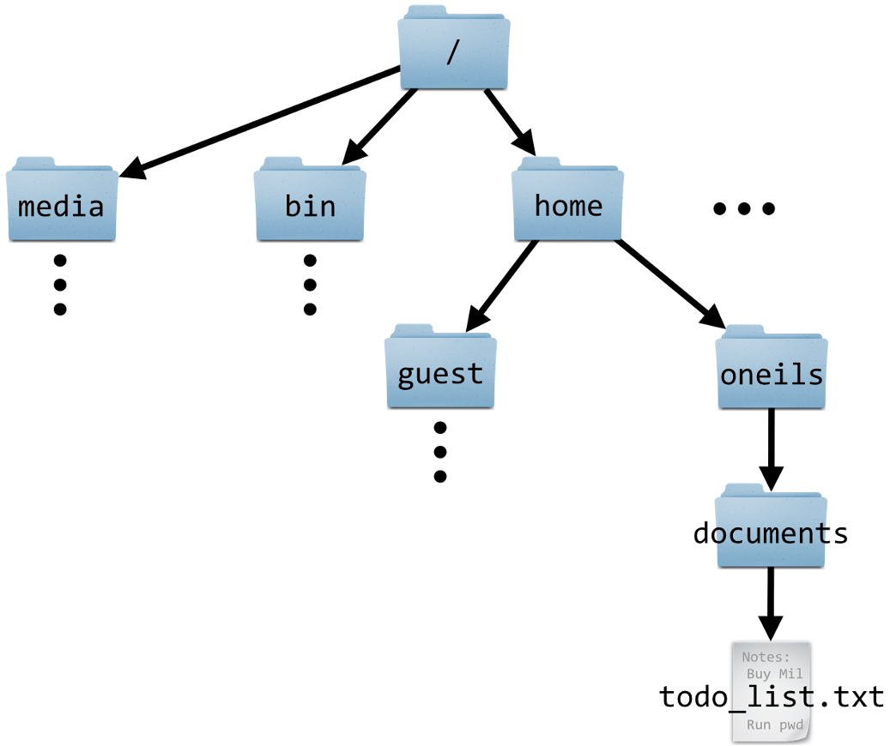
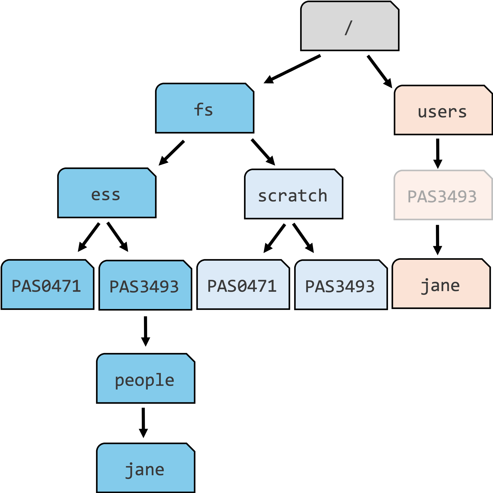
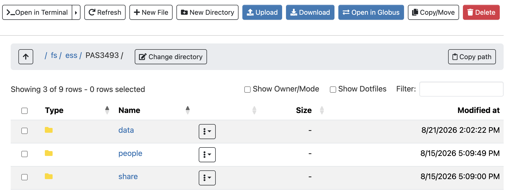

# Introduction {background-color="#A7B1B7"}

## Introduction

**This session introduces high-performance computing**
**and the Ohio Supercomputer Center (OSC)**

::: {.columns}
::: {.column}

. . .

- Why? You will do all your coding and computing for this course at OSC!

. . .

- This is a brief overview, meant to give you enough context to get started
  with OSC.

. . .

- You'll learn much more along the way, and a deeper dive will follow in week 6.

:::
::: {.column}

{fig-align="center" width="70%" fig-alt="The Ohio Supercomputer Center logo."}

:::
:::

## Learning goals

**You will learn:**

::: {.columns}
::: {.column}

- What supercomputers are and why they are useful
- What resources OSC provides
- How to access OSC resources through its web portal, "OSC OnDemand"

:::
::: {.column}

{fig-align="center" width="70%" fig-alt="The Ohio Supercomputer Center logo."}

:::
:::

# High-performance computing {background-color="#A7B1B7"}

## Supercomputer basics

::: {.columns}
::: {.column width="47%"}

### [What is a supercomputer?]{style="display:block; text-align:center;"}

A supercomputer, also known as a "**cluster**":

- Consists of many computers connected by a high-speed network
- Can be accessed remotely by its users

:::
::: {.column width="5%"}

:::
::: {.column width="47%" .fragment data-fragment-index="1"}

### [What does it provide?]{style="display:block; text-align:center;"}

High-Performance Computing (**HPC**) resources --- which have two main aspects:

- [**Compute**]{.teal}: computing power to run your data processing and analysis.
- [**Storage**]{.blue}: space for storage of your data and results.

:::
:::

## Why use a supercomputer?

Can you think of any reasons to use a supercomputer instead of your own computer?

- Your analyses take a long time to run, need large numbers of processors,
  or a large amount of memory.
- You need to run an analysis many times.
- You need to store a lot of data.
- Your analyses require Linux-only software, but you have Windows.
- Your analyses require specialized hardware, such as GPUs.

. . .

::: {.callout-tip appearance="simple"}
**When working with omics data, many of these reasons often apply.**
This can make it hard or impossible to run all your analyses on your computer,
and supercomputers provide a solution.
:::

# The Ohio Supercomputer Center (OSC) {background-color="#A7B1B7"}

## What is OSC?

::: {.columns}
::: {.column width="40%"}

- The Ohio Supercomputer Center (OSC) is a supercomputer facility provided by the
  state of Ohio.

- OSC has three supercomputers, lots of storage space,
  and excellent infrastructure to access these resources.

:::
::: {.column width="60%"}

{fig-align="center" width="95%" fig-alt="A photo of the Cardinal OSC cluster"}

::: legend2
Cardinal, one of OSC's supercomputers.
:::

:::
:::

## OSC Projects

Access to and usage of OSC goes through OSC "Projects".

::: {.columns}
::: {.column width="29%" .box-tertiary .fragment data-fragment-index="1"}
***Scope of a project***

A project can be tied to a lab or research project,
or be educational like this course's project.

The OSC Project for this course is `PAS3493`.
:::

::: {.column width="2%"}
:::

::: {.column width="29%" .box-primary .fragment data-fragment-index="2"}

***Projects are the billing units***

OSC charges for "compute hours" and storage space,
and does so at the level of a project (not individual users).
:::

::: {.column width="2%"}
:::

::: {.column width="30%" .box-secondary .fragment data-fragment-index="3"}
***From a user perspective***

You can be a member of any number of projects, so you'll need to:

- Specify the appropriate project when requesting compute.
- Store your files in that project's storage locations.
:::
:::

# The structure of a supercomputer center {background-color="#A7B1B7"}

## Nodes, clusters, and supercomputer centers

{fig-align="center" width="95%" fig-alt="A diagram showing the structure of a supercomputer center with three main components: file systems, login nodes, and compute nodes"}

::: {.columns style="text-align:center"}
::: {.column width="21%"}

**Node**\
A single computer that is a part of a supercomputer.

:::
::: {.column width="32%"}

**Supercomputer / Cluster**\
A collection of connected computers/nodes.

:::
::: {.column width="30%"}

**Supercomputer Center**\
A facility like OSC with one or more supercomputers.
OSC has three: "Ascend", "Cardinal", and "Pitzer".

:::
:::

::: footer
:::

## Terminology

Or, shown in another way:

::: {.stacked-venn}

::: {.item color="#666666"}
Supercomputer Center
:::

::: {.item color="#0072B2"}
Supercomputer/Cluster
:::

::: {.item color="#009E73"}
Node
:::

:::

::: footer
:::

## Supercomputer components

::: {.columns}
::: {.column width="40%"}

Main parts of a supercomputer:

. . .

- **Login nodes**\
  The handful of computers that everyone lands on when logging in.

. . .

- **Compute nodes** (for [compute]{.teal})\
  The many computers you can reserve to run your analyses.

. . .

- **File system** (for [storage]{.blue})\
  Where files are stored ---
  one system shared across all clusters.

:::
::: {.column width="60%"}

. . .

{fig-align="center" width="95%" fig-alt="A diagram showing the structure of a supercomputer with three main components: file systems, login nodes, and compute nodes"}

:::
:::

## Login versus compute nodes

::: {.columns}
::: {.column width="47%"}

### [Login nodes]{style="display:block; text-align:center;"}

An initial **landing spot** when you log in to a supercomputer:

- There are only a handful of them on each supercomputer.
- They are shared among everyone, and cannot be reserved for exclusive usage.

::: {.callout-warning appearance="simple" .fragment data-fragment-index="1"}
Login nodes are meant only for light tasks such as organizing files and
creating scripts for compute jobs,
and ***not*** **for serious computing**.
:::

:::
::: {.column width="5%"}

:::
::: {.column width="47%" .fragment data-fragment-index="2"}

### [Compute nodes]{style="display:block; text-align:center;"}

This is where **serious computation**, such as data analysis, takes place:

- To access compute nodes, you need to request a "compute job".

- A *job scheduler* program then assigns the requested resources ---
  for example, access to a specific compute node for two hours.

:::
:::

## File system --- background

::: {.columns}
::: {.column width="44%"}

{fig-align="center" width="100%" fig-alt="A diagram of an example file structure on a Mac computer."}

:::legend2
Example file structure on a Mac [@oneil2019].
:::

:::
::: {.column width="2%"}
:::
::: {.column width="54%"}

- Mac and Linux computers (OSC runs on Linux) have a single starting point
  to the entire file structure: the **root folder**, `/`.

. . .

- A **path** specifies the location of a file or folder ---
  `/home/guest` is the path to the "guest" folder.

. . .

- In paths, `/` is _also_ used to separate folders\
  (but Windows uses `\`).

:::
:::

## File system --- background

::: {.columns}
::: {.column width="44%"}

{fig-align="center" width="100%" fig-alt="A diagram of an example file structure on a Mac computer."}

:::legend2
Example file structure on a Mac [@oneil2019].
:::

:::
::: {.column width="2%"}
:::
::: {.column width="54%"}

Is `guest` inside `home`, or vice versa?

`guest` is inside `home`.
In other words, `guest` is a subfolder of `home`,
and `home` is the parent folder of `guest`.

. . .

What is the path to `todo_list.txt`?

`/home/oneils/documents/todo_list.txt`

:::
:::

## File system at OSC

Like a regular computer's file system, OSC also has a single file structure:

::: {.columns}
::: {.column}
{fig-align="center" width="90%" fig-alt="A diagram of an example file structure on a Mac computer."}

::: legend2
Example file structure on a Mac [@oneil2019].
:::

:::
::: {.column}
{fig-align="center" width="85%" fig-alt="A diagram of the high-level file structure at OSC."}

::: legend2
Some key folders in OSC's file structure.
:::

:::
:::

## OSC storage areas

| Area                                     | Main purpose                                                          | One for each | Location       |
| ----------------------------------------------- | --------------------------------------------------------------------- | ------------ | -------------- |
| [**Project**]{style="background-color:#C1E5F5"} | Main project storage                                                  | Project      | `/fs/ess/`     |
| [**Scratch**]{style="background-color:#DCEAF7"} | Additional, temporary project storage                                 | Project      | `/fs/scratch/` |
|                                                 | [General, _personal_ files not tied to projects]{style="color:white"} |              |                |

: {.hover tbl-colwidths="[15,45,20,20]"}

## OSC storage areas

| Area                                     | Main purpose                                   | One for each | Location       |
| ----------------------------------------------- | ---------------------------------------------- | ------------ | -------------- |
| [**Project**]{style="background-color:#C1E5F5"} | Main project storage                           | Project      | `/fs/ess/`     |
| [**Scratch**]{style="background-color:#DCEAF7"} | Additional, temporary project storage          | Project      | `/fs/scratch/` |
| [**Home**]{style="background-color:#FBE3D6"}    | General, _personal_ files not tied to projects | User         | `/users/`      |

: {.hover tbl-colwidths="[15,45,20,20]"}

## OSC storage areas

:::: callout-quiz
::: callout-note
#### Where should each of these go, Project (`/ess/`), Scratch, or Home?

A) &nbsp; Your files for this course

B) &nbsp; A copy of a manuscript draft, unrelated to any project

C) &nbsp; 200 GB of intermediate files that you can regenerate, and won't need next month

  &nbsp; _Click for the answers_

A) &nbsp; [**Project**]{style="background-color:#C1E5F5"} --- for this course, `/fs/ess/PAS3493`

B) &nbsp; [**Home**]{style="background-color:#FBE3D6"} --- personal files not tied to a project

C) &nbsp; [**Scratch**]{style="background-color:#DCEAF7"} --- temporary storage for large, regenerable files

:::
::::

## OSC file structure in more detail

::: {.columns}
::: {.column}

{fig-align="center" width="75%" fig-alt="A diagram showing paths on OSC and navigating upwards with relative paths"}

:::
::: {.column}

**Key folders for fictional student `jane` ---** 
[**Project-related folders**]{style="background-color:#C1E5F5"}:

. . .

- For this course, the main data storage location is `/fs/ess/PAS3493`.

- `jane` has created her personal folder in the `PAS3493` project,
   and you will do the same in just a minute.

. . .

What is the path to Jane's personal folder?

It is `/fs/ess/PAS3493/people/jane`.

:::
:::

## OSC file structure in more detail

::: {.columns}
::: {.column}

{fig-align="center" width="97%" fig-alt="A diagram showing paths on OSC and navigating upwards with relative paths"}

:::
::: {.column}

**Key folders for fictional student `jane` ---** 
[**Project-related folders**]{style="background-color:#C1E5F5"}:

- For this course, the main data storage location is `/fs/ess/PAS3493`.

- `jane` has created her personal folder in the `PAS3493` project,
   and you will do the same in just a minute.

::: {.callout-note appearance="simple"}
When you join other projects,
you get access to additional `/fs/ess` and `/fs/scratch` folders.
:::

:::
:::

## OSC file structure in more detail

::: {.columns}
::: {.column}

{fig-align="center" width="97%" fig-alt="A diagram showing paths on OSC and navigating upwards with relative paths"}

:::
::: {.column}

**Key folders for fictional student `jane` ---** 
[**Project-related folders**]{style="background-color:#C1E5F5"}:

- For this course, the main data storage location is `/fs/ess/PAS3493`.

- `jane` has created her personal folder in the `PAS3493` project,
   and you will do the same in just a minute.

::: {.callout-note appearance="simple"}
When you join other projects,
you get access to additional `/fs/ess` and `/fs/scratch` folders.

All of these can contain many subfolders!
:::

:::
:::

## OSC file structure in more detail

::: {.columns}
::: {.column}

{fig-align="center" width="80%" fig-alt="A diagram showing paths on OSC and navigating upwards with relative paths"}

:::
::: {.column}

**Key folders for fictional student `jane` ---** 
[**Home folder**]{style="background-color:#FBE3D6"}:

- Recall: you'll only ever have one Home folder.

- You typically don't want to store (active) course or research files here.

. . .

::: {.callout-warning appearance="simple"}
The `PAS3493` box in the [Home]{style="background-color:#FBE3D6"} branch is faded because:

- Your Home location may be elsewhere:
  this is merely the project that `jane`'s account was created under.

- Despite appearances, your Home folder is not meaningfully associated with a project!

:::
:::
:::

# OSC OnDemand {background-color="#A7B1B7"}

## OSC websites

OSC has three main websites:

| Website                                                               | Purpose                                        | Login? |
| --------------------------------------------------------------------- | ---------------------------------------------- | ------ |
| [https://ondemand.osc.edu](https://ondemand.osc.edu){target="_blank"} | Web portal: use OSC resources in your browser  | Yes    |
| [https://my.osc.edu](https://my.osc.edu){target="_blank"}             | Account and project management                 | Yes    |
| [https://osc.edu](https://osc.edu){target="_blank"}                   | General public-facing website with information | No     |

: {.hover .striped}

. . .

 

Our main access point during the course is **OSC OnDemand**,
which offers access to, for example:

- A file browser/explorer
- A Unix shell
- "Interactive Apps": programs such as RStudio and VS Code

## Let's log in

 Go to <https://ondemand.osc.edu> and log in.
You should then see a page like this:

{fig-align="center" width="75%" fig-alt="A screenshot of the OSC OnDemand landing page"}

::: callout-warning
#### Do not go to class.osc.edu!
That is a separate OSC portal for some classroom accounts,
and it is *not* the one we use.
:::

::: footer
:::

## Files menu

::: {.columns}
::: {.column width="70%"}

 In the top blue bar, hover over the **Files** dropdown menu.

. . .

You'll see a list of folders you have access to ---
if your account is brand new, these three:

1. A [**Home**]{style="background-color:#FBE3D6"} folder, listed as "Home Directory"
2. The `PAS3493` project's ["**project**"]{style="background-color:#C1E5F5"} folder (`/fs/ess/PAS3493`)
3. The `PAS3493` project's ["**scratch**"]{style="background-color:#DCEAF7"} folder (`/fs/scratch/PAS3493`)

. . .

::: {.callout-tip appearance="simple"}
In the screenshot on the right, the user is a member of two projects,
PAS0471 and PAS3493, so two pairs of `/fs/ess` and `/fs/scratch` folders are shown.
:::

. . .

::: {.callout-tip appearance="simple"}
Directory, or "dir" for short, is another word for folder.
We'll use these terms interchangeably.
:::

:::
::: {.column width="30%"}

{fig-align="center" width="80%" fig-alt="A screenshot of the OSC OnDemand file browser."}

:::
:::

## Files menu


Click on `/fs/ess/PAS3493` to see what folders and files are there:

. . .

{.nostretch fig-align="center" width="84%" fig-alt="A screenshot of the OSC OnDemand file browser."}

::: {.callout-note appearance="simple"}
This interface is **much like the file browser on your own computer**:
you can create, delete, move, and copy files and folders, and even upload
and download files.
:::

##  Create a personal folder

1. Click on the `people` folder.
2. Click the "New Directory" button at the top.
3. Give the new folder the **exact same name** as your OSC username.
4. Click on the new folder and within it, create two more folders:
   - one called `week02`
   - one called `week03`

. . .

::: {.callout-note appearance="simple"}
You will be using this personal folder to store all your files for this course!
:::

## System status

 In the "**Clusters**" dropdown menu, click on the item at the bottom, "**`System Status`**":

{fig-align="center" width="40%" fig-alt="A screenshot of the options in the OSC OnDemand Clusters dropdown menu." .lightbox}

## System status

This page shows an overview of the live, current usage of the three clusters,
and gives a good idea of the scale of the supercomputer center:

{fig-align="center" width="73%" fig-alt="A screenshot of the OSC Ondemand System Status page showing live cluster usage." .lightbox}

:::footer
:::

------

::: {.columns}
::: {.column}

### [Interactive Apps menu]{style="display:block; text-align:center; color:var(--color-primary);"}

Via the Interactive Apps dropdown menu,
you can access programs with Graphical User Interfaces (**GUI**s;
point-and-click interfaces):

. . .

- You'll soon start using the VS Code text editor, listed here as
  `Code Server`, to write Markdown files and work in the Unix shell.

- Later, you'll use `RStudio Server` to code in R.

 

 Click on **Code Server**,
and we'll pick up from there in the next lecture.

:::
::: {.column}

{fig-align="center" width="31%" fig-alt="A screenshot of the options in the OSC OnDemand Interactive Apps dropdown menu."}

:::
:::

::: footer
:::

## Recap

::: {.columns}
::: {.column width="30%" .box-blue .fragment data-fragment-index="1"}
### Supercomputers

Provide shared **compute** and **storage** resources, accessed remotely.

Nodes come in **login** vs. **compute** flavors.

:::
::: {.column width="3%"}
:::
::: {.column width="30%" .box-amber .fragment data-fragment-index="2"}
### OSC Projects

OSC access is organized through **Projects**.

The course's Project is `PAS3493`.

:::
::: {.column width="3%"}
:::
::: {.column width="30%" .box-teal .fragment data-fragment-index="3"}
### OSC OnDemand

<https://ondemand.osc.edu> is how you'll access all of this,
including "Interactive Apps" like Code Server.

:::
:::

# Questions? {background-color="#A7B1B7" .unlisted}

  

[_Click here to go to the next lecture, [**VS Code**](./w2c_vscode.qmd)_]{style="display:block; text-align:center"}

  

## References
