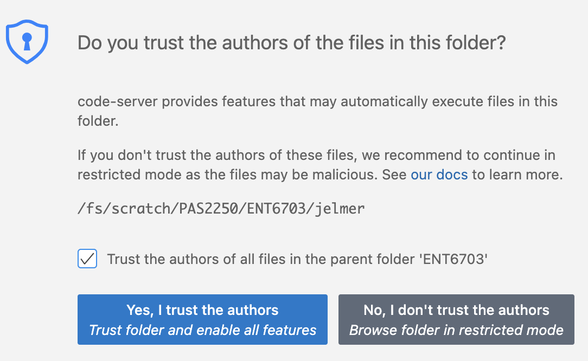
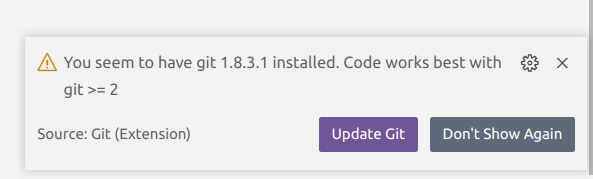
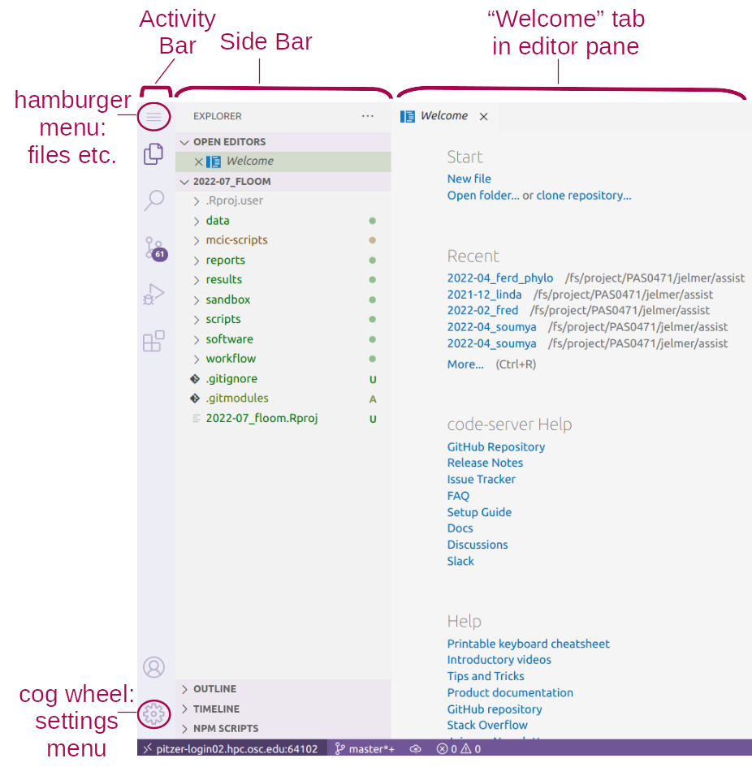

---------

 

## Introduction

### Context & overview

The [previous lecture](./w2a_project-org.qmd) emphasized the importance of research
documentation, and recommended using plain-text files to do so.
Now, you will learn to use **Markdown**,
a simple plain-text markup language that is a great option for writing your documentation.

But first, we'll introduce to **VS Code**,
the text editor you'll use to write Markdown --
as well as to write Unix shell code throughout the course.

## VS Code

### What is VS Code?

VS Code is basically a **fancy text editor**.
Its full name is Visual Studio Code, and it's also called "Code Server" at OSC.

To emphasize the additional functionality relative to basic text editors like Notepad and TextEdit,
editors like VS Code are also referred to as **IDEs**: *Integrated Development Environments*.
The RStudio program is another good example of an IDE.
Just like RStudio is an IDE for R, VS Code will be our IDE for shell code^[
Some advantages of VS Code: Works with all operating systems, is free, and open source;
it has an integrated terminal with a Unix shell; it is available at OSC OnDemand;
it is very popular and heavily developed].

### Starting VS Code at OSC

- Log in to OSC's OnDemand portal at <https://ondemand.osc.edu>

- In the blue top bar, select `Interactive Apps` and near the bottom, click `Code Server`.

- Interactive Apps like VS Code and RStudio **run on compute nodes** (not login nodes).
  Because compute nodes always need to be "reserved",
  we have to fill out a form and specify the following details:
  - The **Cluster** that we want to use: `pitzer`
  - The **Account**, the OSC Project to be billed for the compute node usage: `PAS2880`
  - The **Number of hours** we want to make a reservation for: `2`
  - This time, leave the **Working Directory** (starting point) for the program blank
  - The **App Code Server version**: `4.8.3` (this should be the only available option)

- Click `Launch` and you'll be sent to the _My Interactive Sessions_ page
  with a card for your job at the top.

- First, your job may be *Queued* for some seconds
  (i.e., waiting for computing resources to be assigned to it),
  but it should soon switch to *Starting* and then
  be ready for usage (*Running*) in another couple of seconds:

{fig-align="center" width="75%" fig-alt="A screenshot of the OSC OnDemand page shown when the Code Server job has started running." .lightbox}

- Once the blue **Connect to VS Code** button appears,
  click that to open VS Code in a new browser tab.

- When VS Code opens, you may get these two pop-ups (and possibly some others) ---
  click "Yes" (and check the box) and "Don't Show Again", respectively:

::: columns
::: {.column width="52%"}
{fig-align="center" width="85%" fig-alt="A screenshot of a popup you may get when first opening a folder in VS Code." .lightbox}
:::

::: {.column width="48%"}
{fig-align="center" width="85%" fig-alt="A screenshot of a popup you may get when first opening VS Code." .lightbox}
:::
:::

- You'll also see a Get Started page ---
  you don't have to go through any steps that may be suggested there.

_Congratulations: you have started your first compute job at OSC!_ 🥳

### The VS Code User Interface

{fig-align="center" width="80%" fig-alt="An annotated screenshot of the VS Code user interace" .lightbox}

#### Side bars

By default, the (wide) **Side Bar** will show a file explorer,
where you see your files, create new folders and files, and so on.

The **Activity Bar** (narrow side bar) on the far left has:

- A  ("hamburger menu"),
  which has menu items like `File` that you often find in a top bar
- A  (cog wheel icon) in the bottom,
  through which you can mainly access *settings*
- Icons to toggle between options for the wide Side Bar:
  we'll talk about those in a later session
  
### A folder as a starting point

Very conveniently, VS Code takes a specific
**folder as a starting point in all parts of the program**:

- In its file explorer
- When saving files
- In the Unix shell its terminal

 Click `File` > `Open Folder` and then type/select the
personal dir within `/fs/ess/PAS2880/users` you made last week
(for example, I will select `/fs/ess/PAS2880/users/jelmer`).
_This will cause the program to reload._

::: {.callout-tip appearance="simple"}
Remember all the talk of using relative paths that are supposed to start at a
(research) project's top-level dir?
Opening a folder like this in VS Code will help you with this,
and also makes it easy to switch between projects!
:::

#### Terminal (with a Unix shell)

 **Open a terminal** by clicking
   > `Terminal` > `New Terminal`.
We'll start using this terminal in the next lecture.
For now, practice _resizing panes_
(terminal vs. editor, and the width of the side bar)
by hovering your cursor over the lines dividing them and then dragging.

#### Editor pane and `Get Started` document

The main part of the VS Code is the **editor pane**.
Here, you can open scripts and other types of text files, images, and so on.
Like in a web browser, you can have multiple tabs open.

Whenever you open VS Code,
an editor tab with a `Get Started` document is automatically opened.
This provides some help and shortcuts to recently opened files and folders.

 **Create and save a new file:**

1. _Open a new file:_
   Click the hamburger menu <i class="fa fa-bars"></i> > `File` > `New File`.
2. _Save the file_ (<kbd>Ctrl/⌘</kbd>+<kbd>S</kbd>) within your `week02` dir
   as a Markdown file, e.g. `markdown-intro.md`.
