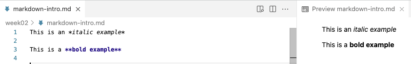

# Introduction {background-color="#A7B1B7"}

## Overview and learning goals

**This session introduces Markdown for research documentation**

::: {.columns}
::: {.column}

. . .

- The [previous lecture](./w2b_project-org.qmd) emphasized the importance
  of research documentation, using plain-text files to do so

. . .

- Now, you'll learn **Markdown**, a simple plain-text markup language
  that's a great option for writing that documentation

:::
::: {.column}

{fig-align="center" width="55%" fig-alt="The Markdown logo."}

:::
:::

## Overview and learning goals

**You will learn:**

::: {.columns}
::: {.column}

- What Markdown is
- How to preview "rendered" Markdown files in VS Code

. . .

- The most common Markdown syntax elements
- Some quirks in how Markdown treats whitespace

:::
::: {.column}

{fig-align="center" width="55%" fig-alt="The Markdown logo."}

:::
:::

# What is Markdown? {background-color="#A7B1B7"}

## What is Markdown?

- A lightweight plain-text "markup language" that provides formatting
  options for plain-text files

- The plain-text **source** Markdown file can be "**rendered**" to produce an output
  file in various formats, like PDF

. . .

<hr style="height:1pt; visibility:hidden;" />

Think of it as a much simpler version of HTML:

_TODO - ADD HTML EXAMPLE_

## A first example

Surrounding text with single or double asterisks (**`*`**) applies
italic and bold formatting, respectively:

- `*italic example*` is rendered as: *italic example*
- `**bold example**` is rendered as: **bold example**

{fig-align="center" width="100%" fig-alt="A side-by-side screenshot of a source Markdown document and its VS Code preview."}

## Markdown in VS Code

::: {.columns}
::: {.column width="70%"}

When you save a file with the `.md` extension in VS Code:

- Some formatting is automatically applied in the editor
- You can open a live **Preview** of the rendered version, using the
  icon shown on the right

:::
::: {.column width="30%"}

<br>

{fig-align="center" width="40%" fig-alt="A screenshot of the Markdown preview icon in VS Code."}

:::
:::

<br>

{fig-align="center" width="100%" fig-alt="A side-by-side screenshot of a source Markdown document and its VS Code preview."}

##  Give it a try

- Create a new file `markdown-intro.md` file and save it in your `week02` folder.

- Type the following Markdown text in the file:

```markdown
This is an *italic example*

This is a **bold example**
```

<hr style="height:1pt; visibility:hidden;" />

- Which should look as follows in VS Code:

{fig-align="center" width="100%" fig-alt="A side-by-side screenshot of a source Markdown document and its VS Code preview."}

# Common Markdown syntax {background-color="#A7B1B7"}

## Headers

Use one or more `#` characters, followed by a space:

```markdown
# Intro to Markdown

## Section 1: The basics
```

<hr style="height:1pt; visibility:hidden;" />

- One `#` makes a level-1 header (largest -- use for the document's title)
- Two `##` makes a level-2 header, and so forth for smaller headers

. . .

<br><br>

::: {.callout-tip appearance="simple"}
This slide deck itself is a Markdown (Quarto) document: `#` starts a
new section, and `##` starts a new slide!
:::

## Lists

::: {.columns}
::: {.column width="47%"}

**Type:**

```markdown
1. Create a _numbered_ list like this
1. Note that the numbers don't even need to increment.
1. Real easy!
```

<br><br>

```markdown
- Or make an unordered list
- with hyphens instead
```

:::
::: {.column width="7%"}
:::
::: {.column width="47%"}

**Renders as:**

1. Create a _numbered_ list like this
1. Note that the numbers don't even need to increment.
1. Real easy!

- Or make an unordered list
- with hyphens instead

:::
:::

## Horizontal rules

- Use **at least 3 dashes** (`---`) on a line by themselves to create a
  horizontal rule:

```markdown
Section 1 text.

----

Section 2 text.
```

## Code formatting

::: {.columns}
::: {.column width="47%"}

**Type:**

````markdown
## Section 2: Shell commands

Backticks as in `date` result in inline
code formatting.
But you may want whole "blocks" of code:

```bash
# Print the current date and time
date
```
````

:::
::: {.column width="53%"}

**Preview:**

{fig-align="center" width="100%" fig-alt="The VS Code preview of the Markdown document above."}

:::
:::

## Hyperlinks

## Overview of most common syntax

| Syntax/source           | Result/rendered output                                             |
| ----------------------- | ------------------------------------------------------------------ |
| \*italic\*              | *italic* text (or one underscore: \_italic\_)                      |
| \*\*bold\*\*            | **bold** text                                                      |
| # My Title              | Header level 1 (largest)                                           |
| ## My Section           | Header level 2 (smaller)                                           |
| - List item             | Unordered (bulleted) list                                          |
| 1. List item            | Ordered (numbered) list                                            |
| \-\-\-                  | Horizontal rule (3+ dashes)                                        |
| \[link text\]\(url\)    | Clickable link with "hidden" URL: [link text](https://website.com) |
| \<https://website.com\> | Clickable link with visible URL: <https://website.com>             |
| \> Text                 | Blockquote (like quoted text in emails)                            |

: {.hover .striped}

## Overview of most common syntax: code-formatting

| Syntax/source                                  | Result/rendered output                              |
| ---------------------------------------------- | --------------------------------------------------- |
| \`inline code\`                                | "Code-formatted" text for inline use: `inline code` |
| ```` ``` ```` <br> code <br> ```` ``` ````     | Generic/language-agnostic code block                |
| ```` ```bash ```` <br> code <br> ```` ``` ```` | `bash`-formatted language code block                |
| ```` ```r ```` <br> code <br> ```` ``` ````    | `r`-formatted language code block                   |
|                                                |                                                     |

: {.striped tbl-colwidths="[25,75]"}

## Creating tables

Tables take a bit more work -- use vertical bars `|` and dashes `-` like so:

::: {.columns}
::: {.column width="45%"}

**Type:**

```markdown
| city       | inhabitants |
|------------|-------------|
| Columbus   | 906 K       |
| Cleveland  | 368 K       |
```

:::
::: {.column width="10%"}
:::
::: {.column width="45%"}

**Renders as:**

| city       | inhabitants |
|------------|-------------|
| Columbus   | 906 K       |
| Cleveland  | 368 K       |

:::
:::

##  Your Turn

::: {.columns}
::: {.column width="48%"}

Add the following to your `markdown-intro.md`:

{fig-align="center" width="99%" fig-alt="A VS Code preview of a Markdown document."}

:::
::: {.column width="52%"}

<br>

<details><summary>*Click for the solution*</summary>

````markdown
## Section 3: Hyperlinks!

- The Markdown docs can be found [here](https://www.markdownguide.org)
- Or if you'd like to see the **URL**: <https://www.markdownguide.org>

### Section 3b: Take it from the experts

> This is a blockquote. It is often used to highlight
> text, for example quotes from papers or emails.

One last thing: `ls` is my favorite command
````

</details>

:::
:::

# Whitespace in Markdown {background-color="#A7B1B7"}

## Leave whitespace around syntax elements

**First**, leave a **blank line between different sections**, such as
between lists, headers, and paragraphs -- or rendering may break:

```bash-in-nocolor
## Chapter 2: List of ...

- Item 1
- Item 2

For example, ....
```

. . .

<hr style="height:1pt; visibility:hidden;" />

**Second**, leave a **space after** heading (`#`) and list (`-`/`1.`)
characters, or they won't be interpreted correctly

## Space after # and list markers

::: {.columns}
::: {.column width="45%"}

**This:**

```
##An important list

-x
-y
-z
```

:::
::: {.column width="45%"}

**Renders as:**

##An important list

-x -y -z

:::
:::

## A single newline is ignored

::: {.columns}
::: {.column width="45%"}

**This:**

```
Line 1.
Line 2.
```

:::
::: {.column width="45%"}

**Renders as:**

Line 1.
Line 2.

:::
:::

. . .

A **blank line** between text starts a new paragraph instead:

::: {.columns}
::: {.column width="45%"}

```
Paragraph 1.

Paragraph 2.
```

:::
::: {.column width="45%"}

Paragraph 1.

Paragraph 2.

:::
:::

## Extra whitespace gets collapsed

Multiple consecutive spaces or blank lines are **"collapsed"** into a
single one:

::: {.columns}
::: {.column width="45%"}

**This:**

```
Empty             spaces

Many


blank lines
```

:::
::: {.column width="45%"}

**Renders as:**

Empty spaces

Many

blank lines

:::
:::

## Forcing whitespace and linebreaks

::: {.callout-tip appearance="simple"}
Use HTML **`<br>`** to force extra visible whitespace -- any HTML
markup works in Markdown!
:::

. . .

A single **linebreak** (not a new paragraph) can be forced with *two or
more trailing spaces* or a backslash `\`:

::: {.columns}
::: {.column width="45%"}

```
My first sentence.\
My second sentence.
```

:::
::: {.column width="45%"}

**Renders as:**

My first sentence.\
My second sentence.

:::
:::

# In closing {background-color="#A7B1B7"}

## Why use Markdown?

Markdown is useful for documentation because it is:

- *Easy to write* -- you only need to know a dozen or so syntax
  constructs
- *Easy to read* in source form -- and VS Code applies some formatting
  even in the raw file

. . .

- *A de facto standard* for documentation in computational fields --
  e.g. GitHub, which you'll use starting week 4, renders Markdown files
  for you

. . .

::: callout-tip
Use `.md` files instead of `.txt` for the research documentation
discussed in the previous lecture.
:::

## Markdown for everything?

Several **Markdown extensions** allow documents to *contain code that
runs*, with the output then included in the rendered document:

- R Markdown (`.Rmd`), and its successor [Quarto](https://quarto.org/)
  -- which you'll learn later in this course

. . .

<hr style="height:1pt; visibility:hidden;" />

::: {.callout-tip appearance="simple"}
This entire website, including these slides, is written using Quarto!
Quarto also supports citations and journal-specific formatting, so you
can even write manuscripts with it.
:::

## Recap: Markdown

- Markdown is a plain-text markup language that can be **rendered** to
  formats like HTML and PDF
- Common syntax: `*italic*`, `**bold**`, `#`/`##` headers, `-`/`1.`
  lists, `` `code` ``, code blocks, links, and blockquotes
- Leave **blank lines** between sections, and a **space** after `#`/
  list markers
- Prefer `.md` files for the research documentation of week 2, lecture
  B

# Questions? {background-color="#A7B1B7"}

<br><br><br><br>
