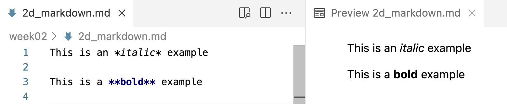

# Introduction {background-color="#A7B1B7"}

<!----
TODO - next year:
- Illustrate language-specific syntax highlighting with comments: '//' in c, '#' in bash or R
--->

## Context

**This session introduces Markdown for research documentation.**

::: {.columns}
::: {.column}

. . .

- [This week's first lecture](./w2a_project-org.qmd) emphasized the importance
  of documenting your research.

. . .

- Now you'll learn the **Markdown** mini-language,
  a great option for writing that documentation --- and more.

:::
::: {.column}

{fig-align="center" width="55%" fig-alt="The Markdown logo."}

:::
:::

## Learning goals

**You will learn:**

::: {.columns}
::: {.column}

- What Markdown is and why it's useful.
- How to preview "rendered" Markdown files in VS Code.

. . .

- The most common Markdown "syntax" elements.
- Some quirks in how Markdown treats whitespace.

:::
::: {.column}

{fig-align="center" width="55%" fig-alt="The Markdown logo."}

:::
:::

# First steps with Markdown {background-color="#A7B1B7"}

## What is Markdown?

::: {.columns}
::: {.column width="47%"}

### [A simple markup language]{style="display:block; text-align:center;"}

- Markdown is a lightweight "**markup language**".
  You write in plain text, adding simple formatting instructions using visible characters.

. . .

- Your plain-text **source** Markdown file can be converted into various output
  formats, like HTML or PDF.

. . .

- This process of conversion is called "**rendering**",
  during which the formatting instructions are applied
  (and the visible characters are removed).

:::
::: {.column width="5%"}
<div class="fragment" data-fragment-index="1" style="border-left: 1px solid #A7B1B7; height: 100%; margin: 0 auto; width: 0;"></div>
:::
::: {.column width="47%" .fragment data-fragment-index="1"}

### [A first example]{style="display:block; text-align:center;"}

Surrounding text with single or double asterisks (**`*`**) applies
*italic* and **bold** formatting, respectively:

- \*italic example\* produces *italic example*
- \*\*bold example\*\* produces **bold example**

<hr style="height:1pt; visibility:hidden;" />

::: {.callout-tip appearance="simple"}
We refer to these constructs (`*` for italic, etc.) as the "syntax" of the language.
:::

:::
:::

## Markdown in VS Code

::: {.columns}
::: {.column width="60%"}

Markdown files have extension `.md`,
and when you save a file with that extension in VS Code:

- Some formatting is automatically applied in the editor.
- You can open a live **Preview** of the rendered version, using the
  icon in the top-right of the editor (shown on the right).

:::
::: {.column width="40%"}

<hr style="height:1pt; visibility:hidden;" />

{fig-align="center" width="40%" fig-alt="A screenshot of the Markdown preview icon in VS Code."}

:::
:::

. . .

{fig-align="center" width="85%" fig-alt="A side-by-side screenshot of a source Markdown document and its VS Code preview."}

::: legend2
Markdown source (editor) on the left, rendered preview on the right.
:::

##  Your turn

- In the [previous session](./w2c_vscode.qmd), you created a file `2d_markdown.md`.\
  Type the following text in this file, then open the Preview:

  ```{.markdown code-line-numbers="false"}
  This is an *italic example*

  This is a **bold example**
  ```

<hr style="height:1pt; visibility:hidden;" />

. . .

- As shown in the previous slide, that should look as follows in VS Code:

{fig-align="center" width="85%" fig-alt="A side-by-side screenshot of a source Markdown document and its VS Code preview."}

::: legend2
Markdown source (editor) on the left, rendered preview on the right.
:::

## Why use Markdown? It is:

::: {.columns}
::: {.column width="30%" .box-blue}
### Easy to use

- **Easy to write**:
  you only need to know a dozen or so syntax constructs to get started.

::: {.fragment data-fragment-index="1"}
- **Easy to read** in source form
  (and VS Code applies some formatting even there).
:::

:::
::: {.column width="3%"}
:::
::: {.column width="30%" .box-amber .fragment data-fragment-index="2"}
### Widely used

- The de facto standard for **documentation** in computational fields.

- Has become even more prevalent with the rise of GenAI:
  chatbots write responses in Markdown,
  and AI coding tools are configured with Markdown files (e.g., `CLAUDE.md`).

:::

::: {.column width="3%"}
:::

::: {.column width="30%" .box-teal .fragment data-fragment-index="3"}
### Powerful and versatile

::: {.fragment data-fragment-index="3"}
- One source file can be converted to many output formats.
:::

::: {.fragment data-fragment-index="4"}
- Markdown extensions enable:

  - Executable code in documents,
    such as in [Quarto](https://quarto.org/) (covered in week 14)

  - Creating slides (such as these!) and websites (such as this one!)
:::

:::
:::

# The most common Markdown syntax {background-color="#A7B1B7"}

## Headers

To create headers, use one or more `#` characters, followed by a space:

::: {.columns}
::: {.column width="28%"}

**Type:**

<hr style="width:95%; margin:0.3em 0;" />
<hr style="height:1pt; visibility:hidden;" />

```{.markdown code-line-numbers="false"}
# Markdown intro

This is an *italic example*

This is a **bold example**

## Lists

### Warblers

### Sparrows
```

:::
::: {.column width="30%"}

**Rendered as:**

<hr style="width:95%; margin:0.3em 0;" />

{fig-align="left" width="70%" fig-alt="A side-by-side screenshot of a source Markdown document and its VS Code preview."}

:::
::: {.column width="41%"}

. . .

::: callout-note
#### Header levels

- One `#` makes a level-1 header\
  (largest; use only for document titles)
- Two `##` makes a level-2 header
- Three `###` makes a level-3 header ---\
  and so forth for smaller headers
:::

:::
:::

## Headers

::: {.columns}
::: {.column width="50%"}

Let's build a complete skeleton of a Markdown document,\
using the following headers:

```{.markdown code-line-numbers="false"}
# Markdown intro

This is an *italic example*

This is a **bold example**

## Lists

### Warblers

### Sparrows

## Hyperlinks and blockquotes

## Exercise

## Code formatting

## Whitespace
```

::: {.column width="10%"}
:::
:::
::: {.column width="40%"}

. . .

::: callout-tip
#### Auto save in VS Code
In this version of VS Code, changes to files are automatically saved.

If you don't like that,
you can open the Settings and search find the "Files: Auto Save" option.
:::

:::
:::

## Lists

::: {.columns}
::: {.column width="47%"}

**Type (under the headings from the previous slide):**

<hr style="width:95%; margin:0.3em 0;" />

<hr style="height:1pt; visibility:hidden;" />

```{.markdown code-line-numbers="false"}
- Pine Warbler
- Palm Warbler
```

:::
::: {.column width="7%"}
:::
::: {.column width="47%"}

**Rendered as:**

<hr style="width:95%; margin:0.3em 0;" />

- Pine Warbler
- Palm Warbler

:::
:::

. . .

<hr style="height:1pt; visibility:hidden;" />

::: {.columns}
::: {.column width="47%"}

<hr style="height:1pt; visibility:hidden;" />

```{.markdown code-line-numbers="false"}
1. Swamp Sparrow
2. Tree Sparrow
2. Field Sparrow
```

:::
::: {.column width="7%"}
:::
::: {.column width="47%"}

1. Swamp Sparrow
2. Tree Sparrow
2. Field Sparrow

:::
:::

<hr style="height:1pt; visibility:hidden;" />

. . .

::: callout-note
### Automatic numbering
In the second example, the last two items are rendered as "2." and "3."
even though they are both numbered "2." in the source.
Markdown automatically numbers ordered lists,
so you don't have to worry about numbering them correctly in the source.
:::

## Hyperlinks and blockquotes

::: {.columns}
::: {.column width="47%"}

**Type:**

<hr style="width:95%; margin:0.3em 0;" />

```{.markdown code-line-numbers="false"}
The docs are [here](https://markdownguide.org).

Or show the URL: <https://markdownguide.org>

> A blockquote is useful to highlight
> text, such as a quote from a paper.
```

. . .

<br>

::: {.callout-tip appearance="simple"}
Mind the order in a `[text](url)` link:\
the **`[`**link text**`]`** comes first, and then the **`(`**URL**`)`**.
:::

:::
::: {.column width="7%"}
:::
::: {.column width="47%"}

**Rendered as:**

<hr style="width:95%; margin:0.3em 0;" />

The docs are [here](https://www.markdownguide.org).

Or show the URL: <https://www.markdownguide.org>

> A blockquote is useful to highlight
> text, such as a quote from a paper.

:::
:::

## Your document so far

{fig-align="center" width="80%" fig-alt="A side-by-side screenshot of a source Markdown document and its VS Code preview."}

::: footer
:::

## Overview of most common syntax

| Syntax/source           | Result/rendered output                                             |
| ----------------------- | ------------------------------------------------------------------ |
| \*italic\*              | *italic* text (or use an underscore: \_italic\_)                  |
| \*\*bold\*\*            | **bold** text                                                      |
| # My Title              | Header level 1 (largest)                                           |
| ## My Section           | Header level 2 (smaller)                                           |
| - List item             | Unordered (bulleted) list                                          |
| 1. List item            | Ordered (numbered) list                                            |
| \<https://website.com\> | Clickable link with visible URL: <https://website.com>             |
| \[link text\]\(url\)    | Clickable link with "hidden" URL: [link text](https://website.com) |
| \> Text                 | Blockquote (like quoted text in emails)                            |
| \-\-\-                  | Horizontal rule (use 3+ dashes)                                    |

: {.hover .striped}

::: {.columns}
::: {.column width="20%"}
:::
::: {.column width="60%"}
::: {.callout-tip appearance="simple"}
See also the Markdown Guide's [cheat sheet](https://www.markdownguide.org/cheat-sheet/).
:::
:::
::: {.column width="20%"}
:::
:::

::: footer
:::

##  Exercise

Try to create the following content at the `## Exercise` header in
your Markdown file (the URL can be anything):

<hr style="height:1pt; visibility:hidden;" />

{.nostretch fig-align="center" width="60%" fig-alt="A side-by-side screenshot of a source Markdown document and its VS Code preview."}

## Solution

::: {.columns}
::: {.column width="49%"}

**Type:**

<hr style="width:95%; margin:0.3em 0;" />

```{.markdown code-line-numbers="false"}
## Exercise

Extracted DNA from *Quercus rubra* leaves using
the **CTAB protocol**.

Steps:

1. Grind tissue in liquid nitrogen
2. Add CTAB buffer
3. Incubate at 65°C

See the [CTAB protocol](https://pmc.ncbi.nlm.nih.gov/articles/PMC10278931/)
for details.

> Note: sample 3 had low yield -- repeat next week.
```

:::
::: {.column width="51%"}

**Rendered as:**

<hr style="width:95%; margin:0.3em 0;" />

{fig-align="center" width="100%" fig-alt="A side-by-side screenshot of a source Markdown document and its VS Code preview."}

:::
:::

# Code formatting and whitespace {background-color="#A7B1B7"}

## Code formatting

::: {.columns}
::: {.column width="47%"}

### [What is code formatting]{style="display:block; text-align:center;"}

Applying "code formatting" to text means that it:

- Is displayed in a [monospaced font]{style="font-family:monospace; font-size:0.9em"},
  and often with a different text and/or background color
- May have language-specific syntax highlighting

:::
::: {.column width="5%"}
<div class="fragment" data-fragment-index="1" style="border-left: 1px solid #A7B1B7; height: 100%; margin: 0 auto; width: 0;"></div>
:::
::: {.column width="47%" .fragment data-fragment-index="1"}

### [How to apply it]{style="display:block; text-align:center;"}

Surround text with backticks <kbd>\`</kbd>:

- Single backticks for **inline code**
- Triple backticks for **code blocks**

 _Take a moment to find the backtick key on your keyboard_
_(usually above the Tab key)._

:::
:::

. . .

<hr style="height:1pt; visibility:hidden;" />

::: {.columns}
::: {.column width="48%"}

**Type:**

<hr style="width:95%; margin:0.3em 0;" />

```{.markdown code-line-numbers="false"}
The command `date` prints the current date and time.
```

<hr style="height:1pt; visibility:hidden;" />

````{.markdown code-line-numbers="false"}
```bash
# Print the current date and time
date
```
````

:::
::: {.column width="4%"}
:::
::: {.column width="48%"}

**Rendered as:**

<hr style="width:95%; margin:0.3em 0;" />

The command `date` prints the current date and time.

<hr style="height:1pt; visibility:hidden;" />

```{.bash code-line-numbers="false"}
# Print the current date and time
date
```

:::
:::

::: footer
:::

## Overview of code-formatting syntax

| Syntax/source                                  | Result/rendered output                              |
| ---------------------------------------------- | --------------------------------------------------- |
| \`inline code\`                                | "Code-formatted" text for inline use: `inline code` |
| \`\`\`bash <br> code <br> ```` ``` ````        | Code block with `bash` syntax highlighting          |
| \`\`\`r <br> code <br> ```` ``` ````           | Code block with `r` syntax highlighting             |
| ```` ``` ```` <br> code <br> ```` ``` ````     | Generic/language-agnostic code block                |

: {.hover .striped tbl-colwidths="[25,75]"}

## Leave whitespace around syntax elements

::: {.columns}
::: {.column width="46%"}

### [A blank line between sections]{style="display:block; text-align:center;"}

Always leave a blank line between different elements,
such as headers, lists, and regular paragraphs,
to guarantee they are interpreted correctly.

```{.markdown code-line-numbers="false"}
### Warblers

- Pine Warbler
- Palm Warbler

Both of these are warblers, which are ...
```

:::

::: {.column width="5%"}
<div class="fragment" data-fragment-index="1" style="border-left: 1px solid #A7B1B7; height: 100%; margin: 0 auto; width: 0;"></div>
:::

::: {.column width="49%" .fragment data-fragment-index="1"}

### [A space after specific characters]{style="display:block; text-align:center;"}

Always leave a space after heading (`#`) and list (`-`/`1.`)
characters, or they won't be interpreted correctly.

::: {.columns}
::: {.column width="45%"}

**Type:**

<hr style="width:95%; margin:0.3em 0;" />

```{.markdown code-line-numbers="false"}
##An important list

-x
-y
-z
```

:::
::: {.column width="45%"}

**Rendered as:**

<hr style="width:95%; margin:0.3em 0;" />

##An important list

-x -y -z

:::
:::

:::
:::

. . .

<hr style="height:1pt; visibility:hidden;" />

<details class=details-quiz><summary>
Which **two** things happened to the list on the right? _(Click to see the answer)_
</summary>

_The answer will be added after the lecture._

<!----
Not only did the items not become a bulleted list,
they were also collapsed into a single line: we'll see why now.
--->

</details>

::: footer
:::

## Single line breaks are ignored

**A line break in the source does not create a line break in the output:**

::: {.columns}
::: {.column width="43%"}

**Type:**

<hr style="width:95%; margin:0.3em 0;" />

```{.markdown code-line-numbers="false"}
Line 1.
Line 2.
```

:::
::: {.column width="4%"}
:::
::: {.column width="43%"}

**Rendered as:**

<hr style="width:95%; margin:0.3em 0;" />

Line 1.
Line 2.

:::
:::

. . .

<br>
<hr style="height:1pt; visibility:hidden;" />

**Instead, you'll have to start a new paragraph with a blank line between the**
**two lines of text:**

::: {.columns}
::: {.column width="43%"}

<hr style="width:95%; margin:0.3em 0;" />

```{.markdown code-line-numbers="false"}
Paragraph 1.

Paragraph 2.
```

:::
::: {.column width="4%"}
:::
::: {.column width="43%"}

<hr style="width:95%; margin:0.3em 0;" />

Paragraph 1.

Paragraph 2.

:::
:::

## Recap

::: {.columns}
::: {.column width="30%" .box-blue .fragment data-fragment-index="1"}
### What Markdown is

A lightweight markup language: plain text plus visible formatting characters.

Your source file is **rendered** into HTML, PDF, and more ---
preview it in VS Code.

:::
::: {.column width="3%"}
:::
::: {.column width="30%" .box-amber .fragment data-fragment-index="2"}
### The core syntax

`*italic*`, `**bold**`, `#` headers, `-` and `1.` lists,
`[text](url)` links, and `>` blockquotes.

Backticks for code: single for inline, triple for blocks.

:::
::: {.column width="3%"}
:::
::: {.column width="30%" .box-teal .fragment data-fragment-index="3"}
### Whitespace matters

Leave a blank line between elements,
and a space after `#` and `-`.

Single line breaks are ignored --- start a new paragraph instead.

:::
:::

# Questions? {background-color="#A7B1B7" .unlisted}

# Markdown self-study material {background-color="#A7B1B7"}

## Creating tables

Creating tables in Markdown is a bit trickier than the other elements we've seen.
Use vertical bars `|` and dashes `-` like so:

::: {.columns}
::: {.column width="45%"}

**Type:**

<hr style="width:95%; margin:0.3em 0;" />
<hr style="height:1pt; visibility:hidden;" />

```{.markdown code-line-numbers="false"}
| city       | inhabitants |
|------------|-------------|
| Columbus   | 906 K       |
| Cleveland  | 368 K       |
```

:::
::: {.column width="10%"}
:::
::: {.column width="45%"}

**Rendered as:**

<hr style="width:95%; margin:0.3em 0;" />
<hr style="height:1pt; visibility:hidden;" />

| city       | inhabitants |
|------------|-------------|
| Columbus   | 906 K       |
| Cleveland  | 368 K       |

:::
:::

<br>

. . .

::: {.callout-note appearance="simple"}
For more info, see <https://www.markdownguide.org/extended-syntax/#tables>.
:::

## Inserting images/figures

Images can be inserted using the following syntax:

```{.markdown code-line-numbers="false"}

```

<hr style="height:1pt; visibility:hidden;" />

- The syntax is the same as for a link, but with a leading **`!`**.
- The caption is optional: `` also works.
- The path is interpreted **relative to the Markdown file**,\
  so an image in a subfolder needs e.g. ``.

## Forcing a single line break

You can force a single **line break** (as opposed to a new paragraph) by adding\
a backslash `\` after the last character on a line:

::: columns
::: {.column width="40%"}

**Type:**

<hr style="width:95%; margin:0.3em 0;" />

```{.markdown code-line-numbers="false"}
My first sentence.\
My second sentence.
```

:::
::: {.column width="5%"}
:::
::: {.column width="40%"}
**Rendered as:**

<hr style="width:95%; margin:0.3em 0;" />

My first sentence.\
My second sentence.

:::
:::

## Some whitespace is "collapsed"

Multiple consecutive spaces or blank lines are "collapsed" into a single one:

<hr style="height:1pt; visibility:hidden;" />

::: {.columns}
::: {.column width="45%"}

**Type:**

<hr style="width:95%; margin:0.3em 0;" />

```{.markdown code-line-numbers="false"}
Empty             spaces

Many


blank lines
```

:::
::: {.column width="5%"}
:::
::: {.column width="45%"}

**Rendered as:**

<hr style="width:95%; margin:0.3em 0;" />

Empty spaces

Many

blank lines

:::
:::

## Forcing additional space between paragraphs

We saw earlier that Markdown collapses multiple consecutive spaces or blank lines\
into a single one.
If you want to force additional space between paragraphs,\
you'll have to resort to an HTML tag ---
each **`<br>`** tag forces a line break:

::: columns
::: {.column width="35%"}

**Type:**

<hr style="width:95%; margin:0.3em 0;" />

```{.markdown code-line-numbers="false"}
One <br> word <br> per line
and <br> <br> <br> <br> <br>
several blank lines.
```

:::
::: {.column width="5%"}
:::
::: {.column width="35%"}
**Rendered as:**

<hr style="width:95%; margin:0.3em 0;" />

One <br> word <br> per line
and <br> <br> <br> <br> <br>
several blank lines.

:::
:::

. . .

::: {.columns}
::: {.column width="15%"}
:::
::: {.column width="70%"}
::: {.callout-tip appearance="simple"}
You can use any HTML markup in Markdown!
Maybe not everyone's cup of tea,
but this is one way in which Markdown is very versatile.
:::
:::
::: {.column width="15%"}
:::
:::

::: footer
:::
