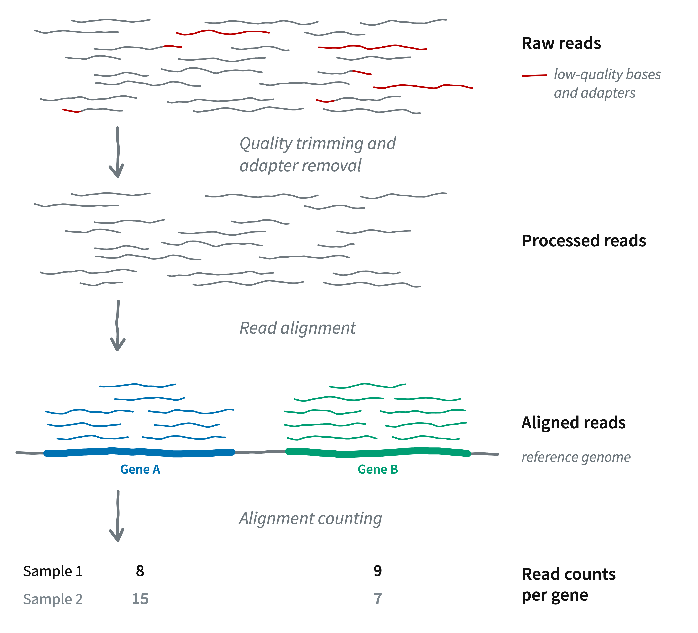

# Genomics (sequence) file types {background-color="#A7B1B7"}

## Overview

DNA and protein (amino acid) sequences and sequence annotations are mostly
stored in **plain-text** formats.
Some of the most common types, which you'll work with in this course, are:


::: {.columns}
::: {.column width="31%" .box-teal .fragment data-fragment-index="1"}

**FASTA**

- Simple sequence files, where each entry contains a header and a sequence.

- Versatile: may contain a few short sequences, entire genome assemblies,
  proteomes, ...

:::
::: {.column width="2%"}
:::
::: {.column width="31%" .box-amber .fragment data-fragment-index="2"}

**FASTQ**

- The standard format for **HTS reads**.

- Includes a quality score for each nucleotide.

:::
::: {.column width="2%"}
:::
::: {.column width="31%" .box-blue .fragment data-fragment-index="3"}

**GTF**/**GFF**

- A **(genome) annotation** format.

- Table with e.g. coordinates of genes and exons.

:::
:::

<hr style="height:1pt; visibility:hidden;" />

. . .

::: {.callout-note appearance="simple"}
Two other common formats are **SAM** and its binary equivalent **BAM**,
which are produced e.g. when you align reads to a genome.
:::

## FASTA files

FASTA files contain one or more DNA or amino acid sequences,\
with no limits on the number of sequences or the sequence lengths.

The following example FASTA file contains two entries:

```bash-out
>unique_sequence_ID Optional description
ATTCATTAAAGCAGTTTATTGGCTTAATGTACATCAGTGAAATCATAAATGCTAAAAA
>unique_sequence_ID2
ATTCATTAAAGCAGTTTATTGGCTTAATGTACATCAGTGAAATCATAAATGCTAAATG
```

. . .

<hr style="height:1pt; visibility:hidden;" />

Each entry contains a **header** and the **sequence** itself, where:

- **Header lines** start with a "`>`" and provide identifying information (metadata) for the sequence
- The **sequence** is often spread across multiple lines
  (with a fixed line width, e.g. 60 or 80 characters)

. . .

<hr style="height:1pt; visibility:hidden;" />

::: {.callout-note appearance="simple"}
FASTA files most commonly have a `.fa` or `.fasta` **file extension**.
Also used are extensions that make explicit whether the file contains
nucleotide (`.fna`) or amino acid sequences (`.faa`).
:::

## FASTQ files

FASTQ is the standard format for HTS reads.
**Each read forms one FASTQ entry** and is represented by four lines,
which contain, respectively:

. . .

1.  A **header** that starts with **`@`** and uniquely identifies the read
2.  The **sequence** itself
3.  A plus sign, **`+`**
4.  One-character **quality scores** for each base (hence the "Q" in FASTQ, for "quality")

. . .

{fig-align="center" width="100%" fig-alt="An annotated screenshot of two reads in a FASTQ file." .lightbox}

## FASTQ quality scores

The quality scores represent an estimate of the
**error probability of the base call**.

Specifically, they correspond to a numeric "Phred" quality score ($Q$),
which is a function of the estimated probability that a base call is erroneous ($P$):

$$
Q = -10 \log_{10}(P)
$$
<hr style="height:1pt; visibility:hidden;" />

. . .

Some specific probabilities and their rough qualitative interpretation for Illumina data:

| Phred score | Error probability | Rough interpretation |  [ASCII character]{style="color:white;"}   |
| :-----------------: | ----------------- | -------------------- | --- |
|       **10**        | 1 in 10           | terrible             |     |
|       **20**        | 1 in 100          | bad                  |     |
|       **30**        | 1 in 1,000        | good                 |     |
|       **40**        | 1 in 10,000       | excellent            |     |

: {.striped tbl-colwidths="[25, 25, 30, 20]"}

## FASTQ quality scores

The numeric Phred quality score is represented in FASTQ files
*not by the number itself*,
but by a corresponding "ASCII character".

This allows for a single-character representation of each possible score —
therefore,
**each quality score character can correspond to (and line up with) a base character**
in the read.

<hr style="height:1pt; visibility:hidden;" />

. . .

For example:

| Phred score | Error probability | Rough interpretation |  ASCII character |
|:---------------------:|-------------------|----------------------| ---|
| **10**              | 1 in 10           | terrible             | `+`             |
| **20**              | 1 in 100          | bad                  | `5`             |
| **30**              | 1 in 1,000        | good                 | `?`             |
| **40**              | 1 in 10,000       | excellent            | `I`             |

: {.striped tbl-colwidths="[25, 25, 30, 20]"}

## FASTQ quality scores

The numeric Phred quality score is represented in FASTQ files
*not by the number itself*,
but by a corresponding "ASCII character".

This allows for a single-character representation of each possible score —
therefore,
**each quality score character can correspond to (and line up with) a base character**
in the read.

<hr style="height:1pt; visibility:hidden;" />

{fig-align="center" width="100%" fig-alt="An annotated screenshot of two reads in a FASTQ file." .lightbox}

## FASTQ

While FASTQ files can be any size, separate files are typically used for:

::: {.columns}
::: {.column width="48%"}

- **Each read direction**\
  For paired-end data

  | Read direction | File name identifier |
  | -------------- | -------------------- |
  | Forward        | `_R1`                |
  | Reverse        | `_R2`                |

  : {.striped .hover}

:::
::: {.column width="4%"}
:::
::: {.column width="48%"}

- **Each sample**\
  Reads are normally "demultiplexed" into separate files for each sample.

:::
:::

. . .

<hr style="height:1pt; visibility:hidden;" />

Therefore,
paired-end FASTQ files for 2 samples usually look something like this:

::: {.columns}
::: {.column width="48%"}

``` bash
sample1_R1.fastq
sample1_R2.fastq
sample2_R1.fastq
sample2_R2.fastq
```

:::
::: {.column width="4%"}
:::
::: {.column width="48%"}

::: {.callout-tip appearance="simple"}
FASTQ files most commonly have a `.fastq` extension, and sometimes `.fq`.
:::

:::
:::

## GTF/GFF files

Genome annotations go in the highly similar, **tabular** GTF (`.gtf`) and GFF
(`.gff`) formats, with:

- One row for each annotated "**genomic feature**" (gene, exon, etc.)
- Columns with information like the genomic coordinates of the features

. . .

After a metadata header, the tabular part looks like this
(*column names added for clarity*):

```bash-out
seqname      source  feature     start   end     score  strand  frame    attributes
NC_068937.1  Gnomon  gene        2046    110808  .       +       .       gene_id "LOC120427725"; transcript_id ""; db_xref "GeneID:120427725"; description "homeotic protein deformed"; gbkey "Gene"; gene "LOC120427725"; gene_biotype "protein_coding";
NC_068937.1  Gnomon  transcript  2046    110808  .       +       .       gene_id "LOC120427725"; transcript_id "XM_052707445.1"; db_xref "GeneID:120427725"; gbkey "mRNA"; gene "LOC120427725"; model_evidence "Supporting evidence includes similarity to: 25 Proteins"; product "homeotic protein deformed, transcript variant X3"; transcript_biotype "mRNA";
NC_068937.1  Gnomon  exon        2046    2531    .       +       .       gene_id "LOC120427725"; transcript_id "XM_052707445.1"; db_xref "GeneID:120427725"; gene "LOC120427725"; model_evidence "Supporting evidence includes similarity to: 25 Proteins"; product "homeotic protein deformed, transcript variant X3"; transcript_biotype "mRNA"; exon_number "1";
NC_068937.1  Gnomon  exon        52113   52136   .       +       .       gene_id "LOC120427725"; transcript_id "XM_052707445.1"; db_xref "GeneID:120427725"; gene "LOC120427725"; model_evidence "Supporting evidence includes similarity to: 25 Proteins"; product "homeotic protein deformed, transcript variant X3"; transcript_biotype "mRNA"; exon_number "2";
```

. . .

::: callout-note
#### Details for a few columns:

- **_seqname_** --- Name of the chromosome, scaffold, or contig
- **_source_** --- Name of the program that generated this feature, or the data source (e.g. database)
- **_attributes_** --- A semicolon-separated list of key-value pairs with additional information
:::

::: footer
:::

# The course's main example dataset {background-color="#A7B1B7"}

## Garrigos et al. 2025

Throughout the course, we will use an example/practice data set
from @garrigós2025:

{fig-align="center" width="80%" fig-alt="A screenshot of the paper's front matter." .lightbox}

## Experimental design

This paper uses RNA-Seq data to study gene expression in *Culex pipiens* mosquitoes
infected with malaria-causing *Plasmodium* protozoans ---
specifically, it compares mosquitoes according to:

- **Infection status**: control vs. *Plasmodium cathemerium* vs. *P. relictum*
- **Time after infection**: 1 vs. 10 vs. 21 days (DAI)

. . .

<hr style="height:1pt; visibility:hidden;" />

The following numbers of biological replicates were used for each
treatment combination:

|        | Control | _P. cathemerium_ | _P. relictum_ |
|--------|:---------:|:--------:|:---------:|
| **01 DAI** |    3    |     3  |   4
| **10 DAI** |    4    |     4  |   4
| **21 DAI** |    4    |     4  |   3

: {.striped}

## The dataset's files

To keep things manageable while practicing,
I have **subset** the data to omit the 21-day samples and only keep 500,000
reads per FASTQ file.

. . .

<hr style="height:1pt; visibility:hidden;" />

All in all, the set of files,
[available through GitHub](https://github.com/jelmerp/garrigos-data),
consists of:

- **Reads** --- 44 paired-end, ~75-bp Illumina FASTQ files for 22 samples
- **Reference genome annotation** --- _Culex pipiens_ GTF file
- **Metadata** (sample data) --- A table with e.g. treatment info for each sample
- **README** --- A Markdown file describing the data set

<hr style="height:1pt; visibility:hidden;" />

. . .

::: {.callout-tip appearance="simple"}
We'll download the **reference genome assembly** FASTA file separately.
:::

. . .

<br>

***Next slide:** steps to obtain a count table from raw reads*

------

{fig-align="center" width="75%" fig-alt="A diagram of RNA-Seq analysis steps." .lightbox}

::: footer
:::

# Questions? {background-color="#A7B1B7" .unlisted}

<br><br>

[_Click here to go to the next lecture, [**Working with files in the Unix shell I**](./w4b_shell-files1.qmd)_]{style="display:block; text-align:center"}

## Bonus slide: RNA-Seq analysis steps

{fig-align="center" width="60%" fig-alt="A diagram showing the steps in an RNA-Seq analysis pipeline." .lightbox}

## References
