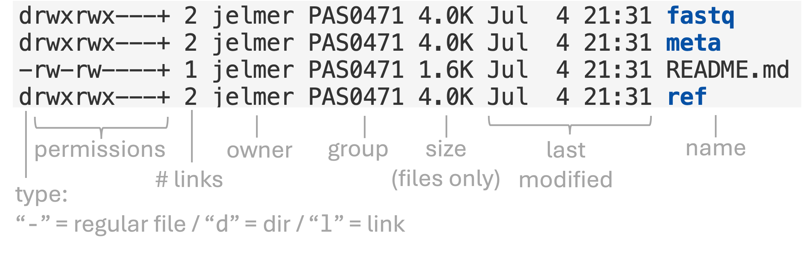

--------------------------------------------------------------------------------

<br>

## Introduction

### Overview & learning goals for this week's shell lectures

We'll pick up where we left off last week,
continuing with basic Unix shell commands.
We will focus on **commands that operate on files and dirs**.
Specifically, you will learn to use the Unix shell to:

- Create, copy, move, rename, and delete directories and files (**this lecture**)
- Select multiple files with a shell wildcard (**this lecture**)
- View the contents of text files in various ways ([next lecture](./w4c_shell-files2.qmd))
- Use redirection and the pipe to flexibly process the output of commands
  ([next lecture](./w4c_shell-files2.qmd))
- Search within, manipulate, and extract information from text files
  ([next lecture](./w4c_shell-files2.qmd))

### Lecture context & overview

GUI-based file browsers
(such as "Finder" on Mac, "File Explorer" on Windows,
and the interface we saw in OSC OnDemand's Files menu)
can perform operations like listing, creating, moving, renaming, copying, and
removing files and folders.
Here, you will learn to use Unix shell commands that can perform these actions.

**Why do I need to learn to do these relatively trivial tasks in the shell?** [🤨]{style="font-size:1.3em"}

1. This will help you to get more comfortable with working in the shell.
2. The general benefits of using code --- automation and reproducibility ---
   apply here too.
3. ***With practice, using the shell is faster and more powerful than a GUI file***
   ***browser*** (certainly at OSC).

(You may also run into situations where a GUI file browser is not available.)

### Getting ready

#### Start a VS Code session

Open a VS Code session in _exactly the same way as last week_:

1. Log in to OSC's OnDemand portal at <https://ondemand.osc.edu>.

2. In the blue top bar, select `Interactive Apps` and near the bottom,
   click `Code Server`.

3. Fill out the form as follows (these fields should be prefilled now --- just check them):
   - **Cluster**: `pitzer`
   - **Account**: `PAS3493`
   - **Number of hours**: `2`
   - **Working Directory**: `/fs/ess/PAS3493/people/<user>`
    (replace `<user>` with your user name)
   - **App Code Server version**: `4.129.0`

4. Click `Launch`, and in the next page, click the `Connect to VS Code` button once it appears.

5. In VS Code, **open a terminal** by either:
   - Clicking  &rarr; `Terminal` &rarr; `New Terminal`
   - Using the keyboard shortcut <kbd>Ctrl</kbd>+<kbd>`</kbd>

6. Check that you are in `/fs/ess/PAS3493/people/$USER`
   by typing `pwd` in the terminal.

   ::: {.callout-tip}
   #### Working dir check
   First, recall that `$USER` is a variable that represents your username.

   Second, if you're not in `/fs/ess/PAS3493/people/$USER`,
   it may be listed under `Recents` in the `Get Started` document ---
   if so, click on that entry.
   Otherwise, click `File` > `Open Folder` and type/select that path.
   :::

## Download the practice dataset

You will now download the practice/example dataset from @garrigós2025
that we've discussed.
Use the `git clone` command (there is a space between `git` and `clone`^[
`git` is a type of command that has "subcommands",
such as `clone` and many others. You will learn much more about Git next week.
])
to download a repository on GitHub that contains the practice dataset:

```bash
git clone https://github.com/cfaes-bioinfo/garrigos
```
```bash-out
Cloning into 'garrigos'...
remote: Enumerating objects: 52, done.
remote: Total 52 (delta 0), reused 0 (delta 0), pack-reused 52 (from 1)
Receiving objects: 100% (52/52), 945.76 MiB | 132.14 MiB/s, done.
Updating files: 100% (47/47), done.
```

This may take 10 or so seconds, since it will download almost 1 GB of data.
Next, navigate into the dir that was just downloaded:

```bash
cd garrigos/
```

::: {.callout-tip}
#### Trailing slash `/`
You don't need the trailing slash after the directory name, but it is allowed.
Since I will use Tab completion to complete the dir name,
and encourage you to do the same, the trailing slash is included in these examples.
:::

## `ls` and `tree` to list

### `ls`

The `ls` command, short for **list**, will list files and directories ---
by default those in your current working dir:

``` bash
ls
```
```{=html}
<pre class="bash-out"><code><span style="color: #0328fc;">fastq</span>  <span style="color: #0328fc;">meta</span>  <span style="color: black;">README.md</span>  <span style="color: #0328fc;">ref</span></code></pre>
```

`ls` uses different colors to indicate different types of files:

- Entries in **[blue]{style="color: #0328fc"}** are directories
  (`fastq`, `meta` and `ref` above).
- Entries in **black** (or white in dark themes) are regular files (`README.md` above).
- Entries in **[red]{style="color: #d92118"}** are compressed files
  (we'll see examples of this soon).

With `ls`, you can use:

- One or more **arguments** to change the dir (or file) it operates on
- One or more **options** to change how it shows the output

Let's start with an option, **`-l`** (lowercase L):

``` bash
ls -l
```
```{=html}
<pre class="bash-out"><code>total 2
drwxr-x---+ 2 jelmer PAS0471 4096 Sep 14 11:14 <span style="color: #0328fc;">fastq</span>
drwxr-x---+ 2 jelmer PAS0471 4096 Sep 14 11:14 <span style="color: #0328fc;">meta</span>
-rw-rw----+ 1 jelmer PAS0471 2856 Sep 14 11:14 README.md
drwxr-x---+ 2 jelmer PAS0471 4096 Sep 14 11:14 <span style="color: #0328fc;">ref</span></code></pre>
```

The same items as before were printed, but now **in a different format**:
one item per line,
with additional information such as the date and time that each file was last
modified, and the file sizes in bytes directly to the left of the date.
(The user name, project ID, and dates will differ in your output; my project ID is `PAS0471` ---
see the box below for more info.)

Let's add another option, **`-h`**:

``` bash
ls -lh
```
```{=html}
<pre class="bash-out"><code>total 2.0K
drwxr-x---+ 2 jelmer PAS0471 4.0K Sep 14 11:14 <span style="color: #0328fc;">fastq</span>
drwxr-x---+ 2 jelmer PAS0471 4.0K Sep 14 11:14 <span style="color: #0328fc;">meta</span>
-rw-rw----+ 1 jelmer PAS0471 2.8K Sep 14 11:14 README.md
drwxr-x---+ 2 jelmer PAS0471 4.0K Sep 14 11:14 <span style="color: #0328fc;">ref</span></code></pre>
```

<details class="details-quiz"><summary>
How does the output differ after adding `-h`, and what do you think that means? *(Click to see the answer)*</summary>

_The answer will be added after class._

<!----
The only difference is in the format of the column reporting the sizes of the
items listed.

We now have "Human-readable file sizes" (hence `-h`),
where sizes on the scale of kilobytes will be shown with `K`s,
of megabytes with `M`s, and of gigabytes with `G`s.
That can be useful especially for large files.
---->
</details>

::: {.callout-note collapse="true"}
#### Optional reading: More info about the columns in long-format `ls` output _(Click to expand)_

A _lot_ of information is shown in long-format `ls` output,
and it can be a bit overwhelming at first.
You'll learn to ignore the majority of columns, which are only relevant in specific contexts.

The following image shows what each column in long-format `ls` represents:

{fig-align="center" width="90%" fig-alt="An annotated screenshot of long-format ls output." .lightbox}

Some notes about the above:

- We will talk about file "**permissions**" later in the course.
- You can ignore the column with the "_number of links_",
  as this is not informative for regular users.
- Sizes shown for _directories_ unfortunately do not correspond to the total
  size of the dir and its contents.
  Basically, you should only pay attention to **sizes of _files_** when looking at
  long-format `ls` output (to get the total size of a dir, use `du -sh <dir>`).
- The default "**group**" for your account is the group shown for your Home dir.
  This is the group that will be assigned to any new files or directories you create.
  For me, it is `PAS0471` --- even when I create dirs and files in other locations,
  the default group will still be `PAS0471`.
  This has relevance for file permissions, which we will discuss later in the course.

Finally, the first line of long-format `ls` output (`total 2` / `total 2.0K` in
the examples above) gives an indication of the total size of files
that are directly located in this folder, i.e. not including those in subdirs.
:::

Moving on to **argument(s)** ---
to list the contents of one or more other dirs, specify these as arguments:

``` bash
# [Your output should show file names in red]
ls fastq/
```
```{=html}
<pre class="bash-out"><code><span style="color: #d92118;">S63_R1.fastq.gz</span>  <span style="color: #d92118;">S67_R1.fastq.gz</span>  <span style="color: #d92118;">S71_R1.fastq.gz</span>  <span style="color: #d92118;">S77_R1.fastq.gz</span>  <span style="color: #d92118;">S81_R1.fastq.gz</span>  <span style="color: #d92118;">S85_R1.fastq.gz</span><br><span style="color: #d92118;">S63_R2.fastq.gz</span>  <span style="color: #d92118;">S67_R2.fastq.gz</span>  <span style="color: #d92118;">S71_R2.fastq.gz</span>  <span style="color: #d92118;">S77_R2.fastq.gz</span>  <span style="color: #d92118;">S81_R2.fastq.gz</span>  <span style="color: #d92118;">S85_R2.fastq.gz</span><br><span style="color: #d92118;">S64_R1.fastq.gz</span>  <span style="color: #d92118;">S68_R1.fastq.gz</span>  <span style="color: #d92118;">S74_R1.fastq.gz</span>  <span style="color: #d92118;">S78_R1.fastq.gz</span>  <span style="color: #d92118;">S82_R1.fastq.gz</span>  <span style="color: #d92118;">S86_R1.fastq.gz</span><br><span style="color: #d92118;">S64_R2.fastq.gz</span>  <span style="color: #d92118;">S68_R2.fastq.gz</span>  <span style="color: #d92118;">S74_R2.fastq.gz</span>  <span style="color: #d92118;">S78_R2.fastq.gz</span>  <span style="color: #d92118;">S82_R2.fastq.gz</span>  <span style="color: #d92118;">S86_R2.fastq.gz</span><br><span style="color: #d92118;">S65_R1.fastq.gz</span>  <span style="color: #d92118;">S69_R1.fastq.gz</span>  <span style="color: #d92118;">S75_R1.fastq.gz</span>  <span style="color: #d92118;">S79_R1.fastq.gz</span>  <span style="color: #d92118;">S83_R1.fastq.gz</span><br><span style="color: #d92118;">S65_R2.fastq.gz</span>  <span style="color: #d92118;">S69_R2.fastq.gz</span>  <span style="color: #d92118;">S75_R2.fastq.gz</span>  <span style="color: #d92118;">S79_R2.fastq.gz</span>  <span style="color: #d92118;">S83_R2.fastq.gz</span><br><span style="color: #d92118;">S66_R1.fastq.gz</span>  <span style="color: #d92118;">S70_R1.fastq.gz</span>  <span style="color: #d92118;">S76_R1.fastq.gz</span>  <span style="color: #d92118;">S80_R1.fastq.gz</span>  <span style="color: #d92118;">S84_R1.fastq.gz</span><br><span style="color: #d92118;">S66_R2.fastq.gz</span>  <span style="color: #d92118;">S70_R2.fastq.gz</span>  <span style="color: #d92118;">S76_R2.fastq.gz</span>  <span style="color: #d92118;">S80_R2.fastq.gz</span>  <span style="color: #d92118;">S84_R2.fastq.gz</span></code></pre>
```

And like you saw last week with `cal`, options and arguments can be combined:

``` bash
ls -lh fastq/
```
```{=html}
<pre class="bash-out"><code>total 941M
-rw-r-----+ 1 jelmer PAS0471 21M Nov 13  2024 <span style="color: #d92118;">S63_R1.fastq.gz</span>
-rw-r-----+ 1 jelmer PAS0471 22M Nov 13  2024 <span style="color: #d92118;">S63_R2.fastq.gz</span>
-rw-r-----+ 1 jelmer PAS0471 21M Nov 13  2024 <span style="color: #d92118;">S64_R1.fastq.gz</span>
-rw-r-----+ 1 jelmer PAS0471 22M Nov 13  2024 <span style="color: #d92118;">S64_R2.fastq.gz</span>
-rw-r-----+ 1 jelmer PAS0471 22M Nov 13  2024 <span style="color: #d92118;">S65_R1.fastq.gz</span>
-rw-r-----+ 1 jelmer PAS0471 22M Nov 13  2024 <span style="color: #d92118;">S65_R2.fastq.gz</span>
# [...output truncated...]</code></pre>
```

Some notes about these FASTQ files:

- They are printed in **[red]{style="color: #d92118"}** because they are compressed,
  as the added `.gz` extension also indicates.
- There are two files per sample: `_R1` (forward reads) and `_R2` (reverse reads).
- The files are ~21-22 MB in size ---
  much smaller than the original file sizes (~1-2 GB) because they were subsampled.

::: exercise
####  Exercise 1: Listing a single file

If you want to check the size of a single file,
it may not be convenient to list all of a dir's contents.
Can you get `ls` to show you the file size **only** for the `S65_R2.fastq.gz` file?

<details><summary>  *Click to see the solution.*</summary>

The argument to `ls` can be a path of any kind,
including to a file rather than to a dir:

```bash
ls -lh fastq/S65_R2.fastq.gz
```
```{=html}
<pre class="bash-out"><code>-rw-r-----+ 1 jelmer PAS0471 22M Nov 13  2024 fastq/<span style="color: #d92118;">S65_R2.fastq.gz</span></code></pre>
```
</details>
:::

### `tree` to recursively list files in tree-like format

By default, `ls` is not **"recursive"**,
which means that it only shows results for **one directory level**.
Compare that with the output of the `tree` command,
which gives a nice recursive overview in a simple tree-like format:

```bash
tree
```
```{=html}
<pre class="bash-out"><code>.
├── <span style="color: #0328fc;">fastq</span>
│   ├── <span style="color: #d92118;">S63_R1.fastq.gz</span>
│   ├── <span style="color: #d92118;">S63_R2.fastq.gz</span>
│   ├── <span style="color: #d92118;">S64_R1.fastq.gz</span>
│   ├── <span style="color: #d92118;">S64_R2.fastq.gz</span>
│   ├── <span style="color: #d92118;">S65_R1.fastq.gz</span>
│   ├── <span style="color: #d92118;">S65_R2.fastq.gz</span>
│   └── [...other FASTQ files not shown...]
├── <span style="color: #0328fc;">meta</span>
│   └── metadata.tsv
├── README.md
└── <span style="color: #0328fc;">ref</span>
    └── <span style="color: #d92118;">annot.gtf.gz</span>

3 directories, 47 files</code></pre>
```

Let's take a step back and consider what's in our dataset:

- 44 FASTQ files with RNA-Seq reads for 22 samples (in the `fastq` dir).
- A metadata file with treatment group info for each sample (in the `meta` dir).
- A `README.md` Markdown file.
- A GTF annotation file for the reference genome (in the `ref` dir).

We will take a closer look at these files this week and in the weeks to come.

## `mkdir` and `touch` to create dirs and files

### `mkdir` to create new directories

The `mkdir` command creates one or more new directories.
Let's create a dir for this week and navigate there:

```bash
mkdir ../week04
cd ../week04/
```

By default, `mkdir` is not recursive either:
it won't create a dir inside a dir that doesn't exist yet.
The `-p` option is needed to **enable recursive behavior**:

```bash
mkdir -p sandbox/jar
```

This command was recursive because both the `sandbox` dir and the
`jar` dir within it had to be created at once.
The name `sandbox` is common for dirs meant for experimentation and testing.
Now, navigate into the `sandbox` dir you just created:

```bash
cd sandbox/
ls
```
```{=html}
<pre class="bash-out"><code><span style="color: #0328fc;">jar</span></code></pre>
```

For the rest of this lecture and most of the next one,
you'll work inside this `sandbox` dir, so let's take a moment to look at the layout:

```bash-out-solo
/fs/ess/PAS3493/people/$USER
├── garrigos           <- The practice dataset: only read from it, don't change it
│   ├── fastq
│   ├── meta
│   └── ref
└── week04             <- Your dir for this week
    └── sandbox        <- Your working dir for the rest of this week's classes
        └── jar
```

::: exercise
####  Exercise 2: `mkdir` and recursiveness

What do you think the following `mkdir` command does,
and would you consider that recursive?
Then, run the command and see what it did.

```bash
mkdir cup pot
```

<details><summary>  &nbsp; _Click to see the answer._</summary>

This command created two dirs at once.
It is **not** recursive, because it only operated on one "dir level",
i.e. it did not need to create two dir levels
(or put another way, it did not create a dir within a dir).

```bash
ls
```
```{=html}
<pre class="bash-out"><code><span style="color: #0328fc;">cup</span>  <span style="color: #0328fc;">jar</span>  <span style="color: #0328fc;">pot</span></code></pre>
```
</details>
:::

::: {.callout-note collapse="true"}
#### Self-study: what else does the `-p` option to `mkdir` do? _(Click to expand)_

Run the below two commands one by one,
and read any output the commands print to the screen.
Why does the first command fail?
What can you conclude about the `-p` option other than that it enables recursiveness?

```bash
mkdir jar/
mkdir -p jar/
```

<details><summary>  &nbsp; _Click to see the answer._</summary>

- `mkdir jar/` produces an error,
  because you're trying to create a dir that already exists:

  ```bash
  mkdir jar/
  ```
  ```bash-out
  mkdir: cannot create directory 'jar/': File exists
  ```

- While `mkdir -p jar/` doesn't print anything:

  ```bash
  mkdir -p jar/
  ```

- The latter may either mean that `mkdir -p` recreated the dir,
  or that it did nothing but also didn't complain.
  Here's the answer: `mkdir -p` doesn't do anything when
  the dir already exists, and won't produce an error either.
  We'll come back to why that is useful when we start writing shell scripts.

</details>

<hr style="height:1pt; visibility:hidden;" />

:::

### `touch` to create a new file

To create new, empty files, use the `touch` command,
specifying the file name(s) as the argument(s):

```bash
# Create a single new file called apple.txt
touch apple.txt

# Create two additional files:
touch fig.txt kiwi.txt
```

::: callout-tip
#### Operating on multiple files
As you just saw, both `mkdir` and `touch` can take multiple arguments.
Notably, almost all shell commands that operate on files and/or dirs
**can operate on multiple (many!) files at a time**,
which is one reason that using these commands can be highly efficient.
That's especially true once you know how to select/specify many files at once
using shortcuts known as wildcards (later in this lecture).
:::

::: exercise
####  Exercise 3: Creating a file in a new dir

Create a new file `mango.txt` inside a new dir `box`.
Don't change your working dir while you're doing this.

<details><summary>  &nbsp; _Click to see the answer._</summary>

To make a new dir and create a file in there,
you can't just use the `touch` command,
as it cannot create the directory for you
(pay attention to the error, which may seem a bit confusing):

```bash
touch box/mango.txt
```
```bash-out
touch: cannot touch 'box/mango.txt': No such file or directory
```

Instead, you first have to create the new dir with `mkdir`,
and _then_ create the new file in there:

```bash
mkdir box
touch box/mango.txt
```
</details>
:::

## `cp` to copy

The `cp` command copies files and/or dirs from one location to another.
Just like when copying files in a GUI file browser,
the new copy can have a different name than the original ---
or the same name, as long as it's copied to a different dir.

`cp` has two **required arguments** in the following order:

1. What you want to copy (**source** path)
2. Where you want to copy it to (**destination** path)

That is, its basic syntax is `cp <source path> <destination path>`.

::: callout-note
#### Recap: The meaning of `<...>` notation
Recall that when I use `< >` around text in a line of code,
that text is **descriptive** rather than literal, and has to be replaced.
In this example, `<source path>` should be replaced in an actual line of code by
whatever "source" you want to use, and likewise for the `<destination path>`.
:::

#### Basic examples

- Same directory, different file name:

  ```bash
  cp kiwi.txt kiwi_copy.txt
  ```

- Different directory, same file name:

  ```bash
  cp kiwi.txt jar/
  ```

- Different directory, different file name:

  ```bash
  cp kiwi.txt jar/kiwi_backup.txt
  ```

In other words: if the destination is an existing dir, the copy is placed inside
it with its original name --- otherwise, the destination is the name of the copy.

#### Copying into your working dir without changing the name

It's common to copy a file from elsewhere into your working dir while keeping its name.
Instead of typing out the file name in the destination path,
you can use the `.` shortcut to refer to your current working dir:

```bash
# Equivalent to: cp jar/kiwi_backup.txt kiwi_backup.txt
cp jar/kiwi_backup.txt .
```

Check the contents of the `sandbox` dir:

```bash
ls
```
```{=html}
<pre class="bash-out"><code>apple.txt  <span style="color: #0328fc;">box</span>  <span style="color: #0328fc;">cup</span>  fig.txt  <span style="color: #0328fc;">jar</span>  kiwi_backup.txt  kiwi_copy.txt  kiwi.txt  <span style="color: #0328fc;">pot</span></code></pre>
```

:::callout-tip
#### Use Tab completion when typing paths to existing files!
You will be much faster and less likely to have typos in your paths
when you consistently use Tab completion.
:::

#### Copying dirs and their contents

Finally, `cp` will by default refuse to copy directories and their contents ---
that is, like `ls` and `mkdir`, it is not **recursive**^[
For better or worse, non-recursiveness in shell commands is meant as a sort of safety mechanism,
since it makes it harder to accidentally operate on very large amounts of data.]:

```bash
cp jar/ jar_copy
```
```bash-out
cp: -r not specified; omitting directory 'jar/'
```

The `-r` option is needed for recursive copying:

```bash
cp -r jar/ jar_copy
ls jar_copy/
```
```bash-out
kiwi_backup.txt  kiwi.txt
```

## `mv` to move and rename

**Moving** a file versus **renaming** it is fundamentally the same operation:
in both cases, you are **changing its path**.
That is because both a file's name (e.g. `mango.txt`) and the dir it is inside
(`box/`) are part of its path (`box/mango.txt`).

As such, the **`mv`** command can be used to move files, rename them,
or do both at the same time --- the same three scenarios you saw with `cp`:

- Same directory, different file name ("renaming"):

  ```bash
  mv kiwi_copy.txt plum.txt
  ```

- Different directory, same file name ("moving"):

  ```bash
  # (cup/ is the dir you created in Exercise 2)
  mv plum.txt cup/
  ```

- Different directory, different file name ("moving + renaming"):

  ```bash
  mv kiwi_backup.txt cup/kiwi_old.txt
  ```

Finally, note that unlike `cp`, the `mv` command does not need an `-r` option to move or rename dirs!

::: callout-tip
#### Both the `mv` and `cp` commands will by default:

- Not report what they do: no output = success
  (use the **`-v` option for _verbose_** to make them report what they do).
- Overwrite existing files without reporting this
  (use the **`-i` option for _interactive_** to make them ask before overwriting).
:::

::: {.callout-note collapse="true"}
#### Operating on multiple files with `mv` and `cp` _(Click to expand)_

You can move or copy multiple files at once with `mv` and `cp`.
If you give these commands more than two arguments,
the **last argument is the destination**,
which must then be an existing dir --- for example:

```bash
cp <source1> <source2> <destination>
mv <source1> <source2> <source3> <source4> <destination>
```
:::

## `rm` to remove

The **`rm`** command removes files and optionally dirs.
First, let's remove one of the dummy files you created above:

```bash
rm apple.txt
```

Like with `cp`, the **`-r`** option is needed to make the command work recursively:

```bash
# (box/ is the dir you created in Exercise 3)
rm box/
```
```bash-out
rm: cannot remove 'box/': Is a directory
```

```bash
# (This produces no output if it works)
rm -r box/
```

::: {.callout-warning collapse="true"}
#### There is no trash bin when deleting files in the shell, so use `rm` with caution! _(Click to expand)_

`rm -r` can be very dangerous ---
for example, the command `rm -r /` would try to remove the entire contents
of the computer, including the operating system
(luckily, `rm` nowadays refuses this particular command ---
but it will not stop you from e.g. wiping your entire home dir with `rm -r ~`).
A couple of ways to take precautions:

- You can add the `-i` option,
  which will make you confirm each individual removal (can be tedious).
- When you intend to remove an _empty_ dir, you can use the `rmdir` command.
  This command fails on non-empty dirs.
:::

::: exercise
####  Exercise 4: Spaces in file names --- what could go wrong?

Consider the following hypothetical scenario:

- You have a dir called `data` with important raw data,
  and a dir called `extra data` with additional data.

  ```bash
  # [Hypothetical - don't run]
  ls
  ```
  ```bash-out
  data  'extra data'
  ```

- You realize you won't need the additional data at all,
  so you try to remove the `extra data` dir with the following command:

  ```bash
  # [Hypothetical - don't run]
  rm -r extra data
  ```

What do you expect would happen when that last command is run?

A) The `extra data` dir is removed, as intended.
B) Nothing is removed, and `rm` gives an error because there is no `extra` dir.
C) The `data` dir is removed, and `rm` gives an error because there is no `extra` dir.
D) Both the `data` and `extra data` dirs are removed.

<!-----
<details><summary>  &nbsp; _Click to see the answer._</summary>

The correct answer is **C**.

Because the space in the dir name was not "escaped"
(for example, by quoting the name: `rm -r "extra data"`),
`rm` will interpret `extra` and `data` as two separate arguments,
i.e. as two separate files/dirs to remove.

Therefore, the `rm` command will not remove the `extra data` dir,
but it will remove the `data` dir ---
now your project's raw data has been erased! 😳

(Additionally, it will produce an error because it cannot find the `extra` dir.
But this error does not stop `rm` from moving on to the next argument.)

</details>

<hr style="height:1pt; visibility:hidden;" />
---->

:::

## Wildcard expansion (globbing)

Shell wildcard expansion is a very useful technique to select multiple files,
where **wildcards** are **characters with a special meaning**.
To practice with this,
start by creating some dummy FASTQ files in your `sandbox` dir:

```bash
# (Copy-and-paste this into the shell rather than typing it out)
touch sample1_R1.fastq sample1_R2.fastq
touch sample2_R1.fastq sample2_R2.fastq
touch sample3_R1.fastq sample3_R2.fastq
```

```bash
ls
```
```{=html}
<pre class="bash-out"><code><span style="color: #0328fc;">cup</span>  fig.txt  <span style="color: #0328fc;">jar</span>  <span style="color: #0328fc;">jar_copy</span>  kiwi.txt  <span style="color: #0328fc;">pot</span>  sample1_R1.fastq  sample1_R2.fastq<br>sample2_R1.fastq  sample2_R2.fastq  sample3_R1.fastq  sample3_R2.fastq</code></pre>
```

The most commonly used wildcard is `*`,
which matches **any number of any combination of characters**
(including "nothing" --- the absence of any characters).
For example, you can match only the two `sample1` files with a `*` using:

```bash
# This matches files that start with "sample1"
ls sample1*
```
```bash-out
sample1_R1.fastq  sample1_R2.fastq
```

Selecting files with wildcard expansion is called **globbing**.
When globbing, the pattern has to **match the entire file name** ---
therefore, the following doesn't match anything:

```bash
# This matches files that *end* in R1, but there are no such files:
ls *R1
```
```bash-out
ls: cannot access '*R1': No such file or directory
```

So, if the text we use for matching is in the middle of the file name,
like `R1`, we need a `*` on **both sides** of it:

```bash
# This matches files that *contain*, anywhere in their names, "R1":
ls *R1*
```
```bash-out
sample1_R1.fastq  sample2_R1.fastq  sample3_R1.fastq
```

In summary:

| Pattern        | Matches files whose names...
|----------------|---------------------------|
| `sample1*`     | [start with]{.underline} "sample1"
| `*.fastq`      | [end with]{.underline} ".fastq"
| `*_R1*`        | [contain]{.underline} "\_R1"
| `*`            | _(matches all files and dirs in the working dir)_^[Except so-called hidden files, whose names start with a `.`.]

: {.striped .hover}

<hr style="height:1pt; visibility:hidden;" />

::: exercise
####  Exercise 5: File matching

a. Which files does `ls *samp*le*` match? Make a prediction before you try it.

   <!----
   <details><summary>  &nbsp; _Click to see the answer._</summary>

   It matches all the FASTQ files, because:

   - All the FASTQ file names start with `sample`.
   - Since `*` also matches "zero characters", there is no requirement for the
     presence of characters at the locations of the "unnecessary" `*`s.
   </details>
   ---->

b. Create two new files called `sample1.txt` and `sample2.txt` in the current working dir.
   Then, only match the two FASTQ files for sample1 ---
   that is, avoid matching these new `.txt` files.

   <!----
   <details><summary>  &nbsp; _Click to see the answer._</summary>

   First we create the files:

   ```bash
   touch sample1.txt sample2.txt
   ```

   Then we match only the two FASTQ files --- the code below means
   any file that starts with "sample1" and ends with "fastq":

   ```bash
   ls sample1*fastq
   ```
   ```bash-out
   sample1_R1.fastq  sample1_R2.fastq
   ```
   </details>
   ---->
:::

#### Expansion is done by the shell itself

The "expansion" of a wildcard to matching file names is **done by the shell itself**,
not by `ls` --- or by any other command you might be using wildcards with.
Therefore, a command like `ls` receives the list of files
**after the expansion has already happened.**
When you type...

```bash
ls sample1*fastq
```

...the shell will perform wildcard expansion before it runs the `ls` command.
As such, the `ls` command will not see the `*` wildcard at all^[
If nothing matches, the shell leaves the pattern as is ---
which is why the error message for `ls *R1` above showed `*R1` literally.],
and be run as follows:

```bash
ls sample1_R1.fastq sample1_R2.fastq
```

#### Practical examples

Because the expansion is done by the shell,
wildcard expansion works with any command that accepts multiple paths as arguments,
such as copy (`cp`), move (`mv`), and remove (`rm`).
For example, we can:

- Remove any stray `.txt` files at once using `rm -v *.txt`,
  where we add the `-v` option to make `rm` report what it is removing:

  ```bash
  rm -v *.txt
  ```
  ```bash-out
  removed 'fig.txt'
  removed 'kiwi.txt'
  removed 'sample1.txt'
  removed 'sample2.txt'
  ```

- Move all FASTQ files at once using:

  ```bash
  mkdir fastq_files
  mv -v *fastq fastq_files/
  ```
  ```bash-out
  renamed 'sample1_R1.fastq' -> 'fastq_files/sample1_R1.fastq'
  renamed 'sample1_R2.fastq' -> 'fastq_files/sample1_R2.fastq'
  renamed 'sample2_R1.fastq' -> 'fastq_files/sample2_R1.fastq'
  renamed 'sample2_R2.fastq' -> 'fastq_files/sample2_R2.fastq'
  renamed 'sample3_R1.fastq' -> 'fastq_files/sample3_R1.fastq'
  renamed 'sample3_R2.fastq' -> 'fastq_files/sample3_R2.fastq'
  ```

Globbing is incredibly useful for working with large numbers of files,
and is one of the reasons that shell commands are so powerful and efficient.
Later on, you'll use it, for example,
to iterate over all FASTQ files in a dir to run a command on each of them.

<hr style="height:1pt; visibility:hidden;" />
