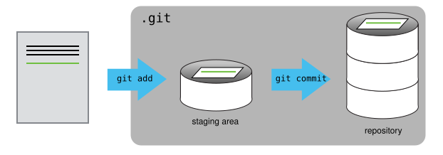

# Introduction {background-color="#A7B1B7"}

## Learning goals

**In this lecture, you'll learn:**

- Why it's a good idea to use a formal Version Control System
  for research projects
- Key Git concepts and terminology such as _repositories_ and _commits_
- An overview of the basic Git workflow

. . .

 

::: {.callout-tip appearance="simple"}
This lecture covers Git **concepts**,
and we'll put them into practice [in the next one](./w5b_git.qmd).
:::

# Version control {background-color="#A7B1B7"}

## Why use a Version Control System?

During a research project, your files will constantly change. Ideally, you can:

- Keep earlier versions of your files
- See what changed between them,
- Go back (e.g., after accidentally overwriting a file,
  or when a script stops working)

. . .

Modern cloud storage solutions (OneDrive, Dropbox, etc.) help.
You can restore automatically saved earlier versions of individual files,
and work simultaneously on files with collaborators.

## Why use a Version Control System?

However, with a formal Version Control System,
it's also or better possible to:

::: {.columns}
::: {.column .fragment data-fragment-index="1" width="44%"}

### [General benefits]{style="display:block; text-align:center;"}

- Go back to past states of your entire project, not just individual files.
- See your history of changes.

:::
::: {.column width="6%"}

:::

::: {.column .fragment data-fragment-index="2" width="50%"}

### [Code-related benefits]{style="display:block; text-align:center;"}

- Use it on remote servers like OSC.
- Publicly (or privately) share your code.
- Make experimental changes without affecting current functionality.
- See and undo changes that AI coding assistants made to your code.

:::
:::

::: {.fragment data-fragment-index="3"}

> *Version control is a way to keep your scientific projects tidily organized,*
> *collaborate on science, and have the whole history of each project at your fingertips.*
>
> --- @allesina2019, Chapter 2

:::

::: footer
:::

## How Git works

**Git** is the most widely used Version Control System.
Git maintains a database in which you save "snapshots" of your project
with every minor piece of progress.

. . .

It manages this cleverly without having to create full copies of the project for every snapshot:

{fig-align="center" width="80%" fig-alt="A diagram showing how Git saves project snapshots." .lightbox}

::: legend2
The boxes with dashed lines depict files that have not changed: these will not be saved repeatedly. Figure from <https://git-scm.com>.
:::

::: footer
:::

## Key Git term #1: Repository (repo)

A Git **repository** (or "repo") is the **version-control database** for a project.

::: {.columns}
::: {.column width="47%" .fragment data-fragment-index="1"}

### [Organization]{style="display:block; text-align:center;"}

- One Git repository manages files inside a **single directory structure**.

- It is typical (and recommended) to have one Git repository for each research project.

::: {.callout-tip .fragment data-fragment-index="2" appearance="simple"}
To use Git effectively, having separate directories for each project,
as discussed in week 2, is important.

Within folders, systematic file organization also makes Git easier to work with.
:::

:::

::: {.column width="5%"}

:::

::: {.column width="47%" .fragment data-fragment-index="3"}

### [Practically speaking]{style="display:block; text-align:center;"}

- You can start a Git repository in any dir you have write access to.

- The database is saved in a hidden dir (**`.git`**) in the dir where you started
  the repo.

. . .

::: {.callout-note appearance="simple"}
A file or dir name that starts with a **`.`**, like in `.git`, is **hidden**.

These don't show up in file browsers or `ls` listings by default.
:::

:::
:::

::: footer
:::

## Key Git term #2: Commit

A Git "commit" is a **saved snapshot** of the project. Note that:

- You can always go back to the state of the entire project,
  or of individual files, at any commit.
- You make commits **manually** ---
  Git is not an automated backup system, and this is by design!

## What to version-control?

You should primarily put **manually edited** files under version control.
That is, version-control changeable source files, but not derived files.
For instance:

- Version-control your Markdown file, not the HTML it produces.
- Version-control your script, not the output it produces.

. . .

::: callout-tip
#### Derived files
Recall from week 2 that results and other derived files in essence
are (or should be) *dispensable*,
because they can be regenerated using the raw data and the scripts.

Therefore, version-controlling derived files is usually unnecessary and would lead
to bloated repositories.
:::

## File limitations

There are some limitations to the types and sizes of files that can be committed with Git:

::: {.columns}
::: {.column width="30%" .box-blue .fragment data-fragment-index="1"}
### File type

- Binary (non-text) files, such as Word or Excel files, or compiled software, can be included,
  but:

- Git can't show line-by-line changes for them like it can for plain-text files.

:::
::: {.column width="3%"}
:::
::: {.column width="30%" .box-amber .fragment data-fragment-index="2"}
### Repository size

For performance reasons, it's best to keep individual repositories under about 1 GB.

:::
::: {.column width="3%"}
:::
::: {.column width="30%" .box-teal .fragment data-fragment-index="3"}
### File size

Git itself doesn't limit file sizes, but GitHub (Wednesday) blocks files >100 MB.

:::
:::

## Putting it together: what to include

::: {.columns}
::: {.column width="44%"}

### [Put under version control]{style="display:block; text-align:center;"}

- **Scripts** (and any other source code)
- **Documentation** files of your project

And optionally:

- **Metadata** (e.g., sample information)
- **Manuscripts**, especially when writing in a plain text format

:::
::: {.column width="5%"}

:::

::: {.column width="50%" .fragment data-fragment-index="1"}

### [Don't put under version control]{style="display:block; text-align:center;"}

- **Results**
- **Data**, in most cases

. . .

::: {.callout-note}
#### More on sharing data
Small datasets may be appealing to add,
e.g. because this is an easy way to share them.

That can be OK even if it's not exactly what Git is designed for ---
but for large omics datasets, it is often simply not feasible.
**Specialized repositories** exist and we'll talk about them later in the course.
:::

:::
:::

## Quiz: Commit or not?

Your project directory contains the files below.
Which ones should you put under version control?

a) `scripts/trim.sh` --- a script you wrote
b) `README.md` --- your project's documentation
c) `results/trim/sampleA.fastq.gz` --- output from your trimming script
d) `README.html` --- rendered from `README.md`

<!-----

::: callout-tip
#### Answer
**a)** and **b)**: these are files you edit by hand.
**c)** and **d)** are derived files: you can always regenerate them from the script
or the Markdown file.
:::
------>

## User Interfaces for Git

::: {.columns}
::: {.column width="47%"}

### [Ways to work with Git]{style="display:block; text-align:center;"}

- The native command-line interface (CLI).
- Third-party graphical user interfaces (GUIs) such as GitHub Desktop.
- IDEs with Git integration like RStudio and VS Code.

:::
::: {.column width="5%"}

:::
::: {.column width="47%" .fragment data-fragment-index="1"}

### [What we'll use in this course]{style="display:block; text-align:center;"}

- We will **focus on the CLI** because it's the most universal and powerful interface.

- But you can switch to GUI usage later:
  - This is not a hard switch to make.
  - We recommend to use the VS Code integration, and will briefly show this.

:::
:::

. . .

::: callout-note
#### Stick with it!
Git takes some getting used to, regardless of the interface ---
the main difficulties are conceptual, not technical.
Many people have "false starts" with it,
but in this course we try to get you past that.

This is also an area where GenAI can be _really_ helpful!
:::

::: footer
:::

# The basic Git workflow {background-color="#A7B1B7"}

## The basic Git workflow

Git commands always start with `git` followed by a second command/subcommand or "verb": `git add`,
`git commit`, etc. Only three commands tend to make up the vast majority of your Git work:

::: {.columns}
::: {.column width="30%" .box-blue .fragment data-fragment-index="1"}
### `git add`

Does two things:

1. Start "**tracking**" files
   (files in your dir are _not_ automatically included in the repo!).
2. "**Staging**" files: mark changed and new files as ready to be committed.

:::
::: {.column width="3%"}
:::
::: {.column width="30%" .box-amber .fragment data-fragment-index="2"}
### `git commit`

Create a new **snapshot** of the project that includes all currently staged changes.

:::
::: {.column width="3%"}
:::
::: {.column width="30%" .box-teal .fragment data-fragment-index="3"}
### `git status`

Get the **status** of your repo:

- Which files have changed
- Which new files are present
- Tips on next steps, etc.

:::
:::

## The basic Git workflow

Adding and committing changes with Git commands:

{fig-align="center" width="100%" fig-alt="A diagram of the process of adding and committing changes with Git commands." .lightbox}

::: legend2
The Git database, which is in a hidden folder `.git`, is depicted with a gray background.
:::

# Questions? {background-color="#A7B1B7" .unlisted}

  

[_Click here to continue with today's hands-on practice: [**Version control with Git**](./w5b_git.qmd)_]{style="display:block; text-align:center"}

## References
