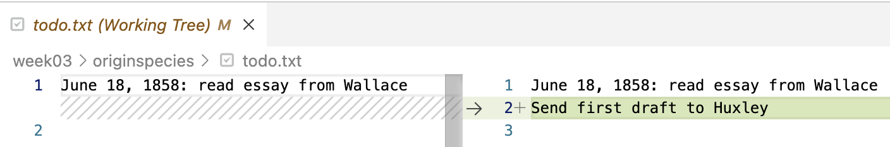

----------------------------------------------------------------------------------------------------

<br>

## Introduction

This is the hands-on continuation of today's lecture on version control with Git.

### Learning goals for this lecture

- Learn the basic Git workflow and basic Git commands
- Make Git ignore specific files and dirs
- Show the changes you've made to files
- Move and remove files that are tracked by Git
- Undo accidental changes to your files

### Getting ready

#### Start a VS Code session

Start a VS Code session like you've done before.

<details><summary>  _Click here to see the instructions_</summary>

1. Log in to OSC's OnDemand portal at <https://ondemand.osc.edu>.

2. In the blue top bar, select `Interactive Apps` and near the bottom,
   click `Code Server`.

3. Fill out the form as follows (as necessary --- should be prefilled now!):
   - **Cluster**: `pitzer`
   - **Account**: `PAS3493`
   - **Number of hours**: `2`
   - **Working Directory**: `/fs/ess/PAS3493/people/<user>`
    (replace `<user>` with your user name)
   - **App Code Server version**: `4.129.0`

4. Click `Launch`, and in the next page, click the `Connect to VS Code` button once it appears.

5. In VS Code, **open a terminal** by either:
   - Clicking  &rarr; `Terminal` &rarr; `New Terminal`
   - Using the keyboard shortcut <kbd>Ctrl</kbd>+<kbd>`</kbd>

6. Check that you are in `/fs/ess/PAS3493/people/$USER`
   by typing `pwd` in the terminal.

   ::: {.callout-tip appearance="simple"}
   Recall that `$USER` is a variable that represents your username.

   If you're not in `/fs/ess/PAS3493/people/$USER`,
   it may be listed under `Recents` in the `Get Started` document ---
   if so, click on that entry.
   Otherwise, click `File` > `Open Folder` and type/select that path.
   :::

</details>

#### Create a dir for this week and navigate there

```bash
mkdir week05
cd week05
```

#### Open a Markdown file for notes

You may want to create and open a Markdown file to keep class notes:

```bash
# After this command, click on the file name in the file explorer to open it:
touch lectureB.md
```

## One-time Git configuration

We will start with one-time personal Git configuration.
This will apply anywhere on OSC,
and won't ever have to be redone unless you want to make changes.

These steps are all done with `git config --global`:

1. Make your name known to Git ---
   your actual first and last name (*not your OSC or GitHub username!*):

   ```sh
   git config --global user.name 'John Doe'
   ```

2. Make your email address known
   (_should match the address associated with your GitHub account_):

   ```sh
   git config --global user.email 'doe.391@osu.edu'
   ```

3. Set a default text editor for Git.
   (Git will occasionally^[
   When you need to provide a "commit message"
   and haven't entered one on the command line.]
   open a text editor for you. Even though we're using VS Code,
   here it is better to select a text editor that runs in the shell,
   like `nano`^[
   The default editor is `vi`/`vim`, which is more complicated and,
   for example, notoriously hard to exit for beginners.].)

   ```sh
   git config --global core.editor "nano -w"
   ```

4. Change the default "branch" name to `main`
   (Git's own default is still `master`, whereas GitHub uses `main`):

   ```sh
   git config --global init.defaultbranch main
   ```

5. Finally, check whether you successfully changed the settings:

   ```sh
   git config --global --list
   ```
   ```bash-out
   user.name=John Doe
   user.email=doe.391@osu.edu
   core.editor=nano -w
   init.defaultbranch=main
   ```

## Your first Git repository

You'll create a Git repository for a mock book project:
writing Charles Darwin's "On the Origin of Species"
(this content follows chapter 2 in @allesina2019).

### Start a new Git repository

Create a new dir for a mock project that you will version-control with Git,
and navigate there:

``` sh
# (Your starting point should be /fs/ess/PAS3493/people/$USER/week05)
mkdir originspecies
cd originspecies
```

The command to **initialize a new Git repository is `git init`** ---
use that to start a repo for the `originspecies` dir:

``` sh
git init
```
``` bash-out
Initialized empty Git repository in /fs/ess/PAS3493/people/jelmer/week05/originspecies/.git/
```

Can we confirm that the Git repo dir is there?

```bash
# The -a option to ls will also show hidden files
ls -a
```
```bash-out
.  ..  .git
```

Next, check the status of your new repository with `git status`:

``` sh
git status
```

``` bash-out
On branch main

No commits yet

nothing to commit (create/copy files and use "git add" to track)
```

Git reports that you:

- Are on a "branch" called `main`.
  We won't cover Git branches in class, but this is discussed in the
  [optional self-study material](../bonus/git.qmd) and @allesina2019 Chapter 2.6.
  Basically, branches are "parallel versions" of your repository.

- Have not created any commits yet.

- Have "nothing to commit" because there are no files in this dir.

### Your first Git commit

You will start writing the book ([😉]{style="font-size:1.2em"})
by `echo`-ing some text into a new file called `origin.txt`:

``` sh
echo "An Abstract of an Essay on ..." > origin.txt
```

Now, check the status of the repository again:

``` sh
git status
```
``` bash-out
On branch main

No commits yet

Untracked files:
  (use "git add <file>..." to include in what will be committed)
        origin.txt

nothing added to commit but untracked files present (use "git add" to track)
```

::: {.callout-tip appearance="minimal"}
The Git output will include some [colors]{style="color:red"} that are not shown
in the output on this website.
:::

Git has clearly **detected** the new file.
But as mentioned in the intro slides, Git does not automatically start "tracking" files,
which is to say it won't automatically include files in the repository.
Instead, it tells you the file is "Untracked" and gives a hint on how to add it to the repository.

So, **start tracking the file and stage it all at once** with `git add`:

``` sh
# (Note that tab-completion on file names will work here, too)
git add origin.txt
```

Check the status of the repo again:

``` sh
git status
```
``` bash-out
On branch main

No commits yet

Changes to be committed:
  (use "git rm --cached <file>..." to unstage)
        new file:   origin.txt
```

Now, your file has been added to the **staging area** (also called the **Index**) and is
listed as a "_change to be committed_"^[
You also get a hint on how to "*unstage*" the file:
i.e., reverting what you just did with `git add` and leaving the file untracked once again].
This means that if you now run `git commit`, the file would be included in that commit.

So, with your file tracked & staged, let's make your **first commit**.
Note that we add the option `-m` followed by a "commit message":
a short description of the changes you are including in the current commit.
(If you leave out `-m`, Git will instead open the `nano` editor that you
configured above, so you can type your commit message there.)

``` sh
# We use the commit message (option '-m') "Started the book" to describe our commit
git commit -m "Started the book"
```

``` bash-out
[main (root-commit) 3df4361] Started the book
 1 file changed, 1 insertion(+)
 create mode 100644 origin.txt
```

Now that you've made your first Git commit, check the status of the repo again:

``` sh
git status
```

``` bash-out
On branch main
nothing to commit, working tree clean
```

::: {.callout-tip appearance="simple"}
Try to get in the habit of using `git status` a lot ---
as a sanity check before and after other `git` actions.
:::

Also look at the **commit history** of the repo with `git log`:

``` sh
git log
```

``` bash-out
commit 3df4361c1de9b71e08bf6e050105d53097acec21 (HEAD -> main)
Author: Jelmer Poelstra <jelmerpoelstra@gmail.com>
Date:   Mon Mar 11 10:55:35 2024 -0400

    Started the book
```

Note the "hexadecimal code" (which uses numbers and the letters `a`-`f`)
on the first line ---
this is a unique identifier for each commit, called the **SHA-1 checksum**.
You can reference and access each past commit with these checksums.

::: exercise
####  Exercise: Put the commands in order

Say you want to start a brand-new project with a Git repository,
and make a first commit containing a single file, `notes.md`.
In which order should you run the commands below?
_(Only figure out the order --- don't run these commands,
or you would create a repository inside your `originspecies` repository.)_

```bash
git commit -m "Start notes"
git init
cd myproject
git add notes.md
echo "# Project notes" > notes.md
mkdir myproject
```

Bonus: two of these commands could be swapped without any problems.
Which ones?

<details><summary>  _Click for the solution._ </summary>

_The solution will be added after class._

<!----
```bash
mkdir myproject
cd myproject
git init
echo "# Project notes" > notes.md
git add notes.md
git commit -m "Start notes"
```

Bonus: `git init` and `echo` can be swapped:
Git doesn't care whether files already existed when you initialized the repo.
Swapping `git add` and `git commit`, on the other hand,
would make Git report that there is nothing to commit.
---->
</details>
:::

### Your second commit

Start by modifying the book file --- you'll actually overwrite the earlier content:

``` sh
echo "On the Origin of Species" > origin.txt
```

Check the status of the repo:

``` sh
git status
```

``` bash-out
Changes not staged for commit:
  (use "git add <file>..." to update what will be committed)
  (use "git restore <file>..." to discard changes in working directory)
        modified:   origin.txt

no changes added to commit (use "git add" and/or "git commit -a")
```

Git has *noticed* the changes, because the file is being tracked:
`origin.txt` is listed as "modified".
But changes to tracked files aren't automatically _staged_ ---
use `git add` to **stage** the file as a first step to committing these changes:

``` sh
git add origin.txt
```

Now, make your second commit:

``` sh
git commit -m "Changed the title as suggested by Murray"
```

``` bash-out
[main f106353] Changed the title as suggested by Murray
 1 file changed, 1 insertion(+), 1 deletion(-)
```

Git gives a brief summary of the changes that were made:
you changed 1 file (`origin.txt`), and since you replaced the line of text in that file,
it interprets that as 1 insertion (the new line) and 1 deletion (the replaced line).

Check the history of the repo again --- you'll see that there are now 2 commits:

``` bash
git log
```

``` bash-out
commit f1063537b6a1e0d87d2d52c9e96c38694959997a (HEAD -> main)
Author: Jelmer Poelstra <jelmerpoelstra@gmail.com>
Date:   Mon Mar 11 11:01:49 2024 -0400

    Changed the title as suggested by Murray

commit 3df4361c1de9b71e08bf6e050105d53097acec21
Author: Jelmer Poelstra <jelmerpoelstra@gmail.com>
Date:   Mon Mar 11 10:55:35 2024 -0400

    Started the book
```

As you start accumulating commits,
you might prefer `git log --oneline` for a one-line-per-commit summary:

```bash
git log --oneline
```
```bash-out
f106353 (HEAD -> main) Changed the title as suggested by Murray
3df4361 Started the book
```

::: exercise
####  Exercise: Find the mistake

In another repo, someone staged a modified file and tried to commit it
_(don't run these commands)_:

```bash
git add origin.txt
git commit -m Added the first chapter
```
```bash-out
error: pathspec 'the' did not match any file(s) known to git
error: pathspec 'first' did not match any file(s) known to git
error: pathspec 'chapter' did not match any file(s) known to git
```

What went wrong, and how would you fix it?

<details><summary>  _Click for the solution._ </summary>

_The solution will be added after class._

<!----
The commit message was not quoted.
As a result, the shell passed each word as a separate argument:
Git took only `Added` as the commit message,
and interpreted `the`, `first`, and `chapter` as names of files to commit.
Because no such files exist, Git refused to make the commit.

The fix is to put the commit message in quotes:

```bash
git commit -m "Added the first chapter"
```

(There is no need to rerun `git add`: the file is still staged.)
---->
</details>
:::

::: callout-note
### Staging files efficiently

When you have multiple files that you would like to stage, you don't need to add them one-by-one:

``` sh
# NOTE: Don't run any of this - these are hypothetical examples
# Stage all files in the project/repository:
git add --all

# Stage all files in a specific dir (here: 'scripts') in the project:
git add scripts/
```

Finally, you can use the `-a` option for `git commit` as a shortcut to
**stage and commit all changes with a single command**
(but note that this will *not add untracked files*):

``` sh
# Stage & commit all changes to tracked files:
git commit -am "My commit message"
```
:::

### What to include in individual commits

The last example in the box above showed the `-a` option to `git commit`,
which allows you to stage and commit all changes since the last commit at once.
That seems more convenient than separately `git add`ing files before committing.

However, rather than committing everything at once (say, at the end of each day),
it's good practice to make each commit a *unit of progress worth saving* ---
and as such, to **create separate commits for distinct changes**.

For example, let's say that you use `git status` to check which files you've changed
since your last commit, and you find that you have:

-   Updated a README file to include more information about your samples.
-   Worked on a script to run quality control of sequence files.

These are completely unrelated changes, and it would **not** be recommended to include both in a
single commit.

::: exercise
####  Quiz: Separate commits

Continuing the example above: you updated `README.md` with information about your samples,
and worked on the quality control script `scripts/qc.sh`.
Which approach follows the recommendation to create separate commits for distinct changes?

a) `git commit -am "Update files"`
b) `git add --all`, and then `git commit -m "Add sample info to README and work on QC script"`
c) `git add README.md` and `git commit -m "Add sample info to README"`,
   then `git add scripts/qc.sh` and `git commit -m "Add FastQC step to QC script"`
d) None of the above: wait until you have made more changes,
   so you don't end up with too many commits

<details><summary>  _Click for the solution._ </summary>

_The solution will be added after class._

<!----
The correct answer is **c)**.

Options a) and b) both lump two unrelated changes into a single commit
(and a) also has an uninformative commit message).
With c), each commit is one unit of progress,
which makes your history much easier to read.
As for d): many small commits are not a problem ---
see the best practices at the bottom of this page.
---->
</details>
:::

<hr style="height:1pt; visibility:hidden;" />

::: exercise
####  Exercise

1.  Create a new file `todo.txt` containing the line:
    "June 18, 1858: read essay from Wallace".

    <details><summary>  _Click for the solution._ </summary>

    _The solution will be added after class._

    <!----
    ``` sh
    echo "June 18, 1858: read essay from Wallace" > todo.txt
    ```
    ---->
    </details>

2.  Use a Git command to stage the file.

    <details><summary>  _Click for the solution._ </summary>

    _The solution will be added after class._

    <!----
    ``` sh
    git add todo.txt
    ```
    ---->
    </details>

3.  Create a Git commit with the commit message "*Added to-do list*".

    <details><summary>  _Click for the solution._ </summary>

    _The solution will be added after class._

    <!----
    ``` sh
    git commit -m "Added to-do list"
    ```
    ---->
    </details>
:::

<hr style="height:1pt; visibility:hidden;" />

::: {.callout-tip appearance="simple"}
You have now learned the basic Git workflow! 🥳
The sections below will go through a few related key aspects of using Git.
:::

## Ignoring files and directories

As discussed in the [intro slides](./w5a_git-intro.qmd#what-do-i-put-under-version-control),
it's best not to track some files,
such as very bulky data files, temporary files, and results.

We've seen that Git will notice and report any "untracked" files in your project
whenever you run `git status`.
This can get annoying and can make it harder to spot changes and untracked files
that you do want to add ---
and you might even accidentally start tracking these files, for example with `git add --all`.

To deal with this, you can tell Git not to pay attention to certain files by adding file names and
wildcard selections to a **`.gitignore` file**.
This way, these files won't be listed as untracked files when you run `git status`,
and they wouldn't be added even when you use `git add --all`.

To see this in action,
start by adding some content that you don't want to commit to your repository:
a dir `data`,
and a file ending in a `~` (a temporary file type that e.g. text editors can produce):

``` sh
mkdir data
touch data/drawings_1855-{01..12} todo.txt~
```

When you check the status of the repo, you see that Git has noticed these files:

``` sh
git status
```

``` bash-out
Untracked files:
  (use "git add <file>..." to include in what will be committed)
        data/
        todo.txt~
```

If you don't do anything about this,
Git will keep reporting these untracked files whenever you run `git status`.
**To prevent this, you can create a `.gitignore` file:**

- The file should be called exactly `.gitignore`,
  and should be placed in the project's root dir
- This is a plain text file that contains dir and file names/patterns,
  all of which will be ignored by Git
- As soon as a `.gitignore` file exists, Git will automatically check and process its contents
- It's a good idea to add and commit this file to the repo.

Now, create a `.gitignore` file and add entries to instruct Git
to ignore everything in the `data/` dir, and any file that ends in a `~`:

``` sh
# Ignore everything in the data dir:
echo "data/" > .gitignore
# Ignore everything that ends in a ~:
echo "*~" >> .gitignore
```
```sh
cat .gitignore
```
```bash-out
data/
*~
```

When you check the status again,
Git will have automatically processed the `.gitignore` file,
and the targeted files should no longer be listed as untracked files:

``` sh
git status
```

``` bash-out
Untracked files:
  (use "git add <file>..." to include in what will be committed)
        .gitignore
```

However, you do now have an untracked `.gitignore` file,
so track and commit this file as follows:

``` sh
git add .gitignore
git commit -m "Add a gitignore file"
```

``` bash-out
[main 9715ab5] Add a gitignore file
 1 file changed, 2 insertions(+)
 create mode 100644 .gitignore
```

::: exercise
####  Exercise: `.gitignore`

1. **Find the mistake.**
   In another project, someone wanted Git to ignore both the `data` dir
   and files ending in `~`, and ran these commands _(don't run them)_:

   ```bash
   echo "data/" > .gitignore
   echo "*~" > .gitignore
   ```

   But `git status` still lists `data/` as untracked. What went wrong?

   <details><summary>  _Click for the solution._ </summary>

   _The solution will be added after class._

   <!----
   The second command used `>` instead of `>>`,
   so it overwrote the `.gitignore` file rather than appending to it.
   The file now only contains `*~`, which you could check with `cat .gitignore`.
   ---->
   </details>

2. **What is ignored?**
   A repo's `.gitignore` file contains these two lines:

   ```bash-out-solo
   results/
   *.log
   ```

   Which of these new files would Git _not_ ignore?

   a) `results/counts.tsv`
   b) `run.log`
   c) `scripts/run.log`
   d) `scripts/qc.sh`

   <details><summary>  _Click for the solution._ </summary>

   _The solution will be added after class._

   <!----
   Only **d)**.
   `results/counts.tsv` is inside an ignored dir, and both `.log` files match `*.log`.
   Note that c) is ignored too: a pattern without a slash, like `*.log`,
   matches files in any dir of the repo, not just in the top-level dir.
   ---->
   </details>
:::

<hr style="height:1pt; visibility:hidden;" />

::: callout-tip
### Good project file organization helps with version control

Good project file organization, as discussed in week 2, can make your life with Git a lot easier.
This is especially true when it comes to files that you want to ignore.

Since you'll generally want to ignore data and results files,
if you keep all of those in their own top-level directories,
it will be easy and not error-prone to tell Git to ignore them.
But if you were, for example, mixing scripts and either results or data within dirs,
it would be much harder to keep this straight.
:::

## File states and showing changes

### File states

To formalize what we've seen earlier,
tracked files can be in one of three states:

- Unchanged since the last commit: **committed** (=> latest version is in the repo/commits).
- Modified and staged since the last commit: **staged** (=> latest version is in the stage/"Index").
- Modified but not staged since the last commit: **modified** (=> latest version is in the working dir).

::: callout-warning
### "Working dir" in the context of Git
Note that when we talk about the "working dir" in the context of Git,
it means not just your top-level project/repository directory,
or any specific dir within there that you may have `cd`-ed into,
but the **entire project/repository directory hierarchy**.

In a Git context,
this term is mainly used to distinguish between the state of your
project on your computer ("working dir")
versus that in the repository ("index" and "commits"),
and Git itself calls it the "working _tree_"
(as in the message "_working tree clean_" that you saw earlier).
:::

::: exercise
####  Quiz: File states

Say that in a different repo, `git status` prints the following:

```bash-out-solo
On branch main
Changes to be committed:
  (use "git restore --staged <file>..." to unstage)
        modified:   scripts/qc.sh

Changes not staged for commit:
  (use "git add <file>..." to update what will be committed)
  (use "git restore <file>..." to discard changes in working directory)
        modified:   README.md

Untracked files:
  (use "git add <file>..." to include in what will be committed)
        scripts/trim.sh
```

1. Which file(s) would be included in a commit if you now ran `git commit -m "My message"`?

   a) Only `scripts/qc.sh`
   b) `scripts/qc.sh` and `README.md`
   c) All three files
   d) None of them: you first need to run `git add`

2. And which file(s) would be included if you instead ran `git commit -am "My message"`?

<details><summary>  _Click for the solution._ </summary>

_The solution will be added after class._

<!----
1. **a)**: only _staged_ changes are included in a commit.
   `README.md` was modified but not staged,
   and `scripts/trim.sh` is not even tracked.

2. `scripts/qc.sh` and `README.md`: the `-a` option stages all changes to _tracked_ files,
   but it does not add untracked files.
---->
</details>
:::

### Showing changes

You can use the **`git diff` command** to show changes that you have made.
By default, it will show all changes between the _working dir_ and:

- The _last commit_ if nothing has been staged.
- The _stage (Index)_ if something has been staged.

Right now, there are no differences to report in our `originspecies` repository,
because your working dir, the stage/Index, and the last commit are all the same:

``` sh
# Git diff will not print anything if there are no changes to report:
git diff
```

Change the to-do list
(note: this will only work if you did the exercise above) and check again:

``` sh
echo "June 20, 1858: Send first draft to Huxley" >> todo.txt

git diff
```

``` bash-out
diff --git a/todo.txt b/todo.txt
index e3b5e55..9aca508 100644
--- a/todo.txt
+++ b/todo.txt
@@ -1 +1,2 @@
 June 18, 1858: read essay from Wallace
+June 20, 1858: Send first draft to Huxley
```

We won't go into the details of the above "diff format",
but at the bottom of the output above, you can see some specific changes:
the line "Send first draft to Huxley" was added (hence the **`+`** sign) in our
latest version of the file.

::: {.callout-note collapse="true"}
#### More `git diff` *(Click to expand)*

- To show changes **between the Index (stage) and the last commit**,
  use the `--staged` option to `git diff`.

- If you have *changed multiple files, but just want to see differences for one of them*,
  you can specify the filename.
  In our example,
  that will print the same output as the plain `git diff` command above,
  since we only changed one file:

  ```sh
  git diff todo.txt
  # Output not shown, same as above
  ```
:::

### VS Code functionality to show changes

VS Code has some built-in Git functionality,
some of which is quite a bit more user-friendly than the Git command-line interface.
For example, to see changes between files:

1. Click on the Git symbol in the narrow side bar (below the search icon)
   to open the *Source Control* side bar.

2. In the source control sidebar,
   you should see the `garrigos` repository
   (that dir is a Git repository too, because you downloaded it with `git clone` in week 4),
   but you may not see the `originspecies` repository.
   If not, click "File" > "Open Folder" and select `week05/originspecies`
   to make VS Code start at that dir ---
   then, you should definitely see the `originspecies` repo.

3. Within the `originspecies` listing, you should see `todo.txt`:
   click on the **`M`** next to the file `todo.txt`:

{fig-align="center" width="40%" fig-alt="A screenshot of the VS Code source control sidebar." .lightbox}

4. Then, the following should appear in your editor pane:

{fig-align="center" width="95%" fig-alt="A screenshot of the VS Code diff view." .lightbox}

That's a much more intuitive overview than that of `git diff`,
and makes very clear which line was added.

::: exercise
####  Exercise: another commit

Stage and commit the changes to `todo.txt`, then check what you have done.

<details><summary>  _Click for the solution._ </summary>

_The solution will be added after class._

<!----
- Stage the file:

  ```bash
  git add todo.txt
  ```

- Commit:

  ```bash
  git commit -m "Update the TODO list"
  ```
  ```bash-out
  [main 8ec8103] Update the TODO list
  1 file changed, 1 insertion(+)
  ```

- Check the log ---
  note, when the Git log output gets longer, because you have more commits,
  it may open in `less` rather than print the output to the screen.
  Recall that to exit `less`, you have to press `q`.

  ```bash
  git log
  ```
  ```bash-out
  commit 8ec8103e8d01b342f9470908b87f0649be53edd5
  Author: Jelmer Poelstra <jelmerpoelstra@gmail.com>
  Date:   Mon Mar 11 12:30:35 2024 -0400

      Update the TODO list

  commit 9715ab5325429526a90ea49e9d40a923c93ccb72
  Author: Jelmer Poelstra <jelmerpoelstra@gmail.com>
  Date:   Mon Mar 11 11:37:32 2024 -0400

      Add a gitignore file

  commit 603d1792619bf628d66cd91a45cd7114e3d6b95b
  Author: Jelmer Poelstra <jelmerpoelstra@gmail.com>
  Date:   Mon Mar 11 11:21:36 2024 -0400

      Added to-do list

  commit f1063537b6a1e0d87d2d52c9e96c38694959997a
  Author: Jelmer Poelstra <jelmerpoelstra@gmail.com>
  Date:   Mon Mar 11 11:01:49 2024 -0400

      Changed the title as suggested by Murray

  commit 3df4361c1de9b71e08bf6e050105d53097acec21
  Author: Jelmer Poelstra <jelmerpoelstra@gmail.com>
  Date:   Mon Mar 11 10:55:35 2024 -0400

      Started the book
  ```
---->
</details>

:::

## Moving and removing tracked files

When you want to remove, move, or rename files that are tracked by Git,
it is good practice to preface the regular `rm` and `mv` commands with `git` ---
that is, to use `git rm` and `git mv`.

When removing or moving/renaming a tracked file with `git rm` / `git mv`,
changes will be made to your working dir just like with a regular `rm`/`mv`,
and the operation will also be _staged_.
For example:

``` sh
# (NOTE: Don't run this, hypothetical examples)
git rm file-to-remove.txt
git mv myoldname.txt mynewname.txt

git status
```
```bash-out
On branch main
Changes to be committed:
  (use "git restore --staged <file>..." to unstage)
        renamed:    myoldname.txt -> mynewname.txt
        deleted:    file-to-remove.txt
```

::: {.callout-warning collapse=true}
#### What if I forget to use `git rm`/`git mv`? _(Click to expand)_

It is inevitable that you will occasionally forget about this and e.g. use `rm`
instead of `git rm`.
Fortunately, _Git will eventually figure out what happened_. For example:

- For a renamed file, Git will first be confused and register both a removed file and an
  added file:

  ```bash
  # (Don't run this, this is a hypothetical example)
  mv myoldname.txt mynewname.txt

  git status
  ```
  ```bash-out
  On branch main
  Changes not staged for commit:
    (use "git add/rm <file>..." to update what will be committed)
    (use "git restore <file>..." to discard changes in working directory)
          deleted:    myoldname.txt

  Untracked files:
    (use "git add <file>..." to include in what will be committed)
          mynewname.txt
  ```

- But after you stage both changes (the new file and the deleted file),
  Git realizes it was renamed instead:

  ```bash
  git add myoldname.txt
  git add mynewname.txt

  git status
  ```
  ```bash-out
  On branch main
  Changes to be committed:
    (use "git restore --staged <file>..." to unstage)
          renamed:    myoldname.txt -> mynewname.txt
  ```

So, there is no need to stress if you forget this, but when you remember,
use `git mv` and `git rm`.
:::

::: exercise
####  Exercise: `.gitignore` and `git rm`

**1.** Create a new directory `results` with files `Galapagos.txt` and `Ascension.txt`.
Add a line to the `.gitignore` file to ignore all files in `results`,
and commit the changes to the `.gitignore` file.

<details><summary>  _Click for the solution._ </summary>

_The solution will be added after class._

<!----

- Create the dir and files:

  ```bash
  mkdir results
  touch results/Galapagos.txt results/Ascension.txt
  ```

- Optional - check that they are detected by Git
  (note: only the dir will be shown, not its contents):

  ```bash
  git status
  ```
  ```bash-out
  On branch main
  Untracked files:
    (use "git add <file>..." to include in what will be committed)
          results/

  nothing added to commit but untracked files present (use "git add" to track)
  ```

- Add the text "results/" to the `.gitignore` file:

  ```bash
  echo "results/" >> .gitignore
  ```

- Optional - check the status again:

  ```bash
  git status
  ```
  ```bash-out
  On branch main
  Changes not staged for commit:
    (use "git add <file>..." to update what will be committed)
    (use "git restore <file>..." to discard changes in working directory)
          modified:   .gitignore

  no changes added to commit (use "git add" and/or "git commit -a")
  ```

  Looks good, `results/` is no longer listed.
  But you do need to commit the changes to `.gitignore`.

- Commit the changes to `.gitignore`:

  ```bash
  git add .gitignore
  git commit -m "Add results dir to gitignore"
  ```
  ```bash-out
  [main 33b6576] Add results dir to gitignore
  1 file changed, 1 insertion(+)
  ```
---->
</details>

**2.** Create and commit an empty new file `notes.txt`.
Then, remove it with `git rm` and commit your file removal.

<details><summary>  _Click for the solution._ </summary>

_The solution will be added after class._

<!----

- Create the file and add and commit it:

  ```bash
  touch notes.txt
  git add notes.txt
  git commit -m "Add notes"
  ```
  ```bash-out
  [main 44a37f9] Add notes
   1 file changed, 0 insertions(+), 0 deletions(-)
   create mode 100644 notes.txt
  ```

- Optional - check that the file is there:

  ```bash
  ls
  ```
  ```bash-out
  data  notes.txt  origin.txt  results  todo.txt  todo.txt~
  ```

- Remove the file with `git rm` and commit the removal:

  ```bash
  git rm notes.txt
  git commit -m "These notes were made in error"
  ```
  ```bash-out
  [main 058fd47] These notes were made in error
   1 file changed, 0 insertions(+), 0 deletions(-)
   delete mode 100644 notes.txt
  ```

- Optional - check that the file is no longer there:

  ```bash
  ls
  ```
  ```bash-out
  data  origin.txt  results  todo.txt  todo.txt~
  ```
---->
</details>
:::

## Undoing changes that have not been committed

Here, you'll learn how to undo changes that have not been
committed, like undoing an accidental file removal or overwrite.
(In the [optional self-study Git material](../bonus/git.qmd),
there is a section on undoing changes that _have_ been committed.)

### Recovering a version from the repo

We'll practice with undoing changes to your working dir (that have not been staged)
by recovering a version from the repo:
in other words,
using Git as an "undo button" after accidental file changes or removal.

Let's say you **accidentally overwrote** instead of appended to a file:

1. Accidental overwriting of the file:

   ```sh
   echo "Finish the taxidermy of the finches from Galapagos" > todo.txt
   ```

2. Next, always start by checking the status:

   ```sh
   git status
   ```
   ```bash-out
   On branch main
   Changes not staged for commit:
     (use "git add <file>..." to update what will be committed)
     (use "git restore <file>..." to discard changes in working directory)
           modified:   todo.txt

   no changes added to commit (use "git add" and/or "git commit -a")
   ```

3. You'll want to "discard changes in working directory",
   and Git told you how to do this --- with `git restore`:

   ```sh
   git restore todo.txt

   cat todo.txt
   ```
   ```bash-out
   June 18, 1858: read essay from Wallace
   June 20, 1858: Send first draft to Huxley
   ```

<hr style="height:1pt; visibility:hidden;" />

If you **accidentally deleted a file**,
you can similarly retrieve it with `git restore`:

1. Accidental removal of `todo.txt`

   ```sh
   rm todo.txt
   ```

2. Use `git restore` to get the file back!

   ```bash
   git restore todo.txt

   cat todo.txt
   ```
   ```bash-out
   June 18, 1858: read essay from Wallace
   June 20, 1858: Send first draft to Huxley
   ```

::: exercise
####  Quiz: What can Git restore?

In which of these situations can `git restore` **not** get your file back?

a) You accidentally overwrote a committed file, using `>` instead of `>>`.
b) You accidentally removed a committed file with `rm`.
c) You accidentally removed a new file that you had never added with `git add`.
d) You accidentally removed a whole dir of committed files with `rm -r`.

<details><summary>  _Click for the solution._ </summary>

_The solution will be added after class._

<!----
The correct answer is **c)**.
Git can only restore versions of files that it has stored,
and it never stored anything for a file that you never added.
In all other cases, `git restore` will work ---
for d), you would run `git restore` followed by the name of the dir.
---->
</details>
:::

### Unstaging a file

`git restore` can also *unstage* a file.
In other words, you can undo the staging that is done by `git add`,
so the file goes back to the *modified* state.

This is most often needed when you added a file that was not supposed to be part
of the next commit. For example:

1. You modify two files and use `git add --all`:

   ```sh
   echo "Variation under domestication" >> origin.txt
   echo "Prepare for the next journey" >> todo.txt

   git add --all
   ```

2. Then you realize that those two file changes should be part of separate commits.
   Again, check the status first:

   ```bash
   git status
   ```
   ```bash-out
   On branch main
   Changes to be committed:
     (use "git restore --staged <file>..." to unstage)
           modified:   origin.txt
           modified:   todo.txt
   ```

3. And use `git restore --staged` as suggested by Git:

   ```sh
   git restore --staged todo.txt

   git status
   ```
   ```bash-out
   On branch main
   Changes to be committed:
     (use "git restore --staged <file>..." to unstage)
           modified:   origin.txt

   Changes not staged for commit:
     (use "git add <file>..." to update what will be committed)
     (use "git restore <file>..." to discard changes in working directory)
           modified:   todo.txt
   ```

Now, you can go ahead and add these changes to separate commits: see the exercise below.

And finally, in case you merely staged a file _prematurely_,
you can just continue editing the file and re-add it afterwards.

::: exercise
####  Exercise: Commit the changes 1-by-1

Commit the currently staged changes to `origin.txt`.

<details><summary>  _Click for the solution._ </summary>

_The solution will be added after class._

<!----
```bash
git commit -m "Start writing about artificial selection"
```
---->
</details>

Next, stage and commit the changes to `todo.txt`.

<details><summary>  _Click for the solution._ </summary>

_The solution will be added after class._

<!----
```bash
git add todo.txt
git commit -m "Update the TODO file"
```
---->
</details>

:::

::: {.callout-note collapse="true"}
#### Undoing staged changes _(Click to expand)_

What if you had made mistaken changes (like an accidental deletion) and also
*staged* those changes?
You can simply follow the two steps described above, in order:

1. First unstage the file with `git restore --staged <file>`.
2. Then discard changes in the working dir with `git restore <file>`.

For instance, you overwrote the contents of the book and then staged the overwritten file:

```sh
echo "Instincts of the Cuckoo" > origin.txt
git add origin.txt

cat origin.txt
```
```bash-out
Instincts of the Cuckoo
```

You can undo all of this as follows:

```bash
git restore --staged origin.txt
git restore origin.txt

cat origin.txt
```
```bash-out
On the Origin of Species
Variation under domestication
```
:::

## A few Git best-practices

- **Write informative commit messages.**
  Imagine looking back at your project in a few months,
  after finding an error that you introduced a while ago.
  - Not-so-good commit message: "Updated file"
  - Good commit message: "In file x, updated function y to include z"

](../img/xkcd-git-commit-msg.png){fig-align="center" width="70%" fig-alt="A humorous cartoon showing ever-worsening Git commit messages over time." .lightbox}

- **Commit often, using small commits.**\
  This will also help to keep commit messages informative!

- **Before committing, check what you've changed.**\
  Use `git diff [--staged]` or VS Code functionality.

- **Avoid including unrelated changes in commits.**\
  Separate commits if your working dir contains work from disparate edits:
  use `git add` + `git commit` separately for two sets of files.

- **Don't commit unnecessary files.**\
  These clutter your repo and its history, and when collaborating,
  they can lead to so-called [merge conflicts](../bonus/git.qmd#merge-conflicts) ---
  especially automatically generated, temporary files.
