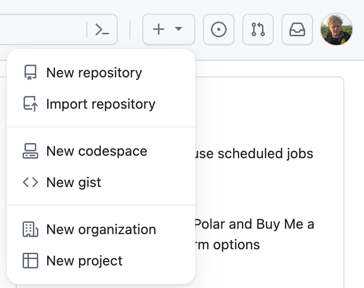
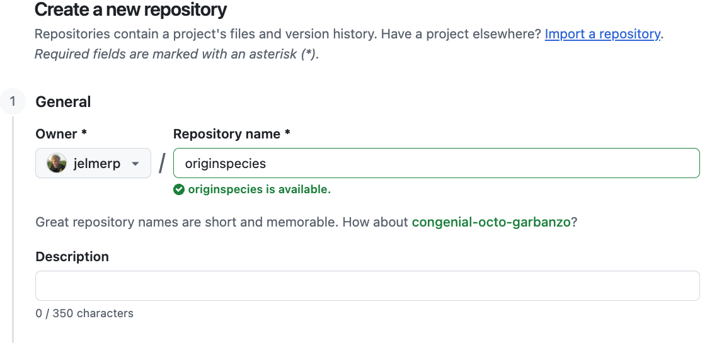

--------------------------------------------------------------------------------

<br>

## Introduction

### Overview & context

In the previous lecture,
you learned how to create and maintain version control repositories with Git.
One of the advantages of doing so is the ease with which you can then share
your code and other relevant files --- here, you'll learn to do so with GitHub.

Specifically, you will learn how to put your local repositories online at GitHub,
and how to keep local and online ("remote") repositories in sync.

### Learning goals

In this lecture, you will learn to:

- Create and explore version control repositories on the GitHub website
- Set up GitHub authentication to connect a local/OSC Git repo to its online
  counterpart on GitHub
- Keep your local and online (remote) repositories in sync

### Getting ready

#### Start a VS Code session

Start a VS Code session like you've done before.

<details><summary>  _Click here to see the instructions_</summary>

1. Log in to OSC's OnDemand portal at <https://ondemand.osc.edu>.

2. In the blue top bar, select `Interactive Apps` and near the bottom,
   click `Code Server`.

3. Fill out the form as follows (as necessary --- should be prefilled now!):
   - **Cluster**: `pitzer`
   - **Account**: `PAS3493`
   - **Number of hours**: `2`
   - **Working Directory**: `/fs/ess/PAS3493/people/<user>`
    (replace `<user>` with your user name)
   - **App Code Server version**: `4.129.0`

4. Click `Launch`, and in the next page, click the `Connect to VS Code` button once it appears.

5. In VS Code, **open a terminal** by either:
   - Clicking  &rarr; `Terminal` &rarr; `New Terminal`
   - Using the keyboard shortcut <kbd>Ctrl</kbd>+<kbd>`</kbd>

6. Check that you are in `/fs/ess/PAS3493/people/$USER`
   by typing `pwd` in the terminal.

   ::: {.callout-tip appearance="simple"}
   Recall that `$USER` is a variable that represents your username.

   If you're not in `/fs/ess/PAS3493/people/$USER`,
   it may be listed under `Recents` in the `Get Started` document ---
   if so, click on that entry.
   Otherwise, click `File` > `Open Folder` and type/select that path.
   :::

</details>

#### Open a Markdown file for notes

Like before, I recommend that you create and open a Markdown file to keep notes:

```bash
# After this command, click on the file name in the file explorer to open it:
touch week05/lectureC.md
```

#### Change your working dir

```bash
cd week05/originspecies
```

## Remote repositories

You have used version control to create a local Git repository for the mock
`originspecies` project.
The next step is to put this repo online.
Generally, sharing Git repositories online allows you to:

- Share your work (e.g. alongside a publication) and/or
- Have an online backup and/or
- Collaborate with others^[
  We will not cover collaboration workflows in class, though ---
  see the [bonus material](../bonus/git.qmd#collaboration-with-git-multi-user-remote-workflows) for this.].

We will use the **GitHub website** as the place to host our online repositories.
Online counterparts of local repositories are usually referred to as
"remote repositories" or simply "**remotes**".

Using remote repositories will mean adding a couple of Git commands to our toolbox:

- **`git remote`** to add and manage connections to remotes.
- **`git push`** to upload ("push") changes from local to remote.
- **`git pull`** to download ("pull") changes from remote to local
  (mainly needed when collaborating, so we won't use it in class).
- **`git clone`** to download a copy of a remote repo that you don't yet have locally
  (you already used this in week 4).

But we will need to start with some one-time setup to enable GitHub authentication.

### One-time setup: GitHub authentication

In order to link your local Git repositories to their online counterparts on GitHub,
you need to set up GitHub authentication.
There are two options for this (see below) ---
we will use `SSH` access with an SSH key.

1. Use the `ssh-keygen` command to generate a public-private SSH key pair ---
   in the command below, replace `your_email@example.com` with the email
   address you used to sign up for a GitHub account:

   ```sh
   ssh-keygen -t ed25519 -C "your_email@example.com"
   ```

2. You'll be asked three questions, and for all three,
   you can accept the default simply by pressing <kbd>Enter</kbd>:

   ```sh
   # Enter file in which to save the key (<default path>):
   # Enter passphrase (empty for no passphrase):
   # Enter same passphrase again:
   ```
   ```bash-out
   Generating public/private ed25519 key pair.
   Enter file in which to save the key (/users/PAS0471/jelmer/.ssh/id_ed25519):
   Enter passphrase (empty for no passphrase):
   Enter same passphrase again:
   Your identification has been saved in /users/PAS0471/jelmer/.ssh/id_ed25519.
   Your public key has been saved in /users/PAS0471/jelmer/.ssh/id_ed25519.pub.
   The key fingerprint is:
   SHA256:KO73cE18HFC/aHKIXR7nf9Fk4++CiIw6GTk7ffG+p2c your_email@example.com
   The key's randomart image is:
   +--[ED25519 256]--+
   |          ...    |
   |           . .   |
   |            + o.o|
   |       . + = *.+o|
   |    ... S * B oo.|
   |   .+.  .o =   .o|
   |    .*.o.+.. .  +|
   |   .= +o+ o E ...|
   |    o= o..+*   ..|
   +----[SHA256]-----+
   ```

   ::: {.callout-warning appearance="simple"}
   If you're instead told that `id_ed25519` "already exists"
   and asked whether to overwrite it, answer `n`:
   you already have an SSH key,
   and can simply continue with step 3 to use that key.
   :::

3. Now, you have two new files in `~/.ssh`:
   `id_ed25519.pub`, which is your **public key**,
   and `id_ed25519`, which is your **private key** (never share this one!).
   To enable authentication, you will put your public key on GitHub,
   which can then verify that you hold the matching private key.
   Print the file with your public SSH key to your screen using `cat`:

   ```sh
   cat ~/.ssh/id_ed25519.pub
   ```
   ```bash-out
   ssh-ed25519 AAAAC3NzaC1lZDI1NTE5AAAAIBz4qiqjbNrKPodoGyoF/v7n0GKyvc/vKiW0apaRjba2 your_email@example.com
   ```

4. Copy the entire line that was printed to screen to your clipboard.
5. In a separate tab in your web browser, go to <https://github.com> and log in.
6. Go to your personal Settings:
   click on your avatar in the far top-right of the page, then select "Settings".
7. Click on `SSH and GPG keys` in the sidebar.
8. Click the green `New SSH key` button.
9. In the form that appears (see screenshot below):
   - Give the key an informative "Title" (name) of your choice,
     e.g. "OSC" to indicate that you will use this key at OSC.
   - Paste the public key, which you copied to your clipboard earlier, into the "Key" box.
   - Click the green `Add SSH key` button. Done!

{fig-align="center" width="80%" fig-alt="The GitHub dialog box to enter your SSH key." .lightbox}

#### Authentication and GitHub URLs

Currently, the two options to authenticate to GitHub when connecting with remotes are:

- `SSH` access with an SSH key (which we have just set up)
- `HTTPS` access with a Personal Access Token (PAT)^[
   [See this GitHub page](https://docs.github.com/en/authentication/keeping-your-account-and-data-secure/managing-your-personal-access-tokens)
   to set this up instead of or in addition to SSH access.]

These two options are associated with separate URLs for your repos on GitHub.
For interacting with your repo on the command line,
**you should make sure to select the URL type corresponding to your authentication type**.
Since you have set up SSH but not HTTPS authentication,
you must use URLs with the SSH format, which look like this:

```bash-out-solo
git@github.com:<USERNAME>/<REPOSITORY>.git
```

(HTTPS URLs are in the more familiar-looking format
`https://github.com/<USERNAME>/<REPOSITORY>.git`.)

We'll see an example of this in a bit.

### Create a remote repository

While we can *interact* with online repos using Git commands,
we can't _create_ a new online repo with the Git CLI.
Therefore, go to the GitHub website to create a new online repo:

1. On the GitHub website, click the **`+`** next to your avatar (top-right) and
   select "**New repository**":

{fig-align="center" width="40%" fig-alt="A screenshot showing the button on GitHub to create a new repository." .lightbox}

2. In the box "**Repository name**", use the same name as that of your local dir:
   `originspecies` (though note that these names don't *have to* match).
   You can leave the Description empty in this case.

{fig-align="center" width="80%" fig-alt="A screenshot showing how to name your repository on GitHub." .lightbox}

3. Leave other options unchanged, as shown below, and click "**Create repository**":

{fig-align="center" width="80%" fig-alt="A screenshot showing the desired settings when creating a new repository on GitHub" .lightbox}

::: callout-tip
### Notes on the above settings

- Public vs. private repositories:
  if you have code you are not (yet) willing to share with the world,
  but you still want an online backup and/or to collaborate,
  you can set a repository's visibility to "Private".
  For the assignments in this course, make your repositories "Public" so we can see them ---
  or, if you prefer to keep a repository private (e.g. for your final project),
  add GitHub users `jelmerp` and `kstarr791` as collaborators
  (in the repo's `Settings` > `Collaborators`).

- In this case, you don't want to add a README or `.gitignore`,
  since you already have a `.gitignore` in your local repo
  and will create a README below.
  In general, to avoid confusion,
  it's best to not add or edit any files in your repo on github.com:
  do this locally, then upload to GitHub by pushing (as you'll see below).

- For a research project repository, you may want to add a brief Description.
  But you can also do that after creating the repo.
:::

### Link the local and remote repositories

After you click "Create repository",
a page similar to this screenshot should appear,
which provides information about linking the remote and local repositories:

{fig-align="center" width="75%" fig-alt="A screenshot showing the information GitHub provides about linking remote and local repositories." .lightbox}

Go back to VS Code to enter the commands that GitHub provides under the
"*...or push an existing repository from the command line*"
heading shown at the bottom of the screenshot above^[
Though we can skip the second one, `git branch -M main`, since our branch is already called "main".
]:

1. First, tell Git to add a "remote" connection with **`git remote`**,
   providing three arguments to this command:
   - **`add`** --- because we're adding a remote connection
   - **`origin`** --- the nickname for the connection
     (could be anything but is usually called "origin" by convention).
   - The **URL** to the GitHub repo
     (**in SSH format**: click on the `HTTPS`/`SSH` button to toggle the URL type)

   ```sh
   # git remote add <remote-nickname> <URL>
   # (Replace <github-username> with yours, or copy the command from the GitHub page)
   git remote add origin git@github.com:<github-username>/originspecies.git
   ```

2. Second, upload ("push") your local repo to remote using **`git push`**.
   The first time you push a repository,
   use the `-u` option to set up an "**u**pstream" (default) counterpart for your local branch:

   ```sh
   # git push -u <connection> <branch>
   git push -u origin main
   ```

3. The first time you connect to GitHub from OSC, you'll get a message like this:
   type `yes` and press <kbd>Enter</kbd>.

   ```bash-out-solo
   The authenticity of host 'github.com (140.82.114.4)' can't be established.
   ED25519 key fingerprint is SHA256:+DiY3wvvV6TuJJhbpZisF/zLDA0zPMSvHdkr4UvCOqU.
   This key is not known by any other names.
   Are you sure you want to continue connecting (yes/no/[fingerprint])?
   ```

4. The push/upload should process, with a message along these lines printed:

   ```bash-out-solo
   Enumerating objects: 28, done.
   Counting objects: 100% (28/28), done.
   Delta compression using up to 40 threads
   Compressing objects: 100% (17/17), done.
   Writing objects: 100% (28/28), 2.41 KiB | 2.41 MiB/s, done.
   Total 28 (delta 3), reused 0 (delta 0), pack-reused 0
   remote: Resolving deltas: 100% (3/3), done.
   To github.com:jelmerp/originspecies.git
    * [new branch]      main -> main
   branch 'main' set up to track 'origin/main'.
   ```

From now on, you can push with a simpler command: thanks to the `-u` option,
running `git push` without additional arguments will push:

- From the **currently active *"branch"*** in your local repo
  (default: `main` --- this is our only branch)^[
  To learn more about branches, see the [Git bonus material](../bonus/git.qmd).]
- To the corresponding branch in the **remote connection** we just set up (`origin`).

Therefore, from now on, you can simply use the following command to push:

```sh
git push
```

::: {.callout-note}
#### Check or change the remote connection

You can check your remote connection settings for a repo with `git remote -v`:

```bash
git remote -v
```
```bash-out
origin  git@github.com:jelmerp/originspecies.git (fetch)
origin  git@github.com:jelmerp/originspecies.git (push)
```

If you need to change the URL of your connection, you can use:

```bash
git remote set-url origin <NEW_URL>
```
:::

::: exercise
####  Exercise: Find the mistake

A classmate created a GitHub repo `myproject`,
and then ran the following commands _(don't run these)_:

```bash
git remote add origin https://github.com/doe/myproject.git
git push -u origin main
```

They were prompted for their GitHub username and password,
but even after entering these correctly,
the push failed with an "Authentication failed" error.

1. What went wrong?
2. Which command should they run to fix this, before trying to push again?

<details><summary>  _Click for the solution._ </summary>

_The solution will be added after class._

<!----
1. They used an HTTPS URL, but they had only set up SSH authentication.
   (GitHub doesn't accept account passwords for Git operations.)

2. They should change the URL of the remote to the SSH format:

   ```bash
   git remote set-url origin git@github.com:doe/myproject.git
   ```
---->
</details>
:::

::: {.callout-note}
#### `git clone` sets up a remote for you

In week 4, you downloaded the `garrigos` repository with `git clone`.
Besides downloading the repo, including its full history,
`git clone` automatically sets up the online repo as a remote called `origin`.
You can see this in the `garrigos` dir:

```bash
cd ../../garrigos
git remote -v
cd ../week05/originspecies
```
```bash-out
origin  https://github.com/cfaes-bioinfo/garrigos (fetch)
origin  https://github.com/cfaes-bioinfo/garrigos (push)
```

Note that this is an HTTPS URL, even though you haven't set up HTTPS authentication.
That's fine, because downloading a public repo doesn't require authentication ---
you would only need it to push, which you can't do for this repo anyway, since it isn't yours.
:::

### Explore the repository on GitHub

Back at GitHub on your repo page,
click the `<> Code` tab near the top of the page (or simply refresh the page):

{fig-align="center" width="40%" fig-alt="A screenshot of the GitHub Code button for a repository." .lightbox}

This is basically your repo's "home page",
and you can see the files you just uploaded from your local repo:

{fig-align="center" width="90%" fig-alt="A screenshot of the front page of our new repository." .lightbox}

Next, click on `x commits`
(`x` should be 5 if you followed along exactly in the previous class ---
but it's not really important if you have a different number):

{fig-align="center" width="35%" fig-alt="A screenshot of the commit info on GitHub." .lightbox}

You'll get an overview of the commits you made,
somewhat similar to `git log`'s output:

{fig-align="center" width="95%" fig-alt="A screenshot of the overview of commits on GitHub." .lightbox}

You can click on a commit message to see the changes made by that commit:

{fig-align="center" width="95%" fig-alt="A screenshot of the diff view on GitHub." .lightbox}

Go back to the previous page, the overview of commits.
On the right-hand side, a **<kbd>< ></kbd>** button will allow you to
see the _state of the entire repo_ (all files in the project) at the time of that commit:

{fig-align="center" width="28%" fig-alt="A screenshot of the Browse Repository button on GitHub." .lightbox}

On the commit overview page, scroll down all the way to the first commit and click the **<kbd>< ></kbd>**:
you'll see the repo's "home page" again, but now with only the `origin.txt` file,
since that was the only file in your repo at the time:

{fig-align="center" width="90%" fig-alt="A screenshot of the view of our repository at an earlier timepoint." .lightbox}

#### GitHub "Issues"

Each GitHub repository has an "Issues" tab.
GitHub Issues are mainly used to track bugs and other (potential) problems with a repository.
In an issue, you can reference specific commits and people, and use Markdown formatting.

::: {.callout-note appearance="simple"}
For future assignments and your final project, you will create an issue simply to
notify us about your repository.
You can do so by "tagging" GitHub users: type `@` followed by their username
(e.g. `@jelmerp`) in the *body* (not the title) of the issue.
:::

To go to the Issues tab for your repo, click on Issues towards the top of the page:

{fig-align="center" width="35%" fig-alt="A screenshot showing the Issues button for a repo." .lightbox}

And you should see the following page ---
in which you can open a new issue with the "New Issue" button:

{fig-align="center" width="75%" fig-alt="A screenshot showing the New Issue button on GitHub." .lightbox}

::: exercise
####  Exercise: Practice "handing in" with an Issue

This is how you'll hand in upcoming assignments, so let's practice:

1. Open a new issue in your `originspecies` repo, and give it a title like "Test issue".
2. In the _body_ of the issue, tag the instructor by typing `@jelmerp`,
   and create the issue.
3. Check that the tag worked: on the page of your new issue,
   `@jelmerp` should now be shown as a link.
:::

## Remote repo workflows: single-user

Here we will go over the typical Git + GitHub workflow with a single user,
i.e., without someone collaborating with you on the repository.
The [version control bonus page](../bonus/git.qmd#collaboration-with-git-multi-user-remote-workflows)
covers collaboration with Git and GitHub, i.e. multi-user workflows.

In a single-user workflow, all changes are typically made in the local repository,
and the remote repo is simply periodically updated (*pushed to*).
So, the interaction between local and remote is unidirectional:

::: columns
::: {.column width="48%"}
{fig-align="center" width="95%" fig-alt="A diagram of the remote repo workflow: uploading for the first time." .lightbox}
:::
::: {.column width="4%"}
:::
::: {.column width="48%"}

{fig-align="center" width="95%" fig-alt="A diagram of the remote repo workflow: now the repos are in sync." .lightbox}

:::
:::

-----

::: columns
::: {.column width="48%"}
{fig-align="center" width="95%" fig-alt="A diagram of the remote repo workflow after you've made a local commit." .lightbox}
:::
::: {.column width="4%"}
:::
::: {.column width="48%"}
{fig-align="center" width="95%" fig-alt="A diagram of the remote repo workflow: use git push to sync again." .lightbox}
:::
:::

In a single-user workflow with a remote,
you commit just like you would without a remote in your day-to-day work,
and in addition, *push* to remote occasionally.
Let's run through an example.

- Start by creating a `README.md` file for your repo:

  ```sh
  echo "# Origin" > README.md
  echo "Repo for book draft on my new **theory**" >> README.md
  ```

- Add and commit the file:

  ```sh
  git add README.md
  git commit -m "Added a README file"
  ```
  ```bash-out
  [main 63ce484] Added a README file
  1 file changed, 2 insertions(+)
  create mode 100644 README.md
  ```

- Check the status: Git knows that your local repo
  is now one commit "ahead" of its remote counterpart:

  ```sh
  git status
  ```
  ```bash-out
  On branch main
  Your branch is ahead of 'origin/main' by 1 commit.
    (use "git push" to publish your local commits)

  nothing to commit, working tree clean
  ```

- But Git will not automatically sync! So, now push to the remote repository:

  ```sh
  git push
  ```
  ```bash-out
  Enumerating objects: 4, done.
  Counting objects: 100% (4/4), done.
  Delta compression using up to 40 threads
  Compressing objects: 100% (3/3), done.
  Writing objects: 100% (3/3), 404 bytes | 404.00 KiB/s, done.
  Total 3 (delta 0), reused 0 (delta 0), pack-reused 0
  To github.com:jelmerp/originspecies.git
     4968e62..63ce484  main -> main
  ```

<hr style="height:1pt; visibility:hidden;" />

Let's go back to GitHub and refresh your repo page: note that the Markdown in `README.md` has been automatically rendered and is shown below the file listing!

{fig-align="center" width="90%" fig-alt="A screenshot of the rendered README file on GitHub." .lightbox}

::: exercise
####  Exercise: Commit and push

1. Add the next chapter title, "Variation under nature", to `origin.txt`,
   and commit this change.
   Then, add a line of your choice to `todo.txt`,
   and commit that change separately.

2. Before pushing, check the status of your repo.
   Which of these messages do you expect to see?

   a) Your branch is up to date with 'origin/main'.
   b) Your branch is ahead of 'origin/main' by 1 commit.
   c) Your branch is ahead of 'origin/main' by 2 commits.
   d) Your branch is behind 'origin/main' by 2 commits.

3. Push your changes to GitHub,
   and check on the GitHub website that your two new commits are there.

<details><summary>  _Click for the solution._ </summary>

_The solution will be added after class._

<!----
1. Make and commit the two changes:

   ```bash
   echo "Variation under nature" >> origin.txt
   git add origin.txt
   git commit -m "Add chapter 2 title"

   echo "Find a publisher" >> todo.txt
   git add todo.txt
   git commit -m "Add publisher to TODO list"
   ```

2. The correct answer is **c)**: you made two local commits that are not yet on GitHub.
   ("Behind" would mean that the remote has commits that your local repo doesn't have,
   which can happen when you collaborate.)

3. Push:

   ```bash
   git push
   ```

   Then, on GitHub, click on the number of commits:
   your two new commits should be at the top.
---->
</details>
:::

::: callout-warning
#### Don't commit large files

GitHub will refuse a push that includes any file larger than 100 MB.
It will do so **even if you have since removed the file or added it to your `.gitignore`**:
once a file has been committed, it is part of your repository's history,
and `git push` uploads that history.
Fixing this requires rewriting your repository's history, which we don't cover in this course.

So, make sure that large data files, like FASTQ files, never get committed:

- Set up your `.gitignore` file _before_ you add data to your project dir.
- Check `git status` before you commit,
  and don't use `git add --all` unless you're sure what it will add.

If this does happen to you, ask us for help.
:::

## Git and GitHub recap

A single-user Git workflow, with a GitHub remote,
consists at its core of the following steps:

1. Work on your research and change files in the repo
2. Stage changes with `git add`
3. Commit changes with `git commit`
4. Push commits with `git push`

Additional Git functionality we have seen:

1. Start a new repo with `git init`
2. Add untracked files to the repo _also_ with `git add`
3. Make sure Git ignores files with a `.gitignore` file
4. Check the current status of your repo with `git status` ---
   e.g. what files have changed since your last commit
5. See the specific changes you have made to files with `git diff`
   (or with VS Code's "Source Control" panel)
6. Get an overview of your past commits with `git log`
7. Undo uncommitted changes to files with `git restore`
8. Set up and manage the connection to a remote on GitHub with `git remote`
9. Download a copy of an online repo with `git clone`
