--------------------------------------------------------------------------------

<br>

## Introduction

### Overview & context

In the previous lecture,
you learned how to create and maintain version control repositories with Git.
One of the advantages of doing so is the ease with which you can then share
your code and other relevant files --- here, you'll learn to do so with GitHub.

### Learning goals

In this lecture, you will learn to:

- Create and explore version control repositories on the GitHub website.
- Set up GitHub authentication, so you can connect your Git repo at OSC to its
  online counterpart on GitHub.
- Keep your local and online (remote) repositories in sync.
- Use GitHub Issues, which is how you'll hand in upcoming assignments.

### Getting ready

::: {.columns}
::: {.column width="57%"}

- Start a VS Code session like you've done before.

  <details><summary>  _Click here to see the instructions_</summary>

  1. Log in to OSC's OnDemand portal at <https://ondemand.osc.edu>.

  2. In the blue top bar, select `Interactive Apps` and near the bottom,
     click `Code Server`.

  3. Fill out the form as follows (as necessary --- should be prefilled now!):
     - **Cluster**: `pitzer`
     - **Account**: `PAS3493`
     - **Number of hours**: `2`
     - **Working Directory**: `/fs/ess/PAS3493/people/<user>`
       (replace `<user>` with your user name)
     - **App Code Server version**: `4.129.0`

  4. Click `Launch`, and in the next page, click the `Connect to VS Code` button once it appears.

  5. In VS Code, **open a terminal** by either:
     - Clicking  &rarr; `Terminal` &rarr; `New Terminal`
     - Using the keyboard shortcut <kbd>Ctrl</kbd>+<kbd>`</kbd>

  6. Check that you are in `/fs/ess/PAS3493/people/$USER`
     by typing `pwd` in the terminal.

  </details>

- Open the `week05/evo` dir you created last class.
  Since you've already done this before, the easiest way to do so
  is to click on the `Recents` entry in the `Get Started` document:

  <details><summary>  _Or: open the folder manually (Click to expand)_</summary>

  1. Click  &rarr; `File` &rarr; `Open Folder`.

  2. Type/select `/fs/ess/PAS3493/people/<user>/week05/evo`,
     replacing `<user>` with your user name.
     _This will cause VS Code to reload._

  3. Open a new terminal and check that you are in the `evo` dir:

     ```sh
     pwd
     ```
     ```bash-out
     /fs/ess/PAS3493/people/jelmer/week05/evo
     ```

  </details>

:::
::: {.column width="43%"}

{fig-align="center" width="95%" fig-alt="A screenshot of the VS Code 'Get Started' document, showing the 'Recents' section." .lightbox}

::: legend2
The Welcome page in VS Code, showing "Recents":
here, click on `evo` to open our folder from the last class.
:::

:::
:::

## Remote repositories

### Introduction

You have created a local Git repository for the mock `evo` project.
As discussed in the [intro slides](./w5a_git-intro.qmd),
a typical next step is to keep an online counterpart of your repo
(a "remote repository" or simply "**remote**"),
which allows you to share your work, have an online backup,
and collaborate with others^[
  We will not cover collaboration workflows in class, though ---
  see the [optional self-study material](../bonus/git.qmd#collaboration-with-git-multi-user-remote-workflows) for this.
].

While there are several options for hosting remote repositories,
**GitHub** is the most common choice and the one we'll use here.

We'll practice with two additional Git commands that are useful for working with
remote repos:

- `git remote` --- to add and manage **connections** between local and remote repos.
- `git push` --- to **upload** ("push") changes from local to remote.

::: callout-note
#### Other useful Git commands for working with remotes

- `git pull` --- to download ("pull") changes from remote to local
  (needed when you collaborate, or when you work on the same repo from multiple
  computers, e.g. your laptop and OSC).
- `git clone` --- to download a copy of a remote repo that you don't yet have locally
  (you already used this in week 4).
:::

::: {.callout-note collapse="true"}
#### A message you may run into when pulling _(Click to expand)_

Usually, `git pull` simply downloads the commits you don't have yet,
and you'll see no more than a summary of the changes.
But when _both_ your local repo and the remote have commits that the other
doesn't have --- the two have "**diverged**", which can easily happen when you
work from two computers or with collaborators ---
Git refuses to guess how to combine them, and prints a wall of text:

```sh
git pull
```
```bash-out
hint: You have divergent branches and need to specify how to reconcile them.
hint: You can do so by running one of the following commands sometime before
hint: your next pull:
hint:
hint:   git config pull.rebase false  # merge
hint:   git config pull.rebase true   # rebase
hint:   git config pull.ff only       # fast-forward only
hint:
hint: You can replace "git config" with "git config --global" to set a default
hint: preference for all repositories. [...]
fatal: Need to specify how to reconcile divergent branches.
```

Nothing went wrong here, and nothing was changed:
Git just stopped and asked you to pick a strategy.
The first option, `merge`, keeps both sets of commits and ties them together
with an extra "merge commit",
and is the best default for how we use Git in this course.

To select it once and for all, so you won't see this message again:

```sh
git config --global pull.rebase false
```
:::

### One-time setup: GitHub authentication

Anyone can download a public GitHub repo, but only you should be able to change yours.
So, before you can upload to your remotes from the command line,
you need to set up GitHub authentication: a way to prove to GitHub that you are you.
There are two options for this ([see below](#authentication-and-github-urls)) ---
we will use `SSH` access with an **SSH key**.

1. Use the `ssh-keygen` command to generate a public-private SSH key pair^[
   GitHub's own documentation adds the option `-C "your_email@example.com"` to
   this command. That only stores your email address as a label inside the key file,
   and is not needed: without it, `ssh-keygen` labels the key with your user name
   and the computer you created it on.]:

   ```sh
   ssh-keygen -t ed25519
   ```

2. You'll be asked three questions, and for all three,
   you can accept the default simply by pressing <kbd>Enter</kbd>:

   ```bash-out
   Generating public/private ed25519 key pair.
   Enter file in which to save the key (/users/PAS0471/jelmer/.ssh/id_ed25519):
   Enter passphrase (empty for no passphrase):
   Enter same passphrase again:
   Your identification has been saved in /users/PAS0471/jelmer/.ssh/id_ed25519.
   Your public key has been saved in /users/PAS0471/jelmer/.ssh/id_ed25519.pub.
   The key fingerprint is:
   SHA256:KO73cE18HFC/aHKIXR7nf9Fk4++CiIw6GTk7ffG+p2c jelmer@p0133.ten.osc.edu
   The key's randomart image is:
   +--[ED25519 256]--+
   |          ...    |
   |           . .   |
   |            + o.o|
   |       . + = *.+o|
   |    ... S * B oo.|
   |   .+.  .o =   .o|
   |    .*.o.+.. .  +|
   |   .= +o+ o E ...|
   |    o= o..+*   ..|
   +----[SHA256]-----+
   ```

   ::: {.callout-warning appearance="simple"}
   If you're instead told that `id_ed25519` "already exists"
   and asked whether to overwrite it, answer `n`:
   you already have an SSH key,
   and can simply continue with step 3 to use that key.
   :::

3. Now, you have two new files in `~/.ssh`:
   your **public key** `id_ed25519.pub` and your **private key**
   `id_ed25519` (never share this one!).
   Next, you'll put your public key on GitHub.
   Print the file with your public SSH key to your screen using `cat`:

   ```sh
   cat ~/.ssh/id_ed25519.pub
   ```
   ```bash-out
   ssh-ed25519 AAAAC3NzaC1lZDI1NTE5AAAAIBz4qiqjbNrKPodoGyoF/v7n0GKyvc/vKiW0apaRjba2 jelmer@p0133.ten.osc.edu
   ```

4. Copy the entire line that was printed to screen to your clipboard.
5. In a new browser tab, go to your GitHub personal settings page at
   [https://github.com/settings](https://github.com/settings){target="_blank"} and log in.
6. Click on `SSH and GPG keys` in the sidebar on the left.
7. Click the green `New SSH key` button (top right).
8. Fill out the form as follows (see also the screenshot below):
   a. Give the key an informative **Title** of your choice,
      e.g. "OSC" to indicate that you'll use this key at OSC.
   b. **Key type** should already be correctly set to "Authentication Key".
   c. Paste the public key, which you copied to your clipboard earlier,
      into the **Key** box.
   d. Click the green `Add SSH key` button.

{fig-align="center" width="90%" fig-alt="The GitHub dialog box to enter your SSH key." .lightbox}

:::legend2
The "Add new SSH key" dialog box on GitHub, where you can paste your public SSH key.
:::

9. Test whether authentication works:

   ```sh
   ssh -T git@github.com
   ```

   The first time you connect to GitHub from OSC, you'll get a message like this:
   type `yes` and press <kbd>Enter</kbd>.

   ```bash-out-solo
   The authenticity of host 'github.com (140.82.114.4)' can't be established.
   ED25519 key fingerprint is SHA256:+DiY3wvvV6TuJJhbpZisF/zLDA0zPMSvHdkr4UvCOqU.
   This key is not known by any other names.
   Are you sure you want to continue connecting (yes/no/[fingerprint])?
   ```

   Then, you should see:

   ```bash-out-solo
   Hi jelmerp! You've successfully authenticated, but GitHub does not provide shell access.
   ```

   That might seem like an error or a warning, but it's actually a success message:
   it means that GitHub accepted your key and you are now authenticated.

   ::: {.callout-warning appearance="simple"}
   If you instead got `Permission denied (publickey)`, GitHub didn't accept your key:
   check that you pasted the _entire_ contents of `id_ed25519.pub` into GitHub.
   :::

<hr style="height:1pt; visibility:hidden;" />

::: {.callout-note collapse="true"}
#### How do these keys work? _(Click to expand)_
With SSH authentication, you create a matching **pair of keys**.
Think of the **public key** as a padlock, and the **private key** as the only key that opens it:
you install the padlock on your GitHub account, and whenever you push from OSC,
Git proves it's you by opening that padlock with your private key.
This is why you can share your public key freely, but should never share your private key.
:::

#### Authentication and GitHub URLs

The two options to authenticate to GitHub when connecting with remotes are:

- `SSH` access with an SSH key (which we have just set up)
- `HTTPS` access with a Personal Access Token (PAT)^[
   [See this GitHub page](https://docs.github.com/en/authentication/keeping-your-account-and-data-secure/managing-your-personal-access-tokens)
   to set this up instead of or in addition to SSH access.]

These two options are associated with separate URLs for your repos on GitHub.
For interacting with your repo on the command line,
**you should make sure to select the URL type corresponding to your authentication type**.
Since you have set up SSH but not HTTPS authentication,
you must use URLs with the SSH format, which look like this:

```bash-out-solo
git@github.com:<USERNAME>/<REPOSITORY>.git
```

(HTTPS URLs are in the more familiar-looking format
`https://github.com/<USERNAME>/<REPOSITORY>.git`.)

### Create a remote repository

::: {.columns}
::: {.column width="55%"}

While we can *interact* with online repos using Git commands,
we can't _create_ a new online repo with the Git CLI.
Therefore, go to the GitHub website to create a new online repo:

1. On the GitHub website, click the **`+`** in the top bar and in the resulting menu,
   select "**New repository**" (see the screenshot on the right).

2. In the resulting form (see the screenshot below),
   in the box "**Repository name**", use the same name as that of your local dir:
   `evo` (though note that these names don't *have to* match).
   You can leave the Description empty.

:::
::: {.column width="45%"}

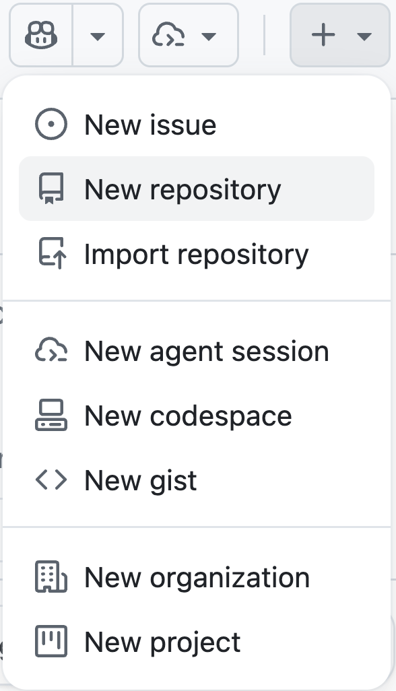{fig-align="center" width="60%" .no-border fig-alt="A screenshot showing the button on GitHub to create a new repository." .lightbox}


:::
:::

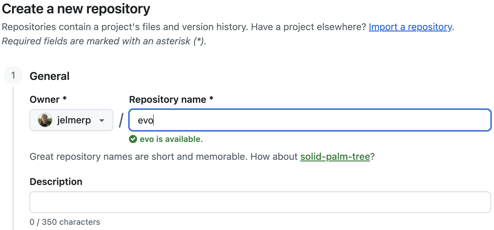{fig-align="center" width="90%" .no-border fig-alt="A screenshot showing how to name your repository on GitHub." .lightbox}

3. Leave these options all unchanged:

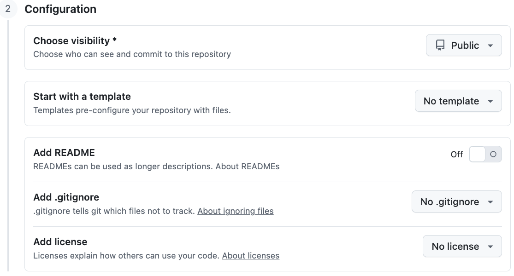{fig-align="center" width="90%" .no-border fig-alt="A screenshot showing the desired settings when creating a new repository on GitHub" .lightbox}

4. Leave the "Jumpstart your project with Copilot" option^[
   This uses GitHub's AI assistant Copilot to generate starter files
   (e.g. code and a README) based on a short description of your project.
   ] empty and click the green button "**Create repository**":

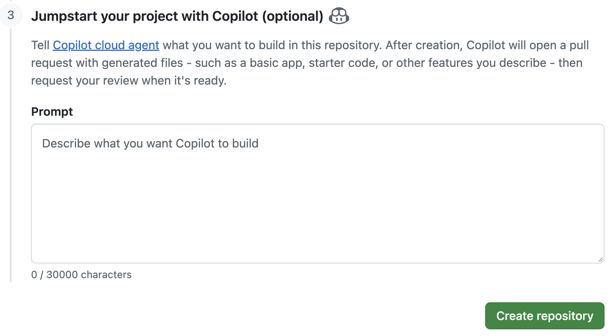{fig-align="center" width="90%" .no-border fig-alt="A screenshot showing the final new repo settings on GitHub." .lightbox}

::: {.callout-tip collapse="true"}
### Notes on the above repository settings _(Click to expand)_

- **Public vs. private repositories**\
  If you have code you are not (yet) willing to share with the world,
  but you still want an online backup and/or to collaborate,
  you can set a repository's visibility to "Private".
  For the assignments in this course, make your repositories "Public" so we can see them ---
  or, if you prefer to keep a repository private (e.g. for your final project),
  add GitHub users `jelmerp` and `kstarr791` as collaborators
  (in the repo's `Settings` > `Collaborators`).
  Also keep in mind that *everything* in a public repo is visible to anyone ---
  including your full commit history.
  So if you commit and push something that shouldn't be shared
  (unpublished data, a password), removing it in a later commit does *not*
  remove it from the repo.

- **Adding files in this interface**\
  In this case, you don't want to add a README or `.gitignore`,
  since you already have a `.gitignore` in your local repo and will create a
  README below. In general,
  it's best to not add or edit any files in your repo on GitHub:
  do this locally, then upload to GitHub by pushing (as you'll see below).
  If you do change files on GitHub, the remote will have a commit that your local repo doesn't,
  and Git will reject your next push.
  The same happens if you accidentally let GitHub add a README when creating the repo.
  The easiest fix is then to delete the GitHub repo
  (in its `Settings`, all the way at the bottom) and create it again.

- **Description**\
  For real-world projects, you may want to add a brief Description.
  But you can also do that after creating the repo.
:::

### Link the local and remote repositories

After you click "Create repository",
a page similar to this screenshot should appear,
which provides commands we can use to set up a connection between the remote and
local repositories:

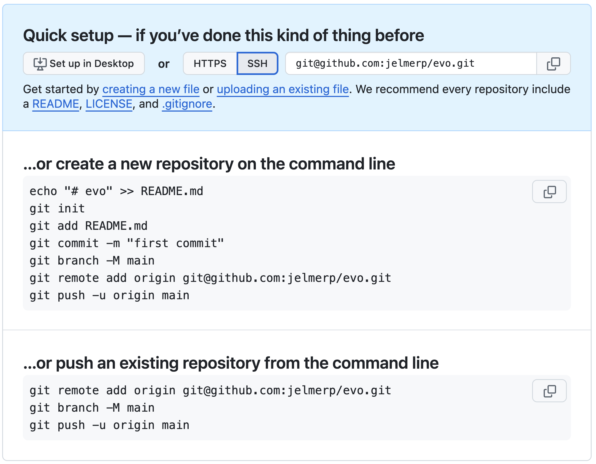{fig-align="center" width="85%" .no-border fig-alt="A screenshot showing the information GitHub provides about linking remote and local repositories." .lightbox}

**Click the `SSH` button** in the blue section to make sure the URL in the commands
is in SSH format.

Then, go back to VS Code, where we'll enter the commands GitHub provided under the
"*...or push an existing repository from the command line*"
heading shown in the screenshot above
(but skipping the second one, `git branch -M main`, since our branch is already called "main"):

1. Tell Git to **add a remote connection** with `git remote`,
   providing three pieces of information:
   - **`add`** --- because we're adding a remote connection
   - **`origin`** --- the nickname for the connection
     (could be anything but is usually called "origin" by convention)
   - The **URL** to the GitHub repo, which should now be in SSH format:

   ```sh
   # git remote add <remote-nickname> <URL>
   # (Replace <github-username> with yours, or copy the command from the GitHub page)
   git remote add origin git@github.com:<github-username>/evo.git
   ```

2. **Upload ("push")** your local repo to remote using `git push`.
   The first time you push a repository, use the `-u` option to set up a
   default "**u**pstream" counterpart for your local branch:

   ```sh
   # syntax: git push -u <remote-nickname> <branch>
   git push -u origin main
   ```

3. The upload should take place and show a message similar to this:

   ```bash-out-solo
   Enumerating objects: 28, done.
   Counting objects: 100% (28/28), done.
   Delta compression using up to 40 threads
   Compressing objects: 100% (17/17), done.
   Writing objects: 100% (28/28), 2.41 KiB | 2.41 MiB/s, done.
   Total 28 (delta 3), reused 0 (delta 0), pack-reused 0
   remote: Resolving deltas: 100% (3/3), done.
   To github.com:jelmerp/evo.git
    * [new branch]      main -> main
   branch 'main' set up to track 'origin/main'.
   ```

Because we have set up the upstream counterpart with the `-u` option,
from now on, running `git push` without arguments will push:

- From the **currently active branch** in your local repo
  (default: `main` --- this is our only branch)^[
  To learn more about branches, see the [Git bonus material](../bonus/git.qmd).]
- To the corresponding branch in the **remote connection** (`origin`) we just set up

Therefore, you can from now on simply use the following command to push additional
commits that you make locally to the remote repo:

```sh
git push
```

::: {#vscode-publish .callout-tip collapse="true"}
#### Doing all of the above with a few clicks with VS Code _(Click to expand)_

VS Code can do everything we just did (creating the GitHub repo,
setting up the remote connection, and pushing) with one button.
Whenever you open a Git repo that does _not_ yet have a remote,
the Source Control side bar shows a blue **Publish Branch** button.

The first time you click it, VS Code walks you through logging in to GitHub:

1. When the "GitHub" extension asks to sign in, click **Allow**:

   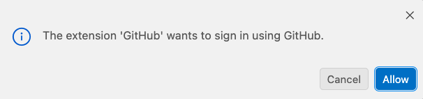{fig-align="center" width="75%" fig-alt="A screenshot of the VS Code dialog asking whether the GitHub extension may sign in using GitHub." .lightbox}

2. VS Code shows a **one-time code** --- click **Copy & Continue to Browser**,
   which copies that code to your clipboard:

   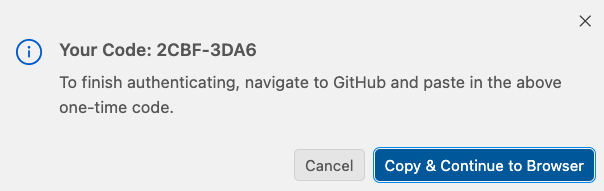{fig-align="center" width="75%" fig-alt="A screenshot of the VS Code dialog showing a one-time authentication code." .lightbox}

3. Click **Open** to let code-server open the GitHub login page in a new tab:

   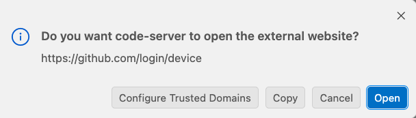{fig-align="center" width="75%" fig-alt="A screenshot of the VS Code dialog asking permission to open the GitHub device-login website." .lightbox}

   If no tab opens, go to <https://github.com/login/device> yourself ---
   the notification in the bottom-right corner of VS Code reminds you of the
   address and of your code:

   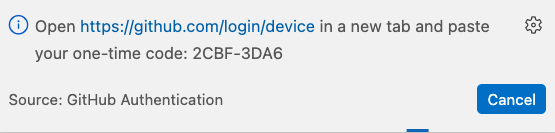{fig-align="center" width="75%" fig-alt="A screenshot of the VS Code notification with the GitHub device-login address and the one-time code." .lightbox}

4. On the GitHub page, paste your one-time code.
   Then, on the resulting page, click the green **Authorize** button at the bottom:

   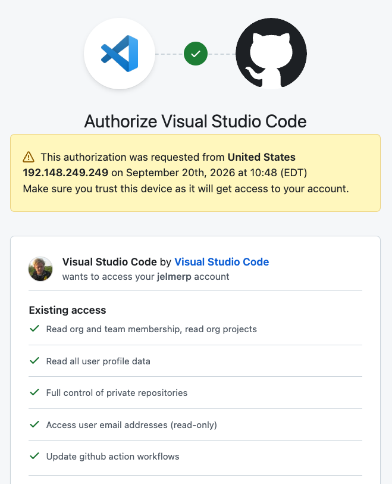{fig-align="center" width="65%" fig-alt="A screenshot of the GitHub page to authorize Visual Studio Code." .lightbox}

After you've logged in, VS Code asks for a repository name and whether to publish
to a **public** or a **private** repository
(for this course, pick **public**), and then creates the repo on GitHub and
pushes your commits to it.
Your login is remembered, so for later repos it really is just a few clicks.

Two things to keep in mind if you use this:

- VS Code sets up the remote with an **HTTPS** URL
  (as you can check with `git remote -v`) rather than an SSH one,
  and handles the authentication for you.

- The SSH key you set up above is still worth having:
  it lets you push from _any_ terminal at OSC ---
  also outside of VS Code, and from inside scripts ---
  whereas the VS Code login only works inside a VS Code session.
:::

::: {.callout-note collapse="true"}
#### Check or change the remote connection _(Click to expand)_

You can check your remote connection settings for a repo with `git remote -v`:

```bash
git remote -v
```
```bash-out
origin  git@github.com:jelmerp/evo.git (fetch)
origin  git@github.com:jelmerp/evo.git (push)
```

If you need to change the URL of your connection, you can use:

```bash
git remote set-url origin <NEW_URL>
```
:::

::: {.callout-note collapse="true"}
#### Compare: `git clone` sets up a remote for you _(Click to expand)_

In week 4, you downloaded the `garrigos` repository with `git clone`.
Besides downloading the repo, including its full history,
`git clone` automatically sets up the online repo as a remote called `origin`.
You can see this in the `garrigos` dir:

```bash
cd ../../garrigos
git remote -v
cd ../week05/evo
```
```bash-out
origin  https://github.com/cfaes-bioinfo/garrigos (fetch)
origin  https://github.com/cfaes-bioinfo/garrigos (push)
```

Note that this is an HTTPS URL, even though you haven't set up HTTPS authentication.
That's fine, because downloading a public repo doesn't require authentication ---
you would only need it to push, which you can't do for this repo anyway, since it isn't yours.
:::

### Explore the repository on GitHub

Back at GitHub on your repo page, refresh the browser page,
and you should see something like this ---
that's basically your repo's "home page",
where you can see the files you just uploaded from your local repo:

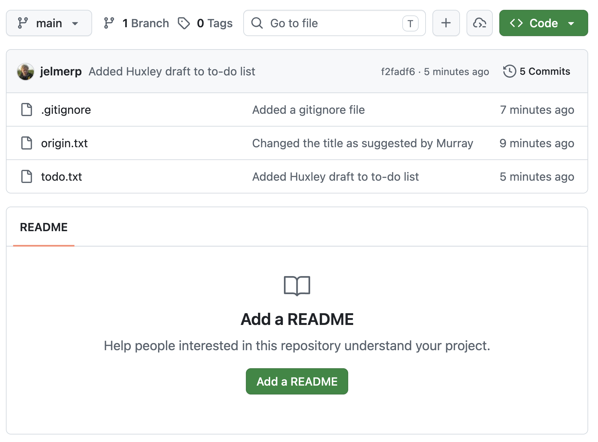{fig-align="center" width="85%" .no-border fig-alt="A screenshot of the front page of our new repository." .lightbox}

The part Zoomed in on in the screenshot below shows the number of commits made
to the repo, and the ID and time (as a relative time, e.g. "3 hours ago")
of the most recent commit.

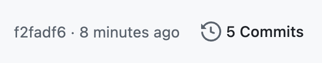{fig-align="center" width="40%" .no-border fig-alt="A screenshot of the commit info on GitHub." .lightbox}

If you followed along exactly in the previous class, this should say 5 commits
(but it's OK if you have a different number).
Click on the `5 commits` (or similar) link to get an overview of the commits you made,
similar to `git log`'s output:

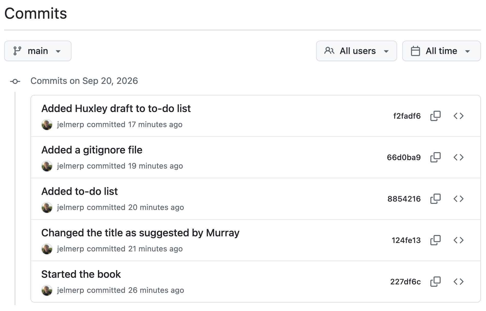{fig-align="center" width="85%" .no-border fig-alt="A screenshot of the overview of commits on GitHub." .lightbox}

::: {.callout-tip collapse="true"}
#### Your avatar next to your commits _(Click to expand)_

- If your commits show a generic gray icon instead of your avatar,
  the email address in your Git configuration (`git config --global user.email`)
  isn't associated with your GitHub account.
  You can fix this by adding that address as a
  [secondary email](https://github.com/settings/emails) on GitHub.

- If you'd like for your avatar to be a custom profile picture instead of the
  default GitHub icon,
  you can set that up on your GitHub profile page.
:::

If you click on a commit message, you'll see the changes made by that commit ---
click on the most recent commit:

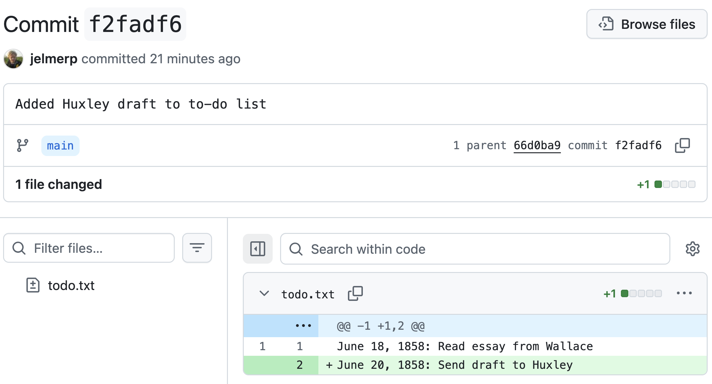{fig-align="center" .no-border width="85%" fig-alt="A screenshot of the diff view on GitHub." .lightbox}

Go back to the previous page, the overview of commits.
On the right-hand side, a **<kbd>< ></kbd>** button will allow you to
see the _state of the entire repo_ (all files in the project) at the time of that commit::

{fig-align="center" width="28%" fig-alt="A screenshot of the Browse Repository button on GitHub." .lightbox}

On the commit overview page, scroll down all the way to the first commit and click the **<kbd>< ></kbd>**:
you'll see the repo's "home page" again, but now with only the `origin.txt` file,
since that was the only file in your repo at the time:

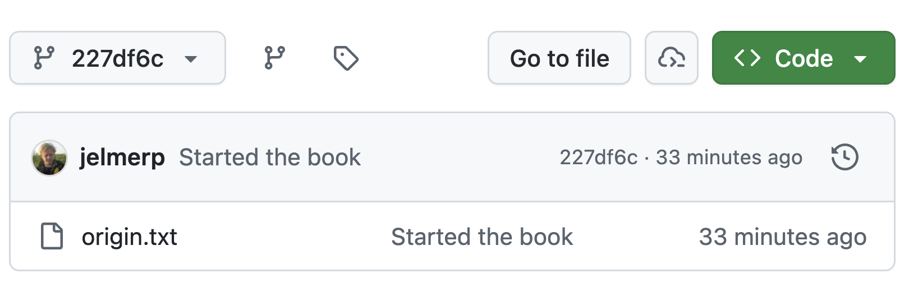{fig-align="center" width="70%" .no-border fig-alt="A screenshot of the view of our repository at an earlier timepoint." .lightbox}

### GitHub "Issues"

Each GitHub repository has an "Issues" tab.
GitHub Issues are mainly used to track bugs and other (potential) problems with a
repository, both among collaborators and between users and the repository maintainers
(in public repos, anyone can open an issue to report a problem or ask a question).

In **this course**, you will use GitHub Issues to communicate with the instructors
that you have completed an assignment and that your repository is ready for grading.

To go to the Issues tab for your repo, click on Issues towards the top of the page:

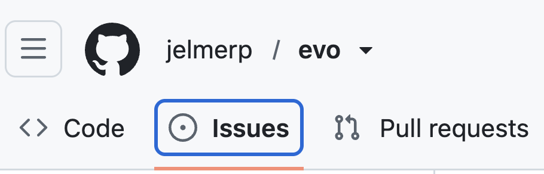{fig-align="center" width="40%" .no-border fig-alt="A screenshot showing the Issues button for a repo." .lightbox}

You should see a page like this,
where you can open a new issue with the "New Issue" button:

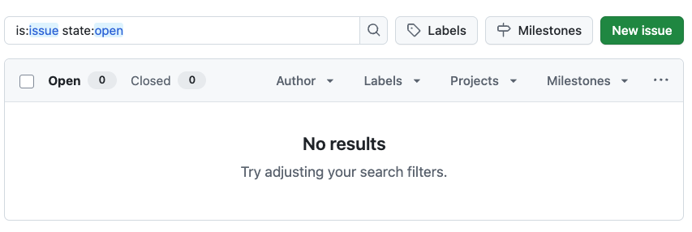{fig-align="center" width="75%" .no-border fig-alt="A screenshot showing the New Issue button on GitHub." .lightbox}

In an issue, you can use Markdown formatting,
and you can reference specific commits and people.
In next week's exercises, you'll practice with tagging the instructors in an issue,
and in **future assignments**,
you'll use this to let the instructors know you have finished an assignment.

## Remote repo workflows

We'll go over the typical Git + GitHub workflow with a **single user**,
i.e., without someone collaborating with you on the repository.
(The [optional self-study page on version control](../bonus/git.qmd#collaboration-with-git-multi-user-remote-workflows)
covers collaboration with Git and GitHub, i.e. **multi-user workflows**.)

### Single-user workflow: conceptual overview

In a single-user workflow, all changes are typically made in a single copy of the
local repository, and the remote repo is simply periodically updated (*pushed to*).
So, the interaction between local and remote is unidirectional:

::: columns
::: {.column width="48%"}
{fig-align="center" width="95%" .no-border fig-alt="A diagram of the remote repo workflow: uploading for the first time." .lightbox}
:::
::: {.column width="4%"}
:::
::: {.column width="48%"}

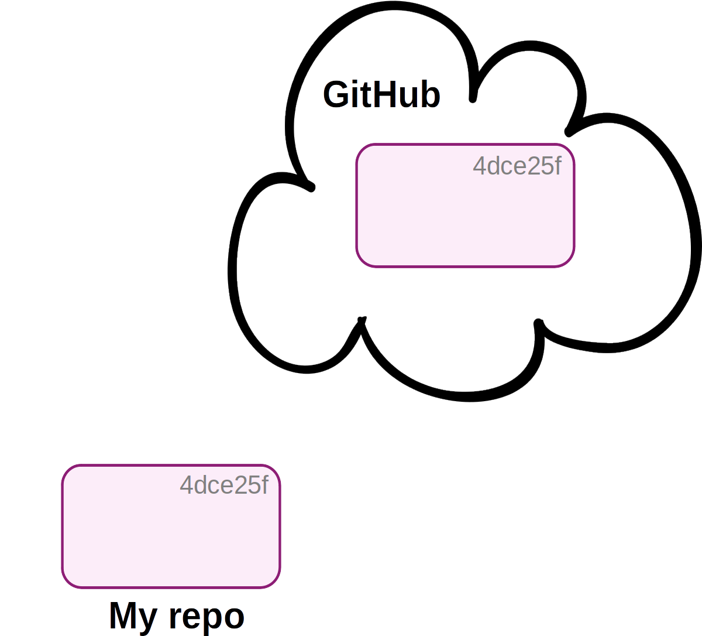{fig-align="center" width="95%" .no-border fig-alt="A diagram of the remote repo workflow: now the repos are in sync." .lightbox}

:::
:::

-----

::: columns
::: {.column width="48%"}
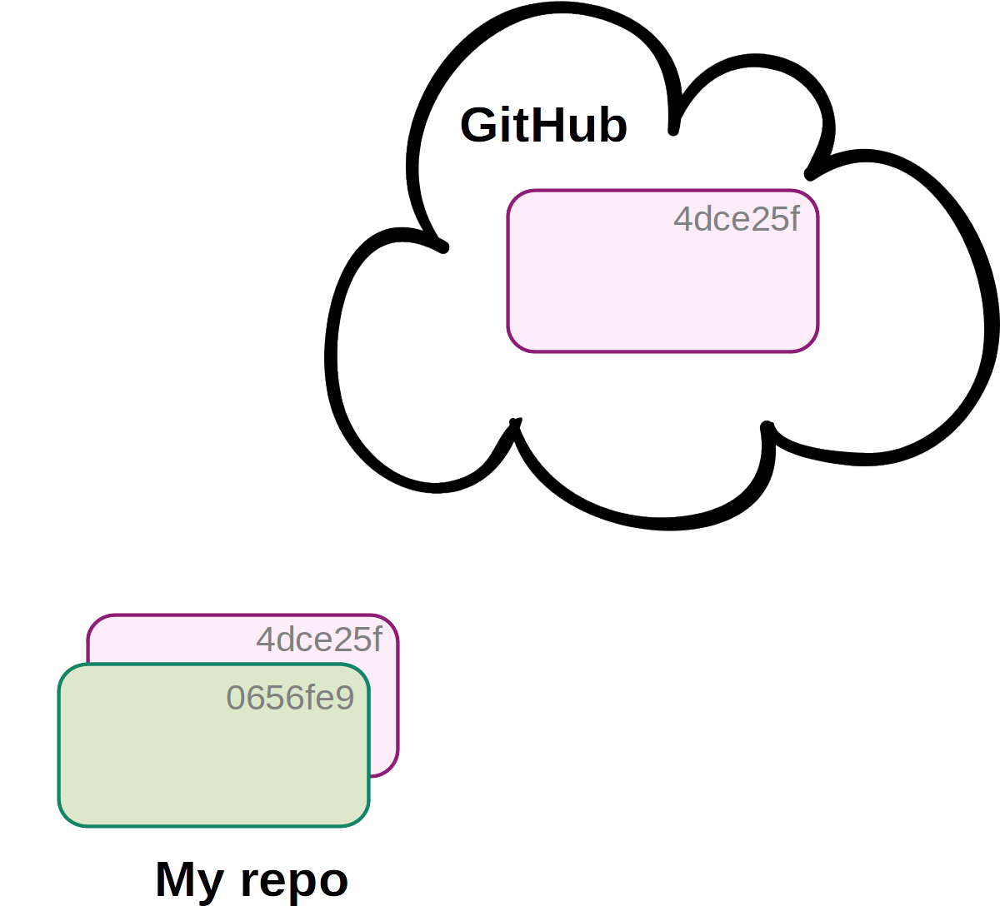{fig-align="center" width="95%" .no-border fig-alt="A diagram of the remote repo workflow after you've made a local commit." .lightbox}
:::
::: {.column width="4%"}
:::
::: {.column width="48%"}
{fig-align="center" width="95%" .no-border fig-alt="A diagram of the remote repo workflow: use git push to sync again." .lightbox}
:::
:::

<hr style="height:1pt; visibility:hidden;" />

In a single-user workflow with a remote,
you commit just like you would without a remote in your day-to-day work,
and in addition, push to remote occasionally.

### Single-user workflow: in practice

Let's see an example --- we'll make a new commit and push it to the remote repo on GitHub.

- Create a `README.md` file for your repo:

  ```sh
  touch README.md
  ```

- Open the file in the VS Code editor and copy the following text into it ---
  we'll add a few lines of Markdown formatting,
  so we can later see how GitHub automatically renders Markdown files:

  ```markdown
  # On the Origin of Species

  Repo for book draft on my **new theory**.

  ## Chapters

  1. Variation under *domestication*
  2. Variation under *nature*
  3. Struggle for existence
  4. Version control with `git`

  ## Contribute

  To contribute, please email <charles@aol.com>.
  ```

- Add and commit the file:

  ```sh
  git add README.md
  git commit -m "Added a README file"
  ```
  ```bash-out
  [main 63ce484] Added a README file
   1 file changed, 14 insertions(+)
   create mode 100644 README.md
  ```

- Check the status --- Git knows that your local repo
  is now one commit "ahead" of its remote counterpart:

  ```sh
  git status
  ```
  ```bash-out
  On branch main
  Your branch is ahead of 'origin/main' by 1 commit.
    (use "git push" to publish your local commits)

  nothing to commit, working tree clean
  ```

- As you know by now, Git doesn't automatically do much, and that includes pushing.
  So, now push to the remote:

  ```sh
  git push
  ```
  ```bash-out
  Enumerating objects: 4, done.
  Counting objects: 100% (4/4), done.
  Delta compression using up to 40 threads
  Compressing objects: 100% (3/3), done.
  Writing objects: 100% (3/3), 404 bytes | 404.00 KiB/s, done.
  Total 3 (delta 0), reused 0 (delta 0), pack-reused 0
  To github.com:jelmerp/evo.git
     4968e62..63ce484  main -> main
  ```

<hr style="height:1pt; visibility:hidden;" />

Go back to GitHub and refresh your repo page:
note that the Markdown in `README.md` has been automatically rendered,
and is shown below the file listing!

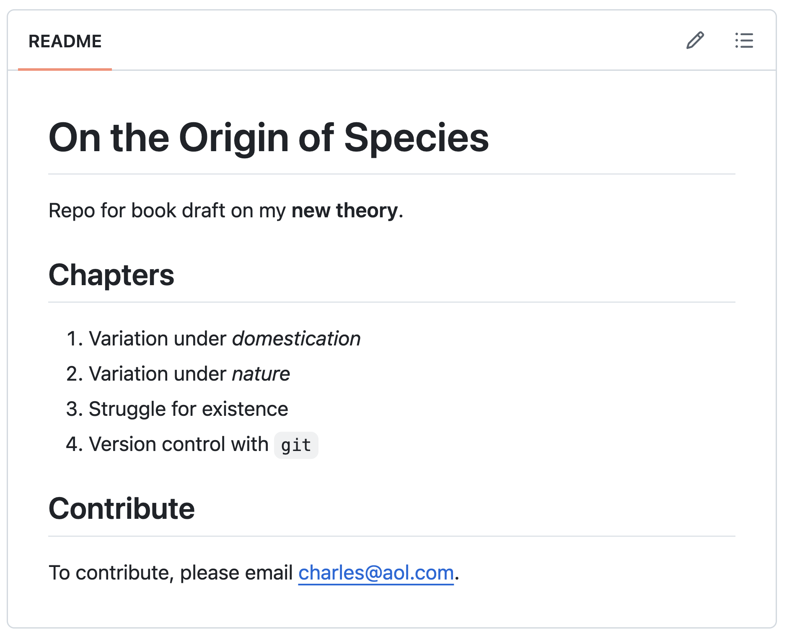{fig-align="center" width="80%" .no-border fig-alt="A screenshot of the rendered README file on GitHub." .lightbox}

::: exercise
####  Exercise 1: Commit and push

1.  Add the first chapter title, "Variation under domestication", to `origin.txt`,
    and commit this change.
    Then, add a line of your choice to `todo.txt`, and commit that change separately.

    <!----
    <details><summary>  _Click for the solution._ </summary>

    ```bash
    echo "Variation under domestication" >> origin.txt
    git add origin.txt
    git commit -m "Added chapter 1 title"

    echo "Find a publisher" >> todo.txt
    git add todo.txt
    git commit -m "Added publisher to to-do list"
    ```
    </details>
    ---->

2.  Before pushing, check the status of your repo.
    Which of these messages do you expect to see?

    a) Your branch is up to date with 'origin/main'.
    b) Your branch is ahead of 'origin/main' by 1 commit.
    c) Your branch is ahead of 'origin/main' by 2 commits.
    d) Your branch is behind 'origin/main' by 2 commits.

    <!----
    <details><summary>  _Click for the solution._ </summary>

    The correct answer is **c)**: you made two local commits that are not yet on GitHub.
    ("Behind" would mean that the remote has commits that your local repo doesn't have,
    which can happen when you collaborate.)
    </details>
    ---->

3.  Before pushing, append another line to `todo.txt`, but don't commit it.
    Predict: after you push, will that line show up in `todo.txt` on GitHub?

    <!----
    <details><summary>  _Click for the solution._ </summary>

    No: `git push` only uploads commits.
    Changes that you haven't committed exist only in your working tree,
    so they aren't pushed (and aren't backed up online either!).
    </details>
    ---->

4.  Push your changes to GitHub.
    Then, on the GitHub website, check that your two new commits are there,
    and whether your prediction in part 3 was right.

    <!----
    <details><summary>  _Click for the solution._ </summary>

    ```bash
    git push
    ```

    Then, on GitHub, click on the number of commits:
    your two new commits should be at the top.
    When you click on `todo.txt` in the repo's file listing,
    the line you added in part 3 is not there.
    (You can now commit and push that change, or discard it with `git restore todo.txt`.)
    </details>
    ---->
:::

::: {.callout-warning collapse="true"}
#### Don't commit large files _(Click to expand)_

GitHub will refuse a push that includes any file larger than 100 MB.
It will do so **even if you have since removed the file or added it to your `.gitignore`**:
once a file has been committed, it is part of your repository's history,
and `git push` uploads that history.
Fixing this requires rewriting your repository's history, which we don't cover in this course.

So, make sure that large data files, like FASTQ files, never get committed
by setting up your `.gitignore` file appropriately, checking `git status` before
committing, and being careful with `git add --all`.
:::

## Git and GitHub recap

A single-user Git workflow, with a GitHub remote,
consists at its core of the following steps:

1. Work on your research and change files in the repo.
2. Stage changes with `git add`.
3. Commit changes with `git commit`.
4. Push commits with `git push`.

Additional Git functionality we have seen:

1. Start a new repo with `git init`.
2. Add untracked files to the repo _also_ with `git add`.
3. Make sure Git ignores files with a `.gitignore` file.
4. Check the current status of your repo with `git status` ---
   e.g. what files have changed since your last commit.
5. See the specific changes you have made to files with `git diff`
   (or with VS Code's "Source Control" panel).
6. Get an overview of your past commits with `git log`.
7. Undo uncommitted changes to files with `git restore`.
8. Set up and manage the connection to a remote on GitHub with `git remote`.
9. Download a copy of an online repo with `git clone`.


<!-------
Removed:

exercise
####  Exercise 1: Find the mistake

A classmate, who set up SSH authentication in class just like you did,
created a GitHub repo `myproject`,
and then ran the following commands _(don't run these)_:

```bash
git remote add origin https://github.com/doe/myproject.git
git push -u origin main
```

They were prompted for their GitHub username and password,
but even after entering these correctly,
the push failed with an "Authentication failed" error.

1.  What went wrong?

    <details><summary>  _Click for the solution._ </summary>

    They used an HTTPS URL, but they had only set up SSH authentication.
    (GitHub doesn't accept account passwords for Git operations.)
    </details>

2.  Which command should they run to fix this, before trying to push again?

    <details><summary>  _Click for the solution._ </summary>

    ```bash
    git remote set-url origin git@github.com:doe/myproject.git
    ```
    </details>

exercise
####  Exercise 1: Practice "handing in" with an Issue

This is how you'll hand in upcoming assignments, so let's practice ---
for real assignments, you'll tag both instructors this way:

1. Open a new issue in your `evo` repo, and give it a title like "Test issue".
2. In the _body_ of the issue, tag both instructors by typing `@jelmerp`
   and `@kstarr791`, and create the issue.
3. Check that the tags worked: on the page of your new issue,
   `@jelmerp` and `@kstarr791` should now be shown as links.

------->
