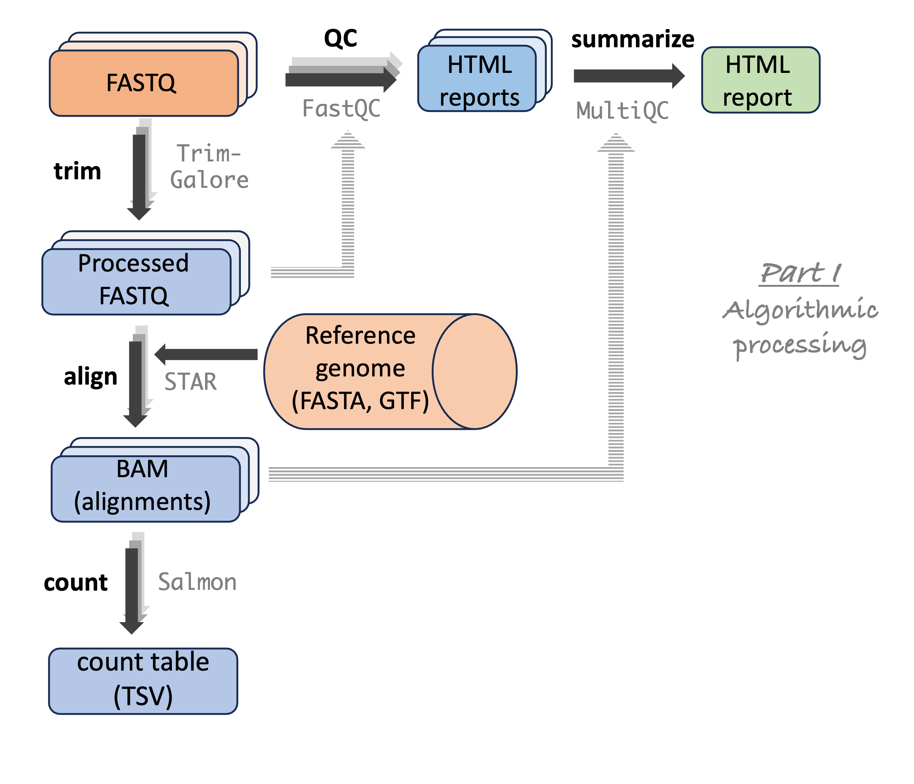

## Where we're heading

Step by step, in this and the next few weeks,\
you'll learn to run command-line bioinformatics programs at OSC:

1. A deeper dive into OSC _(this lecture)_
2. How to use software at OSC, including programs that aren't installed _(next lecture)_
3. How to write shell scripts _(next week)_
4. How to submit shell scripts as "batch jobs" _(in week 9)_
5. How to build functional commands to run such programs _(throughout)_

# Compute nodes, compute jobs, and cores {background-color="#A7B1B7"}

## Using compute nodes via "jobs"

::: {.columns}
::: {.column width="47%"}

### [Compute jobs]{style="display:block; text-align:center;"}

You use compute nodes by **requesting resources**,
such as a number of nodes and cores, and for how long you need them.

These requests result in "**compute jobs**" (or simply "jobs").
Our VS Code sessions are an example!

:::
::: {.column width="6%"}

:::
::: {.column width="47%" .fragment data-fragment-index="1"}

### [The job scheduler]{style="display:block; text-align:center;"}

Many users send requests all the time,
so a **job scheduler** (**Slurm** at OSC) considers each request
and assigns resources to jobs as they become available.

::: {.callout-tip appearance="simple"}
In week 9, you'll learn to submit scripts as "batch jobs" with Slurm.
:::

:::
:::

## Recap: nodes and clusters

{fig-align="center" width="95%" fig-alt="A diagram showing the structure of a supercomputer center with three main components: file systems, login nodes, and compute nodes"}

::: {.columns style="text-align:center"}
::: {.column width="21%"}

**Node**\
A single computer that is a part of a supercomputer.

:::
::: {.column width="32%"}

**Supercomputer / Cluster**\
A collection of connected computers/nodes.

:::
::: {.column width="30%"}

**Supercomputer Center**\
A facility like OSC with one or more supercomputers.
OSC has three: "Ascend", "Cardinal", and "Pitzer".

:::
:::

::: footer
:::

## Cores

There is one more "level" than what was shown on the previous slide, from week 2 ---\
each node has multiple **cores**:

{fig-align="center" width="100%" fig-alt="A diagram showing the hierarchy of supercomputers, nodes, and cores." .lightbox}

## Cores

::: {.columns}
::: {.column width="47%"}

### [What is a core?]{style="display:block; text-align:center;"}

- A component of a node (computer) that can **independently**
  perform a computing task, like running a bioinformatics program.

- Also, many programs can use **multiple cores** for a single run,
  which can speed them up considerably.

:::
::: {.column width="6%"}

:::
::: {.column width="47%" .fragment data-fragment-index="1"}

### [Core / Processor / CPU / Thread]{style="display:block; text-align:center;"}

- These terms are not technically synonyms,
  but are often used **interchangeably**.

- For working at OSC, treat them as meaning the same thing:
  **components of nodes** that can be reserved and used independently.

:::
:::

. . .

::: {.callout-note appearance="simple"}
Typical compute jobs use only 1 node, but multiple cores on that node.

A job's resource usage is measured in **core hours**.
For example, using 2 cores for 3 hours = 6 core hours.
:::

## One node, several jobs

A node is usually **shared by several jobs**, each of which has reserved some of its cores:

Job A

Job A

Job B

Job B

Job B

Job B

free

free

::: legend2
A node with 8 cores (real Pitzer nodes have 40--48): 
Job A has 2 cores, Job B has 4, and 2 cores are free.
:::

. . .

 

When you request resources,
the Slurm scheduler looks for a node with enough free cores.

As such, **smaller requests** (fewer cores, less time) may start more quickly
than **larger ones**, especially when the cluster is heavily used.

-----

::: callout-quiz
::: callout-note
#### Quiz: Core hours

A) You request a compute job with 8 cores for 3 hours.
   How many core hours will your Project be billed for?

B) The job ran, only **used 1 of those cores**.
   Do you think that changes the number of billed core hours?

C) The job ran, and it **ended after 1 hour**.
   Do you think that changes the number of billed core hours?

<!----

  &nbsp; &nbsp; _Click for the answers_

A) 8 cores × 3 hours = **24 core hours**.

B) **No**: you're billed for the cores you _reserved_, whether or not they were used.
   So, request multiple cores only if the program you run can actually use them.

C) **Yes**: OSC only bills for the time a job actually ran,
   so 8 cores × 1 hour = **8 core hours**.

---->

:::
:::

::: callout-quiz
::: callout-note
#### Quiz: Interpretation

What does this tell you about how many cores and hours to request?

<!----

  &nbsp; &nbsp; _Click for the answer_

Only request as many cores as the program can use.
For time, it's better to be generous: unused time isn't billed,
and a job that runs out of time is killed before it finishes
(though very long requests may wait longer in the queue).

---->

:::
:::

## System status

In OnDemand's "**Clusters**" dropdown menu,
click on the item at the bottom, "**`System Status`**":

{fig-align="center" width="40%" fig-alt="A screenshot of the options in the OSC OnDemand Clusters dropdown menu." .lightbox}

This page shows the live usage of the three clusters,
and gives a good idea of the scale of the supercomputer center (***next slide***).

. . .

::: callout-quiz
::: callout-note
#### On the next slide, what does "processors" refer to?

<!----
Here, OSC uses the word "processor" to mean "core" (or "CPU").
As mentioned, these terms are often used interchangeably
(but technically a processor is a physical chip that may contain multiple cores).
---->
:::
:::

----

{.img-wide style="--img-width: 103%" fig-alt="A screenshot of the OSC Ondemand System Status page showing live cluster usage." .lightbox}

::: footer
:::

## Side note

::: callout-note
#### Why does OSC have multiple clusters rather than a single big one?

OSC buys a new cluster every few years and retires the oldest one,\
so the clusters differ in age and hardware:

- **Pitzer** (2018, expanded in 2020)
- **Ascend** (2022, with many GPU nodes)
- **Cardinal** (2024)

Among other things, rolling out clusters this way keeps some hardware\
up to date at all times, and avoids downtime for the entire center.
:::

## Compute node types

::: {.columns}
::: {.column width="47%"}

### ["Standard" nodes]{style="display:block; text-align:center;"}

- By far the most numerous (Pitzer has 564).
- Vary in size, e.g., 40–48 cores per node on Pitzer.
- Used by **default**, and will serve you well for most omics analyses.

:::
::: {.column width="6%"}

:::
::: {.column width="47%" .fragment data-fragment-index="1"}

### [Other node types]{style="display:block; text-align:center;"}

- Nodes with extra **memory**:\
  `largemem` and `hugemem`.
- Nodes with **GPUs** (Graphics Processing Units) in addition to CPUs.

. . .

::: {.callout-tip}
#### When are these useful?
You may occasionally need these, for example for genome or transcriptome assembly
(large-memory nodes) or Oxford Nanopore base-calling (GPU nodes).
:::

:::
:::

## Memory versus storage

When we talk about a computer's **memory**, this refers to **RAM** ---
don't confuse this with file *storage*.

<!----
Think of storage as a bookshelf, and memory as your desk:
you can only work on what fits on your desk, but it's much quicker to reach.
----->

::: {.columns}
::: {.column width="47%" .fragment data-fragment-index="1"}

### [Memory (RAM)]{style="display:block; text-align:center;"}

- The data a computer is actively using.
- Accessed orders of magnitude faster than data on disk.
- E.g., heavily used when you play a game or have many browser tabs open.

:::
::: {.column width="6%"}

:::
::: {.column width="47%" .fragment data-fragment-index="2"}

### [Storage (disk)]{style="display:block; text-align:center;"}

- The data that is saved in files on disk.

. . .

::: {.callout-tip appearance="simple"}
When your computer **freezes**, memory is often full, and it starts using disk
storage as "virtual memory", which is much slower.
:::
:::
:::

. . .

::: {.callout-note appearance="simple"}
**Bioinformatics programs** may load input data into memory for fast access,
and hold intermediate results there too.
With large datasets, they may need 10s–100s of GBs of memory.
:::

. . .

::: {.callout-note appearance="simple"}
At OSC, available memory is **proportional** to the number of cores you request
(often 4 GB per core).
:::

::: footer
:::

# OSC Projects {background-color="#A7B1B7"}

## OSC bills Project-wise

OSC bills **Projects** (not individual users), and only for two things:

::: {.columns}
::: {.column width="30%" .box-blue .fragment data-fragment-index="1"}
### File storage

- File storage in the Project dirs (`/fs/ess`).

- Charged per TB per month for what you have **reserved**, not what you actually use.

:::
::: {.column width="3%"}
:::
::: {.column width="30%" .box-amber .fragment data-fragment-index="2"}
### Compute

- Compute node usage.

- Charged per **core hour**.

:::
::: {.column width="3%"}
:::
::: {.column width="30%" .box-teal .fragment data-fragment-index="3"}
### Who pays?

- Every OSU PI gets a $1,000 yearly credit.
- OSU colleges pay some or all of the costs --- CFAES currently pays all of it.

:::
:::

. . .

::: {.callout-note appearance="simple"}
Prices for academic usage are generally low, but a Project using dozens of TBs
and tens of thousands of core hours would still be charged over a thousand dollars
per year.
:::

## Using and managing OSC Projects

In this course, we only use the course's OSC Project `PAS3493`.
For your own research, you would likely use a Project specific to a research
project, or your lab's general-use Project.

::: {.columns}
::: {.column width="47%" .fragment data-fragment-index="1"}

### [Using a Project]{style="display:block; text-align:center;"}

In practice, "using" a Project means:

- **Storage**: Storing data in its `/fs/ess` and/or `/fs/scratch` dirs.
- **Compute**: Selecting the Project when starting compute jobs,
  like VS Code (Code Server) and (later in the course) batch jobs.

:::
::: {.column width="6%"}

:::
::: {.column width="47%" .fragment data-fragment-index="2"}

### [Managing a Project]{style="display:block; text-align:center;"}

Generally **only PIs** can do this
([more info](https://www.osc.edu/supercomputing/portals/client_portal/projects_budgets_and_charge_accounts){target="_blank"}).
Project admins can, among other things:

- Manage the compute budget and `/fs/ess` storage allocation.
- Add users to the Project.

:::
:::

# Storage areas {background-color="#A7B1B7"}

## Storage areas: overview

Let's start by recapping what we learned in week 2 about the three main storage
areas at OSC:

::: {.columns}
::: {.column width="24%"}
:::
::: {.column width="53%"}

| Area        | Path           | One for each... |
| ----------- | -------------- | --------------- |
| **Home**    | `/users/`      | User            |
| **Project** | `/fs/ess/`     | OSC Project     |
| **Scratch** | `/fs/scratch/` | OSC Project     |

: {.striped .hover tbl-colwidths="[25, 35, 40]"}

:::
::: {.column width="23%"}
:::
:::

## Storage areas: overview

Now, let's see some additional features of these storage areas:

| Area     | Quota                        | Backed up?   | Auto-purged? | I/O Speed        | Billed      |
| -------- | ---------------------------- | ------------ | ------------ | ---------------- | ----------- |
| **Home** | [500 GB / 1 M files]{.amber} | [Yes]{.teal} | [No]{.teal}  | [Slower]{.amber} | [No]{.teal} |

: {.striped .hover tbl-colwidths="[13, 21, 16, 26, 14, 12]"}

## Storage areas: overview

Now, let's see some additional features of these storage areas:

| Area        | Quota                        | Backed up?   | Auto-purged? | I/O Speed        | Billed        |
| ----------- | ---------------------------- | ------------ | ------------ | ---------------- | ------------- |
| **Home**    | [500 GB / 1 M files]{.amber} | [Yes]{.teal} | [No]{.teal}  | [Slower]{.amber} | [No]{.teal}   |
| **Project** | [Flexible]{.teal}            | [Yes]{.teal} | [No]{.teal}  | [Slower]{.amber} | [Yes]{.amber} |

: {.striped .hover tbl-colwidths="[13, 21, 16, 26, 14, 12]"}

## Storage areas: overview

Now, let's see some additional features of these storage areas:

| Area        | Quota                        | Backed up?   | Auto-purged?            | I/O Speed        | Billed        |
| ----------- | ---------------------------- | ------------ | ----------------------- | ---------------- | ------------- |
| **Home**    | [500 GB / 1 M files]{.amber} | [Yes]{.teal} | [No]{.teal}             | [Slower]{.amber} | [No]{.teal}   |
| **Project** | [Flexible]{.teal}            | [Yes]{.teal} | [No]{.teal}             | [Slower]{.amber} | [Yes]{.amber} |
| **Scratch** | [100 TB]{.teal}              | [No]{.amber} | [After 60 days unused]{.amber} | [Faster]{.teal}  | [No]{.teal}   |

: {.striped .hover tbl-colwidths="[13, 21, 16, 26, 14, 12]"}

. . .

 

::: {.callout-tip appearance="simple"}
All in all, Project storage should be your default,
but when working with large datasets and/or limited storage quota,
consider Scratch for large intermediate files that you can regenerate.
:::

. . .

::: {.callout-note appearance="simple"}
There is a **fourth** storage area, _compute_,
that is directly tied to compute jobs (deleted when a job ends).\
In practice, this is rarely needed in bioinformatics, and we won't use it in this course.
:::

## Storage areas: final notes

::: {.columns}
::: {.column width="30%" .box-blue}
### Hidden files in Home

- Your Home dir will have hidden files (those starting with a `.`) that are
  generated and used **automatically** by software.

- Don't mess with them unless you know what you're doing!

:::
::: {.column width="3%"}
:::
::: {.column width="30%" .box-amber .fragment data-fragment-index="1"}
### Accessing backups

- Home and Project dirs are backed up **daily**.

- You don't have _direct_ access to the backups,
  but can email OSC to restore your files from a specific date.

:::
::: {.column width="3%"}
:::
::: {.column width="30%" .box-teal .fragment data-fragment-index="2"}
### Files across clusters

- OSC's clusters share the entire file system.

- So, you can access your files with the same paths across all clusters.

:::
:::

## Storage quota on the OnDemand dashboard

{fig-align="center" width="65%" fig-alt="A screenshot of the OSC OnDemand dashboard showing storage quota information." .lightbox}

::: footer
:::

## Storage quota on the OnDemand dashboard

{fig-align="center" width="65%" fig-alt="A screenshot of the OSC OnDemand dashboard showing storage quota information." .lightbox}

::: footer
:::

# Using software at OSC {background-color="#A7B1B7"}

## Omics analyses use many programs

A typical omics data analysis workflow consists of a sequence of specialized
bioinformatics programs (a.k.a. software or tools).
For example, the RNA-seq workflow we'll go through:

{fig-align="center" width="53%" fig-alt="A diagram showing the steps in an RNA-seq analysis pipeline." .lightbox}

::: footer
:::

## Installed software at OSC

::: {.columns}
::: {.column width="47%"}
### [Basic system-wide installations]{style="display:block; text-align:center;"}

- Besides the shell commands we've been using,
  other commonly used software like Git, Python, and Apptainer
  can be used without any extra steps.

:::

::: {.column width="6%"}

:::

::: {.column width="47%" .fragment data-fragment-index="1"}

### [Modules]{style="display:block; text-align:center;"}

- OSC has also installed many more specialized programs,
  including bioinformatics tools.

- You can use such a program after **loading its "module"** using the `module` command.

- **But:** The collection of installed software at OSC is not comprehensive,
  and program versions are not always the most recent.

:::
:::

## Module Browser

OnDemand has a
[**Module Browser**](https://ondemand.osc.edu/pun/sys/dashboard/module-browser){target="_blank"}
to search the software that OSC has installed as "modules" ---
you'll learn how to load modules in the next lecture.

{fig-align="center" width="100%" fig-alt="A screenshot of the OSC OnDemand Module Browser page." .lightbox}

## Other options

::: {.columns}
::: {.column width="47%"}
### [Installing software yourself?]{style="display:block; text-align:center;"}

Installing software like you would on your own computer
is often not possible at OSC:

- You don't have **administrator privileges**.
- You will often run into issues with **dependencies**
  (other software that a program depends on).

:::

::: {.column width="6%"}

:::

::: {.column width="47%" .fragment data-fragment-index="1"}

### [Conda and containers]{style="display:block; text-align:center;"}

- **Conda**: Allows you to install software into "environments" you can load.

- **Containers**: Self-contained software packages that can be distributed.

- **Both**:
  - Bypass the dependency and administrator privilege issues.
  - Make it easy to switch between versions or use mutually incompatible software.
  - Are good for reproducibility.

:::
:::

::: footer
:::

## Conda versus containers

The two approaches are quite different, both conceptually and in practice:

| Aspect           | Conda                            | Containers                             |
| ---------------- | -------------------------------- | -------------------------------------- |
| Obtaining a tool | Install it                       | Download a file                        |
| Running a tool   | [Load, then run as usual]{.teal} | [With a long command "prefix"]{.amber} |
| Combining tools  | [Easier]{.teal}                  | [Harder]{.amber}                       |

: {.striped .hover tbl-colwidths="[20, 42, 38]"}

## Conda versus containers

The two approaches are quite different, both conceptually and in practice:

| Aspect           | Conda                                          | Containers                              |
| ---------------- | ---------------------------------------------- | --------------------------------------- |
| Obtaining a tool | Install it                                     | Download a file                         |
| Running a tool   | [Load, then run as usual]{.teal}               | [With a long command "prefix"]{.amber}  |
| Combining tools  | [Easier]{.teal}                                | [Harder]{.amber}                        |
| Reliability      | [Installs can be slow or fail]{.amber}         | [Quick and reliable to obtain]{.teal}   |
| Files            | [Many small files (may hit OSC quota)]{.amber} | [Single file]{.teal}                    |
| Portability      | [Less portable]{.amber}                        | [Highly portable & reproducible]{.teal} |

: {.striped .hover tbl-colwidths="[20, 42, 38]"}

. . .

::: {.callout-tip}
#### What programs/tools are available?
The same set of programs is available through Conda and as containers,
all of which are **free and open-source**.
Missing programs tend to be better avoided anyway
(poorly maintained, etc. --- exceptions exist).
:::

::: footer
:::

## Conda versus containers

The two approaches are quite different, both conceptually and in practice:

| Aspect           | Conda                                          | Containers                              |
| ---------------- | ---------------------------------------------- | --------------------------------------- |
| Obtaining a tool | Install it                                     | Download a file                         |
| Running a tool   | [Load, then run as usual]{.teal}               | [With a long command "prefix"]{.amber}  |
| Combining tools  | [Easier]{.teal}                                | [Harder]{.amber}                        |
| Reliability      | [Installs can be slow or fail]{.amber}         | [Quick and reliable to obtain]{.teal}   |
| Files            | [Many small files (may hit OSC quota)]{.amber} | [Single file]{.teal}                    |
| Portability      | [Less portable]{.amber}                        | [Highly portable & reproducible]{.teal} |

: {.striped .hover tbl-colwidths="[20, 42, 38]"}

::: {.callout-note}
#### What will we use?
We'll next practice with modules and containers,
while Conda is covered in [an optional self-study page](/bonus/conda.qmd){target="_blank"}.
:::

::: footer
:::

# Final notes {background-color="#A7B1B7"}

## Direct Unix shell access

The **Clusters** dropdown menu also gives direct access to a Unix shell on any of the
three clusters.

- In the course, we use VS Code (Code Server) to access a shell,\
  but the Clusters dropdown can occasionally be useful as a **quicker access** point.
- Be aware that you will be on a **login node**, so only run light tasks there!

{fig-align="center" width="67%" fig-alt="A screenshot of a Unix shell opened via the Clusters menu on OSC OnDemand." .lightbox}

::: footer
:::

## Contacting OSC to get help

Open a support case in the [OSC Service Center](https://support.osc.edu){target="_blank"}
(log in with your OSC credentials),\
or email **<oschelp@osc.edu>**, with questions like:

- Problems with your account
- Installing or using specific software
- Why your jobs keep failing

They are usually quite quick to respond!

. . .

 

::: callout-tip
### Citing OSC
When you use OSC, it's good practice to **acknowledge and cite OSC** in your papers ---
see their [citation page](https://www.osc.edu/resources/getting_started/citation){target="_blank"}.
:::

# Questions? {background-color="#A7B1B7" .unlisted}

  

[_Click here to go to the next lecture, [**Using software at OSC**](./w6b_software.qmd)_]{style="display:block; text-align:center"}
