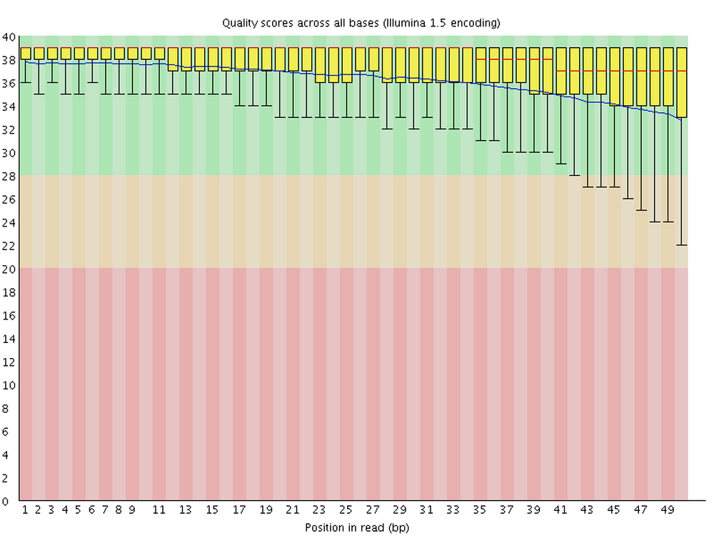
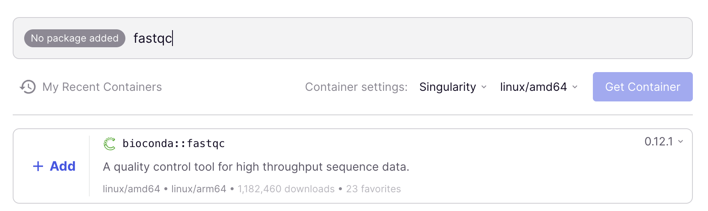
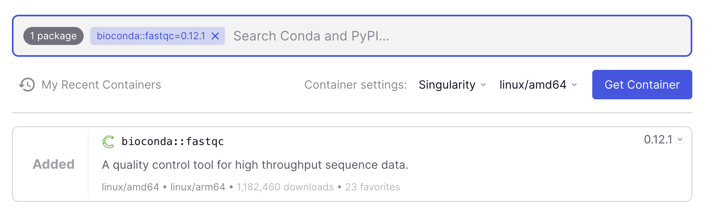
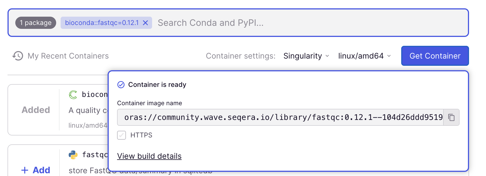
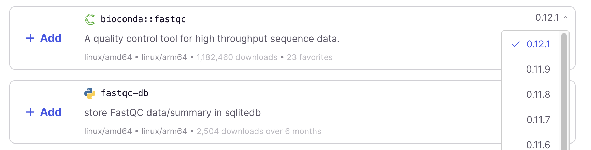

----------------------------------------------------------------------------------------------------

<hr style="height:1pt; visibility:hidden;" />
<hr style="height:1pt; visibility:hidden;" />

## Introduction

### Learning goals

As we discussed in the [previous lecture](w6a_osc.qmd),
you can use software at OSC by loading "modules" with system-wide installations,
or by using containers or Conda.
In this session, you will learn to use **modules** and **containers**,
while [an optional-reading page covers Conda](../bonus/conda.qmd).

We'll use the program **FastQC** to illustrate how to use modules and containers,
so along the way, you'll also learn what FastQC does and how to run it.

### Setting up

::: {.columns}
::: {.column width="80%"}

#### The usual

1. At <https://ondemand.osc.edu>,
   start a VS Code session in `/fs/ess/PAS3493/people/$USER`.
2. Open a terminal. In it, **create** and then navigate to a `week06` dir.
3. _Optional: Create a new Markdown file for class notes and save it in your `week06` dir._

#### Install a VS Code extension

VS Code extensions are small programs that add extra functionality to the IDE.
We'll install several of these during the course,
starting now with a VS Code extension for **viewing HTML files**,
since we'll need to look at an HTML file later in this lecture
(without this extension, HTML files would only open as plaint-text source documents).

1. In the Activity Bar, click the **Extensions icon** at the bottom
   (see screenshot on the right).
2. The wide side bar now shows the Extensions view.
   In the search box at the top, type "*HTML preview*".
3. The first result should be the extension called "**HTML Preview**" by
   Thomas Haakon Townsend. Click the blue "**Install**" button to install it.
4. When asked if you "trust the publisher",
   click the blue "**Trust Publisher & Install**" button.

{fig-align="center" width="75%" fig-alt="The HTML Preview search result." .lightbox}

:::
::: {.column width="20%"}

{fig-align="center" width="45%" fig-alt="The VS Code Extensions icon." .lightbox}

::: legend2
Activity Bar, with the Extensions icon (bottom) highlighted.
:::

:::
:::

## Intermezzo: The FastQC software

As an example piece of bioinformatics software,
we will use FastQC [@andrews2010] in this session.
FastQC is a ubiquitous tool for **quality control of FASTQ files**.
Running FastQC (or a similar program) is the first step in nearly any high-throughput
sequencing project, and it is a good introductory example of a CLI program.

For each FASTQ file that it analyzes,
FastQC outputs an **HTML file** with about a dozen graphs showing different QC
(Quality Control) metrics.
Typically, the most important one is this per-base quality score graph:

{fig-align="center" .no-border width="70%" fig-alt="An example FastQC per-base quality graph." .lightbox}

## Loading software at OSC using modules

As discussed in the previous lecture,
much of the software installed at OSC can only be used after its
**module is explicitly loaded**.
You can search for available software modules and load them using the `module`
command and its various subcommands.

::: {.callout-warning appearance="simple"}
The three OSC clusters mostly have the same software available through modules,
but there are some differences.
In this course, our VS Code sessions run on the Pitzer cluster.
:::

### Searching for available modules

OSC OnDemand has a [Module Browser](https://ondemand.osc.edu/pun/sys/dashboard/module-browser)
that you can use to search for available software modules.
You can also search for available software in the shell
using two subtly different `module` commands:

- `module spider` lists all modules.
- `module avail` lists modules that can be **loaded directly** given the current
  shell environment^[
  This takes into account which other software has been loaded,
  which can make a difference:
  for example, some modules can only be loaded after a specific compiler is loaded.
  ].

Simply running `module spider` or `module avail` spits out complete lists
of available programs,
so it's typically useful to add a **search term** as an argument.
For example, try to use `module spider` to search for `fastqc`:

```bash
module spider fastqc
```
``` {.bash-out}
--------------------------------------------------------------------------------
  fastqc: fastqc/0.12.1
--------------------------------------------------------------------------------

    This module can be loaded directly: module load fastqc/0.12.1

    Help:
      A quality control tool for high throughput sequence data.
```

We can see that `fastqc` is available, namely version `0.12.1`
(the module is printed as `<software>/<version>`).

::: {.callout-warning}
#### Case-sensitivity
These two search commands are not case-sensitive,
but `module load` (below) _is_ case-sensitive.
:::

### Loading modules

To make a program available to you, use the `module load` command.
But first, let's confirm that it is not possible to use FastQC **before doing so**:

```bash
fastqc -v
```
```bash-out
bash: fastqc: command not found...
Failed to search for file: GDBus.Error:org.freedesktop.DBus.Error.NameHasNoOwner: Could not activate remote peer.
```

Notes on the above command and its output:

- The command to run FastQC is `fastqc`.
- Like the shell commands you've learned so far, `fastqc` has many options,
  and files (here, FASTQ files) can be passed as arguments.
  To test whether the program is available,
  we ran it with the `-v` option that would have simply printed the FastQC version
  if it were available.
- The error messages tell us that the `fastqc` command is not currently available.

Now, load the module by specifying the module name and its version exactly
as `module spider` printed it:

```bash
module load fastqc/0.12.1
```

And then check once again whether you can use FastQC:

```bash
fastqc -v
```
```bash-out
FastQC v0.12.1
```

Success! [🥳]{style="font-size: 1.2em;"}

### Final notes on modules

Module loading does **not persist across shell sessions**.
Whenever you are in a fresh shell session
(including but not limited to after you log into OSC for the day),
you'll have to reload any modules you want to use.

Here, we only covered the very basics of using `module`.
Since not all software is available as modules,
we will instead focus on the more universal approach of using containers,
which has the added benefit of improved reproducibility and portability^[
  With portable, we mean that something that works on one computer will also work
  on another computer.
].
That said, for some additional information about modules, see the boxes below.

::: {.callout-note collapse="true"}
#### Other `module` commands  _(Click to expand)_

- To **check which modules are loaded**, use `module list`.
  Its output also includes _automatically_ loaded modules ---
  for example, after loading `fastqc/0.12.1`,
  it may show something like the below, with 5 different modules loaded:

  ```bash
  module list
  ```
  ```{.bash-out}
  Currently Loaded Modules:
    1) intel-oneapi-mkl/2023.2.0   2) intel/2021.10.0   3) mvapich/4.1   4) modules/sp2024   5) fastqc/0.12.1
  ```

- Occasionally, when you run into conflicting (mutually incompatible) modules,
  it can be useful to **unload modules**,
  which you can do with `module unload` or `module purge`:

  ```bash
  # Unload a specific module with 'module unload':
  module unload fastqc/0.12.1

  # Unload all loaded modules with 'module purge':
  module purge
  ```

  If you ran these commands to try them out,
  reload FastQC with `module load fastqc/0.12.1` before continuing.
:::

::: {.callout-note collapse="true"}
#### Another `module load` example: R _(Click to expand)_

If you're familiar with R, you may only have used it within RStudio,
but R can also be started from the command line.
First, test if R is available without loading anything:

```bash
R
```
```bash-out
bash: R: command not found...
```

Nope. Is it available as a module?

```bash
module spider R
```
```bash-out
-------------------------------------------------------------------------------------------------------------------------------------------------------------------------------------------------------------------------------------------------------------------------
  R:
-------------------------------------------------------------------------------------------------------------------------------------------------------------------------------------------------------------------------------------------------------------------------
     Versions:
        R/4.4.0
        R/4.5.2
     Other possible modules matches:
        amber  app_code_server  app_jupyter  app_marimo  benchmark  blender  connectome-workbench  cryosparc-worker  darshan-runtime  darshan-util  deepemhancer  fmriprep  freesurfer  gromacs  gurobi  ibamr  ior  libjpeg-turbo  linaro-forge  mricrogl  mriqc  ...

-------------------------------------------------------------------------------------------------------------------------------------------------------------------------------------------------------------------------------------------------------------------------
  To find other possible module matches execute:

      $ module -r spider '.*R.*'

-------------------------------------------------------------------------------------------------------------------------------------------------------------------------------------------------------------------------------------------------------------------------
  For detailed information about a specific "R" package (including how to load the modules) use the module's full name.
  Note that names that have a trailing (E) are extensions provided by other modules.
  For example:

     $ module spider R/4.5.2
-------------------------------------------------------------------------------------------------------------------------------------------------------------------------------------------------------------------------------------------------------------------------
```

Let's load the most recent version, currently `4.5.2`:

```bash
module load R/4.5.2
```

Next, let's check that R works:

```bash
R
```
```bash-out
R version 4.5.2 (2025-10-31) -- "[Not] Part in a Rumble"
Copyright (C) 2025 The R Foundation for Statistical Computing
Platform: x86_64-pc-linux-gnu

R is free software and comes with ABSOLUTELY NO WARRANTY.
You are welcome to redistribute it under certain conditions.
Type 'license()' or 'licence()' for distribution details.

R is a collaborative project with many contributors.
Type 'contributors()' for more information and
'citation()' on how to cite R or R packages in publications.

Type 'demo()' for some demos, 'help()' for on-line help, or
'help.start()' for an HTML browser interface to help.
Type 'q()' to quit R.

>
```

Now you're in the R console ---
type `q()` or use the general keyboard shortcut for exiting,
<kbd>Ctrl</kbd>+<kbd>D</kbd>, to exit R.
:::

::: exercise
####  Exercise 1: Modules

1. Check whether there is a module for the program **STAR**,
   an aligner for RNA-seq data that we'll later use to align our @garrigós2025
   reads to a reference genome.

   <!----
   <details><summary>  _Click for the solution._ </summary>

   Yes, it's available:

   ```bash
   module spider star
   ```
   ```bash-out
   --------------------------------------------------------------------------------
   star: star/2.7.10b
   --------------------------------------------------------------------------------
     Other possible modules matches:
        starccm
    This module can be loaded directly: module load star/2.7.10b
    Help:
      STAR is an ultrafast universal RNA-seq aligner.
   --------------------------------------------------------------------------------
   To find other possible module matches execute:
      $ module -r spider '.*star.*'
   ```
   </details>
   ---->

2. Load the STAR module and test whether you can use the program
   by running the command `STAR` (in this case, without adding any options).

   <!----
   <details><summary>  _Click for the solution._ </summary>

   ```bash
   module load star/2.7.10b
   STAR
   ```
   ```bash-out
   Usage: STAR  [options]... --genomeDir /path/to/genome/index/   --readFilesIn R1.fq R2.fq
   Spliced Transcripts Alignment to a Reference (c) Alexander Dobin, 2009-2022
   STAR version=2.7.10b
   STAR compilation time,server,dir=2026-06-11T15:35:30-04:00 pitzer-rw02.ten.osc.edu:/tmp/kkoepcke/spack/stage/spack-stage-star-2.7.10b-itj64jf32ufsx7x6kbmlpcprqq5xo5
   in/spack-src/source
   For more details see:
   <https://github.com/alexdobin/STAR>
   <https://github.com/alexdobin/STAR/blob/master/doc/STARmanual.pdf>
   To list all parameters, run STAR --help
   ```
   </details>
   ---->

3. Use `module spider` to see if the program **Salmon**^[
   Salmon is a tool for quantifying transcript abundance from RNA-seq data.]
   is available. Then, look for Salmon in the OnDemand Module Browser.
   Why did the former say it is not available, while the latter says it is?

   <!----
   <details><summary>  _Click for the solution._ </summary>

   No, it isn't available as a module!

   ```bash
   module spider salmon
   ```
   ```bash-out
   Lmod has detected the following error:  Unable to find: "salmon".
   ```

   It's listed in the OnDemand Module Browser, but if you click on it,
   you will see that it is only available on the Cardinal cluster,
   which is not the cluster we are using.

   {fig-align="center" width="80%" fig-alt="A screenshot showing that Salmon is only available on the Cardinal cluster." .lightbox}

   </details>
   ---->

:::

## Running a FastQC analysis

Now that we've loaded the FastQC module, let's try to put it to use with one of
the FASTQ files in our @garrigós2025 practice data set.

Recall that your copy of the data is in `/fs/ess/PAS3493/people/$USER/garrigos`,
so from your working dir `/fs/ess/PAS3493/people/$USER/week06`,
you can most easily reach it with `../garrigos`.
List the FASTQ files for sample `S63` to check that the path works:

``` bash
ls -lh ../garrigos/fastq/S63*
```
``` bash-out
-rw-rw----+ 1 jelmer PAS0471 21M Sep  9 13:46 ../garrigos/fastq/S63_R1.fastq.gz
-rw-rw----+ 1 jelmer PAS0471 22M Sep  9 13:46 ../garrigos/fastq/S63_R2.fastq.gz
```

To analyze a FASTQ file with default settings,
the most basic command is simply `fastqc` followed by the file path:

```{.norun}
fastqc ../garrigos/fastq/S63_R1.fastq.gz
```

However, an annoying default behavior of FastQC is that it writes its output files
in the same dir that contains the input FASTQ files ---
this means mixing your raw data with your results,
which, as we discussed in [Week 2](/week02/w2a_project-org.qmd), we don't want!

To figure out how to change that behavior,
consider that (as you already know from standard shell commands!) most bioinformatics
tools also have a `-h` and/or `--help` option that prints usage information to the screen.

<hr style="height:1pt; visibility:hidden;" />

::: exercise
####  Exercise 2: FastQC help and output dir

1. Run FastQC with the `-h` option to see its help info.
   From the help info, figure out which option can be used to specify a
   custom output directory.

   <details><summary>  _Click for the solution._ </summary>

   The option to do this is `-o`/`--outdir`:

   ``` bash
   fastqc -h
   ```
   ``` bash-out
              FastQC - A high throughput sequence QC analysis tool

   SYNOPSIS

          fastqc seqfile1 seqfile2 .. seqfileN

      fastqc [-o output dir] [--(no)extract] [-f fastq|bam|sam]
            [-c contaminant file] seqfile1 .. seqfileN

    # [...output truncated...]

     -o --outdir     Create all output files in the specified output directory.
                       Please note that this directory must exist as the program
                       will not create it.  If this option is not set then the
                       output file for each sequence file is created in the same
                       directory as the sequence file which was processed.
   ```

   </details>

2. Use this option to build the full command for a FastQC run on `S63_R1.fastq.gz`
   that writes its output to `results/fastqc/`.

   <details><summary>  _Click for the solution._ </summary>

   The option is `--outdir`, and it takes the path to the output dir as an argument
   (in the same way that `head -n` takes a number as an argument):

   ```bash
   fastqc --outdir results/fastqc/ ../garrigos/fastq/S63_R1.fastq.gz
   ```

   - You could equivalently use the short `-o` option instead of `--outdir`.
   - You don't need the trailing `/` in the output dir path, but it doesn't hurt either.

   </details>

3. Try running the command you wrote in the previous step.
   Even if you got the command correct, you should have gotten an error.
   Try to understand the error message and fix the underlying issue,
   then rerun the same command. Keep trying until it runs successfully.

   <details><summary>  _Click for the solution._ </summary>

   The problem is that the output dir `results/fastqc` does not exist yet,
   and FastQC does not create it automatically (this is unusual:
   most bioinformatics programs would do this for you):

   ```bash
   fastqc --outdir results/fastqc/ ../garrigos/fastq/S63_R1.fastq.gz
   ```
   ```bash-out
   Specified output directory 'results/fastqc/' does not exist
   ```

   So, let's create the output dir first, and then rerun the exact same command:

   ``` bash
   mkdir -p results/fastqc
   fastqc --outdir results/fastqc ../garrigos/fastq/S63_R1.fastq.gz
   ```
   ``` bash-out
   Started analysis of S63_R1.fastq.gz
   Approx 5% complete for S63_R1.fastq.gz
   Approx 10% complete for S63_R1.fastq.gz
   Approx 15% complete for S63_R1.fastq.gz
   [...truncated...]
   Analysis complete for S63_R1.fastq.gz
   ```

   Success!
   Above, FastQC printed some "logging" information to screen,
   telling us about its progress.
   The main output, however, is in the output dir we specified:

   - A `.zip` file, which contains tables with FastQC's data summaries.
   - An `.html` (HTML) file, which contains the graphs we'd like to see.

   ``` bash
   ls -lh results/fastqc
   ```
   ``` bash-out
   total 512K
   -rw-rw----+ 1 jelmer PAS0471 241K Mar 21 09:53 S63_R1_fastqc.html
   -rw-rw----+ 1 jelmer PAS0471 256K Mar 21 09:53 S63_R1_fastqc.zip
   ```

   </details>

4. Once your run for the R1 file has successfully completed,
   run FastQC for the R2 FASTQ file of the same sample.
   Do you use the same output dir or a different one?

   <details><summary>  _Click for the solution._ </summary>

   It makes sense to use the same output dir.
   This is because, as you could see above,
   the output file names have the input file identifiers in them.
   As such, because we don't need to worry about overwriting files,
   it will be more convenient to have all results in a single dir.

   To run FastQC for the R2 (reverse-read) file:

   ``` bash
   fastqc --outdir results/fastqc ../garrigos/fastq/S63_R2.fastq.gz
   ```
   ``` bash-out
   Started analysis of S63_R2.fastq.gz
   Approx 5% complete for S63_R2.fastq.gz
   Approx 10% complete for S63_R2.fastq.gz
   Approx 15% complete for S63_R2.fastq.gz
   [...truncated...]
   Analysis complete for S63_R2.fastq.gz
   ```

   ``` bash
   ls -lh results/fastqc
   ```
   ``` bash-out
   total 1008K
   -rw-rw----+ 1 jelmer PAS0471 241K Mar 21 09:53 S63_R1_fastqc.html
   -rw-rw----+ 1 jelmer PAS0471 256K Mar 21 09:53 S63_R1_fastqc.zip
   -rw-rw----+ 1 jelmer PAS0471 234K Mar 21 09:55 S63_R2_fastqc.html
   -rw-rw----+ 1 jelmer PAS0471 244K Mar 21 09:55 S63_R2_fastqc.zip
   ```

   Now, we have four files: two for each of our preceding successful FastQC runs.

   </details>

5. In the VS Code file explorer, find the two FastQC output HTML files.
   Right-click on the first one (for the `R1` file) and click "Open Preview",
   which should open the HTML file in a new tab in VS Code^[
   thanks to the HTML Preview extension we installed earlier.].

6. Explore the file.
   Which graphs do you understand, and which ones don't you understand?

7. Open the second HTML file (for the `R2` file) in a new tab,
   and compare it to the first one. What are the main differences you observe?

:::

Finally, a few notes on the behavior of bioinformatics programs like FastQC:

- **Specifying an output dir vs. output file(s)**\
  FastQC allows us to specify the output _directory_, but not the output _file names_:
  these will be automatically determined based on the input file name(s).
  This kind of behavior is fairly common for bioinformatics programs that
  produce multiple output files in a single run, like FastQC does.

- **Logging output is printed to screen, but the main output is in files.**\
  So far with shell commands, we've seen that output is printed to screen,
  and we can redirect it to a file if we want.
  With bioinformatics programs, however, the main output is often written to files,
  while the output printed to screen is just logging information about the program's progress.

## Using Apptainer containers

As discussed in the previous lecture,
containers are a great way to use programs that aren't available as OSC modules.
We'll use pre-built containers from the **Seqera Containers webpage**,
which provides a wide range of bioinformatics tools in containerized form.
It even allows you to easily build custom containers with multiple programs installed.

The containers can be downloaded as `.sif` files,
which are so-called container "**images**" in the **Apptainer** format
(Apptainer is the container platform that can be used on OSC clusters).

As such, running a program installed in a container is a two-step process:

1. Obtaining a link to the container image from the Seqera Containers webpage.
2. Using the link to run the container image and access the software installed inside it.

We'll go over these steps below.

::: {.callout-note collapse="true"}
#### A bit more background on containers  _(Click to expand)_

- **Container platforms**: Docker and Apptainer
  (formerly, and sometimes still, called Singularity)
  are the most widely used container platforms.
  At supercomputers like OSC, only Apptainer can be used. But luckily,
  it can convert container images that were produced for Docker on the fly.

- **Terminology**:
  - **Container image** ---
    a binary _file_ that contains the container application (`.sif` extension).
  - **Container** (strictly speaking) --- a _running_ container image.
  - **Definition file** --- a plain-text file with the _recipe_ to build a container image.
    We won't see these in the course, since Seqera Containers builds the images for us.
:::

::: {.callout-note collapse="true"}
#### What is Seqera Containers, and which software can it provide? _(Click to expand)_

- **Who runs it**\
  Seqera Containers is a free service by Seqera,
  the company behind the pipeline tool Nextflow (which we'll use later in the course).

- **It doesn't distribute software itself**\
  Seqera doesn't develop or package the programs you find there.
  Instead, it takes existing software packages from other repositories,
  builds container images with them on request,
  and hosts those images so you can download them.

- **Which software it can access**\
  Packages from two big, community-maintained repositories:
  - The **Conda** channels Bioconda (bioinformatics software) and
    conda-forge (general software).
  - **PyPI**, the main repository for Python packages.

- **Putting it together**\
  If a program is available through Bioconda, conda-forge, or PyPI,
  which is the case for the vast majority of bioinformatics tools,
  you can get a container with it from Seqera Containers.
  Programs that aren't in those repositories can't be found there.
:::

### Obtaining a container image

Let's see how we can obtain a link to a container image from Seqera Containers.
Again, we'll use FastQC as the example,
but it works the same for any other program that is available at this site:

1. Go to <https://seqera.io/containers>.

2. In the **search box** below "Containers", type `fastqc`.

3. After waiting for the list to populate,
   the **top hit** should be `bioconda::fastqc`,
   with version `0.12.1` selected
   (the most recent version is always selected by default).

{width="90%" fig-align="center" .no-border fig-alt="A screenshot showing the search result for FastQC on the Seqera containers website." .lightbox}

::: legend2
A screenshot of the Seqera containers website, showing the search result for FastQC.
:::

4. **Add FastQC** to your container request by clicking the blue `+ Add` button.
   You could now add more programs,
   but for this example, we are happy with a container that only has FastQC.

5. In "**Container settings**" below the search box,
   change from `Docker` to `Singularity`, Apptainer's former name
   (and leave the other dropdown as is --- `linux/amd64` should be selected).

{width="90%" fig-align="center" .no-border fig-alt="A screenshot showing the correct selections before getting the link to the container." .lightbox}

::: legend2
When a program is added to the container request,
it appears in the search box as shown in this screenshot.
:::

6. **Get a link** to the container image by clicking the blue
   `Get Container` button.

7. **Copy the link** to the container image that should appear immediately
   --- this type of link is called a URI (Uniform Resource Identifier).
   The link should be:
   `oras://community.wave.seqera.io/library/fastqc:0.12.1--104d26ddd9519960`.
   We'll use this link below to run the container.

{width="90%" fig-align="center" .no-border fig-alt="A screenshot showing the download link for the container." .lightbox}

::: legend2
After clicking "Get Container", the link to the container image appears in the popup window.
:::

<hr style="height:1pt; visibility:hidden;" />

A few more tips on selecting programs for your container on Seqera Containers:

- To select a **different version** of a program,
  you can use the dropdown menu next to the search box:

{width="90%" fig-align="center" .no-border fig-alt="A screenshot demonstrating how to select a different program version for your container." .lightbox}

- You should generally **pick Conda-based** search hits,
  since that is how nearly all bioinformatics programs are distributed.
  You can recognize them in two ways:
  - The program name will be prefixed by `bioconda::` (most commonly) or `conda-forge::`.
  - The Conda logo, the green open circle (snake) shown in the screenshot above.

  _(The other hits are typically Python packages,_
  _which can be recognized by the yellow-and-blue logo ---_
  _see the second hit in the screenshot above.)_

::: {.callout-warning collapse="true"}
#### You can't use a container image before it's ready _(Click to expand)_

In this case, after we clicked Get Container,
the pop-up box should have immediately said "Container is ready".
That means the container image was already available in the repository.

In other cases, however, the container may still need to be built,
and the box should say **"Fetching container"** for a while.
This could take one or a few minutes,
and even though the URI is made available immediately and won't change,
you can only download/use the container once the "Container is ready".

If you use a URI before the container is ready, you get this type of error:

```bash
apptainer exec oras://community.wave.seqera.io/library/multiqc_trim-galore:15a1e9f26daf266f \
    multiqc -v
```
```bash-out
FATAL:   Unable to handle oras://community.wave.seqera.io/library/multiqc_trim-galore:15a1e9f26daf266f uri: failed to get checksum for oras://community.wave.seqera.io/library/multiqc_trim-galore:15a1e9f26daf266f: GET https://community.wave.seqera.io/v2/library/multiqc_trim-galore/manifests/15a1e9f26daf266f: MANIFEST_UNKNOWN: manifest unknown; map[Tag:15a1e9f26daf266f]
```

<hr style="height:1pt; visibility:hidden;" />

:::

### Running a container image

To run a command in a container, the general syntax is:

```{.norun .syntax}
apptainer exec <container-URI> <command>
```

For example, if the command (`<command>` above) you want to run is `fastqc -v`:

```{.norun .syntax}
apptainer exec <container-URI> fastqc -v
```

Put another way, you need to preface your "regular" command to run a program
with `apptainer exec <container-URI>`.
All in all, here is the full command to run `fastqc -v` with the FastQC container
URI we obtained above:

```bash
apptainer exec oras://community.wave.seqera.io/library/fastqc:0.12.1--104d26ddd9519960 \
  fastqc -v
```
```bash-out
INFO:    Downloading oras image
384.0MiB / 384.0MiB [======================================================================================================================] 100 % 51.8 MiB/s 0s
INFO:    gocryptfs not found, will not be able to use gocryptfs
FastQC v0.12.1
```

The **first time** you run this command,
the container image will be downloaded to a default location (see box below),
as you can see in the output above --- this will take a minute or so.

::: callout-tip
#### Long commands

- Above, I **broke the command up across two lines**,
  which can be done by ending the first line with a `\`.
  With a `\`, the shell understands that the command is still incomplete despite the
  newline.
  Using this technique to break up your commands across multiple lines helps with
  **readability** for long commands like this one.
  Make sure that the `\` is the **very last character** on the line:
  even a space after it will break the command.

- Also, this long command prefix to use containers may seem like a big pain.
  Keep in mind, though, that you'll rarely type such commands directly in the terminal.
  Instead, you'll put them in a **script** that you can **reuse**
  (you'll learn to write scripts next week), so you only type the prefix once.
:::

### The container image cache (storage)

The easiest way to run a container image you already downloaded is to simply
**reuse the exact same command** with the URI to the container (!).
Apptainer will realize that the image has already been downloaded,
and will automatically use the downloaded version. Let's try it:

```bash
apptainer exec oras://community.wave.seqera.io/library/fastqc:0.12.1--104d26ddd9519960 \
  fastqc -v
```
```bash-out
INFO:    Using cached SIF image
INFO:    gocryptfs not found, will not be able to use gocryptfs
FastQC v0.12.1
```

- The `Using cached SIF image` line tells you that a previously downloaded SIF file
  is being used --- "cache" means that the file is stored locally for reuse.
- You will keep seeing the `gocryptfs not found` message,
  but this is nothing to worry about.

::: {.callout-note collapse="true"}
#### More about the container image cache _(Click to expand)_

By default, containers are downloaded to a hidden directory in your Home dir,
`~/.apptainer/cache`.
That is generally fine, though if you download hundreds of containers,
your Home dir can get quite full.

- To change the cache location for your **current shell session**,
  set the `$APPTAINER_CACHEDIR` environment variable using `export`, e.g.:

  ```bash
  export APPTAINER_CACHEDIR=/fs/scratch/PAS3493/$USER/containers
  ```

- To **permanently** change this location, you would need to add
  this line to your `~/.bashrc` shell configuration file.
  (We won't cover this file in class,
  but it will be explained in optional self-study for next week.)
  <!-- TODO: link to the self-study page once it's live:
  but it is explained in [this optional self-study page](../bonus/shell-scripting.qmd#bash-configuration-files).) -->

- You can **check what's in your cache** as follows ---
  though this is only informative in terms of how many containers there are
  and how much space they take up,
  because the container names are very cryptic:

  ```bash
  apptainer cache list -v
  ```
  ```bash-out
  NAME                     DATE CREATED           SIZE             TYPE
  sha256:e0c976cb2eca5fe   2026-09-20 19:08:51    383.99 MiB       oras

  There are 1 container file(s) using 383.99 MiB and 0 oci blob file(s) using 0.00 KiB of space
  Total space used: 383.99 MiB
  ```

  <hr style="height:1pt; visibility:hidden;" />

:::

### Using a container instead of a module

In the example above, we ran FastQC on a FASTQ file using its OSC module.
To run the same analysis with the container instead,
you would simply preface the exact same `fastqc` command with
`apptainer exec <container-URI>`.

For example,
let's try running the container-based equivalent of our final FastQC command above:

```bash
# (This will overwrite the previous FastQC results, which is fine)
apptainer exec oras://community.wave.seqera.io/library/fastqc:0.12.1--104d26ddd9519960 \
    fastqc --outdir results/fastqc ../garrigos/fastq/S63_R1.fastq.gz
```
``` bash-out
Started analysis of S63_R1.fastq.gz
Approx 5% complete for S63_R1.fastq.gz
Approx 10% complete for S63_R1.fastq.gz
Approx 15% complete for S63_R1.fastq.gz
[...truncated...]
Analysis complete for S63_R1.fastq.gz
```

### What happens when you run `apptainer exec`?

You can think of a container as a small, separate computer system that contains
only the program(s) it was built with, plus everything those programs need to run
(so-called "dependencies").

When you run `apptainer exec <container-URI> <command>`,
the command is executed **inside the container**:

- Therefore, it can **only use software** installed in the container ---
  which modules you have loaded doesn't matter.

- However, your files that are outside of the container **are still accessible**:
  at OSC, your Home dir and the `/fs/ess` and `/fs/scratch` dirs are automatically
  made available inside containers.
  That's why FastQC could read the FASTQ file and write to `results/fastqc` above.

::: exercise
####  Exercise 3: Modules versus containers

In the section on modules, we said that containers improve reproducibility
and portability compared to modules. Why do you think that is?

<details><summary>  _Click here for a hint._</summary>

Think about what would happen if you wanted to rerun your analysis
on a computer at another institution, or at OSC five years from now.

</details>

<!-----

<hr style="height:1pt; visibility:hidden;" />

<details><summary>  &nbsp; &nbsp; _Click for the answer_</summary>

- **Portability:** Modules are OSC-specific,
  so a command like `module load fastqc/0.12.1` won't work on another computer.
  A container, on the other hand, can be run on any computer with a container platform
  like Apptainer or Docker.

- **Reproducibility:** A module that exists today may not exist in the future,
  or it may be updated to a new version.
  A container image doesn't change: the link you used will always give you
  the exact same program version(s).
  You can also save the container image file (`.sif`) to keep it yourself.

</details>

<hr style="height:1pt; visibility:hidden;" />
------>
:::

::: exercise
####  Self-study exercise: Containers and modules

1. Unload all modules with `module purge`.
   Then, _predict_ whether each of the two commands below will work, and run them to check.

   ```bash
   fastqc -v
   ```
   ```bash
   apptainer exec oras://community.wave.seqera.io/library/fastqc:0.12.1--104d26ddd9519960 \
      fastqc -v
   ```

   <details><summary>  _Click for the solution._ </summary>

   The first command fails with `fastqc: command not found`,
   because the module is no longer loaded.
   The second one works: the container comes with its own FastQC installation,
   so it doesn't matter which modules are loaded.

   </details>

2. A labmate wants to check which version of MultiQC (a program that summarizes FastQC results)
   they have, and runs the command below. It fails --- why?

   ```bash
   apptainer exec oras://community.wave.seqera.io/library/fastqc:0.12.1--104d26ddd9519960 \
      multiqc --version
   ```

   <details><summary>  _Click for the solution._ </summary>

   This container only has FastQC (and its dependencies) installed, not MultiQC:

   ```bash-out
   FATAL:   "multiqc": executable file not found in $PATH
   ```

   They would need a container that includes MultiQC ---
   you'll get one in this week's exercises.

   </details>

:::

## In closing

In research with full-size datasets,
you typically don't want to run bioinformatics programs like FastQC "**interactively**"
like we just did, i.e. by executing the command directly in the terminal.

Instead, it is better to write small shell **scripts** to run such programs,
and then submit those scripts as so-called "batch jobs" at OSC.
In the coming weeks, you will learn the why and how:

- Next week: writing shell scripts.
- Week 9: running shell scripts as batch jobs.

<hr style="height:1pt; visibility:hidden;" />
