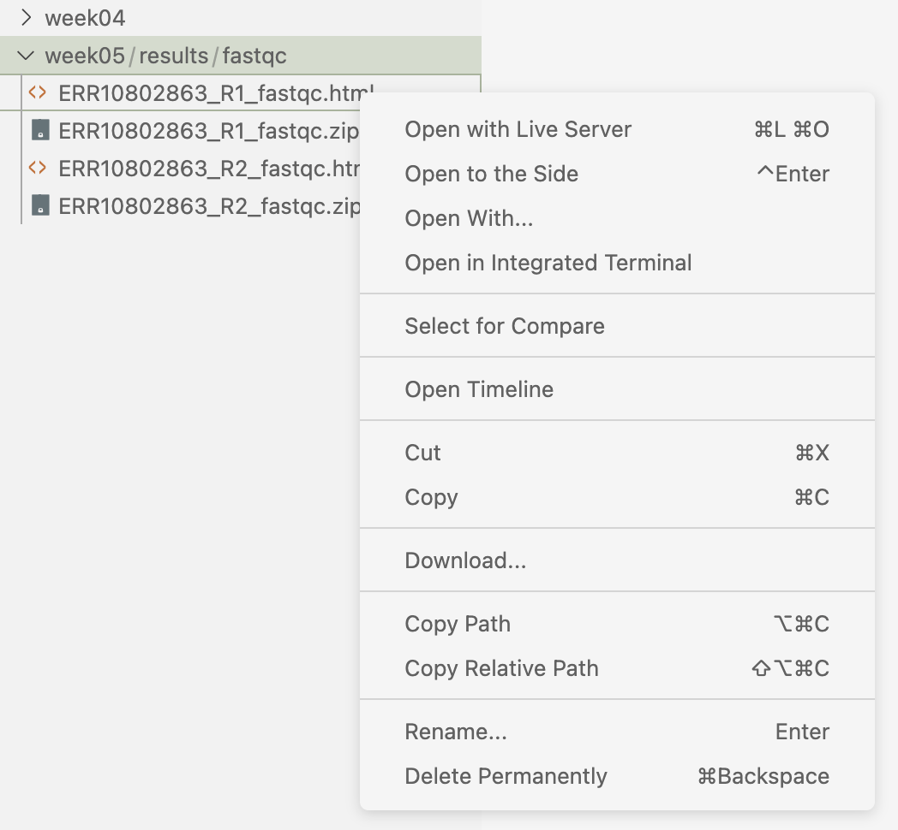

----------------------------------------------------------------------------------------------------

<br>

## Introduction

### Learning goals

As we discussed in the [previous lecture](w6a_osc.qmd),
you can use software at OSC by loading "modules" with system-wide installations,
or by using containers or Conda.
In this session, you will learn to use modules and containers,
while [this optional-reading page covers Conda](../bonus/conda.qmd).

You'll also learn what the program FastQC does and how you can run it.

### Setting up

1. At <https://ondemand.osc.edu>,
   start a VS Code session in `/fs/ess/PAS3493/people/$USER`.
2. Open a terminal and create and then navigate to a `week06` dir.
3. _Optional: Create a new Markdown file for class notes and save it in your `week06` dir._

## Intermezzo I: VS Code revisited

#### Install an extension

::: {.columns}
::: {.column width="75%"}

1. In the Activity Bar, click the `Extensions` icon
   (bottom icon in the screenshot on the right).

2. In the Extensions pane that now fills the Primary (wide) Side Bar,
   search for and then install the extension **Rainbow CSV** (by *mechatroner*).
   This extension makes CSV/TSV files easier to view in the editor pane,
   with column-based colors.

#### Add a keyboard shortcut

Add a keyboard shortcut to send code from your editor pane to the terminal.
That way, you don't have to copy-and-paste code into the terminal when you've
typed it in the editor^[
This is the same type of behavior that you may be familiar with from RStudio.]:

1. Click  (bottom-left) > `Keyboard Shortcuts`.

2. Type "Run Selected Text" in the search box, and you should see the option
   "_Terminal: Run Selected Text in Active Terminal_".

3. Click on that line, then add the shortcut <kbd>Ctrl</kbd>+<kbd>Enter</kbd>.^[
   Don't worry about any warnings that other keybindings exist for this shortcut.]

:::
::: {.column width="25%"}

{fig-align="center" width="35%" fig-alt="The VS Code Extensions icon." .lightbox}

::: legend2
Activity Bar, with the Extensions icon (bottom) highlighted.
:::

:::
:::

:::{.callout-note collapse="false"}
### Self-study: Additional VS Code tips and tricks

- **Automatic whole-line selection**\
  In VS Code's editor pane,
  the _entire line that your cursor is on is selected by default_.
  As such, you don't need to manually select the entire line when wanting to send
  it to the terminal --- or when cutting/copying lines!

- **Downloading files**\
  In the Explorer in the side bar, you can right-click on any file,
  and among the options shown, you should see "**Download...**".
  Click on that to download the file to your computer!
  There is no way to upload, though --- this should be done through the OnDemand
  file browser
  (or using a terminal on your own computer; you'll learn more about that later).

- **Toggling (hiding/showing) the side bars**\
  If you want to save some screen space while coding along in class,
  you may want to occasionally hide the side bars:
  - In  > `View` > `Appearance`,
    you can toggle both the `Activity Bar` and the `Primary Side Bar`.
  - For the primary/wide side bar, you can also drag it away,
    or use the keyboard shortcut <kbd>Ctrl/⌘</kbd>+<kbd>B</kbd>.

- **Auto Save behavior for files in the editor**\
  To change auto-saving behavior,
  which is turned on by default using the "afterDelay" option, you can:
  - Quickly turn it off by clicking  > `File` > `Auto Save`
    (shows a checkmark when activated).
  - Open the Settings ( > `Settings`) and search for "Auto Save",
    where you can pick from several options.

- **The Command Palette**\
  To find and apply any menu option that is available in VS Code,
  the so-called "Command Palette" is handy.
  To access it, click  and then `Command Palette`
  (or press <kbd>F1</kbd> or <kbd>Ctrl/⌘</kbd>+<kbd>Shift</kbd>+<kbd>P</kbd>).
  To use it, start typing something to search for an option.

- **Helpful keyboard shortcuts**

  - Open a terminal: <kbd>Ctrl</kbd>+<kbd>\`</kbd> (backtick)
  - Toggle between the terminal and the editor pane:
    <kbd>Ctrl</kbd>+<kbd>\`</kbd> and <kbd>Ctrl</kbd>+<kbd>1</kbd>.
  - *"Line actions"* in the editor:
    - Move a line up or down: <kbd>Alt/Option</kbd>+<kbd>⬆</kbd>/<kbd>⬇</kbd>
    - Delete a line: <kbd>Ctrl/⌘</kbd>+<kbd>Shift</kbd>+<kbd>K</kbd>
    - The standard copy and cut shortcuts
      (<kbd>Ctrl/⌘</kbd>+<kbd>X</kbd> / <kbd>C</kbd>)
      will **cut/copy the entire line** that the cursor is on!

- **Keyboard shortcuts overview**\
  For a single-page PDF overview of keyboard shortcuts for your operating system:
     \>   `Help`   \>   `Keyboard Shortcut Reference`.
  (Or for direct links to these PDFs on the web:
  [Windows](https://code.visualstudio.com/shortcuts/keyboard-shortcuts-windows.pdf){target="_blank"} /
  [Mac](https://code.visualstudio.com/shortcuts/keyboard-shortcuts-macos.pdf){target="_blank"} /
  [Linux](https://code.visualstudio.com/shortcuts/keyboard-shortcuts-linux.pdf){target="_blank"}.)
:::

## Intermezzo II: The FastQC software

As an example piece of bioinformatics software,
we will use FastQC (@andrews2010) in this session.
FastQC is a ubiquitous tool for **quality control of FASTQ files**:
Running FastQC or a similar program is the first step in nearly any
high-throughput sequencing project.
FastQC is also a good introductory example of a CLI tool.

For each FASTQ file that it analyzes,
FastQC outputs an **HTML file** that you can open in your browser with about a
dozen graphs showing different QC (Quality Control) metrics.
The most important one is this per-base quality score graph:

{fig-align="center" width="70%" fig-alt="An example FastQC per-base quality graph." .lightbox}

## Loading software at OSC with Lmod modules

As discussed in the previous lecture,
much of the software installed at OSC can only be used after its
**module is explicitly loaded** (though basic shell commands and
widely used software like Git, Python, and Apptainer don't need to be loaded).
You can load, unload, and search for available software modules using the
**`module`** command and its sub-commands.

### Searching for available modules

The OSC website has a
[list of installed software](<https://www.osc.edu/resources/available_software/software_list>).
You can also search for available software in the shell
using two subtly different `module` commands:

- `module spider` lists all installed modules.
- `module avail` lists modules that *can be directly loaded* given the current environment
  (i.e., when taking into account which other software has been loaded,
  which can make a difference).

Simply running `module spider` or `module avail` spits out complete lists
of available programs ---
it is therefore more useful to add a **search term** as an argument.
For example, try to use `module spider` to search for `fastqc`:

```bash
module spider fastqc
```
``` {.bash-out}
--------------------------------------------------------------------------------
  fastqc: fastqc/0.12.1
--------------------------------------------------------------------------------

    This module can be loaded directly: module load fastqc/0.12.1

    Help:
      A quality control tool for high throughput sequence data.
```

We can see that `fastqc` is available, namely version `0.12.1`
(that is, the module is printed as `<software>/<version>`).

::: {.callout-warning}
#### Case-sensitivity
These two search commands are not case-sensitive -- but `module load`,
covered below, _is_ case-sensitive.
:::

::: {.callout-warning}
#### Modules may differ depending on which cluster you are at
The various OSC clusters mostly but not entirely have the same modules available!
:::

### Loading modules

All other Lmod software functionality is also accessed using `module` commands.
For instance, to make a program available to you, use the `load` command.

But first, let's confirm that it is not possible to use FastQC before doing so:

```bash
fastqc -v
```
```bash-out
bash: fastqc: command not found...
Failed to search for file: GDBus.Error:org.freedesktop.DBus.Error.NameHasNoOwner: Could not activate remote peer.
```

Notes on the above command:

- The command to run FastQC is `fastqc`
- Like the shell commands you've learned so far, `fastqc` has many options,
  and we can pass FASTQ files as arguments.
- To test for the program's availability, we simply ran `fastqc -v`,
  which prints the FastQC version.

Now, load the module --
specify the module name and its version exactly as `module spider` printed it:

```bash
module load fastqc/0.12.1
```

And then check once again whether you can use FastQC:

```bash
fastqc -v
```
```bash-out
FastQC v0.12.1
```

Success! 🥳

### Final notes on modules

Module loading does **not persist across shell sessions**.
Whenever you are in a fresh shell session
(including but not limited to after you log into OSC for the day),
you'll have to reload any modules you want to use!
And when you run a program that is in a module using a shell script,
include the `module load` command in the script --
we'll see this next week.

Here, we only covered the very basics of using `module`.
To learn a bit more, you can read the boxes below.
In class, we will not go into further detail:
for programs like FastQC that are available as modules,
the basics above are all you need,
and for other programs, we will use containers.

::: {.callout-tip collapse="true"}
#### Other `module` commands  _(Click to expand)_

- To **check which modules are loaded**, use `module list`.
  Its output also includes _automatically_ loaded modules ---
  for example, after loading `fastqc/0.12.1`,
  it may show something like the below, with 5 different modules loaded:

  ```bash
  module list
  ```
  ```{.bash-out}
  Currently Loaded Modules:
    1) intel-oneapi-mkl/2023.2.0   2) intel/2021.10.0   3) mvapich/3.0   4) modules/sp2024   5) fastqc/0.12.1
  ```

- Occasionally, when you run into conflicting (mutually incompatible) modules,
  it can be useful to **unload modules**,
  which you can do with `module unload` or `module purge`:

  ```bash
  # Unload a specific module with 'module unload':
  module unload fastqc/0.12.1

  # Unload all loaded modules with 'module purge':
  module purge
  ```
:::

::: {.callout-note collapse="true"}
#### Another `module load` example: two-step procedure with R _(Click to expand)_

First, test if R is available without loading anything:

```bash
R
```
```bash-out
bash: R: command not found...
```

Nope. Is it available as a module?

```bash
module spider R
```
```bash-out
------------------------------------------------------------------------------------------------------------------------------------------------------------
  R: R/4.4.0
------------------------------------------------------------------------------------------------------------------------------------------------------------

     Other possible modules matches:
        amber, app_code_server, app_jupyter, blender, connectome-workbench, darshan-runtime, darshan-util, deepemhancer, fmriprep, freesurfer, ...

    You will need to load all module(s) on any one of the lines below before the "R/4.4.0" module is available to load.

      gcc/12.3.0

    Help:
      R is 'GNU S', a freely available language and environment for
      statistical computing and graphics which provides a wide variety of
      statistical and graphical techniques: linear and nonlinear modelling,
      statistical tests, time series analysis, classification, clustering,
      etc. Please consult the R project homepage for further information.

------------------------------------------------------------------------------------------------------------------------------------------------------------
  To find other possible module matches execute:

      $ module -r spider '.*R.*'
```

Yes, so let's try to load it:

```bash
module load R/4.4.0
```
```bash-out
Lmod has detected the following error:  These module(s) or extension(s) exist but cannot be loaded as requested: "R/4.4.0"

   You encountered this error for one of the following reasons:
   1. Missing version specification: On Ascend, you must specify an available version.
   2. Missing required modules: Ensure you have loaded the appropriate compiler and MPI modules.

   Try: "module spider R/4.4.0" to view available versions or required modules.

   If you need further assistance, please contact oschelp@osc.edu with the subject line "lmod error: R/4.4.0"
```

That didn't work.
Carefully reading the earlier message printed by `module spider`,
it appears you first need to load the module `gcc/12.3.0` before you can load R.
Specifically, it said:

```bash-out
    You will need to load all module(s) on any one of the lines below before the "R/4.4.0" module is available to load.

      gcc/12.3.0
```

Therefore, let's try to load `gcc` along with `R` --
you can use the command below to load both at the same time:

```bash
module load gcc/12.3.0 R/4.4.0
```
```bash-out
Lmod is automatically replacing "intel/2021.10.0" with "gcc/12.3.0".


Due to MODULEPATH changes, the following have been reloaded:
  1) mvapich/3.0
```

Finally, let's check that R works:

```bash
R
```
```bash-out
R version 4.4.0 (2024-04-24) -- "Puppy Cup"
Copyright (C) 2024 The R Foundation for Statistical Computing
Platform: x86_64-pc-linux-gnu

R is free software and comes with ABSOLUTELY NO WARRANTY.
You are welcome to redistribute it under certain conditions.
Type 'license()' or 'licence()' for distribution details.

  Natural language support but running in an English locale

R is a collaborative project with many contributors.
Type 'contributors()' for more information and
'citation()' on how to cite R or R packages in publications.

Type 'demo()' for some demos, 'help()' for on-line help, or
'help.start()' for an HTML browser interface to help.
Type 'q()' to quit R.

>
```

Now you're in the R console --
type `q()` or use the general keyboard shortcut for exiting,
<kbd>Ctrl</kbd>+<kbd>D</kbd>, to exit R.
:::

::: exercise
####  Exercise: Modules

1. Search for the program MultiQC^[
   MultiQC summarizes the outputs of FastQC and many other bioinformatics programs.]
   -- is it available?

   <!----
   <details><summary>  _Click for the solution._ </summary>

   No, it isn't available!

   ```bash
   module spider multiqc
   ```
   ```bash-out
   Lmod has detected the following error:  Unable to find: "multiqc".
   ```
   </details>
   ---->

2. Search for the program STAR^[
   STAR is an RNA-Seq aligner that we will use to align the reads from our
   example dataset to our reference genome.]
   -- is it available?

   <!----
   <details><summary>  _Click for the solution._ </summary>

   Yes, it's available:

   ```bash
   module spider star
   ```
   ```bash-out
   --------------------------------------------------------------------------------
   star: star/2.7.10b
   --------------------------------------------------------------------------------
     Other possible modules matches:
        starccm
    This module can be loaded directly: module load star/2.7.10b
    Help:
      STAR is an ultrafast universal RNA-seq aligner.
   --------------------------------------------------------------------------------
   To find other possible module matches execute:
      $ module -r spider '.*star.*'
   ```
   </details>
   ---->

3. Load the STAR module and test whether you can use the program
   by running `STAR` (without adding any options).

   <!----
   <details><summary>  _Click for the solution._ </summary>

   ```bash
   module load star/2.7.10b
   STAR
   ```
   ```bash-out
   Usage: STAR  [options]... --genomeDir /path/to/genome/index/   --readFilesIn R1.fq R2.fq
   Spliced Transcripts Alignment to a Reference (c) Alexander Dobin, 2009-2022
   STAR version=2.7.10b
   STAR compilation time,server,dir=2026-06-11T15:35:30-04:00 pitzer-rw02.ten.osc.edu:/tmp/kkoepcke/spack/stage/spack-stage-star-2.7.10b-itj64jf32ufsx7x6kbmlpcprqq5xo5
   in/spack-src/source
   For more details see:
   <https://github.com/alexdobin/STAR>
   <https://github.com/alexdobin/STAR/blob/master/doc/STARmanual.pdf>
   To list all parameters, run STAR --help
   ```
   </details>
   ---->

4. Predict what each of the following will do, and then check whether you were right:
   a. `module load STAR/2.7.10b`
   b. `module unload star/2.7.10b`, followed by `STAR`

   <!----
   <details><summary>  _Click for the solution._ </summary>

   a. You get an error, because `module load` is case-sensitive:
      the module name is lowercase `star`,
      even though the command that it provides is uppercase `STAR`.
   b. You get a "command not found" error:
      after unloading its module, STAR is no longer available.

   </details>
   ---->

5. _Bonus:_ Open a Unix shell on the Cardinal cluster:
   in OnDemand, click "Clusters" in the blue top bar,
   and then "Cardinal Shell Access".
   Also check there whether STAR is available and which versions --
   does it differ from the situation on Pitzer?

   <!----
   <details><summary>  _Click for the solution._ </summary>

   Yes, two different versions are available on Cardinal,
   including a more recent version than on Pitzer:

   ```bash
   module spider star
   ```
   ```bash-out
   -----------------------------------------------------------------------------
   star:
   --------------------------------------------------------------------------------
     Versions:
        star/2.7.10b
        star/2.7.11b
     Other possible modules matches:
        starccm
   ```
   </details>
   ---->

:::

## A practical example: running FastQC on a FASTQ file

We will run FastQC using the module we loaded earlier.
Module loading does not persist across shell sessions,
so to be sure FastQC is available, (re)load the module:

```bash
module load fastqc/0.12.1
```

To analyze a FASTQ file with default FastQC settings,
the command is simply `fastqc` followed by the FASTQ file path --
and we could use one of the FASTQ files in our Garrigos practice data set:

``` bash
# [Don't run this]
fastqc ../garrigos/fastq/S63_R1.fastq.gz
```

To shorten subsequent commands,
let's start by assigning the FASTQ file path to a variable:

```bash
FASTQ_R1=../garrigos/fastq/S63_R1.fastq.gz
```

```bash
ls -lh "$FASTQ_R1"
```
```bash-out
-rw-rw----+ 1 jelmer PAS0471 21M Sep  9 13:46 ../garrigos/fastq/S63_R1.fastq.gz
```

With that, the above command becomes:

```bash
# [Don't run this]
fastqc "$FASTQ_R1"
```

However, an annoying default behavior of FastQC is that it writes its output files
in the same dir that contains the input FASTQ files ---
this means mixing your raw data with your results, which we don't want!

### Changing the output directory?

To figure out how to change that behavior,
consider that many standard shell commands and bioinformatics tools alike
have an option `-h` and/or `--help` to print usage information to the screen.
Let's try that:

``` bash
fastqc -h
```
``` bash-out
            FastQC - A high throughput sequence QC analysis tool

SYNOPSIS

        fastqc seqfile1 seqfile2 .. seqfileN

    fastqc [-o output dir] [--(no)extract] [-f fastq|bam|sam]
           [-c contaminant file] seqfile1 .. seqfileN

# [...output truncated...]
```

<hr style="height:1pt; visibility:hidden;" />

::: exercise
####  Exercise: FastQC help and output dir
Look at FastQC's help info,
and figure out which option can be used to specify a custom output directory.

<!----
<details><summary>  _Click for the solution._ </summary>

The option to do this is `-o`/`--outdir`:

``` bash
fastqc -h
```
``` bash-out
  -o --outdir     Create all output files in the specified output directory.
                    Please note that this directory must exist as the program
                    will not create it.  If this option is not set then the
                    output file for each sequence file is created in the same
                    directory as the sequence file which was processed.
```
</details>
---->

:::

### The final FastQC command

With the added `--outdir` (or `-o`) option,
try to run the following FastQC command:

``` bash
# We'll have to first create the outdir ourselves, in this case:
mkdir -p results/fastqc

# Now we run FastQC:
fastqc --outdir results/fastqc "$FASTQ_R1"
```
``` bash-out
Started analysis of S63_R1.fastq.gz
Approx 5% complete for S63_R1.fastq.gz
Approx 10% complete for S63_R1.fastq.gz
Approx 15% complete for S63_R1.fastq.gz
[...truncated...]
Analysis complete for S63_R1.fastq.gz
```

Success!
Above, FastQC printed some "logging" information to screen,
telling us about its progress.
The main output, however, is in the output dir we specified:

- A `.zip` file, which contains tables with FastQC's data summaries
- An `.html` (HTML) file, which contains the graphs we'd like to see

``` bash
ls -lh results/fastqc
```
``` bash-out
total 512K
-rw-rw----+ 1 jelmer PAS0471 241K Mar 21 09:53 S63_R1_fastqc.html
-rw-rw----+ 1 jelmer PAS0471 256K Mar 21 09:53 S63_R1_fastqc.zip
```

<hr style="height:1pt; visibility:hidden;" />

::: callout-tip
#### Specifying an output dir vs. output file(s)
FastQC allows us to specify the output directory, but not the output file names:
these will be automatically determined based on the input file name(s).
This kind of behavior is fairly common for bioinformatics programs,
since they will often produce multiple output files.
:::

::: exercise
####  Exercise: Another FastQC run

Run FastQC for the corresponding R2 FASTQ file.
Would you use the same output dir or a different one?

<!----
<details><summary>  _Click for the solution._ </summary>

It makes sense to use the same output dir.
This is because, as you could see above,
the output file names have the input file identifiers in them.
As such, because we don't need to worry about overwriting files,
it will be more convenient to have all results in a single dir.

To run FastQC for the R2 (reverse-read) file:

``` bash
FASTQ_R2=../garrigos/fastq/S63_R2.fastq.gz

fastqc --outdir results/fastqc "$FASTQ_R2"
```
``` bash-out
Started analysis of S63_R2.fastq.gz
Approx 5% complete for S63_R2.fastq.gz
Approx 10% complete for S63_R2.fastq.gz
Approx 15% complete for S63_R2.fastq.gz
[...truncated...]
Analysis complete for S63_R2.fastq.gz
```

``` bash
ls -lh results/fastqc
```
``` bash-out
total 1008K
-rw-rw----+ 1 jelmer PAS0471 241K Mar 21 09:53 S63_R1_fastqc.html
-rw-rw----+ 1 jelmer PAS0471 256K Mar 21 09:53 S63_R1_fastqc.zip
-rw-rw----+ 1 jelmer PAS0471 234K Mar 21 09:55 S63_R2_fastqc.html
-rw-rw----+ 1 jelmer PAS0471 244K Mar 21 09:55 S63_R2_fastqc.zip
```

Now, we have four files: two for each of our preceding successful FastQC runs.

</details>
---->
:::

::: exercise
####  Exercise: Download the HTML files and open them

Unfortunately, it's tricky to view HTML files in VS Code --
or at least it is in the current Code Server version at OSC.

Therefore, to look at the FastQC HTML files,
you should first download them to your computer.

We'll cover more scalable methods for downloading files from and uploading them
to OSC in a couple of weeks,
but here is a quick method when you just need one or few files:
in the VS Code file explorer in the side bar,
you can download a file by right-clicking on it and then selecting the
"Download..." option.

{fig-align="center" width="55%" fig-alt="A screenshot showing the file download option in the VS Code file explorer." .lightbox}

Your turn:

1. Download the two FastQC HTML files to your computer.

2. In your computer's file browser, navigate to the folder you downloaded the files to,
   and click on each of them.
   This should open the files in your default web browser.

3. Explore the files.
   Which graphs do you understand, and which ones don't you understand?

4. Are there noticeable differences between the two files
   (i.e., between the forward and reverse reads for the same sample)?
:::

## Using Apptainer containers

As discussed in the previous lecture,
containers are a great way to use programs that aren't available as OSC modules.
Using a container involves two steps:

1. Obtaining a container image (a `.sif` file), which we'll do from **Seqera Containers**.
2. Running the container image to access the software installed inside it.

We'll go over these steps one-by-one.

### Obtaining a container image

#### Finding a container, step-by-step

Here is a step-by-step procedure to find a container image --
again using FastQC version 0.12.1 as the example,
but the procedure would be the same for any other available program:

1. Go to **<https://seqera.io/containers>**

2. In the **search box** below "Containers", type `fastqc`.

3. After waiting for the list to populate,
   the **top hit** should be `bioconda::fastqc`,
   with version `0.12.1` selected
   (the most recent version is always selected by default).

{width="90%" fig-align="center" fig-alt="A screenshot showing the search result for FastQC on the Seqera containers website." .lightbox}

4. **Add FastQC** to your container request by clicking the blue `+ Add` button.
   At this point, you could add additional programs,
   but for this example, we are happy with a container that only has FastQC.

5. In "**Container settings**" below the search box,
   change from `Docker` to `Singularity`
   (and leave the other dropdown as is -- `linux/amd64` should be selected).

{width="90%" fig-align="center" fig-alt="A screenshot showing the correct selections before getting the link to the container." .lightbox}

6. **Get a link** to the container image by clicking the blue
   `Get Container` button.

7. **Copy the link** (URL/URI) to the container image that should appear immediately
   (use the copy icon on the far left).
   The link should be:
   `oras://community.wave.seqera.io/library/fastqc:0.12.1--104d26ddd9519960`

{width="90%" fig-align="center" fig-alt="A screenshot showing the download link for the container." .lightbox}

<hr style="height:1pt; visibility:hidden;" />

::: callout-tip
#### Selecting programs on <https://seqera.io/containers>

A few more tips on selecting programs for your container on this website:

- If we had wanted a **different (older) version of FastQC**,
  we could have used the dropdown menu on the right:

{width="90%" fig-align="center" fig-alt="A screenshot demonstrating how to select a different program version for your container." .lightbox}

- You will always want to **pick Conda-based search hits**,
  which you can recognize in two ways:
  - The program name will be prefixed by `bioconda::` (most commonly) or `conda-forge::`.
  - Its logo, the green open circle (snake) shown in the screenshot above

  (The other hits are typically Python packages,
  which can be recognized by the yellow-and-blue logo.)
:::

::: {.callout-warning collapse="true"}
#### You can't use the container before it's ready _(Click to expand)_

In this case, after we clicked Get Container,
the pop-up box should have immediately said "Container is ready".
That means the container image was already available in the repository.

In other cases, however, the container may still need to be built,
and the box should say **"Fetching container"** for a while.
This could take one or a few minutes,
and even though the URL is made available immediately and won't change,
you can only download/use the container once the "Container is ready".
If you use a URL before the container is ready, you get this error:

```bash
apptainer exec oras://community.wave.seqera.io/library/multiqc_trim-galore:15a1e9f26daf266f \
    multiqc -v
```
```bash-out
FATAL:   Unable to handle oras://community.wave.seqera.io/library/multiqc_trim-galore:15a1e9f26daf266f uri: failed to get checksum for oras://community.wave.seqera.io/library/multiqc_trim-galore:15a1e9f26daf266f: GET https://community.wave.seqera.io/v2/library/multiqc_trim-galore/manifests/15a1e9f26daf266f: MANIFEST_UNKNOWN: manifest unknown; map[Tag:15a1e9f26daf266f]
```
:::

### Running a container image

To run a command in a container, the general syntax is:

```bash
apptainer exec <container-URL> <command>
```

For example, if the command (`<command>` above) you want to run is `fastqc -v`:

```bash
apptainer exec <container-URL> fastqc -v
```

So, you need to preface your "regular" command with `apptainer exec <container-URL>`.
Now with the actual link to the container:

```bash
apptainer exec oras://community.wave.seqera.io/library/fastqc:0.12.1--104d26ddd9519960 \
  fastqc -v
```
```bash-out
INFO:    Downloading oras image
384.0MiB / 384.0MiB [======================================================================================================================] 100 % 51.8 MiB/s 0s
INFO:    gocryptfs not found, will not be able to use gocryptfs
FastQC v0.12.1
```

::: callout-tip
#### Breaking up a command across lines with `\`
Above, I broke the command up across two lines,
which can be done by ending the first line with a `\`.
With a `\`, the shell understands that the command is still incomplete despite the
newline.
Using `\` to break up your commands across multiple lines helps with readability
for long commands like this one.
:::

The **first time** you run this command,
the container image will be downloaded to a default location (see box below),
as you can see in the output above --- this will take a minute or so.

### The container image cache (storage)

The easiest way to run a container image you already downloaded is to simply
reuse the exact same command with the URL to the container (!):
Apptainer will realize that the image has already been downloaded and
will automatically use the downloaded version:

```bash
apptainer exec oras://community.wave.seqera.io/library/fastqc:0.12.1--104d26ddd9519960 \
  fastqc -v
```
```bash-out
INFO:    Using cached SIF image
INFO:    gocryptfs not found, will not be able to use gocryptfs
FastQC v0.12.1
```

- The `Using cached SIF image` line tells you that it is using a
  previously downloaded SIF file.
- You will keep seeing the `gocryptfs not found` message,
  but this is nothing to worry about.

::: {.callout-note collapse="true"}
#### Where is the cache located? _(Click to expand)_

By default, containers are downloaded to a hidden directory in your Home dir,
`~/.apptainer/cache`.
That is generally fine,
but you can change it *for your current shell session* by setting the
`$APPTAINER_CACHEDIR` environment variable, e.g.:

```bash
export APPTAINER_CACHEDIR=/fs/scratch/PAS3493/$USER/containers
```

_(To permanently change this location, you would need to add_
_this line to your `~/.bashrc` shell configuration file._
_We won't cover this file in class.)_

You can check what's in your cache as follows --
though this is only informative in terms of how many containers there are
and how much space they take up,
because the container names are very cryptic:

```bash
apptainer cache list -v
```
```bash-out
NAME                     DATE CREATED           SIZE             TYPE
sha256:e0c976cb2eca5fe   2026-09-20 19:08:51    383.99 MiB       oras

There are 1 container file(s) using 383.99 MiB and 0 oci blob file(s) using 0.00 KiB of space
Total space used: 383.99 MiB
```
<hr style="height:1pt; visibility:hidden;" />
:::

### Using a container instead of a module

In the practical example above,
we ran FastQC on a FASTQ file using the FastQC _module_.
To run the same analysis with the _container_ instead,
you would simply preface the exact same `fastqc` command with
`apptainer exec <container-URL>`.
For example, the container-based equivalent of our final FastQC command would be:

```bash
# [Don't run this]
apptainer exec oras://community.wave.seqera.io/library/fastqc:0.12.1--104d26ddd9519960 \
  fastqc --outdir results/fastqc ../garrigos/fastq/S63_R1.fastq.gz
```

::: exercise
####  Exercise: Containers versus modules

Open a new terminal (click the `+` in the terminal panel),
where no modules have been loaded.
Predict what each of the following commands will do, and then check:

1. ```bash
   apptainer exec oras://community.wave.seqera.io/library/fastqc:0.12.1--104d26ddd9519960 \
     fastqc -v
   ```

   <!----
   <details><summary>  _Click for the solution._ </summary>

   It works: FastQC is installed inside the container,
   so no module needs to be loaded
   (and Apptainer itself is available without loading anything):

   ```bash-out
   INFO:    Using cached SIF image
   INFO:    gocryptfs not found, will not be able to use gocryptfs
   FastQC v0.12.1
   ```
   </details>
   ---->

2. ```bash
   apptainer exec oras://community.wave.seqera.io/library/fastqc:0.12.1--104d26ddd9519960 \
     multiqc --version
   ```

   <!----
   <details><summary>  _Click for the solution._ </summary>

   It fails, because a container only contains the software that was put in it ---
   and this container only has FastQC:

   ```bash-out
   FATAL:   "multiqc": executable file not found in $PATH
   ```
   </details>
   ---->

3. ```bash
   fastqc -v
   ```

   <!----
   <details><summary>  _Click for the solution._ </summary>

   It fails: running a container doesn't install anything,
   and no module has been loaded in this new shell:

   ```bash-out
   bash: fastqc: command not found...
   ```
   </details>
   ---->

:::

## In closing

In research with full-size datasets,
you typically don't want to run bioinformatics programs like FastQC "interactively"
like we just did, i.e. by executing the command directly in the terminal.

Instead, it is preferable to write small shell scripts to run such programs,
and then submit those scripts as so-called "batch jobs" at OSC.
In the coming weeks,
you will learn why that is the case and how you can do this:

- Next week, you'll learn how to write shell scripts and loop over files.
- In week 9, you'll learn how to submit shell scripts as batch jobs.
