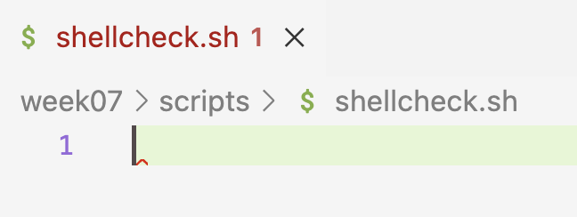
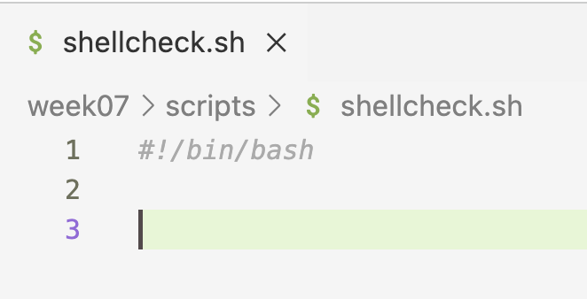
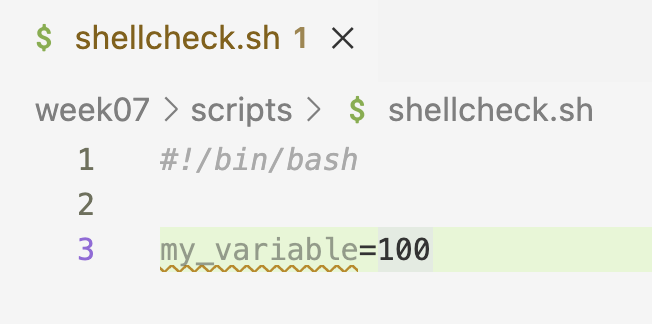
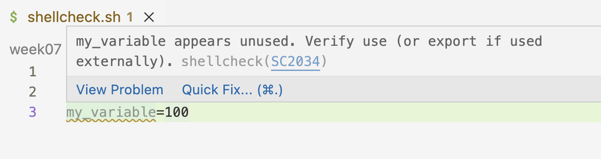
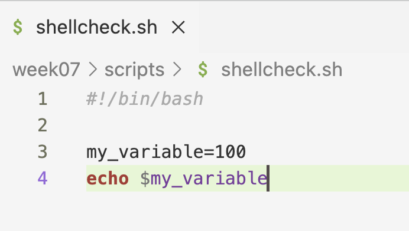

-------

<br>

## Introduction

### Learning Goals

#### This week and the next two weeks

This week, you will learn how to write shell scripts to run programs
with command-line interfaces (CLIs), like various bioinformatics tools.

The end goal is to be able to submit shell scripts as "batch jobs" at OSC,
which e.g. allows you to run them simultaneously many times!
This is extremely useful because with omics analysis,
it's common to have to run the same step for many samples in parallel.
To get there, you still need to learn about the following topics:

1. The basics of shell scripts, using a script to run FastQC as an example _(this session)_
2. Running a script many times with loops _(next session)_
3. Submitting batch jobs with Slurm _(in week 9)_

#### This session

In this session, we will talk about:

- What shell scripts are
- Writing a shell script that runs FastQC
- Boilerplate shell script header lines: shebang and safe settings
- Shell variables
- Command-line arguments to scripts

### Getting ready

#### The usual

1. At <https://ondemand.osc.edu>, start a VS Code session in `/fs/ess/PAS3493/people/$USER`.
2. Open a terminal and create and then navigate to a `week07` dir.
3. **Within the `week07` dir, create a dir `scripts`** (but don't navigate there).
4. _Optional: Create a new Markdown file for class notes and save it in your `week07` dir._

#### Add a VS Code keyboard shortcut

Add a keyboard shortcut to send code from your editor pane to the terminal.
That way, you don't have to copy-and-paste code into the terminal when you've
typed it in the editor^[
This is the same type of behavior that you may be familiar with from RStudio.]:

1. Click  (bottom-left) > `Keyboard Shortcuts`.
2. Type "Run Selected Text" in the search box, and you should see the option
   "_Terminal: Run Selected Text in Active Terminal_".
3. Click on that line, then add the shortcut <kbd>Ctrl</kbd>+<kbd>Enter</kbd>.^[
   Don't worry about any warnings that other keybindings exist for this shortcut.]

#### Install the Shellcheck extension {#install-shellcheck}

The Shellcheck VS Code extension checks your shell scripts for errors and bad
practices, and can be incredibly useful.
But in VS Code Server, there is currently an odd problem with it,
so after installing it, you'll need a work-around to get it to function:

1. In the narrow side bar,
   click on the Extensions icon to switch the wide side bar to Extensions
2. Search for **shellcheck** (by *timonwong*) and install it.

::: {.callout-tip}
#### More VS Code tips and tricks
For many more tips, like useful keyboard shortcuts, settings, and extensions,
see [this optional self-study page on VS Code](../bonus/vscode.qmd).
:::

## Shell scripts

Many bioinformatics tools/programs/software used to analyze omics data
are run from the command line.
In other words, they have a command-line interface (**CLI**).
We can run them using commands that are structurally **very similar** to those of
basic Unix shell commands --- uou saw an example of this when we ran FastQC last week.

However, we've been running shell commands in an "interactive" manner:
typing or pasting them into the shell and then pressing <kbd>Enter</kbd>.
But when you run bioinformatics tools,
it is in most cases a much better idea to **run them via shell scripts**:
plain-text files that contain shell code.

#### Why use shell scripts

Some general reasons why it can be beneficial to use shell scripts
instead of running code interactively line-by-line:

- It is a good way to save and organize your code.
- You can easily rerun scripts and re-use them in similar contexts.

And importantly for our purposes at OSC,
we can **submit scripts as "batch jobs"**, which allows us to:

- Run scripts "remotely" without needing to stay connected to the running process,
  or even to be connected at all to it:
  we can submit a script, log out from OSC and shut down our computer, and it will still run.
- Easily run analyses that take many hours or even multiple days.
- Run a script many times _simultaneously_, such as for different files/samples.

::: {.callout-tip collapse="true"}
#### Recap: Bash vs. shell _(Click to expand)_
So far, we've mostly talked about the Unix _shell_ and _shell_ scripts.
From today onwards, we'll also see the term "Bash" more.

Recall the difference we talked about in the Unix shell intro session:
**there are multiple Unix shell language variants and the specific one we've been**
**using is the Bash shell** (which is by far the most common).

Our shell scripts are therefore in the Bash language,
can be specifically called Bash scripts,
and can be run with the `bash` command.
:::

## A first shell script

### A script to run FastQC

In the previous lecture, you ran FastQC for a FASTQ file
by typing the following commands directly in the terminal:

```bash
# [Don't run this -- this is a recap from last week]
module load fastqc/0.12.1
mkdir -p results/fastqc
fastqc --outdir results/fastqc ../garrigos/fastq/S63_R1.fastq.gz
```

Let's put these commands in a shell script instead.
Create your first script, `fastqc.sh`
(shell scripts usually have the extension `.sh`) as follows:

```bash
# Create an empty file
touch scripts/fastqc.sh
```

A nice VS Code trick mentioned before is that if you hold <kbd>Ctrl</kbd> (Windows)
/ <kbd>⌘</kbd> (Mac) while hovering over a file path in the terminal,
the path should become underlined and you can click on it to open the file.
Try that with the `fastqc.sh` script^[
Alternatively, find the script in the file explorer in the side bar and click
on it there.].
Once the file is open in your editor pane, type or paste the following inside the script:

```{.bash .file filename="scripts/fastqc.sh"}
# Load the OSC module for FastQC
module load fastqc/0.12.1

# Create the output dir if needed
mkdir -p results/fastqc

# Run FastQC
fastqc --outdir results/fastqc ../garrigos/fastq/S63_R1.fastq.gz
```

Shell scripts mostly contain the same Unix shell code you have become familiar with.
As such, this file with three commands (and some comments)
constitutes a **functional shell script**!
One way of running the script is by typing `bash` followed by the path to the script:

```bash
bash scripts/fastqc.sh
```
```{.bash-out}
Started analysis of S63_R1.fastq.gz
Approx 5% complete for S63_R1.fastq.gz
Approx 10% complete for S63_R1.fastq.gz
Approx 15% complete for S63_R1.fastq.gz
[...output truncated...]
Analysis complete for S63_R1.fastq.gz
```

That worked!
But if Shellcheck is working, you should see a red squiggly line on the first
line of your script.
Hover over it to see the warning: Shellcheck wants you to add a "shebang" line,
which you'll learn about in a moment.
Keep an eye out for these squiggly lines ---
Shellcheck will also flag things like typos in variable names.

::: {.callout-tip collapse="true"}
#### Shellcheck in action: screenshots _(Click to expand)_

- Shellcheck shows a red squiggly line when a script has no shebang line,
  and hovering over it tells you why:

  {fig-align="center" width="50%" fig-alt="A screenshot showing a shellcheck warning." .lightbox}

  {fig-align="center" width="80%" fig-alt="A screenshot showing a shellcheck warning." .lightbox}

- Once you add a shebang line, the squiggly line disappears:

  {fig-align="center" width="65%" fig-alt="A screenshot showing a shellcheck warning." .lightbox}

- Shellcheck shows an orange squiggly line when you've assigned a variable
  that you don't use:

  {fig-align="center" width="50%" fig-alt="A screenshot showing a shellcheck warning." .lightbox}

  {fig-align="center" width="70%" fig-alt="A screenshot showing a shellcheck warning." .lightbox}

  Referencing the variable makes the squiggly line disappear:

  {fig-align="center" width="50%" fig-alt="A screenshot showing a shellcheck warning." .lightbox}

- Conversely, Shellcheck warns you when you reference a variable
  that hasn't been assigned --- for example, because of a typo in its name:

  {fig-align="center" width="70%" fig-alt="A screenshot showing a shellcheck warning." .lightbox}
:::

A couple of notes about the commands in the script:

- **Loading the module in the script**\
  Recall that loaded modules don't persist across shell sessions.
  By loading the module inside the script,
  the script will work regardless of whether you have loaded the module in your terminal.
  This will also be important when you run scripts as batch jobs later.

- **Creating the output dir with `mkdir -p`**\
  Recall that FastQC won't create the output dir for you.
  Using `mkdir -p` inside the script ensures that the output dir exists,
  whether or not it existed before running the script
  --- see the box below for details.

:::{.callout-tip collapse="true"}
#### About the `-p` option to `mkdir` _(Click to expand)_

Using `mkdir`'s `-p` option does two things at once,
both of which are very useful when including this command in a script:

- It will enable `mkdir` to create multiple levels of directories at once
  (i.e., to act recursively):
  by default, `mkdir` errors out if the parent directory/ies of the
  specified directory don't yet exist.

  ```bash
  mkdir newdir1/newdir2
  ```
  ```{.bash-out}
  mkdir: cannot create directory ‘newdir1/newdir2’: No such file or directory
  ```

  ```bash
  # This successfully creates both directories:
  mkdir -p newdir1/newdir2
  ```

- If the directory already exists, with `-p`,
  `mkdir` won't do anything and won't return an error.
  Without this option, `mkdir` would return an error,
  which would in turn make the script stop
  (given the settings you'll learn about below):

  ```bash
  mkdir newdir1/newdir2
  ```
  ```{.bash-out}
  mkdir: cannot create directory ‘newdir1/newdir2’: File exists
  ```

  ```bash
  # This does nothing since the dirs already exist
  mkdir -p newdir1/newdir2
  ```
:::

Next, you'll learn about two header lines that are good practice to
add to every shell script.

### Shebang line

A so-called "_shebang_" line is used as the first line of a script to
indicate **which computer language the script uses**:

```sh
#!/bin/bash
```

It starts with **`#!`** (hash-bang), followed by the path to the program that
should run the script: here, Bash, whose executable is located at `/bin/bash`.
Adding a _shebang_ line to every shell script is good practice,
especially when you submit your script to OSC's Slurm queue, as we'll do later.

### Safe shell settings

Some default settings of the Bash shell are bad ideas inside scripts:

- A script **keeps running after a command fails**,
  executing all remaining lines anyway.
  At best, this wastes time, but it can also produce results that are wrong ---
  and if your script prints a lot of output,
  you may not even notice the error message.
- When you **reference a non-existent ("unset") variable**,
  the shell silently replaces it with nothing
  (you'll learn more about variables below).

Therefore, you should add the following line to your shell scripts,
which will change these to safer settings:

```bash
set -euo pipefail
```

With these settings, **the script stops** with an error message if:

- `-e` --- a command fails.
- `-u` --- a non-existent variable is referenced.
- `-o pipefail` --- a command in a shell "pipeline" (e.g., `sort | uniq`) fails.

You don't need to remember these details: simply start every script with this line.
You'll see these settings in action later in this session.

### Adding the header lines to your script

Add the two discussed header lines to your `fastqc.sh` script,
so it will now contain the following:

```{.bash .file filename="scripts/fastqc.sh"}
#!/bin/bash
set -euo pipefail

# Load the OSC module for FastQC
module load fastqc/0.12.1

# Create the output dir if needed
mkdir -p results/fastqc

# Run FastQC
fastqc --outdir results/fastqc ../garrigos/fastq/S63_R1.fastq.gz
```

And run the script again
(this will overwrite the output files from the previous run, which is fine):

```bash
bash scripts/fastqc.sh
```
```{.bash-out}
Started analysis of S63_R1.fastq.gz
Approx 5% complete for S63_R1.fastq.gz
[...output truncated...]
Analysis complete for S63_R1.fastq.gz
```

That didn't change anything to the output,
but at least we confirmed that the script still works.

::: {.callout-note collapse="true"}
#### Can I run scripts without the `bash` command? _(Click to expand)_

It's possible to execute scripts by only typing their path
-- for example:

```bash
# If the script is in a different dir:
scripts/fastqc.sh

# If the script is in your working dir:
./fastqc.sh
```

To be able to do this, the script:

1. Needs to have a _shebang_ line so the computer knows which language to
   execute the script with.
2. Needs to be "executable".
   You can do that by changing the file permissions, e.g.:

  ```bash
  # Add 'execute permissions' for fastqc.sh:
  chmod +x fastqc.sh
  ```

**Why do you need `./` in the example above when the script is in your working dir?**\
The `./` is necessary to make explicit that you're referring to a file name.
Without it (running just `fastqc.sh`),
the shell would look for a command or program of that name, and wouldn't find it.
With yet another step,
it _is_ possible to add your script to the computer's registry of commands/programs,
but we won't cover that here (Google `$PATH` if you're curious).
:::

### The problem with "hard-coded" file paths

Your script works, but it can only do one thing:
run FastQC for the file `S63_R1.fastq.gz`,
with output going to `results/fastqc`.
These file paths are "**hard-coded**" in the script:
to run FastQC for the R2 file of the same sample, or for any other sample,
you would have to edit the script every time.
You'll fix this in two steps:

1. Using **shell variables** to define the file paths only once,
   at the top of the script.
2. Using **command-line arguments** to pass the file paths to the script
   when you run it --- so you won't have to edit the script at all.

## Shell variables

### Variables

Variables are truly ubiquitous in programming.
They are typically used for items that:

- Are referred to repeatedly and/or
- Are subject to change.

These tend to be _settings_ like the paths to input and output files,
and parameter values for programs.
Using variables makes it easier to **change such settings** and makes it possible
to write **scripts that are flexible** depending on user input.
We have already seen some handy applications of variables,
like the environment variable `$USER`, which contains your user name.

#### Assigning and referencing variables

To **assign** a value to a variable in the shell, use the syntax `variable_name=value`:

```bash
# Assign the value "beach" to a variable with the name "location":
location=beach

# Assign the value "200" to a variable with the name "nr_samples":
nr_samples=200
```

:::{.callout-warning}
##### Note: there can't be spaces around the equals sign (`=`)!
:::

To **reference** a variable (i.e., to access its value):

- You need to put a dollar sign `$` in front of its name.
- It is good practice to double-quote (`"..."`) variable names^[
  We'll talk more about quoting later.].

As before with the environment variables `$USER` and `$HOME`,
we'll use the `echo` command to see what values our variables contain:

```bash
echo "$location"
```
```{.bash-out}
beach
```

```bash
echo "$nr_samples"
```
```{.bash-out}
200
```

Conveniently, you can use variables in lots of contexts,
_as if you had directly typed their values_:

```bash
input_file=../garrigos/fastq/S63_R1.fastq.gz

ls -lh "$input_file"
```
```{.bash-out}
-rw-rw----+ 1 jelmer PAS0471 21M Sep  9 13:46 ../garrigos/fastq/S63_R1.fastq.gz
```

::: {.callout-note collapse="true"}
#### In case you're familiar with R: syntax comparison _(Click to expand)_

- Assigning and printing the value of a variable **in R**:

  ``` r
  x <- 5
  x
  ```
  ``` r-out
  [1] 5
  ```

- Assigning and printing the value of a variable **in the Unix shell**:

  ``` bash
  x=5
  echo $x
  ```
  ``` bash-out
  5
  ```

Differences are that in the Unix shell:

- There cannot be any **spaces** around the **`=`** in `x=5`.
- You need a **`$` prefix** to *reference* (but not to *assign*) variables
  in the shell^[
  Because of this, anytime you see a word/string that starts with a `$` in the shell,
  you can safely assume that it is a variable.].
- You need the **`echo`** command, a general command to print text,
  to print the value of `$x` (cf. in R).
:::

### Variable names

In the shell, variable names:

- **Can** contain letters, numbers, and underscores
- **Cannot** contain spaces, periods (`.`), dashes (`-`), or other special symbols^[
  Compare this with the situation for file names,
  which ideally do not contain spaces and special characters either,
  but in which `-` and `.` _are_ recommended.].
- **Cannot start** with a number

Try to make your variable names descriptive,
like `$input_file` above, as opposed to say `$x` and `$myvar`.
There are multiple ways of distinguishing words in the absence of spaces,
such as `$inputFile` and `$input_file`:
I prefer the latter, which is called "snake case".

::: {.callout-tip collapse="true"}
#### Case and environment variables _(Click to expand)_
All-uppercase variable names are pretty commonly used ---
and recall that so-called environment variables such as `$USER` and `$HOME`
are always in uppercase.

My preferred approach is to use lowercase for variables and uppercase for what
we may call "constants", like when you "hard-code" certain file paths or settings.
That means you include them e.g. in a script without allowing them to be set from outside --
more on this later.
:::

### Quoting variables

I have mentioned that it is good practice to quote variables
(i.e. to use `"$myvar"` instead of `$myvar`).
So what can happen if you don't do this?

Let's start by making and moving into a dir to create some messy files:

```bash
mkdir sandbox
cd sandbox
```

If a variable's **value contains spaces**:

  ```sh
  # Assign a string with spaces to variable 'today', and print its value:
  today="Tue, Mar 26"
  echo $today
  ```
  ```bash-out
  Tue, Mar 26
  ```

  ```bash
  # Try to create a file with a name that includes this variable:
  touch README_$today.txt

  # (Using the -1 option to ls will print each entry on its own line)
  ls -1
  ```
  ```bash-out
  26.txt
  Mar
  README_Tue,
  ```

Oops! The shell performed "field splitting" to split the value into three
separate units --- as a result, **three files** were created.
This can be avoided by quoting the variable:

```sh
touch README_"$today".txt
ls -1
```
```bash-out
README_Tue, Mar 26.txt
```

Additionally, without quoting,
you can't explicitly indicate **where a variable name ends**:

```sh
# Start by cleaning the directory
rm *

# We intend to create a file named 'README_Tue, Mar 26_final.txt'
touch README_$today_final.txt
ls -1
```
```bash-out
README_.txt
```

The shell looked for a (non-existent) variable `$today_final`
instead of `$today`,
since it includes all characters until it hits one that can't be part
of a variable name: here, the period.
Quoting solves this, too:

```sh
touch README_"$today"_final.txt
ls -1
```
```bash-out
README_Tue, Mar 26_final.txt
```

```bash
# Move out of the 'sandbox' dir (back to /fs/ess/PAS3493/people/$USER/week07)
cd ..
```

::: {.callout-tip collapse="true"}
#### Curly braces notation: `${myvar}` _(Click to expand)_

The `$var` notation to refer to a variable in the shell is actually an abbreviation
of the full notation, which includes curly braces:

```bash
echo ${today}
```
```bash-out
Tue, Mar 26
```

Putting variable names between curly braces will also make it clear where the
variable name begins and ends, although it does not prevent field splitting:

```sh
touch README_${today}_final.txt

ls
```
```bash-out
26_final.txt  Mar  README_Tue,
```

But you can combine curly braces and quoting:

```sh
touch README_"${today}"_final.txt

ls
```
```bash-out
'README_Tue, Mar 26_final.txt'
```
:::

:::{.callout-note collapse="true"}
#### Quoting as "escaping" -- and double vs. single quotes _(Click to expand)_

By double-quoting a variable,
you are essentially escaping (or "turning off")
the default special meaning of the _space as a field separator_,
and are asking the shell to interpret it as a _literal space_.

Similarly, double quotes will escape other "special characters",
such as shell wildcards. Compare:

```bash
# Due to shell expansion, this will echo/list all files in the current working dir
echo *
```
```{.bash-out}
26.txt Mar README_Tue, README_Tue, Mar 26.txt
```

```bash
# This will simply print the literal "*" character
echo "*"
```
```{.bash-out}
*
```

However, double quotes do **not** turn off the special meaning of `$`
(which is to denote a string as a variable):

```bash
echo "$today"
```
```{.bash-out}
Tue, Mar 26
```

...but **_single quotes_** will:

```bash
echo '$today'
```
```{.bash-out}
$today
```

<hr style="height:1pt; visibility:hidden;" />
:::

### Using variables in your FastQC script

Now, let's change the FastQC script to use variables for the input file and the
output dir:

```{.bash .file filename="scripts/fastqc.sh"}
#!/bin/bash
set -euo pipefail

# Load the OSC module for FastQC
module load fastqc/0.12.1

# Define the input file and output dir
fastq=../garrigos/fastq/S63_R1.fastq.gz
outdir=results/fastqc

# Create the output dir if needed
mkdir -p "$outdir"

# Run FastQC
fastqc --outdir "$outdir" "$fastq"
```

This is an improvement:
the file paths are now clearly defined in one place at the top of the script,
and the output dir, which is used twice, would only need to be changed once.
But you would still need to edit the script to run it for a different FASTQ file.
That's where command-line arguments come in.

## Command-line arguments for scripts

When you run a script, you can pass arguments to it,
such as a file to operate on.
This allows you to make **scripts that are flexible** when it comes to inputs,
outputs, and possibly other settings.
That way, you don't have to hard-code such variable things inside the script,
and can for example run a script many times in parallel to dramatically speed
up your analysis.
All shell scripts that we will write in this course will accept arguments.

### Executing a script with arguments

Executing a script with arguments
is much like when you provide a command like `ls` with arguments,
separated by spaces:

```bash
# [Don't run any of this, these are just syntax examples]

# Pass 2 filenames as arguments to ls:
ls data/sampleA.fastq.gz data/sampleB.fastq.gz

# Pass 2 arguments, an input file and an output dir, to a script:
bash scripts/fastqc.sh data/sampleA.fastq.gz results/fastqc
```

### Positional parameters

Inside the script, any command-line arguments that you pass to it are
**automatically available in variables**,
the so-called "positional parameters".
Specifically:

- Any first argument will be assigned to the variable **`$1`**.
- Any second argument will be assigned to **`$2`**.
- Any third argument will be assigned to **`$3`**, and so on.

So, in the `fastqc.sh` example command above,
`$1` would contain `data/sampleA.fastq.gz` and `$2` would contain `results/fastqc`.

However, even though they are made available,
these variables are **not used** automatically.
So, unless you include code in the script to do something with these variables,
nothing happens with them.

### Using arguments in your FastQC script

In your FastQC script, let's replace the hard-coded file paths with `$1` and `$2`:

```{.bash .file filename="scripts/fastqc.sh"}
#!/bin/bash
set -euo pipefail

# Load the OSC module for FastQC
module load fastqc/0.12.1

# Copy the placeholder variables
fastq="$1"
outdir="$2"

# Create the output dir if needed
mkdir -p "$outdir"

# Run FastQC
fastqc --outdir "$outdir" "$fastq"
```

Only the two lines that define `$fastq` and `$outdir` changed:
their values now come from the command line instead of being hard-coded.

While you _could_ use the `$1`-style variables throughout your script
(e.g., you could have `fastqc --outdir "$2" "$1"`),
I recommend always copying them to descriptively named variables like we did here.
This is better because:

- It will make your script **easier to understand** for others and for your future self.
- It will make it less likely that you accidentally **mix up** the variables.

Now, you can run the script for any FASTQ file without editing it ---
for example, for both FASTQ files of sample `S63`:

```bash
bash scripts/fastqc.sh ../garrigos/fastq/S63_R1.fastq.gz results/fastqc
```
```{.bash-out}
Started analysis of S63_R1.fastq.gz
Approx 5% complete for S63_R1.fastq.gz
[...output truncated...]
Analysis complete for S63_R1.fastq.gz
```

```bash
bash scripts/fastqc.sh ../garrigos/fastq/S63_R2.fastq.gz results/fastqc
```
```{.bash-out}
Started analysis of S63_R2.fastq.gz
Approx 5% complete for S63_R2.fastq.gz
[...output truncated...]
Analysis complete for S63_R2.fastq.gz
```

#### Safe settings in action

What happens if you forget to pass arguments to the script?

```bash
bash scripts/fastqc.sh
```
```{.bash-out}
scripts/fastqc.sh: line 8: $1: unbound variable
```

Thanks to `set -u`, the script stops right away,
with an error message that tells you exactly what went wrong:
the variable `$1` doesn't exist ("is unbound").
Without this setting, the script would have continued with empty values
for `$fastq` and `$outdir`,
leading to much more confusing error messages downstream.

::: exercise
####  Exercise: A script with two arguments

Create a script `scripts/printname.sh` with the following contents:

```{.bash .file filename="scripts/printname.sh"}
#!/bin/bash
set -euo pipefail

first_name="$1"
last_name="$2"

echo "This script will print a first and a last name"
echo "First name: $first_name"
echo "Last name: $last_name"
```

Then, run the script, passing the arguments `John` and `Doe` to it:

```bash
bash scripts/printname.sh John Doe
```
```{.bash-out}
This script will print a first and a last name
First name: John
Last name: Doe
```

In each scenario that is described below, think about what might happen.
Then, run the script as instructed in the scenario to test your prediction.

1. After commenting out the line with `set` settings,
   running the script without passing arguments to it.

   <details><summary>Click here to learn what "commenting out" means</summary>
   You can deactivate a line of code without removing it
   by inserting a `#` as the first character of that line.
   This is often referred to as "commenting out" code.
   For example, below I've commented out the `ls` command,
   and nothing will happen if I run this line:

   ```bash
   #ls
   ```
   </details>

   <!----
   <details><summary>Click here for the solution</summary>
   The script will run in its entirety and not throw any errors,
   because we are now using default Bash settings such that referencing
   non-existent variables does not throw an error.
   Of course, no names are printed either, since we didn't specify any:

   ```bash
   bash scripts/printname.sh
   ```
   ```bash-out
   This script will print a first and a last name
   First name:
   Last name:
   ```

   Being "commented out", the `set` line should read:

   ```bash
   #set -euo pipefail
   ```
   </details>
   ---->

2. Double-quoting the entire name when you run the script,
   e.g.: `bash scripts/printname.sh "John Doe"`.
   _(To get back to where you were, first remove the `#` you inserted in the script_
   _in step 1 above to reactivate the `set` line.)_

   <!----
   <details><summary>Click here for the solution</summary>
   Because we are quoting `"John Doe"`, both names are passed _as a single argument_,
   and both names end up in `$1`, the "first name".
   Then, because no second argument was passed,
   the script stops when trying to copy `$2`:

   ```bash
   bash scripts/printname.sh "John Doe"
   ```
   ```bash-out
   scripts/printname.sh: line 5: $2: unbound variable
   ```
   </details>
   ---->
:::

::: {.callout-note collapse="true"}
#### Why ignoring non-existent variables can be dangerous _(Click to expand)_

The shell's default behavior of ignoring the referencing of unset variables can
lead to accidental file removal as follows:

- Using a variable, you try to remove temporary files whose names start with `temp_`:

  ```bash
  # NOTE: DO NOT run this!
  temp_prefix="temp_"
  rm "$tmp_prefix"*
  ```

- Using a variable, you try to remove a temporary directory:

  ```bash
  # NOTE: DO NOT run this!
  tempdir=output/tmp
  rm -rf $tmpdir/*
  ```

<details><summary> Above, the text specified the _intent_ of the commands. What would have actually happened? _(Click to expand)_</summary>

In both examples, there is a similar typo: `temp` vs. `tmp`,
which means that we are referencing a (likely) non-existent variable.

- In the first example,
  `rm "$tmp_prefix"*` would have been interpreted as `rm *`,
  because the non-existent variable is simply ignored.
  Therefore, we would have **removed all files in the current working directory**.

- In the second example, along similar lines,
  `rm -rf $tmpdir/*` would have been interpreted as `rm -rf /*`.
  Horrifyingly, this would **attempt to remove the entire filesystem**:
  recall that a leading `/` in a path is a computer's root directory.
  (`-r` makes the removal _recursive_ and `-f` _forces_ removal).

</details>

These kinds of accidents are especially likely to happen inside scripts,
where it is common to use variables and to work non-interactively.

But before you get too scared of doing terrible damage, note that at OSC,
you would not be able to remove any essential files
since you don't have the permissions to do so.
On your own computer, this could be more genuinely dangerous, though even there,
you would not be able to remove operating system files without requesting "admin" rights.
:::

:::{.callout-note}
#### Other variables that are automatically available inside scripts:

- **`$#`** contains the _number_ of command-line arguments passed to the script.
- **`$0`** contains the script's file name^[
  Though this does not work when you submit scripts as Slurm batch jobs,
  and we will therefore not use this feature.].
:::

## Recap and next steps

In this session, you've learned the basics of shell scripts,
using a script that runs FastQC as an example.
As you've seen, shell scripts mostly consist of "regular" Unix shell code,
but with some added bells and whistles like:

- Boilerplate shell script header lines: shebang and safe settings
- Variables, to clearly define settings like file paths in one place
- Command-line arguments, which are available in variables in the script
  and make the script flexible without having to edit it

In the next lecture,
you will add "logging" statements to your FastQC script,
and learn how to write loops to easily run a script many times,
such as for every FASTQ file in a dataset.
