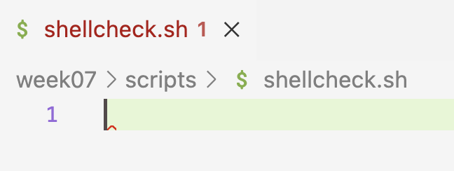
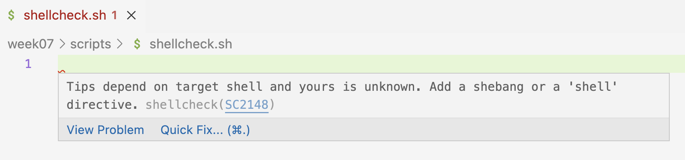
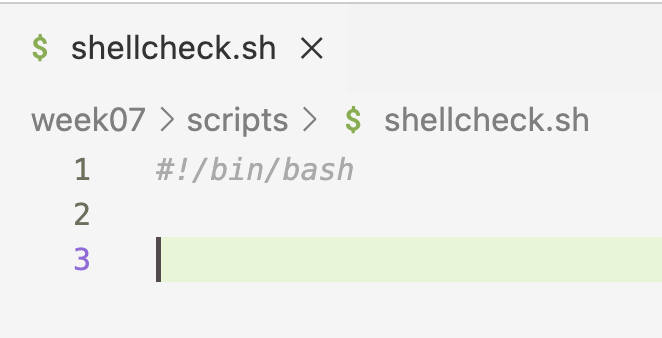
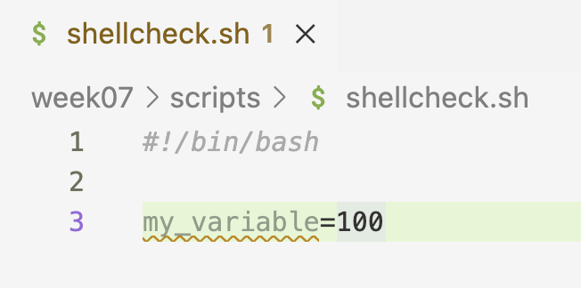
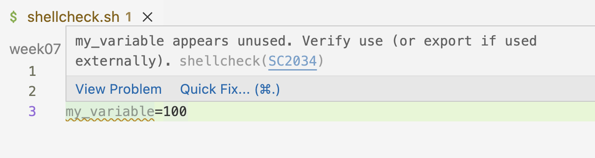
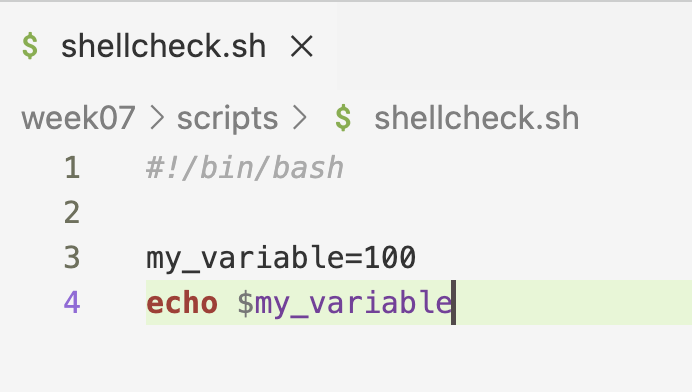
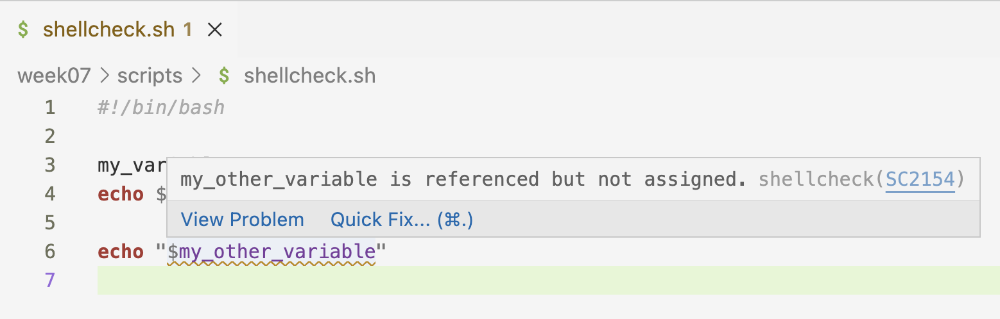

-------

<br>

## Introduction

### Learning Goals

This week, you will learn how to write shell scripts to run programs
with command-line interfaces (CLIs), like various bioinformatics tools.
In this session, we will talk about:

- What shell scripts are
- Writing a shell script that runs FastQC
- Boilerplate shell script header lines: shebang and safe settings
- Shell variables
- Command-line arguments to scripts
- "Logging" statements that report what a script is doing

### Getting ready

#### The usual

1. At <https://ondemand.osc.edu>, start a VS Code session in `/fs/ess/PAS3493/people/$USER`.
2. Open a terminal and create and then navigate to a `week07` dir.
3. **Within the `week07` dir, create a dir `scripts`** (but don't navigate there).
4. _Optional: Create a new Markdown file for class notes and save it in your `week07` dir._

::: {.columns}
::: {.column}

#### Install the Shellcheck VS Code extension {#install-shellcheck}

Shellcheck is a really useful VS Code extension that checks your shell scripts for
errors and bad practices. Install it:

1. In the narrow side bar, click on the Extensions icon.
2. In the wide side bar, search for **shellcheck** (by *timonwong*) and install it.


:::
::: {.column}

<br>

{fig-align="center" width="90%" fig-alt="A screenshot showing the Shellcheck extension in the VS Code extensions marketplace." .lightbox}

:::
:::

<!----
::: {.callout-tip}
#### More VS Code tips and tricks
For many more tips, like on useful keyboard shortcuts, settings, and extensions,
see [this optional self-study page on VS Code](../bonus/vscode.qmd).
:::
----->

## Shell scripts

Many bioinformatics programs to analyze omics data are run from the command line.
In other words, they have a command-line interface (**CLI**).
We can run them using commands that are structurally very **similar** to those of
basic Unix shell commands ---
you saw an example of this when we ran FastQC last week.

However, we've been running shell commands in an "interactive" manner:
typing or pasting them into the shell and then pressing <kbd>Enter</kbd>.
But when you run bioinformatics tools,
it is in most cases a much better idea to **run them via shell scripts**:
plain-text files that contain shell code.

#### Why use shell scripts

Some general reasons why it can be beneficial to use shell scripts
instead of running code interactively line-by-line:

- It is a good way to **save and organize** your code.
- You can easily **rerun** scripts and **re-use** them in similar contexts.

And importantly for our purposes at OSC,
we can submit scripts as **"batch jobs"**, which allows us to:

- Easily perform **long-running** analyses (taking many hours or even multiple days).
- Run analyses **many times simultaneously**, such as for different files/samples.
- Run analyses while being able to **disconnect** from the system.
  We can submit a script, log out from OSC and shut down our computer,
  and it will still run.

We'll talk about batch jobs in two weeks,
and will start learning about shell scripts today.

::: {.callout-tip collapse="true"}
#### Recap: Bash vs. shell _(Click to expand)_
So far, we've mostly talked about the Unix _shell_ and _shell_ scripts.
From today onwards, we'll also see the term "Bash" more.

Recall the difference we talked about in the Unix shell intro session:
there are multiple Unix shell language variants and the specific one we've been
using is Bash (which is by far the most common).

Our shell scripts are therefore in the Bash language,
can be specifically called Bash scripts, and can be run with the `bash` command.
:::

## A first shell script

### A script to run FastQC

In the previous lecture, you ran FastQC for a FASTQ file
by executing the following commands directly in the terminal:

```{.bash .norun}
module load fastqc/0.12.1
mkdir -p results/fastqc
fastqc --outdir results/fastqc ../garrigos/fastq/S63_R1.fastq.gz
```

Let's put these commands in a shell script instead.
Create your first script, `fastqc.sh`
(shell scripts usually have the extension `.sh`) as follows:

```bash
# Create an empty file
touch scripts/fastqc.sh
```

A nice VS Code trick mentioned before is that if you hold <kbd>Ctrl</kbd> (Windows)
/ <kbd>⌘</kbd> (Mac) while hovering over a file path in the terminal,
the path should become underlined and you can click on it to open the file.
Try that with the `fastqc.sh` script^[
Alternatively, find the script in the file explorer in the side bar and click
on it there.].
Once the file is open in your editor pane, type or paste the following inside the script:

```{.bash .file filename="scripts/fastqc.sh"}
# Load the OSC module for FastQC
module load fastqc/0.12.1

# Create the output dir if needed
mkdir -p results/fastqc

# Run FastQC
fastqc --outdir results/fastqc ../garrigos/fastq/S63_R1.fastq.gz
```

Shell scripts mostly contain the same Unix shell code you have become familiar with.
As such, this file with three commands (and some comments)
constitutes a **functional shell script**!

One way of running the script is by typing `bash` followed by the path to the script:

```bash
bash scripts/fastqc.sh
```
```{.bash-out}
Started analysis of S63_R1.fastq.gz
Approx 5% complete for S63_R1.fastq.gz
Approx 10% complete for S63_R1.fastq.gz
Approx 15% complete for S63_R1.fastq.gz
[...output truncated...]
Analysis complete for S63_R1.fastq.gz
```

Nice! A couple of notes about the commands in the script:

- **The module is loaded in the script**\
  Recall that loaded modules don't persist across shell sessions.
  By loading the module inside the script,
  the script will work regardless of whether you have loaded the module in your terminal.
  This will also be important when you run scripts as batch jobs later.

- **The output dir is created with `mkdir -p`**\
  Recall that FastQC won't create the output dir for you.
  Using `mkdir -p` inside the script ensures that the output dir exists,
  whether or not it existed before running the script
  --- see the box below for details.

  :::{.callout-tip collapse="true"}
  #### More about the `-p` option to `mkdir` _(Click to expand)_

  Using `mkdir`'s `-p` option does two things at once,
  both of which are very useful when including this command in a script:

  - It will enable `mkdir` to create multiple levels of directories at once
    (i.e., to act recursively):
    by default, `mkdir` errors out if the parent directory/ies of the
    specified directory don't yet exist.

    ```bash
    mkdir newdir1/newdir2
    ```
    ```{.bash-out}
    mkdir: cannot create directory ‘newdir1/newdir2’: No such file or directory
    ```

    ```bash
    # This successfully creates both directories:
    mkdir -p newdir1/newdir2
    ```

  - If the directory already exists, with `-p`,
    `mkdir` won't do anything and won't return an error.
    Without this option, `mkdir` would return an error,
    which would in turn make the script stop
    (given the settings you'll learn about below):

    ```bash
    mkdir newdir1/newdir2
    ```
    ```{.bash-out}
    mkdir: cannot create directory ‘newdir1/newdir2’: File exists
    ```

    ```bash
    # This does nothing since the dirs already exist
    mkdir -p newdir1/newdir2
    ```
  :::

- **The file paths are relative to your working dir, not to the script**\
  Relative paths in a script, like `results/fastqc` and `../garrigos/...`,
  are interpreted relative to your working dir at the time you _run_ the script ---
  not relative to where the script itself is stored.
  That's why we run the script from within `week07`, as `bash scripts/fastqc.sh`.
  If you instead ran it from within the `scripts` dir (`bash fastqc.sh`),
  FastQC would fail to find the input file.

Next, you'll learn about two header lines that are good practice to
add to every shell script.

### Shebang line

If Shellcheck is working,
you should see a red squiggly line on the first line of your script:

{fig-align="center" width="45%" fig-alt="A screenshot showing a shellcheck warning." .lightbox}

Hover over it to see the warning:
Shellcheck wants you to add a "shebang" line.
(More generally, keep an eye out for these squiggly lines ---
Shellcheck will also flag things like typos in variable names.)

{fig-align="center" width="80%" fig-alt="A screenshot showing a shellcheck warning." .lightbox}

A so-called "_shebang_" line is used as the first line of a script to
indicate **which computer language** the script uses:

```sh
#!/bin/bash
```

It starts with **`#!`** (hash-bang), followed by the path to the program that
should run the script: here, Bash, whose executable is located at `/bin/bash`.
Adding a _shebang_ line to every shell script is good practice,
especially when you submit your script to OSC's Slurm queue, as we'll do later.

### Safe shell settings

Some default settings of the Bash shell are bad ideas inside scripts:

- A script **keeps running after a command fails**,
  executing all remaining lines anyway.
  At best, this wastes time, but it can also produce results downstream of the
  error that are wrong --- and if your script prints a lot of output,
  you may not even notice the error message.
- When you **reference a non-existent ("unset") variable**,
  the shell silently replaces it with nothing
  (you'll learn more about variables below).

To make the script safer and error out when such things happen,
add the following line near the top of your shell scripts:

```bash
set -euo pipefail
```

You'll see these settings in action later in this session.

::: {.callout-note collapse="true"}
#### What does each of these options do? _(Click to expand)_

With these settings, **the script stops** with an error message if:

- `-e` --- a command fails.
- `-u` --- a non-existent variable is referenced.
- `-o pipefail` --- a command in a shell "pipeline" (e.g., `sort | uniq`) fails.

:::

### Adding the header lines to your script

Add the two discussed header lines to your `fastqc.sh` script,
so it will now contain the following:

```{.bash .file filename="scripts/fastqc.sh"}
#!/bin/bash
set -euo pipefail

# Load the OSC module for FastQC
module load fastqc/0.12.1

# Create the output dir if needed
mkdir -p results/fastqc

# Run FastQC
fastqc --outdir results/fastqc ../garrigos/fastq/S63_R1.fastq.gz
```

And run the script again
(this will overwrite the output files from the previous run, which is fine):

```bash
bash scripts/fastqc.sh
```
```{.bash-out}
Started analysis of S63_R1.fastq.gz
Approx 5% complete for S63_R1.fastq.gz
[...output truncated...]
Analysis complete for S63_R1.fastq.gz
```

That didn't change the output,
but we confirmed that the script still works.

::: {.callout-note collapse="true"}
#### Can I run scripts without the `bash` command? _(Click to expand)_

By default, you need to run a script with the `bash` command,
like `bash scripts/fastqc.sh`.
When doing so, you are telling the computer to run the script with Bash
(and the shebang line is actually ignored;
Bash will be used to run the script regardless of what the shebang line says).

It's possible to execute scripts by only typing their path, using syntax like:

```bash
# If the script is in a different dir:
scripts/fastqc.sh

# If the script is in your working dir:
./fastqc.sh
```

To be able to do this, the script:

1. Must have a _shebang_ line so the computer knows which language to execute
   the script with.
2. Must be "executable". You can make it executable by running:

   ```bash
   # Add 'execute permissions' for fastqc.sh:
   chmod +x scripts/fastqc.sh
   ```

----

Finally, why do you need `./` in the second example above (`./fastqc.sh`),
where the script is in your working dir?
The `./` is necessary to make explicit that you're referring to a file name
and not a command. With yet another step,
it _is_ possible to add your script to the computer's registry of commands/programs,
but we won't cover that here (Google `$PATH` if you're curious).
:::

### The problem with "hard-coded" file paths

Your script works, but it can only do one thing:
run FastQC for the file `S63_R1.fastq.gz`,
with output going to `results/fastqc`.
These file paths are "**hard-coded**" in the script:
to run FastQC for the R2 file of the same sample, or for any other sample,
you would have to create a new script or edit the script every time.

Instead, it would be better to make the script **flexible** so that it can run
FastQC for any FASTQ file, with output going to any output dir.
We'll do this in two steps:

1. Using **shell variables** to define the file paths only once,
   at the top of the script.
2. Using **command-line arguments** to pass the file paths to the script
   when you run it, so you won't have to edit the script at all.

## Shell variables

### Variables

In [week 3](../week03/w3a_shell-basics.qmd), you learned about environment variables like `$USER` and `$HOME`,
which are pre-set by the system.
But you can also define your own variables in the shell and in scripts,
which is especially useful for items that:

- Are referred to repeatedly and/or
- Are subject to change

For example, variables may be useful for **settings** like the paths to input and
output files and parameter values for programs.
When using variables, these can be changed in **one place** (the variable definition)
instead of having to change them in multiple places throughout your code.

#### Assigning and referencing variables

To **assign** a value to a variable in the shell, use the syntax `variable_name=value`:

```bash
# Assign the value "inoculated" to a variable with the name "treatment":
treatment=inoculated

# Assign the value "200" to a variable with the name "nr_samples":
nr_samples=200
```

:::{.callout-warning appearance="simple"}
No spaces are allowed around the equals sign: `treatment = inoculated` fails,
because the shell would try to run a command called `treatment`.
:::

To **reference** a variable (i.e., to access its value) by its name:

- Always put a dollar sign `$` in front of it: `treatment` becomes `$treatment`.
- To be safe, also double-quote it: `$treatment` becomes `"$treatment"`.

As before with the environment variables `$USER` and `$HOME`,
use `echo` to see what values your variables contain:

```bash
echo "$treatment"
```
```{.bash-out}
inoculated
```

```bash
echo "$nr_samples"
```
```{.bash-out}
200
```

Conveniently, you can use variables in lots of contexts,
_as if you had directly typed their values_:

```bash
input_file=../garrigos/fastq/S63_R1.fastq.gz

ls -lh "$input_file"
```
```{.bash-out}
-rw-rw----+ 1 jelmer PAS0471 21M Sep  9 13:46 ../garrigos/fastq/S63_R1.fastq.gz
```

<hr style="height:1pt; visibility:hidden;" />

### Variable names

Some rules for variable names in the shell --- they:

- **Can** contain letters, numbers, and underscores
- **Cannot** contain spaces, periods (`.`), dashes (`-`), or other special symbols^[
  Compare this with the situation for file names,
  which ideally do not contain spaces and special characters either,
  but in which `-` and `.` _are_ recommended.]
- **Cannot _start_** with a number

Ideally, variable names are descriptive, like `$input_file` above and not cryptic
like `$x`.
Like with file names, you can distinguish words using capitalization
("camelCase", `$inputFile`) or underscores ("snake case", `$input_file`).
In this course, we'll use lowercase variable names,
but the box at the end of the [arguments section](#constants) explains when
uppercase can be useful.

### Quoting variables

I have mentioned that it is **good practice to quote variables**
(i.e. to use `"$treatment"` instead of `$treatment`).
So what can happen if you don't do this?

Let's start by making and moving into a dir to create some messy files:

```bash
mkdir sandbox
cd sandbox
```

Here's what happens if you don't quote a variable whose **value contains spaces**:

1. Say that you have a variable `today`, and its value contains spaces:

   ```sh
   today="Tue, Mar 26"
   echo $today
   ```
   ```bash-out
   Tue, Mar 26
   ```

2. Next, you try to create a file with a name that includes this variable,
   but you don't quote it:

   ```bash
   touch README_$today.txt

   # (Using the -1 option to ls will print each entry on its own line)
   ls -1
   ```
   ```bash-out
   26.txt
   Mar
   README_Tue,
   ```

3. Oops! The shell performed "field splitting" to split the value into three
   separate units --- as a result, **three files** were created.
   This can be avoided by quoting the variable:

   ```sh
   touch README_"$today".txt
   ls -1
   ```
   ```bash-out
    26.txt
    Mar
    README_Tue,
   'README_Tue, Mar 26.txt'
   ```

Additionally, without quoting,
you can't always indicate **where a variable name ends** ---
explore this in the following exercise.

::: exercise
####  Exercise 1: Where does a variable name end?

First, assign a sample ID to a variable:

```bash
sample_id="A1"
```

For each command below, first predict what it will print,
and then run it to check your prediction.

1. `echo $sample_id.fastq.gz`

2. `echo $sample_id_R1.fastq.gz` (the intent is to print `A1_R1.fastq.gz`)

3. `echo "Processing sample: $sample_ID"`

Finally:

4. Fix the command from item 2 so that it prints `A1_R1.fastq.gz`.

<!----
<details><summary>Click here for the solutions</summary>

1. This works as intended, because a period can't be part of a variable name,
   so the shell knows that the variable name is `sample_id`:

   ```bash-out
   A1.fastq.gz
   ```

2. This prints only `.fastq.gz`!
   Underscores and letters _can_ be part of a variable name,
   so the shell looked for a variable called `sample_id_R1`.
   That variable doesn't exist, and the shell **silently replaced it with nothing**:

   ```bash-out
   .fastq.gz
   ```

3. Variable names are case-sensitive, so `$sample_ID` is a different,
   non-existent variable. Again, the shell doesn't complain,
   it just replaces it with nothing:

   ```bash-out
   Processing sample:
   ```

   This is why the `set -u` setting you added to your script is so useful:
   it makes a script fail with an error message instead.

4. Quote the variable, so that the shell knows where the variable name ends:

   ```bash
   echo "$sample_id"_R1.fastq.gz
   ```
   ```bash-out
   A1_R1.fastq.gz
   ```

</details>
---->
:::

<hr style="height:1pt; visibility:hidden;" />

:::{.callout-note collapse="true"}
#### Quoting as "escaping" --- and double vs. single quotes _(Click to expand)_

By double-quoting a variable, you essentially escape ("turn off")
the default special meaning of the space as a **field separator**,
asking the shell to interpret it instead as a **literal space**.

Similarly, double quotes will escape **other special characters** in the shell,
like shell wildcards. Compare:

- Due to shell expansion, this will show all files in the current working dir:

  ```bash
  echo *
  ```
  ```{.bash-out}
  26.txt Mar README_Tue, README_Tue, Mar 26.txt
  ```

- But with the `*` enclosed in double quotes,
  it will simply print the literal "*" character:

  ```bash
  echo "*"
  ```
  ```{.bash-out}
  *
  ```

However, double quotes do **not** turn off the special meaning of `$`
(which is to denote a string as a variable):

- With **double quotes**, the shell will still interpret `$today` as a variable:

  ```bash
  echo "$today"
  ```
  ```{.bash-out}
  Tue, Mar 26
  ```

- With **single quotes**, the shell will interpret `$today` literally as a string,
  and not as a variable:

  ```bash
  echo '$today'
  ```
  ```{.bash-out}
  $today
  ```

<hr style="height:1pt; visibility:hidden;" />
:::

::: {.callout-tip collapse="true"}
#### Curly braces notation: `${myvar}` _(Click to expand)_

The `$var` notation to refer to a variable in the shell is actually an abbreviation
of the full notation, which includes curly braces:

```bash
echo ${today}
```
```bash-out
Tue, Mar 26
```

Putting variable names between curly braces will also make it clear where the
variable name begins and ends, although it does not prevent field splitting:

```sh
touch README_${today}_final.txt

ls -1 *final*
```
```bash-out
26_final.txt
```

But you can combine curly braces and quoting:

```sh
touch README_"${today}"_final.txt

ls -1 *final*
```
```bash-out
 26_final.txt
'README_Tue, Mar 26_final.txt'
```

<hr style="height:1pt; visibility:hidden;" />

:::

### Using variables in your FastQC script

Now, let's change the FastQC script to use variables for the input file and the
output dir:

```{.bash .file filename="scripts/fastqc.sh"}
#!/bin/bash
set -euo pipefail

# Load the OSC module for FastQC
module load fastqc/0.12.1

# Define the input file and output dir
fastq=../garrigos/fastq/S63_R1.fastq.gz
outdir=results/fastqc

# Create the output dir if needed
mkdir -p "$outdir"

# Run FastQC
fastqc --outdir "$outdir" "$fastq"
```

This is an improvement:
the file paths are now clearly defined in one place at the top of the script,
and the output dir, which is used twice, would only need to be changed once.

But you would still need to edit the script to run it for a different FASTQ file.
Let's see how we can make this more flexible using command-line arguments.

## Command-line arguments for scripts

When you run a script, you can pass arguments to it,
such as an input file and an output dir.
That way, **one script can process any file** without being edited.
And you can run the same script for many files at once (in parallel),
which can dramatically speed up your analysis.
All shell scripts we'll write in this course will accept arguments.

### Executing a script with arguments

Executing a script with arguments
is just like providing a command like `ls` with arguments:

- Pass two file names as arguments to `ls`:

  ```{.norun}
  ls data/sampleA.fastq.gz data/sampleB.fastq.gz
  ```

- Pass two arguments, an input file and an output dir, to a script:

  ```{.norun}
  bash scripts/fastqc.sh data/sampleA.fastq.gz results/fastqc
  ```

### Accessing arguments inside the script

Inside the script, any arguments you pass are
**automatically assigned** to variables named after their position
(we'll call these _placeholder variables_):

- Any **first** argument will be assigned to the variable `$1`
  (above: `data/sampleA.fastq.gz`).
- Any **second** argument will be assigned to `$2`
  (above: `results/fastqc`).
- Any **third** argument will be assigned to `$3` --- _and so on_.

However, the script won't **use** these variables unless you reference them in your code.
Let's see how to do that.

:::{.callout-note}
#### Other variables that are automatically available inside scripts

- **`$#`** contains the _number_ of command-line arguments passed to the script.
- **`$0`** contains the script's file name^[
  Though this does not work when you submit scripts as Slurm batch jobs,
  and we will therefore not use this feature.].
:::

### Using arguments in your FastQC script

In your FastQC script, let's replace the hard-coded file paths with `$1` and `$2`:

```{.bash .file filename="scripts/fastqc.sh"}
#!/bin/bash
set -euo pipefail

# Load the OSC module for FastQC
module load fastqc/0.12.1

# Copy the placeholder variables
fastq="$1"
outdir="$2"

# Create the output dir if needed
mkdir -p "$outdir"

# Run FastQC
fastqc --outdir "$outdir" "$fastq"
```

Only the two lines that define `$fastq` and `$outdir` changed:
their values now come from the command line instead of being hard-coded.

You _could_ use the `$1`-style variables throughout your script, like so:

```{.bash .file filename="fastqc.sh (alternative - don't use)"}
fastqc --outdir "$2" "$1"
```

But I recommend always copying them to descriptively named variables like we did here.
This is better because:

- It will make your script **easier to understand** for others and for your future self.
- It will make it less likely that you accidentally **mix up** the variables.

Now, you can run the script for any FASTQ file without editing it ---
for example, for both FASTQ files of sample `S63`:

```bash
# Move out of the 'sandbox' dir (back to /fs/ess/PAS3493/people/$USER/week07)
cd ..
```

```bash
bash scripts/fastqc.sh ../garrigos/fastq/S63_R1.fastq.gz results/fastqc
```
```{.bash-out}
Started analysis of S63_R1.fastq.gz
Approx 5% complete for S63_R1.fastq.gz
[...output truncated...]
Analysis complete for S63_R1.fastq.gz
```

```bash
bash scripts/fastqc.sh ../garrigos/fastq/S63_R2.fastq.gz results/fastqc
```
```{.bash-out}
Started analysis of S63_R2.fastq.gz
Approx 5% complete for S63_R2.fastq.gz
[...output truncated...]
Analysis complete for S63_R2.fastq.gz
```

::: {.callout-note collapse="true"}
#### Shellcheck and variables _(Click to expand)_

<!----
- Shellcheck shows a red squiggly line when a script has no shebang line,
  and hovering over it tells you why:

  {fig-align="center" width="50%" fig-alt="A screenshot showing a shellcheck warning." .lightbox}

  {fig-align="center" width="80%" fig-alt="A screenshot showing a shellcheck warning." .lightbox}

- Once you add a shebang line, the squiggly line disappears:

  {fig-align="center" width="65%" fig-alt="A screenshot showing a shellcheck warning." .lightbox}

---->

- Shellcheck shows an orange squiggly line when you've assigned a variable
  that you don't use:

  {fig-align="center" width="50%" fig-alt="A screenshot showing a shellcheck warning." .lightbox}

  {fig-align="center" width="70%" fig-alt="A screenshot showing a shellcheck warning." .lightbox}

  Referencing the variable makes the squiggly line disappear:

  {fig-align="center" width="50%" fig-alt="A screenshot showing a shellcheck warning." .lightbox}

- Conversely, Shellcheck warns you when you reference a variable
  that hasn't been assigned --- for example, because of a typo in its name:

  {fig-align="center" width="70%" fig-alt="A screenshot showing a shellcheck warning." .lightbox}
:::

#### Safe settings in action

Our script currently **requires** two arguments: the input FASTQ file and the output dir.
No default values are set for these variables, so if you forget to pass them,
the script won't be able to run successfully.
Let's see what happens exactly if you don't pass arguments to the script:

```bash
bash scripts/fastqc.sh
```
```{.bash-out}
scripts/fastqc.sh: line 8: $1: unbound variable
```

Thanks to our safe settings with `set`, the script stops right away,
with an error message that tells you exactly what went wrong:
the variable `$1` doesn't exist ("is unbound").
Without this setting, the script would have continued with empty values
for `$fastq` and `$outdir`,
leading to much more confusing error messages downstream.

::: exercise
####  Exercise 2: A script with two arguments

1. Create a script `scripts/printname.sh` with the following contents:

   ```{.bash .file filename="scripts/printname.sh"}
   #!/bin/bash
   set -euo pipefail

   first_name="$1"
   last_name="$2"

   echo "This script will print a first and a last name"
   echo "First name: $first_name"
   echo "Last name: $last_name"
   ```

2. What do you think the script's output will be when you run it with the arguments
   `John` and `Doe` like so:

   ```bash
   bash scripts/printname.sh John Doe
   ```

   <!----
   <details><summary>  Click here for the solution</summary>

   ```bash
   bash scripts/printname.sh John Doe
   ```
   ```{.bash-out}
   This script will print a first and a last name
   First name: John
   Last name: Doe
   ```

   </details>
   ---->

Next, in each of the two scenarios described below, think about what might happen.
After you have thought about it,
run the script as instructed in the scenario to test your prediction.

3. Double-quoting the entire name, e.g. `bash scripts/printname.sh "John Doe"`.

   <!----
   <details><summary>  Click here for the solution</summary>
   Because we are quoting `"John Doe"`, both names are passed _as a single argument_,
   and both names end up in `$1`, the "first name".
   Then, because no second argument was passed,
   the script stops when trying to copy `$2`:

   ```bash
   bash scripts/printname.sh "John Doe"
   ```
   ```bash-out
   scripts/printname.sh: line 5: $2: unbound variable
   ```
   </details>
   ---->

4. After "commenting out" the line with `set` settings,
   running the script without passing arguments to it.

   <details><summary>  Click here to learn what "commenting out" means.</summary>
   You can deactivate a line of code without removing it
   by inserting a `#` as the first character of that line.
   This is often referred to as "commenting out" code.
   For example, below I've commented out the `ls` command,
   and nothing will happen if I run this line:

   ```bash
   #ls
   ```
   </details>

   <!----
   <details><summary>  Click here for the solution</summary>
   The script will run in its entirety and not throw any errors,
   because we are now using default Bash settings such that referencing
   non-existent variables does not throw an error.
   Of course, no names are printed either, since we didn't specify any:

   ```bash
   bash scripts/printname.sh
   ```
   ```bash-out
   This script will print a first and a last name
   First name:
   Last name:
   ```

   Being "commented out", the `set` line should read:

   ```bash
   #set -euo pipefail
   ```
   </details>
   ---->

5. What do you expect the output to be when you run the script as follows?

   ```bash
   bash scripts/printname.sh "$USER" '$USER'
   ```

   _Hint: see the box on double vs. single quotes above._

   <!----
   <details><summary>  Click here for the solution</summary>
   The shell expands variables _before_ passing arguments to the script,
   so the first argument is your username.
   The single quotes prevent that expansion, so the second argument is the literal string `$USER`:

   ```bash-out
   This script will print a first and a last name
   First name: jelmer
   Last name: $USER
   ```
   </details>
   ---->

:::

<hr style="height:1pt; visibility:hidden;" />

::: {.callout-warning collapse="true"}
#### Why ignoring non-existent variables can be dangerous _(Click to expand)_

The shell's default behavior of ignoring the referencing of unset variables can
lead to accidental file removal in a couple of ways. Here are two examples:

- Using a variable, you try to remove temporary files whose names start with `temp_`:

  ```{.norun}
  temp_prefix="temp_"
  rm "$tmp_prefix"*
  ```

- Using a variable, you try to remove a temporary directory:

  ```{.norun}
  tempdir=output/tmp
  rm -rf $tmpdir/*
  ```

In both examples, there is a similar typo: `temp` vs. `tmp`,
which means that we are referencing a (likely) non-existent variable.

- In the first example,
  `rm "$tmp_prefix"*` would have been interpreted as `rm *`,
  because the non-existent variable is simply ignored.
  Therefore, we would have removed all files in the current working directory.

- In the second example, along similar lines,
  `rm -rf $tmpdir/*` would have been interpreted as `rm -rf /*`.
  This would attempt to remove the computer's entire filesystem:
  recall that a leading `/` in a path is a computer's root directory
  (`-r` makes the removal _recursive_ and `-f` _forces_ removal).

These kinds of accidents are especially likely to happen inside scripts,
where it is common to use variables and to work non-interactively.

But before you get too scared of doing terrible damage, note that at OSC,
you would not be able to remove any essential files,
since you don't have the permissions to do so.
On your own computer, this could be more genuinely dangerous, though even there,
you would not be able to remove operating system files without requesting "admin" rights.
:::

[]{#constants}

::: {.callout-tip collapse="true"}
#### Hard-coded settings as "constants" _(Click to expand)_

We've made our FastQC script accept arguments,
instead of "hard-coding" variable things like inputs and outputs in the script itself.

You can also use arguments for _settings_ like bioinformatics program options
you may want to vary among different runs of the script,
or relatedly, for information about your data like read length.
If you don't hard-code these options in your script but have arguments for them,
it is easier to re-use your script in different contexts.

But there is a balance to be struck,
and you can also "hobble" your script with a confusing array of arguments.
When you do hard-code potentially variable things in your script,
it's still a good idea to store them in variables that you clearly define
**at the top of your script**.
For example, a quality threshold for a program,
or the URI of an Apptainer container that you use in the script:

```bash
#!/bin/bash
set -euo pipefail

# Settings and constants
MIN_QUAL=30
FASTQC_CONTAINER=oras://community.wave.seqera.io/library/fastqc:0.12.1--104d26ddd9519960
```

Such variables can be referred to as "**constants**":
they make the script easier to maintain (e.g., if you use the value in multiple
places), but unlike variables that get their values from arguments,
they can't be changed from outside the script.

My preferred approach is to use **uppercase** for constants
and **lowercase** for all other variables, so the two are easy to tell apart.
But this is far from universal: it is also fairly common to use uppercase
for all shell variables --- and recall that environment variables
such as `$USER` and `$HOME` are always in uppercase.
:::

## "Logging" statements

### Add logging statements to your script

It is often useful to have your shell script report or "log" what it is doing.
For instance:

- The date and time at which the script was run.
- The arguments that were passed to the script.
- The designated output dirs/files.
- Perhaps even summaries of the output (we won't do this here).

This information can help with troubleshooting and record-keeping.
(One thing to keep in mind is that later,
when you submit scripts as batch jobs,
such logging output will not be printed to screen but will end up in text files.
Therefore, you can store those text files along with other output files to keep
detailed records of what you did!)

Let's add some code to the FastQC script to make it produce logging information:

```{.bash .file filename="scripts/fastqc.sh"}
#!/bin/bash
set -euo pipefail

# Load the OSC module for FastQC
module load fastqc/0.12.1

# Copy the placeholder variables
fastq="$1"
outdir="$2"

# Initial logging
echo "Starting script fastqc.sh"
date
echo "Input FASTQ file:   $fastq"
echo "Output dir:         $outdir"
echo

# Create the output dir if needed
mkdir -p "$outdir"

# Run FastQC
fastqc --outdir "$outdir" "$fastq"

# Final logging
echo
echo "Used FastQC version:"
fastqc --version
echo
echo "Successfully finished script fastqc.sh"
date
```

A couple of notes about the lines that were added to the script above:

- A "marker line" `Successfully finished script` indicates that the end of the
  script was reached. This is useful because of your `set` settings:
  seeing this line printed means that **no errors were encountered**.

- Running `date` at the beginning and end of the script is one way to be able to
  see **how long** the script took to run, and to keep a record of **when** it was run.

- Printing the **input file names** can be particularly useful for troubleshooting.

- The lines that only have `echo` will simply print a blank line,
  basically as a separator between sections.

- For scripts that run bioinformatics tools,
  it's a good idea to include a line that prints the **program version**.

 _Update your `scripts/fastqc.sh` script with the code from the box above._

### Run your final FastQC script

Run your FastQC script again for one FASTQ file:

```bash
bash scripts/fastqc.sh ../garrigos/fastq/S63_R1.fastq.gz results/fastqc
```
```bash-out
Starting script fastqc.sh
Thu Sep 25 13:53:13 EDT 2025
Input FASTQ file:   ../garrigos/fastq/S63_R1.fastq.gz
Output dir:         results/fastqc

Started analysis of S63_R1.fastq.gz
Approx 5% complete for S63_R1.fastq.gz
# [...output truncated...]
Analysis complete for S63_R1.fastq.gz

Used FastQC version:
FastQC v0.12.1

Successfully finished script fastqc.sh
Thu Sep 25 13:53:19 EDT 2025
```

Nice! We got some logging information, and can for example tell that the script
took only 6 seconds to run for this small FASTQ file.

## Recap and next steps

In this session, you've learned the basics of shell scripts,
using a script that runs FastQC as an example.
As you've seen, shell scripts mostly consist of "regular" Unix shell code,
but with some added bells and whistles like:

- Boilerplate shell script **header lines**: shebang and safe settings.
- **Variables**, to clearly define settings like file paths in one place.
- **Command-line arguments**, which are available in variables in the script
  and make the script flexible.
- **Logging statements**, which report what the script is doing.

In the next class, you will learn how to write loops to easily run a script many times,
such as for every FASTQ file or every sample in a dataset.
