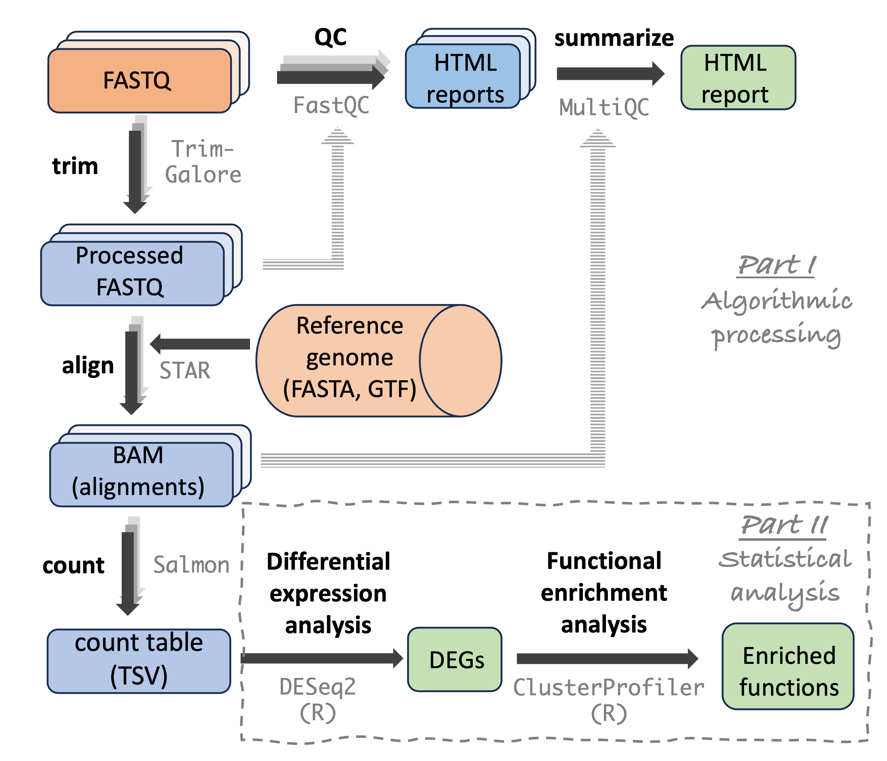

--------------------------------------------------------------------------------

<hr style="height:1pt; visibility:hidden;" />

::: callout-warning
#### This page is a draft and is still under construction.
:::

<hr style="height:1pt; visibility:hidden;" />

## Introduction

In these exercises, you'll practice writing shell scripts to run bioinformatics
programs, and looping over samples to run these scripts multiple times.

The example program is TrimGalore,
a commonly used tool for preprocessing reads in FASTQ files before further analysis.
It's part of the RNA-seq analysis workflow we're gradually applying to the @garrigós2025
data in this course:

{fig-align="center" width="60%" fig-alt="A diagram showing the steps in an RNA-seq analysis pipeline." .lightbox}

<hr style="height:1pt; visibility:hidden;" />

Please do **Exercises 1-3 without any genAI assistance**.
Then, in Exercise 4, you'll hand the script you wrote to a genAI assistant.
This is different from [the second lecture](./w8b_claude.qmd),
where Claude wrote a script from scratch.
At the end, you'll reflect on which approach gave you more confidence in the result.

## What is TrimGalore?

TrimGalore [@krueger2021] is a tool that can trim and filter FASTQ files, removing:

- Any adapter sequences that are present in the reads^[
  Adapters are always added to DNA/cDNA fragments of interest prior to Illumina sequencing,
  and the last bases of a read can "read-through" into the adapter if the fragment
  is shorter than the read length.]
- Poor-quality bases at the end of the reads
- Reads that have become very short after the prior two steps

TrimGalore takes FASTQ files as input, and outputs filtered FASTQ files.
But unlike FastQC, you don't run it on one FASTQ file at a time.

When you have paired-end reads (as with the @garrigós2025 data),
a single TrimGalore run should include **both** the R1 (forward read) and
R2 (reverse read) file for one sample.
This is because R1 and R2 files need to remain "synced":
generally, you can't remove a read from an R1 file without also removing
its mate from the R2.

::: {.callout-note collapse="true"}
#### More about TrimGalore and similar programs _(Click to expand)_

Several largely equivalent tools exist for this kind of FASTQ preprocessing ---
[Trimmomatic](http://www.usadellab.org/cms/index.php?page=trimmomatic) and
[fastp](https://github.com/OpenGene/fastp) are two other commonly used ones.
TrimGalore itself is "just" a wrapper around yet another tool called Cutadapt,
but it is simpler to use.
Two advantages of TrimGalore are:

- It will auto-detect the adapters that are present in your reads.
- It can automatically run FastQC on the trimmed sequences.
:::

## Setting up

1. Start a VS Code session at OSC OnDemand,
   and open your `week08` dir as the VS Code folder,
   like in [the second lecture](./w8b_claude.qmd#prepare-and-open-a-dir-for-this-week)
   (this way, Claude will use your `CLAUDE.md` file from class in Exercise 4).

2. Create a dir `exercises` with a subdir `scripts` (i.e., `week08/exercises/scripts`),
   and in the terminal, **navigate** to the `exercises` dir.

3. Create a file `exercises/README.md` for notes and answers.

4. You'll be working with the familiar `garrigos` FASTQ files.
   It's up to you whether you use the files you already have,
   or copy these FASTQ files into a `data` dir within `week08/exercises`.

## Exercise 1: Get the TrimGalore container

1. At <https://seqera.io/containers>, get a link to a container image
   with TrimGalore version **0.6.10**,
   like you did for FastQC in the
   [week 6 lecture](../week06/w6b_software.qmd#obtaining-a-container-image)
   and for MultiQC in [Graded Assignment 3](../GA/GA3.qmd).
   _(Newer versions exist, so make sure to select 0.6.10:_
   _that's the version we'll use throughout the course.)_

2. To check that the container works,
   use `apptainer exec` with your container link to print the TrimGalore help info
   (`trim_galore --help`).
   You'll use this help info below.

## Exercise 2: Write a TrimGalore script

Write a shell script `scripts/trimgalore.sh`
that runs TrimGalore on paired-end FASTQ files as follows:

- The script should run TrimGalore **once** for each sample's
  R1-R2 pair of FASTQ files

- Your script should accept and process arguments that specify (1) the input
  FASTQ files and (2) the output dir

- Include the standard shell script header lines,
  various "logging statements" with `echo` like we did in the FastQC script,
  and a line that prints the TrimGalore version.

- For each of the items below, figure out the relevant TrimGalore option,
  and use that option:
  - Tell it that the reads are **paired-end**^[
    If you don't do this, TrimGalore will process the two FASTQ files independently.].
  - Set the **output dir**
  - Make it **run FastQC** on the trimmed FASTQ files

- What are the default thresholds for the Phred quality score and read length?
  Can you describe what these parameters do?
  _(You don't have to change them here, the defaults will work fine for us.)_

<details><summary>Hint: See the relevant parts of the TrimGalore help pages _(Click to expand)_</summary><p>

```bash
trim_galore --help
```
```{.bash-out-solo}
 USAGE:
trim_galore [options] <filename(s)>

--paired                This option performs length trimming of quality/adapter/RRBS trimmed reads for
                        paired-end files.

-o/--output_dir <DIR>   If specified all output will be written to this directory instead of the current
                        directory. If the directory doesn't exist it will be created for you.

-j/--cores INT          Number of cores to be used for trimming [default: 1].

--fastqc                Run FastQC in the default mode on the FastQ file once trimming is complete.

--fastqc_args "<ARGS>"  Passes extra arguments to FastQC.

-a/--adapter <STRING>   Adapter sequence to be trimmed. If not specified explicitly, Trim Galore will
                        try to auto-detect whether the Illumina universal, Nextera transposase or Illumina
                        small RNA adapter sequence was used.

-q/--quality <INT>      Trim low-quality ends from reads in addition to adapter removal. [...]
                        Default Phred score: 20.

--length <INT>          Discard reads that became shorter than length INT because of either
                        quality or adapter trimming. A value of '0' effectively disables
                        this behaviour. Default: 20 bp.
```
</p></details>

<details><summary>Hint: Struggling? Here is a script skeleton _(Click to expand)_</summary><p>

Replace the `<...>` parts with your code:

```bash-out-solo
<...header-lines...>

# Constants
TRIMGALORE_CONTAINER=<...>

# Copy the placeholder variables to descriptively named ones
R1=<...>
R2=<...>
outdir=<...>

# Report
echo "Starting script trimgalore.sh"
<...print the date and time...>
echo "Input R1 FASTQ file:      <...>"
<...print other variables...>

# Create the output dir
<...>

# Run TrimGalore
apptainer exec <...> \
    trim_galore \
    <...>
    "$R1" \
    "$R2"

# Report
echo
echo "TrimGalore version:"
<...>
<...other final reporting...>
```
</p></details>

::: {.callout-warning collapse="true"}
#### Don't use/adjust TrimGalore's `--cores` option for now _(Click to expand)_
Since you're running the program interactively on your single-core VS Code compute job,
you only have 1 core at your disposal --- and that's TrimGalore's default.
Therefore, don't adjust this setting here.
Next week, you'll submit this script as a batch job,
giving you the opportunity to use multiple cores.
:::

## Exercise 3: Run your TrimGalore script once

1. Run your TrimGalore script for the FASTQ files of the `S63` sample.
   (Run it directly using `bash <script-path> ...`, don't submit it as a batch job.)

2. Check if everything went well by scanning the output that is printed to screen,
   and by taking a look at TrimGalore's output files.
   What outputs are you finding?
   _(If something went wrong, go back to your `trimgalore.sh` script and try to fix it,_
   _and describe your process in the README.)_

3. Take a closer look at the output that TrimGalore printed to screen
   (note that most of that is also saved in the `*_trimming_report.txt` file in the
   output dir):
   - In each file (R1 and R2), in what percentage of reads were adapters detected?
   - In each file (R1 and R2), what percentage of bases were quality trimmed?
   - What percentage of reads were removed because they were too short?

4. Download the FastQC output for the trimmed R1 file and compare it to the output
   file for the FastQC run on the **raw** R1 file,
   which you did in the
   [week 6 lecture on using software at OSC](../week06/w6b_software.qmd#running-a-fastqc-analysis).
   - Can you see any differences in overall sequence quality?
   - Do the short reads with only `N`s,
     which you saw [in week 4](../week04/w4c_shell-files2.qmd#less-to-page-through-files),
     appear to have been removed?
     The example read in week 4 was 35 bp long,
     which is longer than TrimGalore's default length threshold of 20 bp.
     So how could TrimGalore have removed it?

## Exercise 4: Now bring in genAI

Now that you have a script that _you_ wrote and that you know works,
let's see what a genAI assistant makes of it.

::: {.callout-note appearance="simple"}
These exercises assume you're using Claude in VS Code Server,
as set up in [this week's second lecture](./w8b_claude.qmd).
If that isn't working for you, you can do the same exercises by pasting your script
into [Gemini in the browser](./w8a_genAI.qmd#/signing-in-to-google-gemini) --- but note
that you then lose the automatic file context, so you'll have to provide more
detail in your prompts.
:::

Keep notes on all of the below in your `README.md`:
for each prompt, record what you asked, what you got,
and what you concluded after checking it.

1. Open your `scripts/trimgalore.sh` in the editor and open the Claude panel.
   Check that the script is added as context (you should see its name below the
   prompt box), and that the permission mode is **Manual**.
   Then ask Claude to review your script, for example:

   > Review this shell script. What could be wrong with it, and what would you improve?
   > Don't change the script yet.

   _(Recall from [the first lecture](./w8a_genAI.qmd#/more-pitfalls) that asking_
   _"Is this correct?" invites the model to simply tell you what you want to hear.)_

   Go through the suggestions one at a time:
   - Which suggestions do you agree with?
   - Which do you disagree with, or don't understand?
   - Did it suggest anything that is simply **wrong**,
     or that conflicts with how we've been writing scripts in this course?

2. First, run your script as it is now with an R1 file name that doesn't exist.
   What happens, and at which point does the script stop?

   Then, ask Claude to add something to the script that you haven't written yourself, e.g.:

   > Add a check that both input FASTQ files exist, and exit with an informative
   > error message if they don't

   Claude will show you the proposed change as a diff:
   read it before you accept it.
   Then, **test it** with the same non-existent file name.
   Does it behave the way the AI claimed it would?
   And given what you saw before the change, how useful is this check?

3. Now, ask Claude to write a `for` loop that runs your script for multiple samples:

   > Write a for loop that runs exercises/scripts/trimgalore.sh for the 7 samples whose IDs
   > start with S6, with output dir results/trimgalore.
   > I will run the loop from within the exercises dir.
   > Add it to exercises/README.md.

   ::: {.callout-warning appearance="simple"}
   **Don't run the loop yet!**
   Because you aren't submitting batch jobs yet (you'll do that next week),
   the script will run once for each sample in turn, which takes a while.
   So you'll want to make sure the loop is right first.
   :::

   **Before** running it, check the loop against what you learned in
   [the self-study section of the w7b lecture](../week07/w7b_scripts2.qmd#self-study-looping-over-samples):

   - Does it run the script once per **sample**, rather than once per FASTQ file?
   - Does it get the correct R2 file for each R1 file?
     If you don't understand how it does this, ask Claude to explain that part.
     Recall the `S61` pitfall from
     [the w7b self-study exercise](../week07/w7b_scripts2.qmd#self-study-looping-over-samples):
     would Claude's approach have that problem?
   - Does it only include the 7 `S6` samples?

   Then, test the loop by putting `echo` before the `bash` command,
   so that it only prints the commands it would run.
   If those look right, remove the `echo` and run the loop for real,
   and check TrimGalore's output files once it's done.

4. Next, ask it for something you genuinely don't know how to do yourself,
   related to these exercises.
   Some ideas:
   - Comparing the file sizes of the FASTQ files before and after trimming,
     in a small summary table
   - Summarizing all the `*_trimming_report.txt` files into one overview
   - Anything else you're curious about

   ::: callout-warning
   #### Check every option against the help info
   Whenever the AI suggests **command-line options** --- for TrimGalore or any other
   program --- look them up in that program's help info
   (e.g. `trim_galore --help`) before you believe them,
   or ask Claude to check them against the help info itself,
   like we did in [the second lecture](./w8b_claude.qmd#an-agent-can-check-its-own-claims).
   As we saw in [the first lecture this week](./w8a_genAI.qmd#/trimgalore-prompt),
   making up plausible-looking options that don't exist is one of the most common
   ways these tools fail in a bioinformatics context,
   and the failure is easy to miss because the output _looks_ authoritative.
   :::

5. Finally, write a short reflection in your `README.md`:
   in [the second lecture](./w8b_claude.qmd), Claude wrote a script from scratch,
   while here, you wrote the script yourself first.
   Which approach gave you more confidence that the script is correct, and why?

::: {.callout-tip appearance="simple"}
Hang on to your `trimgalore.sh` script --- you'll start from a very similar script
in [next week's Graded Assignment](../GA/GA4.qmd), where you'll turn it into a
Slurm batch job.
:::

## Solutions

These solutions use the FASTQ files in `../../garrigos/fastq`;
if you copied them into `data`, use `data/` instead.

### Exercise 2

<details><summary> The TrimGalore options you were looking for _(Click to expand)_</summary>

- `--paired` to indicate that the FASTQ files are paired-end
- `--output_dir` (or equivalently, `-o`) to specify the output directory
- `--fastqc` to run FastQC on the trimmed FASTQ files

</details>

<details><summary> A TrimGalore shell script _(Click to expand)_</summary><p>

```bash
#!/bin/bash
set -euo pipefail

# Constants
TRIMGALORE_CONTAINER=oras://community.wave.seqera.io/library/trim-galore:0.6.10--bc38c9238980c80e

# Copy the placeholder variables
R1="$1"
R2="$2"
outdir="$3"

# Report
echo "Starting script trimgalore.sh"
date
echo "Input R1 FASTQ file:      $R1"
echo "Input R2 FASTQ file:      $R2"
echo "Output dir:               $outdir"
echo

# Create the output dir
mkdir -p "$outdir"

# Run TrimGalore
apptainer exec "$TRIMGALORE_CONTAINER" \
    trim_galore \
    --paired \
    --fastqc \
    --output_dir "$outdir" \
    "$R1" \
    "$R2"

# Report
echo
echo "TrimGalore version:"
apptainer exec "$TRIMGALORE_CONTAINER" \
    trim_galore -v
echo "Successfully finished script trimgalore.sh"
date
```
</p></details>

<details><summary> Quality and length threshold options & interpretation _(Click to expand)_</summary>

- The option `-q` (short notation) or `--quality` (long notation) can be used
  to adjust the base quality score threshold, which has the Phred unit we've discussed.
  The default threshold is 20, which corresponds to an estimated 0.01 error rate.
  TrimGalore will trim bases with a lower quality score than this threshold
  from the **end** (3' end) of the reads.
  It will **not** remove or mask bases with lower quality scores elsewhere in the read.

- The option `--length` can be used
  to adjust the read length threshold: any reads that are shorter than this after
  adapter and quality trimming will be removed.
  The default threshold is 20 bp.
  (When the input is paired-end, the corresponding second read will also be removed,
  regardless of its length: paired-end FASTQ files always need to contain both the
  R1 and R2 for each pair; orphan reads would need to be stored in a separate file.)

</details>

### Exercise 3

<details><summary> 1 - Run the script _(Click to expand)_</summary>

```bash
R1=../../garrigos/fastq/S63_R1.fastq.gz
R2=../../garrigos/fastq/S63_R2.fastq.gz
bash scripts/trimgalore.sh "$R1" "$R2" results/trimgalore
```
```bash-out
Starting script trimgalore.sh
Thu Mar 28 10:34:24 EDT 2024
Input R1 FASTQ file:      ../../garrigos/fastq/S63_R1.fastq.gz
Input R2 FASTQ file:      ../../garrigos/fastq/S63_R2.fastq.gz
Output dir:               results/trimgalore

Multicore support not enabled. Proceeding with single-core trimming.
Path to Cutadapt set as: 'cutadapt' (default)
Cutadapt seems to be working fine (tested command 'cutadapt --version')
Cutadapt version: 4.4

# [...output truncated...]
```
</details>

<details><summary> 2 - Check the output files _(Click to expand)_</summary>

```bash
ls -lh results/trimgalore
```
```bash-out
total 42M
-rw-rw----+ 1 jelmer PAS0471 2.4K Mar 28 10:49 S63_R1.fastq.gz_trimming_report.txt
-rw-rw----+ 1 jelmer PAS0471 674K Mar 28 10:49 S63_R1_val_1_fastqc.html
-rw-rw----+ 1 jelmer PAS0471 349K Mar 28 10:49 S63_R1_val_1_fastqc.zip
-rw-rw----+ 1 jelmer PAS0471  20M Mar 28 10:49 S63_R1_val_1.fq.gz
-rw-rw----+ 1 jelmer PAS0471 2.3K Mar 28 10:49 S63_R2.fastq.gz_trimming_report.txt
-rw-rw----+ 1 jelmer PAS0471 676K Mar 28 10:50 S63_R2_val_2_fastqc.html
-rw-rw----+ 1 jelmer PAS0471 341K Mar 28 10:50 S63_R2_val_2_fastqc.zip
-rw-rw----+ 1 jelmer PAS0471  21M Mar 28 10:49 S63_R2_val_2.fq.gz
```
</details>

<details><summary> 3 - Check the trimming results _(Click to expand)_</summary>

- Note that the adapter- and quality trimming results summary for the R1 and R2 files
  are separated widely among all the output that TrimGalore prints ---
  they are printed below (first for the R1, then for the R2 file), and the answers are:

  - 13.0% (R1) and 10.1% (R2) of reads had adapters
  - 3.6% (R1) and 3.5% (R2) of bases were quality-trimmed

  ```bash-out-solo
  === Summary ===

  Total reads processed:                 500,000
  Reads with adapters:                    65,070 (13.0%)
  Reads written (passing filters):       500,000 (100.0%)

  Total basepairs processed:    35,498,138 bp
  Quality-trimmed:               1,274,150 bp (3.6%)
  Total written (filtered):     34,138,461 bp (96.2%)
  ```

  ```bash-out-solo
  === Summary ===

  Total reads processed:                 500,000
  Reads with adapters:                    50,357 (10.1%)
  Reads written (passing filters):       500,000 (100.0%)

  Total basepairs processed:    36,784,563 bp
  Quality-trimmed:               1,283,793 bp (3.5%)
  Total written (filtered):     35,440,230 bp (96.3%)
  ```

- Just before the FastQC logs is a line that reports how many reads were removed
  due to the length filter --- the answer is 6.79%.

  ```bash-out-solo
  Number of sequence pairs removed because at least one read was shorter than the length cutoff (20 bp): 33955 (6.79%)
  ```
</details>

<details><summary> 4 - Check the FastQC output HTML file _(Click to expand)_</summary><p>

Yes, there are clear differences in:

- The mean quality scores, as shown by both the "Per base sequence quality" and the
  "Per sequence quality scores" graphs => qualities are higher after trimming

- The "Per sequence GC content", "Sequence Length Distribution",
  and "Overrepresented sequences" graphs,
  all of which had artefacts related to those very short reads that only
  contained Ns: these reads have been removed by the trimming process.

- Even reads like the 35 bp example from week 4 were removed:
  all of their bases had quality score `#` (Phred score 2),
  so quality trimming removed every base.
  The resulting empty (0 bp) reads were then removed by the length filter,
  together with their mates.

</p></details>

### Exercise 4

Your genAI answers will vary,
but here are some notes on item 2, and what a correct loop for item 3 looks like.

<details><summary> 2 - Running the script with a non-existent file _(Click to expand)_</summary>

Even without the check, the script stops with an error thanks to `set -e`,
because TrimGalore fails.
But it only stops after printing the "Starting" messages and creating the output dir,
and the error message comes from TrimGalore rather than from your script.
An explicit check makes the script fail earlier and more clearly:
useful, but not essential.

</details>

<details><summary> 3 - Run the script for multiple samples _(Click to expand)_</summary><p>

Test the loop:

```bash
for R1 in ../../garrigos/fastq/S6*_R1.fastq.gz; do
    R2=${R1/_R1/_R2}
    echo bash scripts/trimgalore.sh "$R1" "$R2" results/trimgalore
done
```
```bash-out
bash scripts/trimgalore.sh ../../garrigos/fastq/S63_R1.fastq.gz ../../garrigos/fastq/S63_R2.fastq.gz results/trimgalore
bash scripts/trimgalore.sh ../../garrigos/fastq/S64_R1.fastq.gz ../../garrigos/fastq/S64_R2.fastq.gz results/trimgalore
bash scripts/trimgalore.sh ../../garrigos/fastq/S65_R1.fastq.gz ../../garrigos/fastq/S65_R2.fastq.gz results/trimgalore
bash scripts/trimgalore.sh ../../garrigos/fastq/S66_R1.fastq.gz ../../garrigos/fastq/S66_R2.fastq.gz results/trimgalore
bash scripts/trimgalore.sh ../../garrigos/fastq/S67_R1.fastq.gz ../../garrigos/fastq/S67_R2.fastq.gz results/trimgalore
bash scripts/trimgalore.sh ../../garrigos/fastq/S68_R1.fastq.gz ../../garrigos/fastq/S68_R2.fastq.gz results/trimgalore
bash scripts/trimgalore.sh ../../garrigos/fastq/S69_R1.fastq.gz ../../garrigos/fastq/S69_R2.fastq.gz results/trimgalore
```

Looks good? Then run the loop:

```bash
for R1 in ../../garrigos/fastq/S6*_R1.fastq.gz; do
    R2=${R1/_R1/_R2}
    bash scripts/trimgalore.sh "$R1" "$R2" results/trimgalore
done
```
```bash-out
# (Output not shown, same as earlier but should repeat for each sample)
```
</p></details>

<details><summary> 3 - Check the output files _(Click to expand)_</summary>

```bash
ls -lh results/trimgalore
```
```bash-out
total 949M
-rw-rw----+ 1 jelmer PAS0471  20M Mar 28 11:18 S63_R1_val_1.fq.gz
-rw-rw----+ 1 jelmer PAS0471 2.4K Mar 28 11:17 S63_R1.fastq.gz_trimming_report.txt
-rw-rw----+ 1 jelmer PAS0471 674K Mar 28 11:18 S63_R1_val_1_fastqc.html
-rw-rw----+ 1 jelmer PAS0471 349K Mar 28 11:18 S63_R1_val_1_fastqc.zip
-rw-rw----+ 1 jelmer PAS0471  21M Mar 28 11:18 S63_R2_val_2.fq.gz
-rw-rw----+ 1 jelmer PAS0471 2.3K Mar 28 11:18 S63_R2.fastq.gz_trimming_report.txt
-rw-rw----+ 1 jelmer PAS0471 676K Mar 28 11:18 S63_R2_val_2_fastqc.html
-rw-rw----+ 1 jelmer PAS0471 341K Mar 28 11:18 S63_R2_val_2_fastqc.zip
-rw-rw----+ 1 jelmer PAS0471  21M Mar 28 11:19 S64_R1_val_1.fq.gz
-rw-rw----+ 1 jelmer PAS0471 2.7K Mar 28 11:18 S64_R1.fastq.gz_trimming_report.txt
-rw-rw----+ 1 jelmer PAS0471 675K Mar 28 11:19 S64_R1_val_1_fastqc.html
-rw-rw----+ 1 jelmer PAS0471 349K Mar 28 11:19 S64_R1_val_1_fastqc.zip
-rw-rw----+ 1 jelmer PAS0471  22M Mar 28 11:19 S64_R2_val_2.fq.gz
-rw-rw----+ 1 jelmer PAS0471 2.6K Mar 28 11:19 S64_R2.fastq.gz_trimming_report.txt
-rw-rw----+ 1 jelmer PAS0471 671K Mar 28 11:19 S64_R2_val_2_fastqc.html
-rw-rw----+ 1 jelmer PAS0471 336K Mar 28 11:19 S64_R2_val_2_fastqc.zip
-rw-rw----+ 1 jelmer PAS0471  21M Mar 28 11:20 S65_R1_val_1.fq.gz
-rw-rw----+ 1 jelmer PAS0471 2.6K Mar 28 11:19 S65_R1.fastq.gz_trimming_report.txt
-rw-rw----+ 1 jelmer PAS0471 682K Mar 28 11:20 S65_R1_val_1_fastqc.html
-rw-rw----+ 1 jelmer PAS0471 361K Mar 28 11:20 S65_R1_val_1_fastqc.zip
[...output truncated...]
```
</details>
