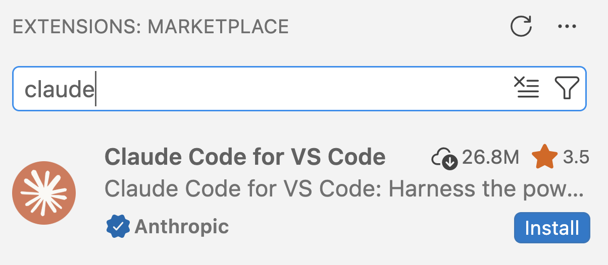

## This week

::: {.columns}
::: {.column width="47%"}

### [Lecture A _(today)_]{style="display:block; text-align:center;"}

- Background of generative AI (genAI)
- Ohio State's genAI tools
- How chat-based and agentic AI differ
- What to use (and not use) genAI for

::: {.fragment data-fragment-index="1"}

- Chat-based examples with Google Gemini
- Writing effective prompts,\
  and common pitfalls
- Partial setup of Claude Code and\
  GitHub Copilot in VS Code

:::

:::
::: {.column width="6%"}

:::

::: {.column width="47%" .fragment data-fragment-index="2"}

### [Lecture B]{style="display:block; text-align:center;"}

- Use Claude Code to help with coding
- Let Claude act as an "agent"
- Give Claude persistent instructions
- Manage Claude's context window and costs

. . .

::: {.callout-note .fragment data-fragment-index="2"}
#### [Self-study content: GitHub Copilot](/bonus/copilot.qmd)

- Setup and use
- Code completions

:::

:::
:::

## Poll: you and genAI

::: {.callout-note .quiz}
#### Do you use genAI for ...

::: {.columns}
::: {.column width="50%"}
- Generating text?
- Enhancing and editing your writing?
- Summarizing, note-taking, or quizzing yourself?
- Translation or language support?
- Generating images, video, or audio?
:::
::: {.column width="50%"}
- Data analysis and presentation?
- Writing computer code?

- Something else?
- None of the above?
:::
:::
:::

::: {.callout-note .quiz}
#### Other

- Complete the sentence: _"I feel ____ about AI"_.
- How often do you deliberately use AI? (hourly/daily/weekly/rarely/never)
- Do you feel seriously conflicted about: (1) any use of AI or (2) use for specific purposes?
:::

::: footer
:::

# Generative AI background {background-color="#A7B1B7"}

## AI in biology and omics

Conventional **machine learning** (ML) is a kind of AI and has been used for
decades in biology,\
but more sophisticated **neural-network** based AI has been developed
more recently:

::: {.columns}
::: {.column width="47%" .fragment data-fragment-index="1"}

### [1. Predictive deep learning]{style="display:block; text-align:center;"}

Commonly used in the past decade, e.g.:

- **AlphaFold 2** predicts 3D protein structure from sequence.
- **DeepVariant** calls DNA variants from sequencing data.

::: {.callout-tip appearance="simple" .fragment data-fragment-index="2"}
Also used outside of omics/bioinformatics, like image classification,
e.g., characterizing soybean defoliation from drone images [@zhang2022].
:::

:::
::: {.column width="6%"}

:::
::: {.column width="47%" .fragment data-fragment-index="3"}

### [2. Generative AI (genAI)]{style="display:block; text-align:center;"}

- **Create new content** such as text, images, code, proteins, and DNA. In biology:
  - **RFdiffusion** designs new proteins
  - **Evo 2** generates DNA sequences at scale

 

::: {.callout-tip appearance="simple"}
Plant pathology example: design of new rice immune receptors
that recognize pathogen proteins [@zhu2026].
:::

:::
:::

::: footer
:::

----

::: {.columns}
::: {.column width="68%"}

{fig-align="center" width="100%" fig-alt="Nested circles: artificial intelligence contains machine learning, which contains neural networks, which contain deep learning, which contains LLMs." .lightbox}

:::
::: {.column width="32%"}

### AI hierarchy {.h2-style}

- Today's generative AI is built on **deep learning**,
  which is a subset of **neural networks**,
  which is a subset of **machine learning**,
  which is a subset of **artificial intelligence**.

  _(In the figure, GANs and LLMs are examples of genAI.)_

. . .

- **Large Language Models (LLMs)** are the kind of generative AI
  that understands and generates text, including code.

        

::: legend2
Image by\
[Gladstone Institutes](https://gladstone-institutes.github.io)
:::

:::
:::

::: footer
:::

## Large Language Models (LLMs)

**LLMs** are trained on vast amounts of text,
and have been extremely prominent since ChatGPT's launch in late 2022.

. . .

> In simple terms, LLMs such as ChatGPT aim to predict the next part of a word or
> phrase based on a user-provided text prompt.
>
> --- @cooper2024

. . .

**However**:

- Older models only looked at the last few words
  (e.g., early search autocomplete).

- LLMs use an architecture called **"transformers"**,
  which considers the broader context:\
  the full input text *and* the output generated so far.

## What's in a name: ChatGPT

::: {.columns}
::: {.column width="29%" .box-tertiary .fragment data-fragment-index="1"}
***G = Generative***

- The model creates new content.
:::

::: {.column width="2%"}
:::

::: {.column width="29%" .box-primary .fragment data-fragment-index="2"}
***P = Pre-trained***

- It only knows about the data it was trained on.
- Anything after the training cutoff date is unknown to the model.
:::

::: {.column width="2%"}
:::

::: {.column width="30%" .box-secondary .fragment data-fragment-index="3"}
***T = Transformer***

- The architecture that lets it consider the broader context of the text.
:::
:::

. . .

::: {.callout-note}
#### Beyond the training data
Many genAI tools can also use information outside of their training data,
such as **a file you upload** or **web search results**,
by adding it to the input text.

This has become much more common in the last few years:
many tools now automatically search the web when a question is about recent events.
:::

::: footer
:::

## How LLMs are trained

::: {.columns}
::: {.column width="30%" .box-blue .fragment data-fragment-index="1"}
### 1. Pre-training

Learn to predict the next word from huge amounts of text (web, books, code).

The model knows a lot, but can't yet answer questions or follow instructions.
:::
::: {.column width="3%"}
:::
::: {.column width="30%" .box-amber .fragment data-fragment-index="2"}
### 2. Fine-tuning

Train on example conversations,
so the model follows instructions and acts as an assistant.
:::
::: {.column width="3%"}
:::
::: {.column width="30%" .box-teal .fragment data-fragment-index="3"}
### 3. Reinforcement learning

Reward good answers, as rated by humans or checked automatically.
:::
:::

. . .

::: {.callout-note .info}
#### Why this matters
- Human ratings reward answers people like,
  which is one cause of **sycophancy** [@sharma2023].
- Automatic checks work especially well for **code and math**,
  which is one reason why genAI is particularly strong at coding.
:::

## Tokens and the context window

::: {.columns}
::: {.column width="47%"}

### [Tokens]{style="display:block; text-align:center;"}

- LLMs read and write **tokens**, not words:
  pieces of words, roughly ¾ of a word each.
- Usage limits and costs are counted in tokens.

:::
::: {.column width="6%"}

:::
::: {.column width="47%" .fragment data-fragment-index="1"}

### [Context window]{style="display:block; text-align:center;"}

- The **maximum number of tokens** a model can consider at once:
  its "working memory".
- Includes everything in the conversation:
  your prompts, uploaded files, and the model's responses.

:::
:::

. . .

::: {.callout-note}
#### Performance degrades with conversation length
Answers get worse well before the context window is full,
and e.g. the middle tends to get "lost".\
Once it is full, older parts are dropped or summarized.

Start a new chat for each new task ---
and even within a task, once a conversation gets long.
:::

## Making sense of model names

A model name like **Claude Sonnet 5.5** combines three "levels":

::: {.columns}
::: {.column width="31%" .box-blue .fragment data-fragment-index="1"}
### 1. Company

Companies each make their own models --- the frontier:

- **Anthropic**: Claude
- **OpenAI**: GPT
- **Google**: Gemini

:::
::: {.column width="3%"}
:::
::: {.column width="31%" .box-amber .fragment data-fragment-index="2"}
### 2. Tier

Each company offers models of different sizes. For Claude:

- **Haiku**: small, fast, cheap
- **Sonnet**: mid-size
- **Opus**: most capable, but slower and pricier

:::
::: {.column width="3%"}
:::
::: {.column width="31%" .box-teal .fragment data-fragment-index="3"}
### 3. Version

Each tier is updated regularly:

- E.g., Claude Opus in 2026: 4.6 → 4.7 → 4.8 → 5 → 5.5.

- Each update is generally an improvement.
:::
:::

. . .

::: {.callout-note .info appearance="simple"}
**Tool ≠ model:** chat tools often let you pick a model,
and some tools use another company's models.\
For example, the tool Microsoft Copilot mainly runs OpenAI's GPT models.
:::

::: footer
:::

----

::: {.columns}
::: {.column width="35%"}

### "PhD-level intelligence"? {.h2-style}

. . .

{fig-align="left" width="95%" fig-alt="An AI-generated image illustrating the alphabet" .lightbox}

::: legend2
A 2025 AI-generated alphabet poster\
by [Maria Sukhareva](https://www.linkedin.com/posts/msukhareva_ai-tech-share-7346777128488640515-bTAd/).
:::
:::
::: {.column width="65%"}

. . .

> _"How many n's are in the word unconventional?"_

{fig-align="center" width="100%" fig-alt="A screenshot of a Microsoft Copilot response counting letters in a word" .lightbox}

. . .

> _"How many b's are in the word blueberry?"_

{fig-align="center" width="80%" fig-alt="A screenshot of a Microsoft Copilot response counting letters in a word" .lightbox}

::: legend2
Note, e.g., the discrepancy between the two answers.
:::

:::
:::

::: footer
:::

## A fast-moving field

- Striking failures like those on the previous slide (from 2025)
  are often fixed in the next version.\
  So, any impressions of what genAI can't do may quickly become outdated!

. . .

- You should also consider the so-called "**jagged frontier**" of genAI:\
  you can't generalize its performance or intelligence based on very bad or very
  good examples.

. . .

- Not all problems have seen quick resolution: e.g.,
  that of making things up ("hallucinations").

. . .

::: callout-note
## Still: Why couldn't it count letters?

- LLMs see **tokens** (word chunks), and each token is converted to a **number**
  before it enters the model.
  So "unconventional" may arrive as just 2–3 numbers, and the letters are gone.

- To see how text is split into tokens, paste "unconventional" and
  a DNA sequence like `ATGGCGTTAGCCATTAGC` into a
  [tokenizer ](https://platform.openai.com/tokenizer){target="_blank"}.
  Click "Token IDs" to see the numbers the model receives.

- **As applied to omics:** don't ask a chat AI to count bases, compute GC content,
  or reverse-complement a sequence by reading it.
  Ask it for **code** that does this, or to run non-AI tools that do it (more later).

:::

::: footer
:::

## Video: Large language models explained briefly



::: footer
:::

# Ohio State genAI adoption {background-color="#A7B1B7"}

## Ohio State goes all-in

Ohio State is one of a number of universities that have embraced genAI in education:

> Ohio State is leading a bold, groundbreaking initiative to integrate artificial intelligence into the undergraduate educational experience. The initiative will ensure that every Ohio State student, beginning with the class of 2029, will graduate being AI fluent — fluent in their field of study, and fluent in the application of AI in that field.
>
> --- <https://oaa.osu.edu/ai-fluency>

. . .

::: {.callout-note .quiz}
#### Your experiences

- What have you noticed of this initiative?

- More broadly, in your other courses:
  - What have you been taught about AI?
  - What kind of policies have been in place?
:::

::: footer
:::

## A Nature News Feature

Last year, Nature published a News Feature about
[genAI adoption at universities ](https://www.nature.com/articles/d41586-025-03340-w){target="_blank"}:

{fig-align="center" width="60%" fig-alt="A screenshot of a Nature article" .lightbox}

::: legend2
@pearson2025
:::

## A Nature News Feature

::: {.columns}
::: {.column width="58%"}

> At Ohio State University in Columbus, students this year will take
> **compulsory AI classes** as part of an initiative to ensure that all of them
> are ‘**AI fluent**’ by the time they graduate.

::: {.fragment data-fragment-index="1"}

> But many education specialists are **deeply concerned** about the explosion of AI
> on campuses: they fear that AI tools are **impeding learning** because they’re
> so new that teachers and students are struggling to use them well.
> Faculty members also worry that students are using AI to **short-cut their way**
> through assignments and tests,
> and some research hints that **offloading mental work** in this way can stifle
> independent, critical thought.

:::

:::
::: {.column width="3%"}
:::
::: {.column width="39%"}

::: {.callout-note .quiz .fragment data-fragment-index="2"}
#### So, not everyone agrees this is a good thing. What do you think?
:::

 

::: {.callout-tip .fragment data-fragment-index="3"}
#### See also

- @sengupta2025: _PhD training needs a reboot in an AI world_\
  [(this week's reading)]{style="color:var(--color-secondary)"}
- @lenharo2026: _Is AI ruining our skills? Early results are in --- and they're not good_\
  [(optional reading)]{style="color:var(--color-secondary)"}

:::
:::
:::

----

{fig-align="center" width="63%" fig-alt="A graph from a Nature article" .lightbox}

::: {.columns}
::: {.column width="15%"}

:::
::: {.column width="70%"}

::: {.callout-note .quiz}
#### How do these numbers compare to our poll?
:::

:::
::: {.column width="15%"}

:::
:::

::: footer
:::

## GenAI in this course and in your research

::: {.columns}
::: {.column width="47%"}

### [In this course]{style="display:block; text-align:center;"}

- From this week on, you're allowed to use genAI for all graded course components.

- [**But**]{.underline} you must always be able to **explain your reasoning and code**,
  and **document** how you used genAI.

:::
::: {.column width="6%"}

:::
::: {.column width="47%" .fragment data-fragment-index="1"}

### [In your research]{style="display:block; text-align:center;"}

- Many journals require you to **disclose** genAI use,
  and genAI can't be an author.
- GenAI output is **not reproducible**:
  the same prompt can give a different answer next time,
  and models are updated and retired.
- So **save the output** you actually use,
  rather than the prompts that produced it.
  For **disclosure**, note which tool you used and for what.

:::
:::

# Which genAI tools to use {background-color="#A7B1B7"}

## Why use genAI through Ohio State?

Ohio State provides access to several genAI tools ---\
and when you can, you should use these rather than personal accounts:

 

::: {.columns}
::: {.column width="47%" .fragment data-fragment-index="1"}

### [Data privacy]{style="display:block; text-align:center;"}

- Your data is handled according to Ohio State's policies.

- So you can share data up to the highest level, "S4: Restricted"
  ([see OSU's data levels ](https://it.osu.edu/data/institutional-data-policy)),
  which includes your unpublished research data.

- _(Though not approved for regulated data, such as HIPAA patient data.)_

:::
::: {.column width="6%"}

:::
::: {.column width="47%" .fragment data-fragment-index="2"}

### [Access]{style="display:block; text-align:center;"}

You get access to more advanced models with higher usage limits
(at least compared to free personal accounts).

 

::: {.callout-warning appearance="simple" .fragment data-fragment-index="3"}
All these tools are **only** approved when you use them through OSU,
i.e. by logging in with your OSU credentials.
:::

:::
:::

## Ohio State approved genAI tools

::: {.columns}
::: {.column width="47%"}

### [Browser- and app-based tools]{style="display:block; text-align:center;"}

Ever-changing list, but currently includes:

- **Google Gemini**
- Microsoft Copilot

::: {.fragment data-fragment-index="1"}
- Adobe Express and Firefly for design and image generation
- Google Colab: Python (or R) notebooks in the browser with Gemini

[Overview of OSU's approved AI tools ](https://ai.osu.edu/resources-buckeyes/approved-ai-tools){target="_blank"}

:::

:::
::: {.column width="6%"}

:::

::: {.column width="47%" .fragment data-fragment-index="3"}

### [API access]{style="display:block; text-align:center;"}

- OSU's GenAI Service provides "**API keys**" to access many different models.

- With an API key, you can use models within other software,
  like within **Claude in VS Code** (next lecture).

- Unlike the chat tools, and unlike personal subscriptions,
  this is **pay-per-use**: every request costs money.

:::
:::

::: {.callout-note .quiz .fragment data-fragment-index="2"}
#### Do you use these tools, or do you prefer something else? Does anyone have a personal subscription?
:::

## Using GenAI inside your IDE

For coding tasks, it is **highly** beneficial to use genAI directly inside your IDE:

 

::: {.columns}
::: {.column width="47%"}

### [Modes of interaction]{style="display:block; text-align:center;"}

- In-line suggestions in the editor.
- In-IDE chat.
- **"Agentic" AI** that can edit files and run commands.

:::
::: {.column width="6%"}

:::
::: {.column width="47%" .fragment data-fragment-index="1"}

### [Benefits]{style="display:block; text-align:center;"}

- Automatic awareness of **your files**.
- Less **copy-pasting** in both directions (e.g. you can simply "accept" suggestions).
- Agent can try its own suggestions and fix its own mistakes in a powerful **feedback loop**.
- **Persistent memory** across sessions, via instruction files saved in your project.

:::
:::

::: {.callout-warning appearance="simple" .fragment data-fragment-index="2"}
Agents are convenient and powerful, but also potentially dangerous as they can change and delete files.
:::

::: footer
:::

## From chat to agents

With the example task of **troubleshooting an error**:

::: {.compare}
::: {.cmp-head}
:::
::: {.cmp-head .cmp-chat}
Chat AI
:::
::: {.cmp-head .cmp-agent}
Agentic AI
:::

::: {.cmp-label}
What it can see
:::
::: {}
Only what you paste or upload
:::
::: {}
Your project files, your environment, output of commands it runs
:::

::: {.cmp-label}
What you need to tell it
:::
::: {}
Error message, your OS, program versions, extensive context
:::
::: {}
Error message, less context
:::

:::

## From chat to agents

With the example task of **troubleshooting an error**:

::: {.compare}
::: {.cmp-head}
:::
::: {.cmp-head .cmp-chat}
Chat AI
:::
::: {.cmp-head .cmp-agent}
Agentic AI
:::

::: {.cmp-label}
What it can see
:::
::: {}
Only what you paste or upload
:::
::: {}
Your project files, your environment, output of commands it runs
:::

::: {.cmp-label}
What you need to tell it
:::
::: {}
Error message, your OS, program versions, extensive context
:::
::: {}
Error message, less context
:::

::: {.cmp-label}
Prompt structure
:::
::: {}
Copy-paste error, explain context, ask for solution
:::
::: {}
Copy-paste or just point to error, ask to fix
:::

::: {.cmp-label}
Workflow
:::
::: {}
You run the code and paste errors back, loop between you and the AI
:::
::: {}
Agent runs the code, reads the errors, fixes them, and retries until done
:::
:::

## Running LLMs locally

::: {.columns}
::: {.column width="47%"}

### [Cloud-based]{style="display:block; text-align:center;"}

- All the options so far are **cloud-based**.

- Each request goes to the provider's servers,
  where the models are hosted and run.

- The models we've discussed are **proprietary** and not available for download.

:::
::: {.column width="6%"}

:::

::: {.column width="47%" .fragment data-fragment-index="1"}

### [Local]{style="display:block; text-align:center;"}

- **Open-weight** models like DeepSeek and Llama can be downloaded and **run locally**.

- Smaller models can run on personal computers; OSC can run larger models\
  (on GPU nodes).

- Beyond compute costs,\
  usage ("inference") is free.

- **Less capable** than frontier proprietary models, but not necessarily by much.

:::
:::

. . .

::: {.callout-tip appearance="simple"}
Local models at OSC: see [osc.edu/AI ](https://www.osc.edu/AI){target="_blank"}.
<!---- TODO add to this --->
:::

::: footer
:::

# Tool setup intermezzo {background-color="#A7B1B7"}

## Initial Claude Code setup in VS Code

::: {.columns}
::: {.column width="55%"}

1. In the **Extensions** side bar, search "claude" to find the "**Claude Code for VS Code**" extension.

2. Click **Install**, then affirm you trust the publisher.

 

::: {.fragment data-fragment-index="1"}

3. Open the "**secondary side bar**" by clicking the highlighted icon in the top-right:

:::

:::
::: {.column width="45%"}

{fig-align="center" width="90%" fig-alt="A screenshot of the VS Code Extensions side bar showing the Claude Code for VS Code extension by Anthropic with an Install button." .lightbox}

::: {.fragment data-fragment-index="1"}

{fig-align="center" width="50%" fig-alt="A screenshot of the VS Code side bar with a CLAUDE CODE tab." .lightbox}

:::

:::
:::

::: footer
:::

## Initial Claude Code setup in VS Code

::: {.columns}
::: {.column width="55%"}

1. In the **Extensions** side bar, search "claude" to find the "**Claude Code for VS Code**" extension.

2. Click **Install**, then affirm you trust the publisher.

 

3. Open the "**secondary side bar**" by clicking the highlighted icon in the top-right:

 

4. Does the sidebar show something like this screenshot?
   If so, you're good for now: we'll set up API key access in the next class.

:::
::: {.column width="45%"}

{fig-align="center" width="70%" fig-alt="A screenshot of the CLAUDE CODE side bar in VS Code showing a message that you are not logged in." .lightbox}

:::

:::

::: footer
:::

## Initial GitHub Copilot setup in VS Code

At OSC, GitHub Copilot is disabled by default in VS Code, so you need to enable it:

::: {.columns}
::: {.column width="45%"}

1. Open the Settings ( > Settings) and enter
   "`chat.disableAIFeatures`" in the search bar.

:::
::: {.column width="55%"}

{fig-align="center" width="95%" fig-alt="A screenshot of the VS Code Settings search bar with 'chat.disableAIFeatures' entered." .lightbox}

:::
:::

## Initial GitHub Copilot setup in VS Code

At OSC, GitHub Copilot is disabled by default in VS Code, so you need to enable it:

::: {.columns}
::: {.column width="45%"}

1. Open the Settings ( > Settings) and enter
   "`chat.disableAIFeatures`" in the search bar.

2. Click on the "`Remote [ondemand.osc.edu]`" tab header.

:::
::: {.column width="55%"}

{fig-align="center" width="95%" fig-alt="A screenshot of the VS Code Settings search bar with 'chat.disableAIFeatures' entered." .lightbox}

:::
:::

## Initial GitHub Copilot setup in VS Code

At OSC, GitHub Copilot is disabled by default in VS Code, so you need to enable it:

::: {.columns}
::: {.column width="45%"}

1. Open the Settings ( > Settings) and enter
   "`chat.disableAIFeatures`" in the search bar.

2. Click on the "`Remote [ondemand.osc.edu]`" tab header.

3. Uncheck the box next to "`Chat: Disable AI Features`".

:::
::: {.column width="55%"}

{fig-align="center" width="95%" fig-alt="A screenshot of the VS Code Settings search bar with 'chat.disableAIFeatures' entered." .lightbox}

:::
:::

## Initial GitHub Copilot setup in VS Code

At OSC, GitHub Copilot is disabled by default in VS Code, so you need to enable it:

::: {.columns}
::: {.column width="45%"}

1. Open the Settings ( > Settings) and enter
   "`chat.disableAIFeatures`" in the search bar.

2. Click on the "`Remote [ondemand.osc.edu]`" tab header.

3. Uncheck the box next to "`Chat: Disable AI Features`".

4. Now, the secondary side bar with Claude should also have a "`CHAT`" tab.
   Click that and the side bar should show something like the screenshot on the right.

:::
::: {.column width="55%"}

{fig-align="center" width="80%" fig-alt="A screenshot of the VS Code side bar showing the GitHub Copilot interface." .lightbox}

:::
:::

::: footer
:::

## Apply for GitHub Copilot student benefits

As a student, you can get extended free access to GitHub Copilot via the **Student Plan**
(see the [course's Copilot page](/bonus/copilot.qmd) for more).
To apply:

1. Go to [https://github.com/settings/education/benefits ](https://github.com/settings/education/benefits){target="_blank"}.

2. Click "**Start an application**":

{fig-align="center" width="90%" fig-alt="A screenshot of the Education Benefits section of the GitHub settings, with a 'Start an application' button." .lightbox}

3. Fill out the form as needed.
   _(You may need a document that proves your current status at the university.)_

::: {.callout-caution appearance="simple"}
Application approval is often quite fast (sometimes in minutes),
but **access is only granted 72 hours after approval**.
You can already sign in and use the free plan in the meantime.
:::

# Applications in omics data analysis {background-color="#A7B1B7"}

## "AI in research" can mean very different things

1. **Specialized non-generative models** (most machine learning / deep learning)\
   Doing a specific task --- e.g., AlphaFold 2 and DeepVariant from earlier.

2. **Biological generative models**\
   Creating new DNA or proteins rather than text ---
   e.g., RFdiffusion and Evo 2 from earlier.

. . .

3. **LLMs that run other tools**\
   An agent that runs, e.g., a structure prediction program,
   which itself may or may not be AI.

. . .

4. **LLMs doing the work themselves**\
   E.g., extracting data from papers, interpreting results like a list of
   differentially expressed genes.

. . .

5. **LLMs helping you write and run code**\
   _The focus of this course._

::: footer
:::

## What can you use genAI for?

::: {.columns}
::: {.column width="47%"}

### [Not code-related]{style="display:block; text-align:center;"}

::: {.fragment data-fragment-index="1"}

- Explain concepts & methods
- Find programs to do a task
- Summarize papers and search the literature

:::

::: {.fragment data-fragment-index="2"}

- Explain results that you got
- Think about next steps
- Give feedback on your writing

:::

:::
::: {.column width="6%"}

:::
::: {.column width="47%"}

### [Code-related]{style="display:block; text-align:center;"}

::: {.fragment data-fragment-index="3"}

- Write code from scratch
- Explain or document code
- Debug or optimize code
- Explain error messages

:::
::: {.fragment data-fragment-index="4"}

- Turn code into a pipeline, "package", or software
- Translate code between languages

:::

:::
:::

 

::: {.legend2}
Partly based on @dewar2026
:::

::: {.callout-note .quiz .fragment data-fragment-index="5"}
#### Anything else?
:::

::: footer
:::

## What should you (not) use genAI for?

::: {.columns}
::: {.column width="47%" .fragment data-fragment-index="1"}
### [Good uses]{style="display:block; text-align:center;"}

- Tasks where you can **check the result** without excessive effort.
- **Tedious** tasks you know how to do:
  comments, documentation, input checks, consistent formatting.
- **Learning**, when you use it as a tutor (explain, give examples, quiz me).

:::
::: {.column width="6%"}

:::

::: {.column width="47%" .fragment data-fragment-index="2"}
### [Be careful with]{style="display:block; text-align:center;"}

- Tasks where you **can't judge** the output.
- Numbers and conclusions that the AI reports **directly**,
  rather than code you can rerun.
- **Replacing your own learning**,
  especially when building new skills [@lenharo2026].
- Sensitive data without proper protection/approval.
:::
:::

. . .

::: {.callout-note}
#### See also:

- This week's **reading** [@king2026]: _Ten Simple Rules for Effective Use of Generative AI for Code Development in Environmental Science_.
- University **guidelines** and departmental **policies** linked on this
  [week's overview page](./w8_overview.qmd){target="_blank"}.
:::

::: footer
:::

## GenAI and expertise

::: {.columns}
::: {.column width="47%"}

{fig-align="center" width="80%" fig-alt="A New York Times opinion headline: Being a Doctor Will Never Be the Same After A.I." .lightbox}

{fig-align="center" width="95%" fig-alt="The essay's subtitle: I have a confession: A.I. is making me a better doctor. And I worry that it's making doctors-in-training worse." .lightbox}

::: legend2
[New York Times, Sept 25, 2026 ](https://www.nytimes.com/2026/09/25/opinion/ai-doctor-medical-students.html){target="_blank"}
:::

:::
::: {.column width="53%"}

::: {.callout-note .quiz .fragment}
#### Why might AI make experienced doctors better, but doctors-in-training worse?

Does the same apply to our fields, and to coding?
:::

:::
:::

## GenAI and expertise

::: {.columns}
::: {.column width="47%"}

{fig-align="center" width="80%" fig-alt="A New York Times opinion headline: If You're Over 40, You're Ready to Use A.I." .lightbox}

::: legend2

[New York Times, July 27, 2026 ](https://www.nytimes.com/2026/07/27/opinion/teaching-kabbalah-ai.html){target="_blank"}
:::

:::
::: {.column width="3%"}
:::
::: {.column width="50%" .fragment data-fragment-index="1"}
> The most important skill in prompting is expertise in the domain you're prompting for.
>
> --- [Sean Goedecke ](https://www.seangoedecke.com/llms-reward-expertise){target="_blank"},
> "_LLMs reward expertise_"

. . .

- Experts ask better questions, spot wrong answers,
  and steer AI toward better solutions.

- Beginners often can't tell when it's wrong.

. . .

- Arguably, genAI makes expertise in your field and basic coding skills **more**
  rather than less important.
:::
:::

::: footer
:::

# Examples with Google Gemini {background-color="#A7B1B7"}

## Signing in to Google Gemini

1. Go to <https://gemini.google.com>.

2. Click "Sign in" and sign in with your **Ohio State email address**
   (`name.#@osu.edu`) ---\
  you'll be sent to the OSU login page.

{fig-align="center" width="65%" fig-alt="A screenshot of the Gemini sign-in page" .lightbox}

::: legend2
While you can chat right away, you need to **sign in** (top right)\
to enable OSU's data protection and access the more advanced models and features.
:::

::: footer
:::

## Signing in to Google Gemini

1. Go to <https://gemini.google.com>.

2. Click "Sign in" and sign in with your **Ohio State email address**
   (`name.#@osu.edu`) ---\
  you'll be sent to the OSU login page.

{fig-align="center" width="70%" fig-alt="A screenshot of the Gemini sign-in page after signing in" .lightbox}

::: legend2
Now you're signed in.
:::

::: footer
:::

## Picking a model

::: {.columns}
::: {.column}

- You can choose between three models in the dropdown in the prompt box.

::: {.fragment data-fragment-index="1"}

- Unlike Claude's Haiku, Sonnet, and Opus, these don't form a simple scale
  from "fast-but-weak" to "slow-but-strong". Roughly:

:::

:::
::: {.column}

{fig-align="center" width="50%" fig-alt="A screenshot of the Gemini model picker" .lightbox}

:::
:::

::: {.fragment data-fragment-index="1"}

| Model | Mode     | What it is           | Notes                                                                       |
| ----- | -------- | -------------------- | --------------------------------------------------------------------------- |
| **3.6**   | **Flash**    | Quick answers        | Fast; fine for most everyday questions                                      |
| **3.6**   | **Thinking** | Reasons longer first | Slower, but better at complex, multi-step problems and self-correction      |
| **3.1**   | **Pro**      | Older, larger model  | Slower, but strong on expert-knowledge questions; older training data |

: {.striped tbl-colwidths="[10, 12, 23, 55]"}

:::

::: footer
:::

## Example prompts

 Try these, or similar queries, in Gemini with the Flash model:

> _What does the following command do?_ `gunzip -v garrigos/ref/*`

> _Why do I need a line #!/bin/bash at the top of a shell script?_

<!-----
- What does set -euo pipefail do at the top of a shell script?
- Why doesn't wc -l on my file S63_R1.fastq.gz tell me how many reads it contains?

Partly familiar
- Why should I put double quotes around variables in bash, like "$file" instead of $file?
- What is the practical difference between module load and running a program through an Apptainer container at OSC?

Check for diff between flash and thinking
- In a directory with files A.fastq.gz and B.fastq.gz, what does this print? for f in "*.fastq.gz"; do echo $f; done
---->

 Let's try this one in "Flash" mode, and then in "Thinking" mode,
in separate chats:

> _How to tell TrimGalore that reads use Illumina two-color chemistry?_

## TrimGalore prompt

- Last year, Microsoft Copilot (GPT-5) gave an **incorrect** answer,\
  making up a `--polyG` option that doesn't exist:

{fig-align="center" width="80%" fig-alt="A screenshot of a Microsoft Copilot response about TrimGalore" .lightbox}

::: footer
:::

## Standard chat, Deep Research, and Notebooks

::: {.columns}
::: {.column width="29%" .box-tertiary}
### Standard chat

- Answers within seconds (Flash) or perhaps a minute (Thinking).
- Good for coding-related questions and many other fairly specific questions.
:::

::: {.column width="2%"}
:::

::: {.column width="29%" .box-primary .fragment data-fragment-index="1"}
### Deep Research

- Works for several minutes, searching and reading sources,
  then producing a report with citations.
- Good for literature over-\
  views and comprehensive tool/method comparisons.
:::

::: {.column width="2%"}
:::

::: {.column width="30%" .box-secondary .fragment data-fragment-index="2"}
### Notebooks

- **You** collect sources for a project in one place.
- It answers use those sources, so you don't have to re-upload or re-explain.
:::
:::

::: {.callout-note appearance="simple" .fragment data-fragment-index="3"}
Student mode, eg quiz -- expand
:::

## Gemini interface

::: {.columns}
::: {.column width="34%"}

**Chats** and **notebooks** are in the left panel:

{fig-align="center" width="90%" fig-alt="A screenshot of the Gemini interface" .lightbox}

:::
::: {.column width="4%"}
:::
::: {.column width="57%" .fragment data-fragment-index="1"}

For "**Deep research**" chat, look in the prompt box's tools menu
(here under "More tools", but the location varies):

{fig-align="left" width="87%" fig-alt="A screenshot of the Gemini Deep Research interface" .lightbox}

:::
:::

::: footer
:::

## Try Deep Research

 Try Deep Research in Gemini with:

> _"Compare TrimGalore, fastp, and Cutadapt for trimming Illumina RNA-seq reads._
> _Which are most used in recent publications, and what are their pros and cons?"_

This takes a few minutes, so keep it running while we continue.

 

::: {.callout-note .quiz}
#### Optional / self-study
Once the report is done, pick two of its citations.
Do the sources exist, and do they actually say what the report claims?
:::

## More on literature search

::: {.columns}
::: {.column width="47%"}

### [Gemini Notebook (NotebookLM)]{style="display:block; text-align:center;"}

- You **upload documents** like papers and ask questions about them:
  answers are based on these sources, with citations to specific passages.

::: {.fragment data-fragment-index="1"}

- In constant, confusing **flux**:
  recently renamed from "NotebookLM" to "Gemini Notebook",
  and now partially integrated with "plain" Gemini's Notebook option.

- At <https://notebook.google.com> but also linked to from "plain" Gemini.

:::

:::
::: {.column width="6%"}

:::

::: {.column width="47%" .fragment data-fragment-index="2"}

### [Google Scholar Labs]{style="display:block; text-align:center;"}

- AI-powered search in Google Scholar:\
  ask a research question in plain language,
  and it finds relevant papers and explains how each relates to your question.

. . .

::: callout-important
#### Access to full text is an issue

- Many papers are behind paywalls, and can't be read by the AI.
- Gemini Notebook avoids this, because you upload the papers yourself.
- Many commercial services exist (some with free tiers), like Consensus.
  Some universities have licenses for these, but OSU does not.

:::

:::
:::

::: footer
:::

##  Breakout rooms

::: {.callout-note .quiz}
#### On your own (~5 min), try at least **one** of these in Gemini:

1. **A topic you know a lot about**\
   Like your research niche or a hobby: ask increasingly specific questions.
2. **A concept from this course you've struggled with**\
   Ask for an explanation and/or a quiz ---
   try the "Students" option if you haven't done so before!
3. **A program or command option you looked up yourself in this course**\
   Ask Gemini about it, and compare its answer to, e.g., the help info.
:::

::: {.callout-note .quiz}
#### Then discuss in your group (~5 min):

- Where was it right, and where was it wrong or vague?
  Did that change as questions got more specific?
- For option 1: would you have caught its mistakes if this weren't your area of expertise?
- Any other takeaways?
:::

# Tips and pitfalls {background-color="#A7B1B7"}

## Writing effective prompts

### General advice

- Break bigger problems down into smaller ones.
- When you know what you want, be specific and detailed, e.g. about formats and programs\
  (but sometimes you want to explore your options and be less specific).

::: {.fragment data-fragment-index="1"}

### For certain larger or more complex tasks, consider including details on:

1. **Context** --- Who you are (or "who the AI is supposed to be") and
   what you're working on
2. **Task** --- What specifically you want the AI to do
3. **Format** --- How you want the output structured
4. **Constraints** --- Any limitations, requirements, or things to avoid
5. **Examples** --- Sample inputs/outputs

:::

## Building up a prompt

**Task:**

> _Write a Bash script that counts the number of reads in a FASTQ file._

. . .

**+ Context & constraints:**

> _[...]_
> _The file is gzip-compressed, and its name should be an argument to the script._
> _Only use standard Unix tools._

. . .

**+ Format & example:**

> _[...] Print file name and read count separated by a tab:_
> _`sampleA_R1.fastq.gz   250000`_

. . .

::: {.callout-tip appearance="simple"}
Many AI answers are poor because the AI doesn't know your file names, column names,
or software.\
AI inside your IDE can see these, which is a big advantage.
:::

::: footer
:::

##  Exercise

::: {.callout-note .quiz}
In Gemini, start **two new chats**:

1. In one, enter the first, "Task"-only version of the prompt from the previous slide.
2. In the other, enter the full version:

   > _Write a Bash script that counts the number of reads in a FASTQ file._
   > _The file is gzip-compressed, and its name should be an argument to the script._
   > _Only use standard Unix tools._
   > _Print file name and read count separated by a tab:_
   > _`sampleA_R1.fastq.gz   250000`_

Compare the answers:

- How do the two scripts differ, and would both work on our `garrigos` FASTQ files?
- Compare with a neighbor's answer to the same prompt: did you get the same script?

<!-----

  &nbsp; &nbsp; _Click for the answers_

- You'll likely get different scripts for the same prompt:
  genAI output isn't reproducible.

------>

:::

::: footer
:::

## "Prompt enhancer" phrases

::: {.columns}
::: {.column width="30%" .box-blue .fragment data-fragment-index="1"}
### Explanation

- _Explain with examples_
- _Explain as if I'm a high school student_

:::
::: {.column width="3%"}
:::
::: {.column width="30%" .box-amber .fragment data-fragment-index="2"}
### Clarification

To make it less likely that the model makes stuff up:

- _Ask me clarifying questions_
- _If you're not sure about something, say so rather than guessing_

:::
::: {.column width="3%"}
:::
::: {.column width="30%" .box-teal .fragment data-fragment-index="3"}
### Verification

- _Show me the specific quotes from the papers that support each of these conclusions_
- _Which parts of this are you least sure about?_
- _How can I check that this code does what I want?_

:::
:::

## Pitfalls

::: {.columns}
::: {.column width="30%" .box-tertiary .fragment data-fragment-index="1"}
### Hallucinations

Models make things up, e.g.:

- Invented commands, options, functions, or data columns.
- Example code _and_ its output --- unless the AI actually ran the code,
  that output is just a prediction.

<!----
Partly because training rewards a confident guess
over saying "I don't know" [@dewar2026].
----->

:::
::: {.column width="3%"}
:::
::: {.column width="30%" .box-primary .fragment data-fragment-index="2"}
### "Jagged frontier"

- Models are very good at some tasks but fail surprisingly at others.

- The frontier keeps moving,
  so past experience doesn't tell you which tasks will fail.

:::
::: {.column width="3%"}
:::
::: {.column width="30%" .box-secondary .fragment data-fragment-index="3"}
### "0-to-90% problem"

- GenAI often gets you most of the way, but not all the way.

- Finishing the task takes expertise ---
  which is harder when you didn't do the first 90% yourself.

:::
:::

## More pitfalls

::: {.columns}
::: {.column width="40%"}

{fig-align="center" width="90%" fig-alt="A circle shaded dark in the center, labeled comfort zone, and fading toward the edge, labeled limitation zone."}

::: legend2
Figure by Hannah Toth
:::

:::
::: {.column width="60%"}

- **Comfort vs. limitation zone**
  - Models do well with common knowledge (e.g., `grep`; referenced millions of times in training data)
  - But hallucinate more with niche or new topics,
    **especially** when no clear documentation can be found with an online search.

. . .

- **Sycophancy:**\
  Models tend to tell you what you want to hear.
  Ask _"What could be wrong with this script?"_ rather than _"I think this correct, do you agree?"_.

. . .

- **Confidence ≠ correctness:**\
  Models sound equally sure when making things up.

:::
:::

# Questions? {background-color="#A7B1B7" .unlisted}

  

[_Click here to go to the next lecture, [**Coding with an AI agent in VS Code**](./w8b_claude.qmd)_]{style="display:block; text-align:center"}

## References

::: footer
:::

<!----
## Why hallucinations happen

> LLMs generate plausible but fabricated information because training and evaluation reward guessing over acknowledging uncertainty. Hallucinations originate as errors in binary classification: if incorrect statements cannot be distinguished from facts, hallucinations arise through natural statistical pressures (Kalai et al., 2025). Most evaluations grade language models like exams where wrong answers and blank answers score equally. Models learn that fabrication might be correct but "I don't know" guarantees zero points.
>
> --- @dewar2026

--->
