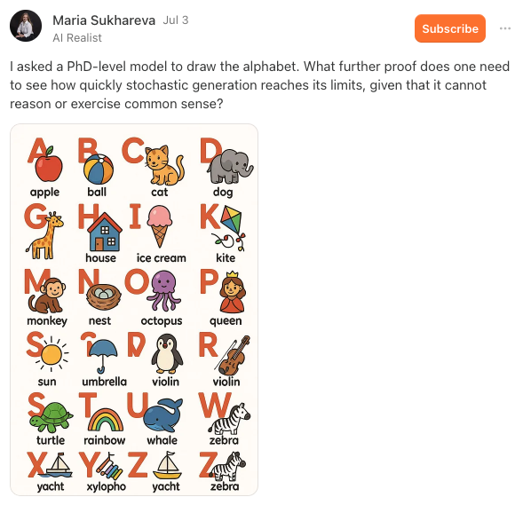
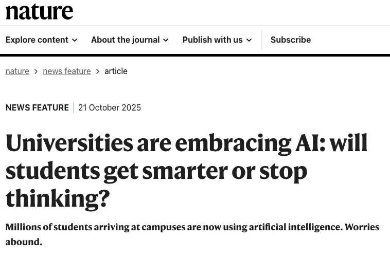
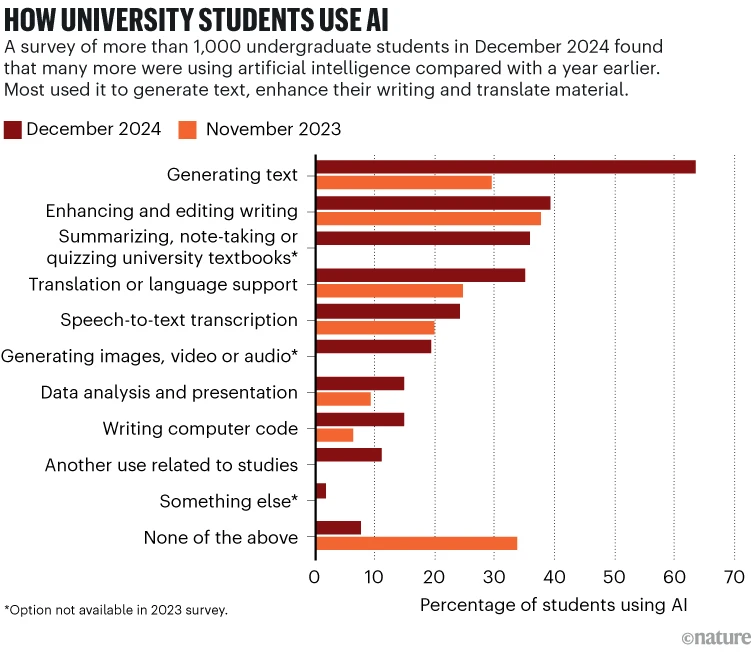
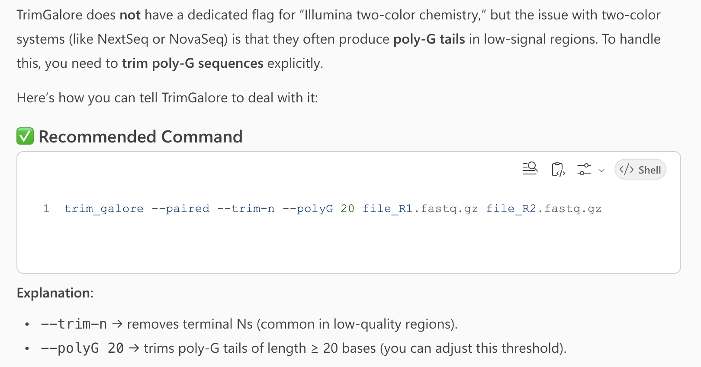
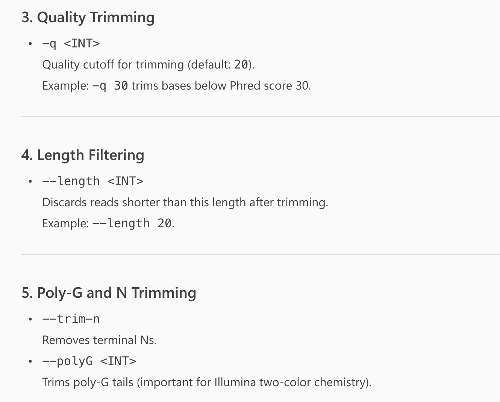
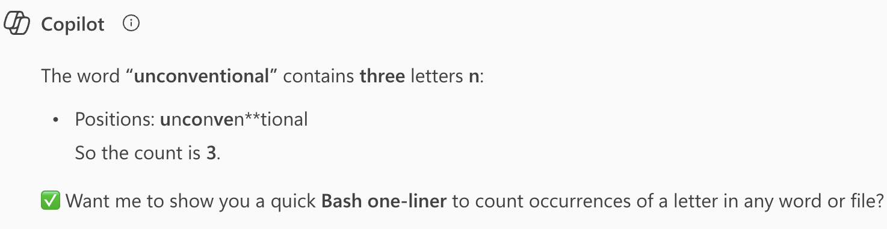
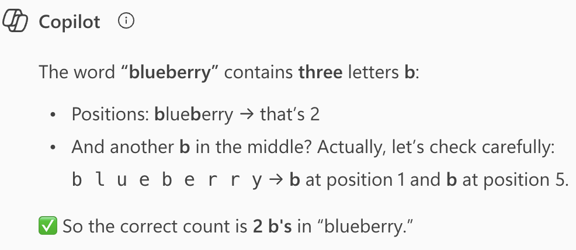

## This week

::: {.columns}
::: {.column width="47%"}

### [Lecture A _(today)_]{style="display:block; text-align:center;"}

- Background of generative AI (genAI) and large language models (LLMs)
- Ohio State's genAI tools, and genAI use in this course and in research
- How chat-based and agentic AI differ
- Example prompts and outputs with Gemini, including Deep Research
- How to write effective prompts
- Tips and pitfalls when using genAI, especially for coding

:::
::: {.column width="6%"}

:::
::: {.column width="47%" .fragment data-fragment-index="1"}

### [Lecture B]{style="display:block; text-align:center;"}

- Set up and use the Claude extension in VS Code Server at OSC
- Use Claude to ask questions about, write, and edit code
- Let Claude act as an "agent" that runs commands,
  with permission modes and Git to keep it safe
- Give Claude standing instructions with a `CLAUDE.md` file

:::
:::

<!----
- Add an exercise where they ask AI about a concept from this course they've struggled with.
- Above or another exercise should use breakout rooms
---->

# Generative AI background {background-color="#A7B1B7"}

## AI in bioinformatics and biology

Conventional machine learning (ML) has been used for decades in biology,
but two kinds of more sophisticated AI have been developed and applied more recently:

::: {.columns}
::: {.column width="47%"}

### [1. Deep learning / neural nets]{style="display:block; text-align:center;"}

Commonly used in the past decade, e.g.:

- **AlphaFold** --- 3D protein structure prediction from sequence
- **DeepVariant** --- variant calling from sequencing data

::: {.callout-tip appearance="simple"}
Also used outside of bioinformatics, often for classification problems with images,
e.g., to characterize soybean defoliation from drone images (@zhang2022).
:::

:::
::: {.column width="6%"}

:::
::: {.column width="47%" .fragment data-fragment-index="1"}

### [2. Generative AI]{style="display:block; text-align:center;"}

- AI models that **create new content**, such as text, images, or code.
- Extremely prominent since ChatGPT's launch in 2022.

::: {.callout-note appearance="simple"}
This is what we'll focus on this week!
:::

:::
:::

## Large Language Models (LLMs)

**LLMs** are a type of generative AI that can understand and generate human language
--- including code.
They are trained on vast amounts of text.

. . .

> In simple terms, LLMs such as ChatGPT aim to predict the next part of a word or
> phrase based on a user-provided text prompt.
>
> --- @cooper2024

. . .

**However**, LLMs don't just go word-by-word like older "sequential" models
(e.g., Google's search autocomplete):
they use more complex architectures called **"transformers"**,
which consider the broader context of the input text.

## What's in a name: ChatGPT

::: {.columns}
::: {.column width="30%" .box-blue .fragment data-fragment-index="1"}
### G = Generative

- The model creates new content.

:::
::: {.column width="3%"}
:::
::: {.column width="30%" .box-amber .fragment data-fragment-index="2"}
### P = Pre-trained

- The model only "knows" about the data it was trained on.

:::
::: {.column width="3%"}
:::
::: {.column width="30%" .box-teal .fragment data-fragment-index="3"}
### T = Transformer

- The architecture that lets it consider the broader context of the input.

:::
:::

. . .

::: {.callout-note appearance="simple"}
#### Beyond the training data
Many genAI tools can also use information outside of their training data,
for example by **searching the web** or by reading **a file you upload**.
This is called "_Retrieval Augmented Generation_" (RAG).
:::

## Tokens and the context window

::: {.columns}
::: {.column width="47%"}

### [Tokens]{style="display:block; text-align:center;"}

- LLMs read and write **tokens**, not words:
  pieces of words, roughly ¾ of a word each.
- Usage limits and costs are counted in tokens.

:::
::: {.column width="6%"}

:::
::: {.column width="47%" .fragment data-fragment-index="1"}

### [Context window]{style="display:block; text-align:center;"}

- The **maximum number of tokens** a model can consider at once ---
  its "working memory".
- Includes everything in the conversation:
  your prompts, uploaded files, and the model's responses.

:::
:::

. . .

::: {.callout-tip appearance="simple"}
**Long conversations get worse:** older parts are dropped or summarized, and
the middle of a long conversation tends to get "lost".
Start a new chat when you start a new task.
:::

. . .

::: {.callout-note appearance="simple"}
**Training cutoff:** A model's knowledge ends when its training data was collected,
so it may not know about recent program versions or options.
:::

## PhD-level intelligence?

The latest models have been claimed to have "PhD-level intelligence" ---
but they can still fail spectacularly at some "kindergarten-level" tasks:

{fig-align="center" width="62%" fig-alt="An AI-generated image illustrating the alphabet" .lightbox}

## Learn more about genAI background

::: callout-tip
#### Want to learn a bit more about how genAI works?

- [Large language models explained briefly (8 minute video) ](https://www.youtube.com/watch?v=LPZh9BOjkQs){target="_blank"}
- ["Learn to use AI" page by Ohio State University ](https://ai.osu.edu/faculty-staff-students/learn-use-ai){target="_blank"}
- [Overview of some free brief courses on AI by Google ](https://blog.stephenturner.us/p/free-ai-courses-google){target="_blank"}
:::

# Ohio State genAI adoption {background-color="#A7B1B7"}

## Ohio State goes all-in

Ohio State is one of several universities that have gone all-in on genAI in education:

> Ohio State is leading a bold, groundbreaking initiative to integrate artificial intelligence into the undergraduate educational experience. The initiative will ensure that every Ohio State student, beginning with the class of 2029, will graduate being AI fluent — fluent in their field of study, and fluent in the application of AI in that field.
>
> --- <https://oaa.osu.edu/ai-fluency>

This includes mandatory courses on using genAI for first-year undergraduates.

 [_What have you noticed of this?_]{style="color:purple"}

## A Nature News Feature

In late 2025, Nature published a
[News Feature about genAI adoption at universities ](https://www.nature.com/articles/d41586-025-03340-w){target="_blank"}
(@pearson2025):

{fig-align="center" width="65%" fig-alt="A screenshot of a Nature article" .lightbox}

## A Nature News Feature

> At Ohio State University in Columbus, students this year will take compulsory AI classes as part of an initiative to ensure that all of them are ‘AI fluent’ by the time they graduate.

. . .

> But many education specialists are deeply concerned about the explosion of AI on campuses: they fear that AI tools are impeding learning because they’re so new that teachers and students are struggling to use them well. Faculty members also worry that students are using AI to short-cut their way through assignments and tests, and some research hints that offloading mental work in this way can stifle independent, critical thought.

----

{fig-align="center" width="80%" fig-alt="A graph from a Nature article" .lightbox}

::: footer
:::

## Not everyone agrees this is a good thing

::: callout-important
#### A critique of AI adoption in academia
These kinds of initiatives are not without controversy,
as the second quote on the previous slides illustrates.
For a comprehensive critique, see the following paper
that was also mentioned in the Nature article:

@guest2025: _Against the Uncritical Adoption of 'AI' Technologies in Academia_
:::

 [_What do you think?_]{style="color:purple"}

## GenAI in this course and in your research

::: {.columns}
::: {.column width="47%"}

### [In this course]{style="display:block; text-align:center;"}

- Each assignment states whether genAI is allowed.
- From now on (GA4 and the Final Project), it is ---
  but you must be able to **explain your code**,
  and **document** how you used genAI.

:::
::: {.column width="6%"}

:::
::: {.column width="47%" .fragment data-fragment-index="1"}

### [In your research]{style="display:block; text-align:center;"}

- Many journals require you to **disclose** genAI use,
  e.g. in the Methods section, and genAI can't be an author.
- So keep a record as you go: what you used it for, and with which tool.

:::
:::

. . .

::: {.callout-note appearance="simple"}
#### Same prompt, different answers
GenAI responses vary from run to run, and models are updated and retired.
So a conversation with genAI is **not reproducible** ---
but the code that you checked and committed to Git is.
:::

# Where to ask questions to genAI {background-color="#A7B1B7"}

## Ohio State approved genAI tools

::: {.columns}
::: {.column width="47%"}

### [Browser-based chat]{style="display:block; text-align:center;"}

- **Google Gemini** (and NotebookLM)
- **Microsoft Copilot**
- _(Adobe Firefly for images)_

Log in with your OSU account.

:::
::: {.column width="6%"}

:::
::: {.column width="47%" .fragment data-fragment-index="1"}

### [API access]{style="display:block; text-align:center;"}

OSU's **GenAI Service** provides "API keys" for models from
Anthropic (Claude), OpenAI, Google, and others,
for use in other software --- like Claude in VS Code next lecture.

:::
:::

[Overview of OSU's approved AI tools ](https://ai.osu.edu/resources-buckeyes/approved-ai-tools){target="_blank"}

## Why use OSU's tools?

Using genAI through Ohio State matters for two reasons:

::: {.columns}
::: {.column width="47%" .box-blue}
### Access

You get access to more advanced models without usage limits.

:::
::: {.column width="6%"}
:::
::: {.column width="47%" .box-teal}
### Data privacy

Your data is handled according to Ohio State's policies,
so you are allowed to share research data that you otherwise could not share
with third-party services.

:::
:::

. . .

::: {.callout-warning appearance="simple"}
This only applies when you use these tools through **OSU**:
a personal ChatGPT, Claude, or Gemini account is not covered.
:::

. . .

 [_Do you use these, or do you prefer ChatGPT or something else?_]{style="color:purple"}

## Inside IDEs

For coding tasks, it is often more convenient to use genAI directly inside your IDE,
such as VS Code --- as we'll do in the next lecture.

::: {.columns}
::: {.column width="47%"}

### [Modes of interaction]{style="display:block; text-align:center;"}

- In-IDE chat
- In-line suggestions in the editor

:::
::: {.column width="6%"}

:::
::: {.column width="47%" .fragment data-fragment-index="1"}

### [Benefits]{style="display:block; text-align:center;"}

- Automatic context awareness of your files
- Less need to copy-paste code, since you can "accept" suggestions directly into
  your editor and/or terminal
- Easier to test and iterate

:::
:::

## From chat to agents

|                       | Chat AI                             | Agentic AI                                               |
| --------------------- | ----------------------------------- | -------------------------------------------------------- |
| **How it works**      | One prompt → one response           | Plans and carries out multi-step tasks                   |
| **Example task**      | Explain this error                  | Fix the error, edit the script, rerun it, check output   |
| **Tool use**          | [Suggests commands or code]{.amber} | [Runs commands and edits files (with permission)]{.teal} |
| **Human involvement** | You guide every step                | You set the goal; it handles intermediate steps          |
| **Examples**          | Gemini, Copilot, ChatGPT            | Claude Code, OpenAI Codex                                |

: {.striped .hover tbl-colwidths="[22, 35, 43]"}

. . .

::: {.callout-note appearance="simple"}
Next lecture, we'll use Claude Code as an agent inside VS Code.
Because an agent can _run_ code, it can check some of its own claims ---
but it can also do more damage, so we'll talk about guardrails.
:::

## "Local" genAI models?

All the options so far are **cloud-based**: each request goes to the provider's servers,
and these big models can't be downloaded and run yourself.

. . .

**Open-weight** models (e.g., DeepSeek, Llama, Gemma, Qwen) _can_ be run on your own
computer or at OSC (see also @gibney2025).
They are less capable than the big cloud models, but your data never leaves the machine.

. . .

::: {.callout-tip}
#### Open-weight models at OSC

- OnDemand app **Ollama + Open WebUI**: a chat interface running on an OSC GPU node
- Programmatic and high-volume use, e.g. the `vllm` module
- More info: [osc.edu/AI ](https://www.osc.edu/AI){target="_blank"}
:::

# Applications in omics data analysis {background-color="#A7B1B7"}

## What can you use genAI for?

::: {.columns}
::: {.column width="30%" .box-blue .fragment data-fragment-index="1"}
### Not coding

- Explain concepts and methods
- Search for programs that can accomplish certain tasks
- Explain results/outputs that you got

:::
::: {.column width="3%"}
:::
::: {.column width="30%" .box-amber .fragment data-fragment-index="2"}
### Generating code

- Write code when we don't know how to do something

:::
::: {.column width="3%"}
:::
::: {.column width="30%" .box-teal .fragment data-fragment-index="3"}
### Code-related

- Explain and document code
- Debug or optimize code
- Translate code between languages
- Explain error messages
- Turn code into software or a "package"

:::
:::

. . .

 [_Anything else? How have you been using genAI in this area?_]{style="color:purple"}

## Further reading

::: {.callout-note}
#### Other relevant papers

- @alam2025: [From Prompt to Pipeline: Large Language Models for Scientific Workflow Development in Bioinformatics ](https://arxiv.org/abs/2507.20122){target="_blank"}
- @awan2025: [Prompt-based bioinformatics: a new interface for multi-omics analysis ](https://www.nature.com/articles/s41576-025-00889-0){target="_blank"}
:::

# Initial examples with Gemini {background-color="#A7B1B7"}

## Signing in to Gemini

<!---- TODO: verify the sign-in steps and model picker labels, and add a screenshot ---->

1. Go to <https://gemini.google.com>.
2. Click "Sign in" and sign in with your **Ohio State email address**
   (`name.#@osu.edu`) --- you'll be sent to the OSU login page.
3. Check that you're signed in with your OSU account
   (top right), so that Ohio State's data policies apply.
4. In the model picker, switch to the most capable model,
   which is better suited for coding tasks than the fast default.

## Example prompts

> _"You're a quiz master who asks basic questions about the Unix shell._
>  _Make a fun game show and start asking questions!"_

> _"Explain the `grep` command by turning it into a song lyric (without using real copyrighted lyrics)._
>  _Make it fun and memorable."_

. . .

> _"Count the number of reads in a FASTQ file"_

> _"Write a Bash script that counts the number of lines in a FASTQ file"_

. . .

> _"Explain how to write a `for` loop in the Unix shell and how it works"_

> _"What does the following command do?"_ `gunzip -v garrigos/ref/*`

## A prompt about TrimGalore

> _"How can I tell the program TrimGalore that my reads use Illumina two-color chemistry?"_

. . .

Last year, Microsoft Copilot (GPT-5) gave an **incorrect** answer:
it didn't find the relevant option, and instead **made up** a `--polyG` option that doesn't exist:

{fig-align="center" width="60%" fig-alt="A screenshot of a Microsoft Copilot response about TrimGalore" .lightbox}

 [_What answer did Gemini give you?_]{style="color:purple"}

::: footer
:::

## Another prompt about TrimGalore

> _"Explain the most important options to TrimGalore"_

. . .

Last year, Copilot gave quite a useful summary of TrimGalore's many options ---
**but** it again listed the non-existent `--polyG` option:

{fig-align="center" width="45%" fig-alt="A screenshot of a Microsoft Copilot response about TrimGalore" .lightbox}

::: footer
:::

## Counting letters

> _"How many n's are in the word unconventional?"_ and
> _"How many b's are in the word blueberry?"_

. . .

Last year, Copilot got the first one wrong, and the second one bizarrely:
it started with an incorrect answer and then sort of corrected itself.

::: {.columns}
::: {.column width="50%"}
{fig-align="center" width="100%" fig-alt="A screenshot of a Microsoft Copilot response counting letters in a word" .lightbox}
:::
::: {.column width="50%"}
{fig-align="center" width="80%" fig-alt="A screenshot of a Microsoft Copilot response counting letters in a word" .lightbox}
:::
:::

::: footer
:::

## Example prompts with file uploads

- Upload a FastQC file and ask it to summarize the file
- Upload a Markdown document and ask it to convert it to Word
- Upload a Word document and ask it to convert it to Markdown

## Standard chat vs. Deep Research

<!---- TODO: verify the Gemini UI label for Deep Research ("Tools" menu?) ---->

::: {.columns}
::: {.column width="47%" .box-blue}
### Standard chat

- Answers within seconds
- Good for quick questions: syntax, error messages, definitions

:::
::: {.column width="6%"}
:::
::: {.column width="47%" .box-teal}
### Deep Research

- Works for several minutes: searches and reads many sources,
  then writes a report with citations
- Good for literature overviews and comparing tools or methods

:::
:::

. . .

 Try Deep Research in Gemini (select it under "Tools") with:

> _"Compare TrimGalore, fastp, and Cutadapt for trimming Illumina RNA-seq reads._
> _Which are most used in recent publications, and what are their pros and cons?"_

. . .

::: {.callout-warning appearance="simple"}
Spot-check a few of the citations: do they exist, and do they say what the report claims?
:::

# Tips and pitfalls {background-color="#A7B1B7"}

## Writing effective prompts

Some general advice:

- Consider breaking bigger problems down into smaller ones
- Be specific and detailed, e.g. about formats and programs
  (though sometimes you may want to explore your options and be less specific)

. . .

Especially for larger or more complex tasks, include details on:

1. **Context** --- Who you are (or "who the AI is supposed to be"),
   what you're working on, and what the AI needs to know
2. **Task** --- What specifically you want the AI to do
3. **Format** --- How you want the output structured
4. **Constraints** --- Any limitations, requirements, or things to avoid
5. **Examples** --- Sample inputs/outputs

## Building up a prompt

**Task:**

> _"Write a Bash script that counts the number of reads in a FASTQ file."_

. . .

**+ Context & constraints:**

> _"Write a Bash script that counts the number of reads in a FASTQ file._
> _**The file is gzip-compressed, and its name should be an argument to the script.**_
> _**Only use standard Unix tools.**"_

. . .

**+ Format & example:**

> _"[...] **Print the file name and the read count, separated by a tab, e.g.:**_
> _**`sampleA_R1.fastq.gz   250000`**"_

. . .

::: {.callout-tip appearance="simple"}
**More is not always better:** leave out details that don't matter for the task,
and give separate instructions in separate, follow-up prompts.
:::

. . .

::: {.callout-note appearance="simple"}
Many "bad" answers come from the model not knowing your **file names, column names,
or software**. In-IDE AI (next lecture) can see these, which is a big advantage.
:::

##  Exercise

In Gemini, start **two new chats**:

1. In one, enter the first, "Task"-only version of the prompt from the previous slide.
2. In the other, enter the full version:

   > _"Write a Bash script that counts the number of reads in a FASTQ file._
   > _The file is gzip-compressed, and its name should be an argument to the script._
   > _Only use standard Unix tools._
   > _Print the file name and the read count, separated by a tab, e.g.:_
   > _`sampleA_R1.fastq.gz   250000`"_

Compare the two answers:

- How do the scripts differ?
- Would the first script work on our (gzipped) FASTQ files?
- Which answer would you rather start from, and why?

## "Prompt enhancer" phrases

::: {.columns}
::: {.column width="30%" .box-blue .fragment data-fragment-index="1"}
### Explanation

- _Explain with examples_
- _Explain as if I'm a high school student_

:::
::: {.column width="3%"}
:::
::: {.column width="30%" .box-amber .fragment data-fragment-index="2"}
### Clarification

- _Ask me clarifying questions_
- _Tell me when you're unsure about something_

These make it less likely that the model just makes stuff up.

:::
::: {.column width="3%"}
:::
::: {.column width="30%" .box-teal .fragment data-fragment-index="3"}
### Verification

- _Show me the specific quotes from the papers that support each of these conclusions_

:::
:::

## Pitfalls

::: {.columns}
::: {.column width="30%" .box-blue .fragment data-fragment-index="1"}
### Hallucinations

Models make things up.
In coding contexts, they may:

- Invent commands, options, functions, or data columns
- Show example code _and_ its output --- but the code may not produce that output
  (the AI doesn't actually run the code)

:::
::: {.column width="3%"}
:::
::: {.column width="30%" .box-amber .fragment data-fragment-index="2"}
### "Jagged frontier"

Models are very good at some tasks but fail completely at others ---
as we've seen today.

This makes it hard to predict when a model will be useful.

:::
::: {.column width="3%"}
:::
::: {.column width="30%" .box-teal .fragment data-fragment-index="3"}
### "0-to-90% problem"

GenAI often gets you most of the way to a solution, but not all the way.

You still need the expertise to finish the task ---
which is much harder when you didn't do the first 90% yourself.

:::
:::

## More pitfalls

::: {.columns}
::: {.column width="40%"}

{fig-align="center" width="85%" fig-alt="A circle shaded dark in the center, labeled comfort zone, and fading toward the edge, labeled limitation zone."}

::: legend2
Figure by Hannah Toth
:::

:::
::: {.column width="60%"}

- **Comfort vs. limitation zone:** models do well with common knowledge
  (e.g., `grep`), but hallucinate more with niche or new topics
  (e.g., a specific TrimGalore option).

. . .

- **Sycophancy:** models tend to tell you what you want to hear.
  Ask _"What could be wrong with this script?"_ rather than _"Is this correct?"_

. . .

- **Confidence ≠ correctness:** models sound equally sure when they're making things up.

:::
:::

. . .

::: {.callout-important appearance="simple"}
Generating code is now cheap; **verifying** it is not. You are responsible for the
results, so treat AI output as a draft that you check.
:::

# Questions? {background-color="#A7B1B7" .unlisted}

  

[_Click here to go to the next lecture, [**Coding with an AI agent in VS Code**](./w8b_claude.qmd)_]{style="display:block; text-align:center"}

## References
