----------------------------------------------------------------------------------------------------

<br>

<!----
Things to verify before class are marked TODO (incl. screenshots to retake in Code Server).

TODO: Per-student OSU LiteLLM keys (with a budget cap). Put a key-less template
at /fs/ess/PAS3493/share/claude-settings.json, with current model names.
---->

## Introduction

### Learning goals

In this lecture, you will learn how to:

- Set up and use the Claude Code extension in VS Code Server at OSC
- Use Claude to ask questions about, write, and edit code, with your files as context
- Let Claude act as an "agent" that runs commands,
  and control what it may do with permission modes
- Give Claude standing instructions with a `CLAUDE.md` file
- Manage Claude's context window and costs

### From chat to agents

In [the previous lecture](./w8a_genAI.qmd), you used genAI through a browser-based chat.
That works well for many questions, but for coding, it has clear limitations:
the model can't see your files unless you paste or upload them,
and it can't check whether the code it writes actually works.

Today, we'll use **Claude Code**, Anthropic's "agentic" coding tool.
Working inside your editor, it can:

- **Read** the files in your project, so you don't have to explain or paste them
- **Edit and create** files, showing you each change for approval
- **Run commands** in the terminal, for example to test a script or check a program's
  help info --- also with your approval

In other words, if browser chat is like emailing a knowledgeable colleague,
working with an agent is more like having them sit next to you at your computer.

::: {.callout-note appearance="simple"}
Claude Code comes in several forms, including a command-line program
and a desktop app. We'll use its **VS Code extension**.
:::

### Why Claude in VS Code Server?

There are many AI coding tools, but this setup has a few advantages for us:

- **It's approved for your research data.**
  We'll use Claude through an API key from OSU's
  [Generative AI Service](https://it.osu.edu/generative-ai-service),
  which is approved for use with restricted institutional data (levels S2--S4).
  (As discussed in w8a, this would _not_ be the case with a personal account.)
- **It runs on a compute node.**
  Because VS Code Server runs inside a compute job,
  any commands that Claude runs also happen on a compute node, not a login node.
- **No extra setup on your own computer.**

::: {.callout-note}
#### What Claude doesn't do: inline suggestions

Some AI coding tools, like GitHub Copilot, also offer **inline suggestions**:
"ghost text" that appears as you type and that you can accept with <kbd>Tab</kbd>.

{fig-align="center" width="80%" fig-alt="A screenshot of a GitHub Copilot inline suggestion in the VS Code editor, with a bar showing Accept (Tab) and Accept Word options." .lightbox}

Claude Code doesn't offer these.
For learning, that's arguably a good thing: inline suggestions are easy to accept
without reading them, whereas Claude's proposed changes are something you
review deliberately.
If you want to try inline suggestions, see the
[self-study page on GitHub Copilot](../bonus/copilot.qmd).
:::

## Getting set up

### Prepare a dir for this week

1. At <https://ondemand.osc.edu>, start a VS Code session in `/fs/ess/PAS3493/people/$USER`.

2. In the terminal, create a dir for this week, and copy your scripts from last week into it:

   ```bash
   mkdir -p week08/scripts
   cp week07/scripts/*.sh week08/scripts/
   ```

3. **Open the `week08` dir as your VS Code folder**:
   click `File` > `Open Folder`, and select or type `/fs/ess/PAS3493/people/<user>/week08`.
   VS Code will reload.

   ::: {.callout-important appearance="simple"}
   Claude treats the folder that is open in VS Code as its "workspace":
   this is where it will look for files, and by default the only place where it can make changes.
   :::

4. Turn this dir into a Git repository and commit the scripts:

   ```bash
   git init
   git add scripts
   git commit -m "Add scripts from week 7"
   ```

   You'll see later why it's a good idea to use Git when working with an AI agent.

### Install the Claude Code extension

1. In the **Extensions** side bar, search for "claude",
   and click **Install** for the extension "**Claude Code for VS Code**" by Anthropic:

   {fig-align="center" width="50%" fig-alt="A screenshot of the VS Code Extensions side bar showing the Claude Code for VS Code extension by Anthropic with an Install button." .lightbox}

2. In the pop-up that asks whether you trust the publisher "Anthropic",
   click **Trust Publisher & Install**:

   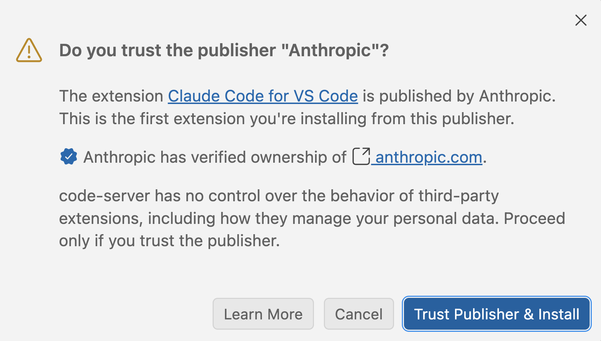{fig-align="center" width="55%" fig-alt="A screenshot of a pop-up asking 'Do you trust the publisher Anthropic?' with a 'Trust Publisher & Install' button." .lightbox}

### Connect Claude to your API key

<!---- TODO: how and when students receive their key; budget per key ---->

You should have received a personal API key from Jelmer,
which gives you access to Claude models through OSU's Generative AI Service.

Claude Code reads its settings, including which API key to use, from a file
`~/.claude/settings.json` in your Home dir. To set this up:

1. Copy a template settings file to that location:

   ```bash
   mkdir -p ~/.claude
   cp /fs/ess/PAS3493/share/claude-settings.json ~/.claude/settings.json
   ```

2. Open the file in the editor: click `File` > `Open File`,
   and type `~/.claude/settings.json`.

3. Replace `<API-KEY>` with your personal API key (keep the quotes around it),
   and save the file.

::: {.callout-note collapse="true"}
#### What's in the settings file? _(Click to expand)_

The file is in JSON format:

```json
{
  "env": {
    "ANTHROPIC_BASE_URL": "https://litellm.cloud.osu.edu",
    "ANTHROPIC_AUTH_TOKEN": "<API-KEY>",
    "ANTHROPIC_DEFAULT_OPUS_MODEL": "<TODO>",
    "ANTHROPIC_DEFAULT_SONNET_MODEL": "<TODO>",
    "ANTHROPIC_DEFAULT_HAIKU_MODEL": "<TODO>",
    "CLAUDE_CODE_DISABLE_EXPERIMENTAL_BETAS": "1"
  }
}
```

- `ANTHROPIC_BASE_URL` makes Claude go through OSU's service rather than
  directly to Anthropic.
- `ANTHROPIC_AUTH_TOKEN` is the API key.
- The `MODEL` lines specify which model versions to use.
:::

::: callout-warning
#### Treat the API key like a password
Anyone with your key can use it, and usage costs money and counts toward your
key's budget.
So never share your key, paste it into a prompt, or commit it to a Git repository.
That's one reason the settings file lives in your Home dir,
and not in a project dir that others can see.
:::

### Open Claude

1. Open the Claude panel by clicking the "**CLAUDE CODE**" tab in the side bar
   (if you don't see it, try widening the side bar).
   _Alternatively, click the Claude icon in the top right of the editor pane,_
   _which opens Claude as a tab in the editor._

   <!---- TODO: retake in Code Server ---->
   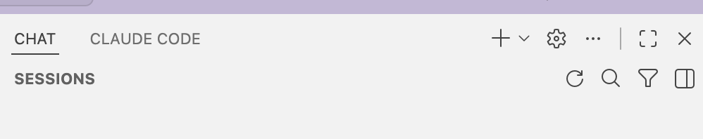{fig-align="center" width="60%" fig-alt="A screenshot of the VS Code side bar with a CLAUDE CODE tab." .lightbox}

2. You may briefly see login options.
   **Don't** click on any of these, but just wait:
   once Claude has read your settings file,
   the panel will switch to a prompt box like this:

   <!---- TODO: retake in Code Server ---->
   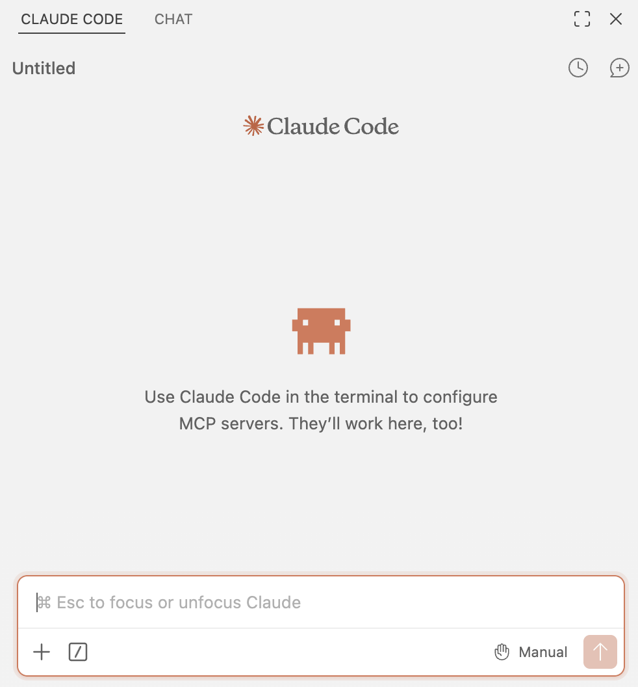{fig-align="center" width="55%" fig-alt="A screenshot of the Claude Code panel ready for a first prompt." .lightbox}

   ::: {.callout-important appearance="simple"}
   If the login options don't disappear after a minute, let us know.
   :::

### The prompt box

Most of what you'll do with Claude starts from the prompt box:

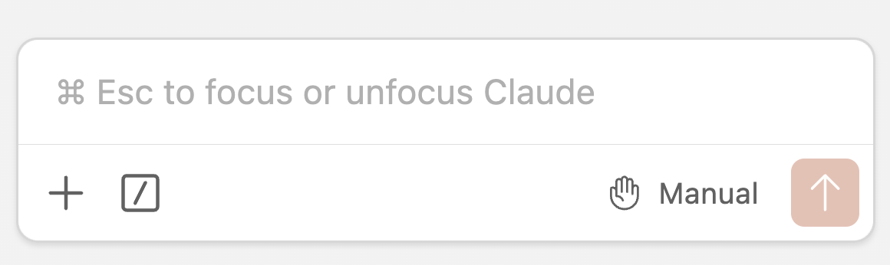{fig-align="center" width="65%" fig-alt="A screenshot of the Claude Code prompt box." .lightbox}

- **`+`** adds files or other context to your prompt (more on this later).
- **`/`** opens the **command menu**, with options such as switching models.
- **`Manual`** is the current **permission mode**:
  how much Claude may do without asking you first (more on this later).

### Choose a model and effort level

Open the command menu with `/`, and look at these options:

- **Switch model**: Claude comes in three model "sizes":
  - **Opus**: the most capable, but slower and more expensive.
    Worth it for complex reasoning or tricky debugging.
  - **Sonnet**: fast, capable, and much cheaper.
    Plenty for writing and editing scripts like ours.
  - **Haiku**: the fastest and cheapest, fine for simple questions and quick edits.

- **Effort**: how much the model "thinks" before responding (Low to Max).
  More effort can give better answers to hard problems, but is slower and uses more tokens.

<!---- TODO: retake: shows outdated model names ---->
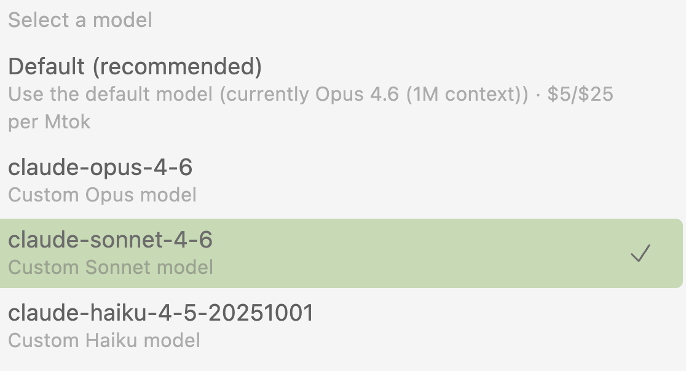{fig-align="center" width="55%" fig-alt="A screenshot of the Claude Code model selection menu." .lightbox}

 **Switch to Sonnet with Medium effort** --- this will be our default today.

::: {.callout-tip appearance="simple"}
A common strategy is to use a stronger model to _plan_ a bigger task,
and a cheaper one to _carry out_ the plan.
:::

## A first prompt: writing a script

### Ask Claude to write a script

Type the following prompt into the prompt box, and press <kbd>Enter</kbd>:

> Write a script scripts/count_reads.sh that counts the number of reads in a
> gzipped FASTQ file. The FASTQ file should be an argument to the script.

Claude will show you what it's doing as it goes.
For example, it may first look at what's in your workspace.
When it has written the script, it will **ask for permission** to create the file,
and show you the proposed contents:

<!---- TODO: screenshot(s) of the permission request and the proposed file ---->

You can accept the change, decline it, or decline it _and_ tell Claude
what to do differently.
Read through the script, and if it looks reasonable, accept it.

::: {.callout-note appearance="simple"}
#### Why does Claude ask for permission?
By default, Claude asks you before it changes any file or runs any command.
We'll look at these "permission modes" in more detail [below](#permission-modes).
:::

<hr style="height:1pt; visibility:hidden;" />

::: exercise
####  Discuss the results

- Does the script look reasonable? Do you understand every line?
- Did you get the same script as your neighbor? If not, do the differences matter?
- How does the script compare to the scripts we wrote in week 7?
  For example, does it use strict Bash settings, and does it report what it's doing?
:::

### Run and check the script

::: exercise
####  Exercise: Run and verify the script

1. Run the script on one of the FASTQ files, for example:

   ```bash
   bash scripts/count_reads.sh ../garrigos/fastq/S63_R1.fastq.gz
   ```

2. Is the number it reports correct?
   Check this **independently**, with a command that you understand and trust
   (_Hint:_ every read in a FASTQ file takes up four lines.)

3. Did Claude itself test the script before telling you it was done?

<!----
<details><summary>  Click here for the solution</summary>

2. You can count the number of lines and divide that by 4:

   ```bash
   echo $(( $(zcat ../garrigos/fastq/S63_R1.fastq.gz | wc -l) / 4 ))
   ```

3. Probably not: unless you ask it to, or it is in a mode where it can run commands
   without asking, Claude often doesn't test its code.
   Its claim that a script "works" can therefore just be a prediction.

</details>
---->
:::

::: callout-important
#### You are responsible for verifying the output
Even when a script runs without errors, it may not do what you need.
Checking results against an independent method, like you just did,
is a habit worth building.
:::

### Edit the script

Next, ask Claude to change the script:

> Change the output so it prints the file name and the number of reads, separated by a tab

This time, Claude will show the proposed change as a **diff**:
removed lines are marked in red, and added lines in green ---
just like with `git diff` in [week 5](../week05/w5b_git.qmd).

<!---- TODO: screenshot of an edit diff ---->

Accept the change, and then make one more:

> Make the script accept multiple FASTQ files, and print one line per file

::: exercise
####  Exercise: Check and commit the edits

1. Look at how Claude made the script accept multiple files.
   Do you recognize the construct it used from week 7?
2. Run the script on all R1 files at once:

   ```bash
   bash scripts/count_reads.sh ../garrigos/fastq/*_R1.fastq.gz
   ```

3. In the terminal, look at the changes compared to your last commit with
   `git diff`, and then commit the new script:

   ```bash
   git add scripts/count_reads.sh
   git commit -m "Add a script to count reads"
   ```
:::

::: {.callout-tip appearance="simple"}
#### These prompts are deliberately simple
They let us focus on how the tool works. In practice, you'd give more context and
detail, as discussed in [the previous lecture](./w8a_genAI.qmd) ---
and a single prompt can ask for all of the above at once.
:::

## Asking questions with your files as context

### Your workspace is the context

A key advantage of using AI inside your editor is that your files are readily available:
you don't need to upload or copy-and-paste them.
Your entire **workspace** (the folder open in VS Code) is "implicit" context:
when Claude thinks it's useful, it will search and read files there by itself.

However, it's often better to point Claude to the relevant files **explicitly**.
That's faster and cheaper, and avoids Claude making assumptions about which files you mean.

### Adding files and code to your prompt

<!---- TODO: retake the screenshots below in Code Server, with course files ---->

- **The file that's active in the editor** is added automatically.
  You can see this below the prompt box, and if you don't want to include it,
  click on its name to exclude it:

  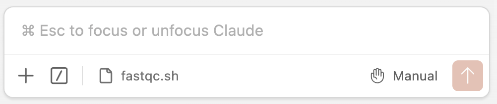{fig-align="center" width="60%" fig-alt="A screenshot of the Claude Code prompt box showing that the file open in the editor was added as context." .lightbox}

- **Selected lines** in the editor are also added automatically.
  This is handy to ask about specific lines in a longer script:

  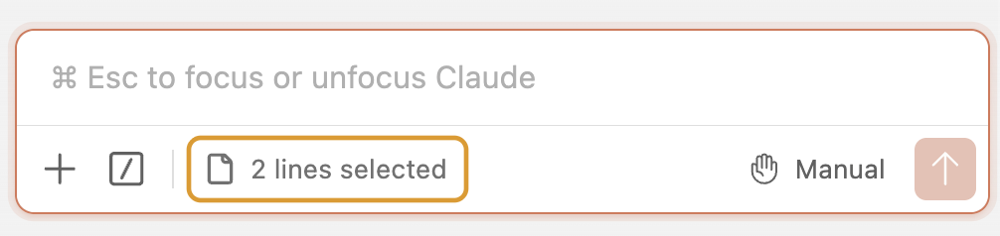{fig-align="center" width="60%" fig-alt="A screenshot of the Claude Code prompt box showing that a selection of lines was added as context." .lightbox}

- **Type `@`** followed by part of a file name to add any file in your workspace,
  including files in subdirs (or type just `@` and wait for a list):

  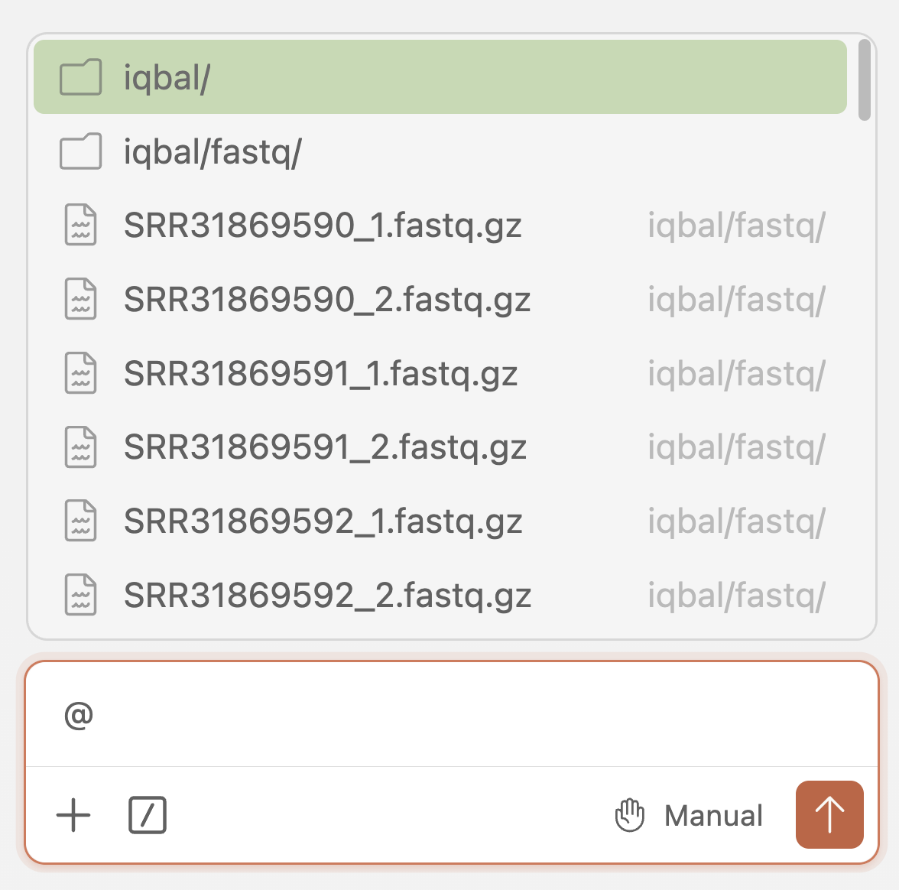{fig-align="center" width="45%" fig-alt="A screenshot of the file list that appears after typing @ in the Claude Code prompt box." .lightbox}

- To add **multiple files**, press <kbd>Alt/Option</kbd>+<kbd>K</kbd> while in a file:
  this keeps it in the context, even when you switch to another file.

::: {.callout-note collapse="true"}
#### The `+` button _(Click to expand)_

You can also add context with the `+` button below the prompt box.
This also lets you upload files from your own computer.

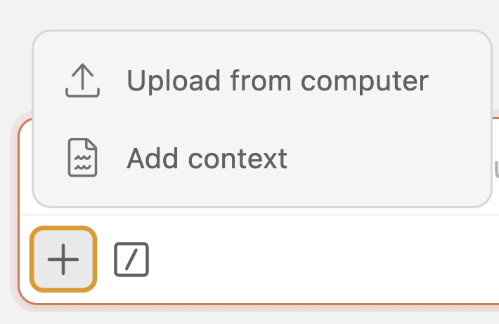{fig-align="center" width="30%" fig-alt="A screenshot of the menu that appears after clicking the plus button in the Claude Code prompt box." .lightbox}
:::

::: exercise
####  Exercise: Ask about your own code

1. Open your `scripts/fastqc.sh` from week 7 in the editor, and ask Claude:

   > Explain what this script does, line by line

   Does its explanation match your own understanding?

2. Select the line with `apptainer exec` in the editor, and ask:

   > What does this line do, and why do we need apptainer here?

3. Now, run the script but **forget the output dir argument**:

   ```bash
   bash scripts/fastqc.sh ../garrigos/fastq/S63_R1.fastq.gz
   ```

   Copy the error message into the prompt box (with the script still open), and ask
   Claude what went wrong. Does its explanation make sense?
   Did it also offer to change the script --- and do you want it to?

4. Close all files in the editor, and ask:

   > Which scripts in this project use a container, and for which program versions?

   Watch how Claude finds the answer.

<!----
<details><summary>  Click here for the solution</summary>

3. The error is `$2: unbound variable`: the script assigns `outdir="$2"`,
   but no second argument was given, and because of `set -u`, Bash stops with an error
   when it encounters an unset variable.
   Claude may offer to add a "usage" check that prints a helpful message when arguments
   are missing. That's a reasonable improvement, but it's your call whether to accept it.

4. Claude will search the `scripts` dir (e.g., for `apptainer` or `oras://`),
   read the matching scripts, and report the container URLs, which include the program versions.

</details>
---->
:::

## Permission modes and running commands

### Permission modes {#permission-modes}

The permission mode, shown at the bottom right of the prompt box,
determines what Claude may do **without asking you first**.
Click on it to switch between modes:

- **Manual**: Claude asks permission for each file edit and command.
- **Edit automatically**: Claude edits files and runs basic commands without asking.
- **Auto mode**: Claude decides for itself when to ask for permission.
- **Plan mode**: Claude doesn't change anything, but writes a **plan**, which opens as a
  Markdown document that you can review and modify before Claude carries it out.
  This is useful for bigger tasks.

::: {.callout-tip appearance="simple"}
**For now, stick to Manual mode**. It's slower, but you'll see exactly what Claude does.
Once you're comfortable reviewing Claude's work, and you're using Git (see below),
"Edit automatically" can save a lot of clicking.
:::

### Letting Claude run commands

Claude can do more than write files: it can also run commands in the terminal.
Try this:

> Run count_reads.sh on all FASTQ files in ../garrigos/fastq, and tell me which sample has the fewest reads

Before running anything, Claude will show you the exact command and ask for permission.
Because the FASTQ files are outside your workspace,
it may also ask for permission to access that dir.

<!---- TODO: screenshot of a command permission request ---->

You'll typically see these options:

- **Yes**: run the command this once.
- **Yes, and don't ask again for: ...**: also allow similar commands in the future.
  For commands, this is saved permanently for this project (see [this self-study page](../bonus/claude-code.qmd#permission-rules)).
- **No**: don't run it. You can add a note to tell Claude what to do instead.

Claude may also ask for permission to **search the web** or **fetch a web page**,
for example to look up a program's documentation.

::: callout-warning
#### Read every command before you approve it
Be especially careful with commands that:

- **Delete, move, or overwrite** files (`rm`, `mv`, `>` redirection, `cp` onto existing files)
- Change things **outside your workspace**
- **Push** to GitHub, or submit many jobs at once

And be careful with "don't ask again" for such commands.
:::

### An agent can check its own claims

In the previous lecture, we saw how genAI can make up command-line options.
An agent that can run commands can instead **check** a program's actual help info.
Try:

> Using the container in scripts/fastqc.sh, check the FastQC help info, and
> tell me which options control the number of threads and the output format

Did Claude run the help command, or did it answer based on its training data?
When an answer is based on the actual help output, you can check it easily.

::: {.callout-note appearance="simple"}
In [next week's Graded Assignment](../GA/GA4.qmd) (Part D), you'll compare a genAI answer
about another program's options with what you found in its help info yourself.
:::

### Stopping, steering, and rewinding

Sometimes you notice that Claude misunderstood you, or is going down the wrong path.
You don't have to wait for it to finish:

- **Steer it**: type a new message while Claude is working,
  and it will take that into account before continuing.

  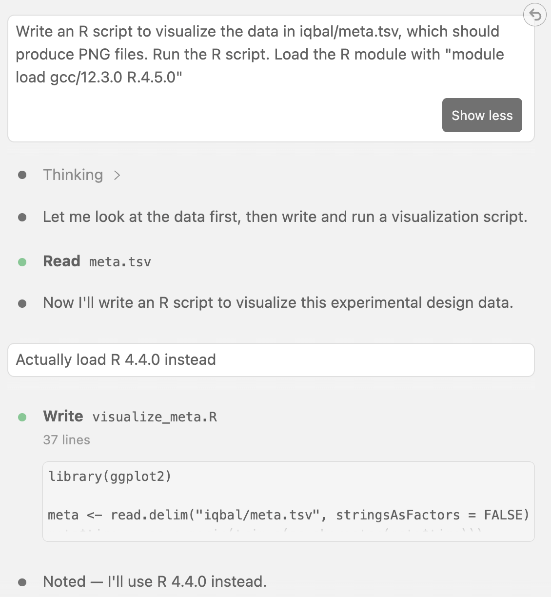{fig-align="center" width="65%" fig-alt="A screenshot of a message being sent to Claude while it is working." .lightbox}

- **Stop it**: press <kbd>Esc</kbd> (or click the stop button).
  You can then send a new message to redirect it.

- **Rewind**: press <kbd>Esc</kbd> twice in quick succession
  (or use the command menu) to go back to an earlier point in the conversation.
  This also **undoes the file changes** Claude made after that point.

  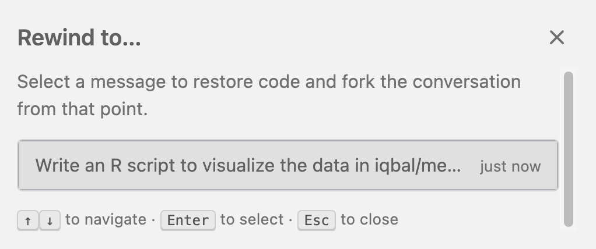{fig-align="center" width="60%" fig-alt="A screenshot of the Claude Code rewind menu, listing earlier messages to go back to." .lightbox}

::: exercise
####  Exercise: Stop and rewind

1. Ask Claude:

   > Add a comment above every line of count_reads.sh explaining what it does

2. While it's working, or once it has made the edit, press <kbd>Esc</kbd> <kbd>Esc</kbd>
   and rewind to before this prompt.
3. Check with `git diff` (or by looking at the file) that the comments are gone.
:::

## Standing instructions with `CLAUDE.md`

### Why standing instructions?

Each new conversation with Claude starts with an empty context window:
it doesn't see what you discussed in earlier conversations.
So you may find yourself repeatedly telling it the same things, such as:

- "Run programs with Apptainer containers, not by installing them"
- "Never modify the raw data in `../garrigos`"
- "Follow the script conventions we've been using"

Rather than repeating yourself, you can put such instructions in a file called `CLAUDE.md`.

### What is `CLAUDE.md`?

`CLAUDE.md` is a Markdown file that Claude **automatically reads at the start of every conversation**
in your project.
Think of it as a briefing for a new team member who joins your project.
There is no required format, but it should be concise and easy to read
--- for you as well as for Claude.
(Many other AI coding tools read a similar file called `AGENTS.md`,
and Claude reads that file too.)

Typically, it's placed in the **root dir of a project**, like our `week08` dir:

```bash-out-solo
week08
├── CLAUDE.md
└── scripts
    ├── count_reads.sh
    └── fastqc.sh
```

::: {.callout-note collapse="true"}
#### Other locations _(Click to expand)_
You can also put a `CLAUDE.md` in a parent dir, to apply to several related projects,
or at `~/.claude/CLAUDE.md`, to apply to all your projects.
:::

### What to include

Some useful things to include:

- **Project overview**: the research question, organism, data type, and experimental design
- **Key dirs and files**: where the raw data, scripts, and results are
- **Conventions**: how you write scripts and name files
- **Software**: how software is run (e.g., with containers) and which versions
- **Rules and pitfalls**: things Claude should never do, or tends to get wrong

### Creating a `CLAUDE.md` with `/init`

You can write a `CLAUDE.md` by hand, but an easier start is the **`/init`** command:
Claude looks through your project and drafts a `CLAUDE.md` for you to review and edit.
(If a `CLAUDE.md` already exists, `/init` will instead suggest updates to it.)

::: exercise
####  Exercise: Create and use a `CLAUDE.md`

1. Type `/init` in the prompt box and press <kbd>Enter</kbd>.
   Once Claude is done, open the `CLAUDE.md` file it created.
   What did it get right? Is anything wrong or missing?

2. Add the following to the file (and remove anything that contradicts it):

   ```{.markdown .file filename="CLAUDE.md"}
   ## Data
   - The raw FASTQ files are in `../garrigos/fastq`: never modify or delete them

   ## Shell script conventions
   - Start scripts with `#!/bin/bash` and `set -euo pipefail`
   - Copy arguments to descriptively named, lowercase variables (e.g. `fastq="$1"`);
     use uppercase only for constants (e.g. `CONTAINER=...`)
   - Run programs with Apptainer containers from Seqera Containers (`oras://` URLs)
   - At the start, report the script name, the date, and the inputs;
     at the end, report the program version, a success message, and the date
   - Create output dirs with `mkdir -p` before writing to them
   - Don't use multi-threading options unless asked
   ```

3. Commit the file:

   ```bash
   git add CLAUDE.md
   git commit -m "Add CLAUDE.md"
   ```

4. Start a **new conversation** (the chat icon with a `+` at the top of the Claude panel),
   so that Claude reads the new `CLAUDE.md`, and ask:

   > Rewrite scripts/count_reads.sh

5. Check the result against each of the conventions:
   did Claude follow all of them? Test the script and commit it if it works.
:::

::: callout-tip
#### Treat `CLAUDE.md` as living documentation
Start simple, and add to it whenever you notice yourself telling Claude the same thing
again --- or Claude making the same mistake again.
Keep it short, though: it's read at the start of every conversation,
so it uses up tokens each time.
:::

::: {.callout-note}
#### `CLAUDE.md` vs. Claude's memory

Besides reading your `CLAUDE.md`, Claude also keeps **memory** notes for itself:
when you correct it or tell it about your preferences, it may save a note,
which is loaded into future conversations in the same project.
You can also ask it directly, e.g. _"Remember that I prefer ..."_.

- **You** write `CLAUDE.md`: your instructions and rules for the project.
- **Claude** writes its memory: things it has learned while working with you.

This is another big advantage of AI in your editor.
Browser-based chatbots may remember general things about you,
but here, both kinds of memory are **specific to each project** and live alongside your files.
So Claude can pick up where you left off, without you having to explain your project again.

Type `/memory` to see and edit both.
It's worth checking Claude's memory notes now and then, since they can be wrong or outdated.
More details are on the [self-study page](../bonus/claude-code.qmd#memory).
:::

::: {.callout-note appearance="simple"}
`CLAUDE.md` contains **instructions**, which Claude will usually but not always follow.
To strictly enforce rules, use [permission rules](../bonus/claude-code.qmd#permission-rules).
For instructions that you only need for _specific_ tasks,
see the self-study page on [skills](../bonus/claude-code.qmd#skills).
:::

::: callout-tip
#### Use Git as a safety net
Version control pairs very well with agentic AI:
commit your work before asking Claude for a bigger change,
review all of its changes afterwards with `git diff` or the Source Control panel,
and undo anything you don't want with `git restore <file>`.
For more on this and other guardrails, such as permission rules that block specific actions,
see the [self-study page on Claude Code](../bonus/claude-code.qmd#guardrails).
:::

## Managing context and cost

### Agents fill up the context window quickly

Recall from [the previous lecture](./w8a_genAI.qmd) that a model's **context window**
holds everything in the conversation, and that performance degrades as it fills up.
With an agent, this happens much faster than with a chatbot:
every file Claude reads and every command output it sees goes into the context too.

To see how full the context window is, type **`/context`** in the prompt box:

<!---- TODO: retake ---->
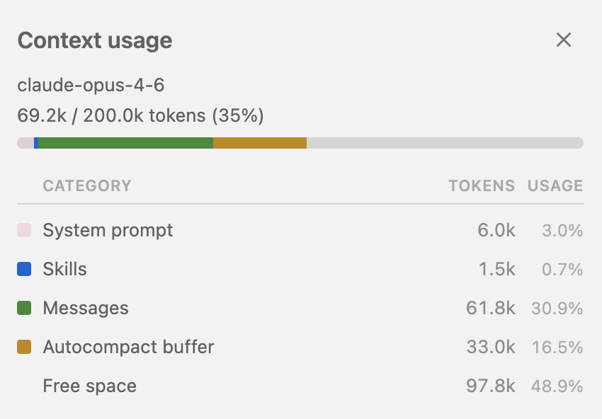{fig-align="center" width="60%" fig-alt="A screenshot of the output of the /context command, showing how much of the context window is used by different categories." .lightbox}

### Start fresh often

- **Start a new conversation for each new task**, with the chat icon with a `+`
  at the top of the Claude panel.
  Claude can get confused when you switch topics within a conversation,
  and a long conversation is slower and more expensive.
- A new conversation doesn't include what was said in earlier ones.
  What Claude needs to know every time belongs in `CLAUDE.md`
  (Claude's memory notes, discussed above, carry over some things as well).
- Previous conversations are listed under the clock icon, in case you want to return to one.

<!---- TODO: retake ---->
{fig-align="center" width="60%" fig-alt="A screenshot of the buttons at the top of the Claude panel." .lightbox}

::: {.callout-note collapse="true"}
#### `/clear` and `/compact` _(Click to expand)_

- **`/clear`** wipes the current conversation, similar to starting a new one.
- **`/compact`** replaces the conversation so far with a summary, to free up space.
  Claude also does this automatically when the context window is nearly full,
  but details can get lost in the process.
:::

### Cost

<!---- TODO: per-key budget amount; can students see their own usage? ---->

Every token costs money, and your API key has a limited budget. Some things to know:

- **Output tokens** (Claude's responses, including its "thinking")
  cost several times more than **input tokens**.
- **Bigger models and higher effort levels** use more tokens and cost more per token.
- **Agentic tasks** can use many tokens, even when the visible conversation is short,
  because Claude reads files and command outputs behind the scenes.
- **Large data files**: if Claude reads or prints an entire FASTQ or BAM file,
  that alone can use up much of your budget.
  It usually looks at just the first lines (e.g. with `head`), but keep an eye on this,
  and don't ask it to "read" large data files.

::: callout-tip
#### You don't always need an agent
For general questions, like explaining a concept or a command,
a browser-based chat like Gemini (through your OSU account) works just as well
and doesn't use your API key's budget.
Use Claude when it helps that it can see your files and run commands.
:::

::: callout-note
#### API pricing vs. personal subscriptions
Paying per token through an API key, as we do here, is **much** more expensive than
a personal subscription to a service like Claude, which has a fixed monthly fee.
A day of heavy agentic coding through an API can easily cost more than a month's subscription.

But a personal subscription is **not approved for institutional data**,
so for research data, stick to OSU-approved routes like your API key.
For personal projects without such data, a subscription may well be the better deal.
:::

## Recap and next steps

### Good habits when working with an agent

- **You own the result.** Read every proposed edit and command before approving it.
- **Verify, don't trust.** When Claude says something "works", that may be a prediction
  rather than a test result. Run the code yourself, and check results independently.
- **Be explicit.** Point Claude to the relevant files, and put your conventions and rules
  in `CLAUDE.md`.
- **Start fresh** for each new task, and keep conversations focused.
- **Commit before, review after.** Use Git so that you can see and undo what Claude changed.
- **Keep a record.** Commit the code that Claude helped write, and note in your README
  how you used AI. You can't count on getting the same answer if you ask again later.
- **Keep secrets out of prompts.** Never paste passwords or API keys into a prompt.
- **Remember that Claude can see what you can see.** In shared dirs like `/fs/ess/PAS3493`,
  that may include other people's files and data. Keep Claude's workspace limited to your own project.
- **Don't let it do your learning for you.** When you're learning something new,
  try it yourself first, and use AI to review, explain, or extend your work afterwards.
  That's also how this week's exercises are set up.

### Next steps

- In [this week's exercises](./w8_exercises.qmd), you'll first write a TrimGalore script
  yourself, and only then ask Claude to review and extend it.
- In [next week's Graded Assignment](../GA/GA4.qmd), you'll compare a genAI answer
  with a program's help info.
- For more on guardrails and other Claude Code features, see the
  [self-study page on Claude Code](../bonus/claude-code.qmd).

## Appendix

### Optional self-study material

- [Claude Code: guardrails, memory, skills, and more](../bonus/claude-code.qmd)
- [GitHub Copilot in a local VS Code installation](../bonus/copilot.qmd),
  including inline suggestions
- Claude Code documentation:
  [VS Code extension](https://code.claude.com/docs/en/vs-code),
  [`CLAUDE.md` and memory](https://code.claude.com/docs/en/memory),
  [permissions](https://code.claude.com/docs/en/permissions),
  [skills](https://code.claude.com/docs/en/skills),
  [commands](https://code.claude.com/docs/en/commands)
- [Free Anthropic courses](https://anthropic.skilljar.com), such as "Claude Code 101" and
  "AI Fluency for students"
- Different models and their pros and cons (these change quickly!):
  - [An Opinionated Guide to Using AI Right Now](https://www.oneusefulthing.org/p/an-opinionated-guide-to-using-ai)
    by Ethan Mollick (Oct 2025)
  - [Which AI model writes the best R code?](https://posit.co/blog/r-llm-evaluation-02/) (Aug 2025)

<br>
