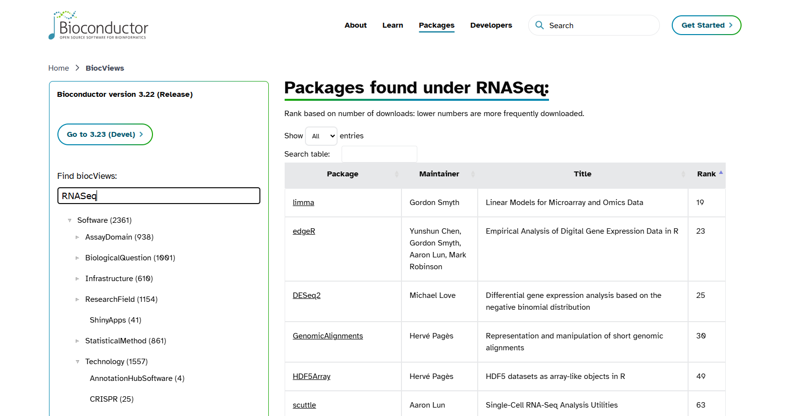

--------------------------------------------------------------------------------

<br>

## Introduction
R packages are available in many places. In our previous lectures, we learnt to install R packages
through CRAN using `install.packages()` function. However, not all packages are available in CRAN.
In this lecture, we will learn about [Bioconductor](https://bioconductor.org/), a specialized
repository for **bioinformatics packages in R** that focuses on analysis of high-throughput genomic
data. Bioconductor was initially developed for the analysis of microarray data.  Now, its packages
are used to analyze a wide range of omics data types such as bulk and single-cell RNA-seq, ChIP-seq, copy number analysis, microarrays, methylation, flow cytometry, and many other domains.
**One of the key requirements of Bioconductor packages is to have high-level documentation and workflows**.
The packages available in Bioconductor are provided
[here](https://bioconductor.org/packages/release/BiocViews.html#___Software).

### Overview & learning goals

In this lecture, you will learn:

- Different types of packages available in `Bioconductor`
- How to **install Bioconductor packages** using the `BiocManager::install()` function
- Bioconductor's data structures
- How to use the `DECIPHER` package to manipulate and align DNA sequences

## Set up and Data preparation
### Open a new Quarto document in RStudio

Create a new folder for `week15` by clicking the `New Folder` icon in the `Files` pane.
Then open a new Quarto file `File` \> `New File` \> `Quarto Document` and save it inside
the `week15` directory as `week15a_bioconductor`.

## Packages available in Bioconductor

There are 4 different types of packages available in Bioconductor:

1. **Software packages (2418)** : further divided into two categories
**infrastructure and methodological packages**.
Infrastructure packages define how the biological data are stored and accessed. For example,
`Biostrings`: tools for
manipulating DNA and RNA sequences. They do not perform the analysis themselves but provide
standardized
data structures that other packages can use.
Methodological packages provide tools and methods to analyze or process the data. For instance,
`DECIPHER`: sequence analysis and manipulation, and `DESeq2`: differential expression analysis, are methodological packages.

2. **Annotation data packages (928)**: these are self-contained databases that store genomic
annotations (e.g., gene identifiers, biological pathways). They act like reference libraries for
biological data. Instead of manually downloading gene IDs or pathway information from external
sources, these packages provide
ready-to-use annotation data directly in R. For example, `OrgDb` packages are **species-specific
annotation databases** in Bioconductor. The package **org.Hs.eg.db (for humans)** maps different
types of gene identifiers (e.g., Entrez IDs, gene symbols) and links them to biological pathways
and Gene Ontology (GO) terms.

3. **Experiment data packages (437)**: contain example datasets mainly used by developers.

4. **Workflows (28)** : provide step-by-step guides for common bioinformatics analyses. They do not
add new code or functions but demonstrate how to use multiple Bioconductor packages together. For
instance, **rnaseqGene - RNA-seq workflow package** shows how to go from raw FASTQ files, alignment,
differential expression analysis, visualization, using several packages together.

::: {.callout-tip}
Bioconductor releases a new version every 6 months. Each Bioconductor version is linked to a
specific version of R. This is different from CRAN, where packages are added continuously without
reference to specific R versions.
The Bioconductor website provides guidance on installing packages, creating reproducible documents,
and promoting better software engineering practices.
**The latest version of Bioconductor is 3.23 (released on April 29, 2026), which is compatible with R 4.6.**

- Bioconductor’s installation function will look up your version of R and give you the appropriate versions of Bioconductor packages.

- If you want the latest version of Bioconductor, you need to use the latest version of R - Michael Love
:::

## Install Bioconductor packages

Similar to CRAN, Bioconductor packages need to be installed only once. However, packages are installed
slightly differently in Bioconductor.
To install Bioconductor packages, you first need to install the `BiocManager` package from
CRAN (if you haven't already done so). You can then use `BiocManager::install()` to install
specific Bioconductor packages.

### Install BiocManager

We need to install BiocManager through which we can install Bioconductor packages. The command to install BiocManager is provided below:
```{r eval=FALSE}
# Install BiocManager only if it was not installed before
if (!requireNamespace("BiocManager", quietly = TRUE)) {
  install.packages("BiocManager")
}
# Check BiocManager version
BiocManager::version()
```

### Install Bioconductor package using BiocManager
Once the BiocManager is installed, use the following command to install `DECIPHER` package of
Bioconductor, which we will use later for sequence manipulation and sequence alignment.
**There are 2,361 software packages available in the Bioconductor.**

```{r eval=FALSE}
# Install packages
BiocManager::install("DECIPHER")
```


### Load the packages
You should be an expert now in loading the packages in R since we have loaded so many packages since `week12`.
Use the `library()` function to load the Bioconductor package in a similar way as CRAN packages.
```{r eval=FALSE}
# Load the DECIPHER package
library(DECIPHER)
```

Every package in Bioconductor has a reference manual. The reference manual for DECIPHER can be found
[here](https://bioconductor.org/packages/release/bioc/manuals/DECIPHER/man/DECIPHER.pdf).
It includes a **complete list of all functions in the package, syntax for each function,**
**descriptions of arguments, available options, and examples that can be run using the**
**package’s built-in datasets.**

```{r eval=FALSE}
# View the inbuilt datasets of DECIPHER
data(package = "DECIPHER")
data("BLOSUM")
str(BLOSUM)
```

::: {.callout-tip}
## Package movement from CRAN and Bioconductor
Packages can become available on CRAN after being available in Bioconductor.
`vcfR` package, which allows easy manipulation and visualization of variant call format (VCF) data,
was first available only in Bioconductor.
Later, the package evolved to be self-contained, not requiring Bioconductor classes, making CRAN a
better fit for broader use.
**BiocManager::install() will also install packages from CRAN. It acts as a wrapper for install.packages()**
:::

### Find the package of interest- biocViews

Bioconductor uses biocViews to organize and classify packages, so, that we can find packages easily on the
Bioconductor website. biocViews includes a controlled vocabulary to categorize Bioconductor packages. Package
authors choose the tags when they submit their package. Tags are later reviewed and refined by Bioconductor
maintainers. You can know
more about the packages by searching [here](https://bioconductor.org/packages/release/BiocViews.html#___Software).
For example, if you search for “RNASeq” on Bioconductor, you will find all packages tagged with that term.

{width="80%" fig-align="center"}

**Rank** column usually indicates the popularity or relevance of the package within Bioconductor, based on
download statistics, usage in workflows, and community interest. `edgeR` and `DESeq2` are the two most commonly used
packages for differential expression analysis of RNA-seq datasets. They are ranked 23 and 25, respectively,
meaning both packages are among the most
downloaded in the Bioconductor project, with `edgeR` being slightly more popular.


## Bioconductor objects can be complex

We discussed in `week12` that anything in R is an object. **Objects in Bioconductor are more complex than vector or matrix.**
Bioconductor does not have a single data structure. Its objects contain multiple attributes (e.g., sequence data,
metadata, annotations). They are specialized **S4 objects** designed
to store biological data efficiently and with metadata. Each object comes with methods—specific functions to
access information inside the object, run analyses, and visualize data.  Accessor functions (e.g., length(),
width(), metadata()) are needed to retrieve specific information from an object.

**Some examples of Bioconductor objects**

- `Biostrings objects (DNA, RNA, AA sequences)` : Used for manipulating sequence strings efficiently

- `SummarizedExperiment (SE)`: Used in RNA-seq analysis (We will discuss about it in more detail on Wednesday)

An SE object consists of three main components:

1. assays: A matrix (or list of matrices) of experimental data. Rows represent genomic features (e.g., genes),
and columns represent samples. You generate this data from the sequencing machine.

2. colData: A table of metadata about the samples (columns). Example: sample IDs, conditions, batch info. You
generate this from your experiment.

3. rowData (or rowRanges): A table of metadata about the features (rows). Example: gene IDs, genomic coordinates,
annotations. You generate this data from Ensembl or any other database.

- `Phylogenetic Tree Objects`: From DECIPHER or ape package.

## Bioconductor packages examples

### **Biostrings**
It is a core package of **DECIPHER**. When you install `DECIPHER`, Bioconductor will
automatically install `Biostrings` and any other required dependencies if they are not already present.
**Biostrings** is used to read, write, search, and manipulate DNA, RNA, or amino acid sequences in which sequences
are stored in `XStringSet` objects.
Amino acid sequences are stored in the class AAStringSet, nucleotide sequences are stored in the class
DNAStringSet or RNAStringSet. The reference manual of Biostrings can be found
[here](https://bioconductor.org/packages/release/bioc/manuals/Biostrings/man/Biostrings.pdf).

```{r eval=FALSE}
# Using standard R to create a character vector of sequences
sequences <- c("AAATCGA", "ATACAACAT", "TTGCCA")
# Display the sequences
sequences
# Get the number of sequences
length(sequences)
# Get the number of characters in each sequence
nchar(sequences)
# Select the 1st and 3rd sequences
sequences[c(1, 3)]
# Try to get the reverse complement
reverseComplement(sequences)
```

Base R can store sequences as simple character strings and perform basic operations like length and indexing.
However, it does not understand biological meaning. Therefore, operations like reverse complement will fail.

```{r eval=FALSE}
# Load Biostrings package, if you have loaded DECIPHER before
library(Biostrings)
# Convert sequences into a DNAStringSet object
dna <- DNAStringSet(sequences)
# Display the DNAStringSet
dna
# Get the number of sequences
length(dna)
# Get the number of characters in each sequence
nchar(dna)
# Select the 1st and 3rd sequences
dna[c(1, 3)]
# Compute reverse complements (works because Biostrings understands DNA)
reverseComplement(dna)
```

The `Biostrings` package provides specialized classes like `DNAStringSet` that understand biological sequences.
This allows us to perform biologically meaningful operations easily.

::: {.callout-tip}
There are three different object systems in R: S3, S4 and Reference classes. An object becomes S3 by assigning a class.
The S3 object system is simple but powerful. Since Bioconductor uses **S4 object-oriented programming in R**,
we will focus on the S4 class. S4 classes have a formal structure, and three important
components are:

- Name: The name of the class (e.g., DNAStringSet, XStringSet). It tells you what type of object you are working
with. Use `class()` to check the class name of an object.

- Slots: These are named compartments inside the object that store data. Each slot holds specific information
(e.g., sequences, metadata). Use `slotNames()` to list all slots in an object.

- Contains: This shows inheritance, i.e. the parent class that the current class extends.
For example, DNAStringSet contains XStringSet, meaning it inherits its behavior and adds DNA-specific features.

Understanding the class structure helps you inspect and manipulate data correctly.
:::

```{r eval=FALSE}
# Check the class of the object
class(dna)
# List all slots in the object
slotNames(dna)
# Show the class definition (slots, inheritance)
getClass("DNAStringSet")
# Display the internal structure of the object
str(dna)
```

::: exercise
####  Exercise: Exploring the `dna` S4 object

Using the `dna` object you created above, **predict** the answer to each
question below, then run the code to check:

1. `nchar(dna)` vs `width(dna)` -- do they agree?
2. `rev(dna)` vs `reverse(dna)` vs `reverseComplement(dna)` -- these give three
   different results. What is each one doing?
3. `slotNames(dna)` -- why is there no slot that literally contains a sequence
   like `"AAATCGA"`?

<details><summary>_Click for the solution_</summary>

```{r eval=FALSE}
nchar(dna)
width(dna)
```
Yes, they agree: `width()` is the `Biostrings`-native accessor for sequence
length, and `nchar()` is base R's generic function, for which `Biostrings`
has defined a method that simply returns the same thing here.

```{r eval=FALSE}
rev(dna)
reverse(dna)
reverseComplement(dna)
```
- `rev(dna)` reverses the **order of the sequences** in the set --
  the sequences themselves are unchanged.
- `reverse(dna)` reverses the **order of the bases within** each sequence
  (e.g. `"AAATCGA"` becomes `"AGCTAAA"`), but doesn't change which bases they are.
- `reverseComplement(dna)` does both: it reverses the order of the bases
  *and* complements them (A\<-\>T, C\<-\>G) -- this is the biologically
  meaningful operation you'd use to get the sequence of the opposite DNA strand.

```{r eval=FALSE}
slotNames(dna)
```
A `DNAStringSet` doesn't store its sequences as plain R character strings in a
slot. Instead, for memory efficiency, it stores all sequences together in a
shared, compactly encoded internal representation, and separately keeps track
of where each individual sequence starts and ends within that shared pool.
The actual bases are only decoded back into readable text (like `"AAATCGA"`)
when you print, subset, or otherwise access the object -- which is exactly why
accessor functions like `width()`, `nchar()`, and `reverseComplement()` exist:
you're not meant to reach into the object's slots directly.

</details>
:::

Let's read our own FASTQ file using the `Biostrings` package.

```{r eval=FALSE}
# Path to your FASTQ.gz file
file_path <- "garrigos/fastq/S63_R1.fastq.gz"
# Read the FASTQ file as a DNAStringSet object
dna_sequences <- readDNAStringSet(filepath = file_path, format = "fastq")
# Extract first 5 sequences
dna_sequences[1:5]
# Extract first 10 sequences and assign it to object
top_ten_seq <- dna_sequences[1:10]
# Write to a new FASTA file
writeXStringSet(
  x = top_ten_seq,
  filepath = "top10_sequences.fasta",
  format = "fasta"
)
```

### **DECIPHER**
DECIPHER is an R/Bioconductor package that provides tools for working with biological sequences.
It is designed to help researchers curate, analyze, and manipulate sequence data efficiently. The package supports
a wide range of tasks:

- Sequence databases: Import, maintain, view, and export very large collections of sequences. Instead of loading
all sequences into memory at once (which would require a huge amount of RAM), DECIPHER uses databases to store and
manage them. This approach makes it possible to analyze millions of sequences without overwhelming system
resources.

- Sequence alignment: accurately align thousands of DNA, RNA, or amino acid sequences. Quickly find and
align the syntenic regions of multiple genomes.

- Oligo design: test oligos in silico, or create new primer and probe sequences optimized for a variety of
objectives.

- Manipulate sequences: trim low quality regions, correct frameshifts, reorient nucleotides, determine
consensus, or digest with restriction enzymes.

- Analyze sequences: find chimeras, classify into a taxonomy of organisms or functions, detect repeats, predict
secondary structure, create phylogenetic trees, and reconstruct ancestral states.

- Gene finding: predict coding and non-coding genes in a genome, extract them from the genome, and export
them to a file.

```{r eval=FALSE}
# For quick reference to the DECIPHER package help pages
?DECIPHER
# To view detailed tutorials and step-by-step documentation (vignettes)
browseVignettes("DECIPHER")
# Opens up web page showing all available vignettes for the DECIPHER package installed on your system.
```

Here, we will use the `DECIPHER` package for the alignment of the sequences. As the number of genomes for the
alignment increases, the computational time
increases as well. It is a challenge to maintain performance as more sequences are added. However,
`DECIPHER` can align hundreds of sequences together accurately in a short time.

A multiple sequence alignment can show several things:

- Are the regions conserved (syntenic regions)?
- Are there insertions or deletions?

Our `top_ten_seq` sequences are just the first 10 raw reads from one FASTQ file --
they come from random locations across the transcriptome and aren't related to
each other, so aligning them wouldn't show anything meaningful.
Instead, for a meaningful example, we'll align one of the example sequence sets
that comes bundled with the `DECIPHER` package: a set of homologous
50S ribosomal protein L2 sequences from different bacterial species.

```{r eval=FALSE}
# Get the path to a set of example sequences that ships with DECIPHER
fasta_file <- system.file("extdata", "50S_ribosomal_protein_L2.fas", package = "DECIPHER")
example_seqs <- readAAStringSet(fasta_file)

# Align the sequences
aligned <- AlignSeqs(example_seqs)
# View the alignment in your console
aligned
# Opens an interactive viewer in your browser
BrowseSeqs(aligned)
# Write aligned object to a FASTA
writeXStringSet(aligned, filepath = "aligned_sequences.fasta", format = "fasta")
```

## Recap and next steps
- Bioconductor and its packages
- `Install packages` in Bioconductor
- Manipulate and align sequences using `DECIPHER`
